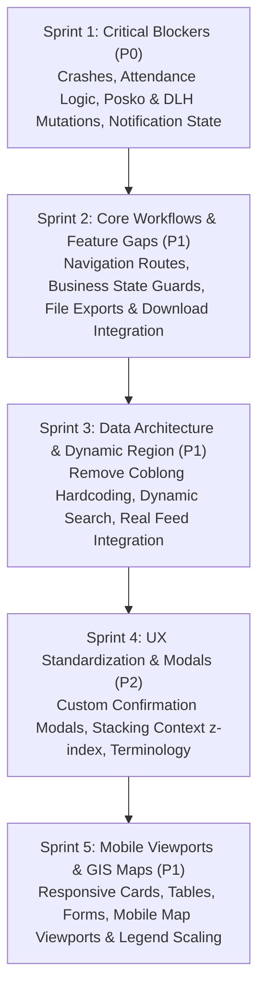

# 🎯 BERSEKA — Comprehensive Bugfix Planning & Tasklist

> **Document Version:** 1.0.0  
> **Source Audit:** [`Website_QC_Audit.xlsx`](file:///c:/laragon/www/Pilah-Sampah-Cerdas/Website_QC_Audit.xlsx)  
> **Total Backlog Items:** 34 Issues (8 P0 Blockers, 20 P1 High, 6 P2 Polish)  
> **Target Goal:** Bring BERSEKA from `Not Ready` to `Production-Ready` across Web Dashboard, API Services, and Mobile Viewports.

---

## 🗺️ Sprint Execution Roadmap

---

## 🏃 Sprint 1 — Critical Blockers (P0) [COMPLETED]

Focus: Fix runtime crashes, broken data calculations, failing mutations, and global notification bugs.

### [x] BUG-001: Fix DPL Search Null String Crash (`Cannot read properties of undefined (reading 'toLowerCase')`)
* **Priority:** P0 (Blocker) | **Area:** DPL Portal | **Category:** Functional
* **Target Files:**
  * [`apps/web/src/pages/dpl/DplDashboardPage.tsx`](file:///c:/laragon/www/Pilah-Sampah-Cerdas/apps/web/src/pages/dpl/DplDashboardPage.tsx#L389-L396)
  * [`apps/web/src/pages/dpl/LogbookKknPage.tsx`](file:///c:/laragon/www/Pilah-Sampah-Cerdas/apps/web/src/pages/dpl/LogbookKknPage.tsx#L220-L228)
* **Root Cause:** `s.nim`, `s.jurusan`, and `s.name` are accessed directly with `.toLowerCase()` without optional chaining or null-safety fallback.
* **Implementation Plan:**
  - Update search query predicate with safe navigation: `(s?.name ?? "").toLowerCase().includes(q) || (s?.nim ?? "").toLowerCase().includes(q) || (s?.jurusan ?? "").toLowerCase().includes(q) || (s?.fakultas ?? "").toLowerCase().includes(q)`.
  - Add safe fallback across all student filtering loops.
* **Verification:** Type search queries containing numbers, spaces, and unmatched strings in DPL Dashboard; verify no unhandled exception is thrown.

---

### [x] BUG-002: Centralize & Correct Attendance Duration/Status Business Logic
* **Priority:** P0 (Blocker) | **Area:** DPL / KKN | **Category:** Data / Logic
* **Target Files:**
  * [`apps/api/src/services/kknAttendanceService.ts`](file:///c:/laragon/www/Pilah-Sampah-Cerdas/apps/api/src/services/kknAttendanceService.ts)
  * [`apps/web/src/pages/dpl/LaporanPresensiPage.tsx`](file:///c:/laragon/www/Pilah-Sampah-Cerdas/apps/web/src/pages/dpl/LaporanPresensiPage.tsx)
  * [`apps/web/src/pages/MonitoringAbsen/index.tsx`](file:///c:/laragon/www/Pilah-Sampah-Cerdas/apps/web/src/pages/MonitoringAbsen/index.tsx)
* **Root Cause:** Inconsistent calculation between total target minutes (e.g. 120 mins) and recorded minutes, causing students with 1-2 minutes to be marked as target achieved.
* **Implementation Plan:**
  - Enforce minimum duration threshold (e.g., $\ge 80\%$ of schedule duration or explicit required hours) before setting status to `TERPENUHI`.
  - Calculate `durasiMenit = round((checkOutAt - checkInAt) / 60000)` and validate against `actualInZoneMinutes`.
* **Verification:** Check-in with 5 minutes on a 120-minute schedule; verify status displays `TIDAK_MEMENUHI_DURASI` or equivalent non-complete state.

---

### [x] BUG-003: Fix Attendance Ratio Inconsistency when Status is "Belum Tercatat"
* **Priority:** P0 (Blocker) | **Area:** DPL / KKN | **Category:** Data / Logic
* **Target Files:**
  * [`apps/api/src/services/dplService.ts`](file:///c:/laragon/www/Pilah-Sampah-Cerdas/apps/api/src/services/dplService.ts)
  * [`apps/web/src/pages/dpl/DplDashboardPage.tsx`](file:///c:/laragon/www/Pilah-Sampah-Cerdas/apps/web/src/pages/dpl/DplDashboardPage.tsx)
* **Root Cause:** Calculation calculates `(total_attended / total_schedules)` using unverified or scheduled-only records, rendering $>0\%$ ratios even when no valid check-ins exist.
* **Implementation Plan:**
  - Filter denominator by active, past schedules. If student has zero verified attendances, strictly return `0%` ratio and `BELUM_TERCATAT`.
* **Verification:** Review fresh student with no check-in records; verify ratio is exactly `0%`.

---

### [x] BUG-004: Connect Attendance Aggregations to KKN Scoring Pipeline
* **Priority:** P0 (Blocker) | **Area:** DPL Assessment | **Category:** Data / Integration
* **Target Files:**
  * [`apps/api/src/services/penilaianKknService.ts`](file:///c:/laragon/www/Pilah-Sampah-Cerdas/apps/api/src/services/penilaianKknService.ts)
  * [`apps/web/src/pages/PenilaianKkn/index.tsx`](file:///c:/laragon/www/Pilah-Sampah-Cerdas/apps/web/src/pages/PenilaianKkn/index.tsx)
* **Root Cause:** `skorMitraKehadiran` and attendance metrics are uncoupled from real `kehadiran_kegiatan` table logs, defaulting to 0 unless manually overridden.
* **Implementation Plan:**
  - Add auto-compute helper in `penilaianKknService.ts` that calculates proposed attendance score from total attendance percentage before saving.
* **Verification:** Verify student with 100% attendance receives appropriate calculated base score in the evaluation interface.

---

### [x] BUG-005: Fix Posko Status Mutation Persistence (`APPROVED` to `PENDING`)
* **Priority:** P0 (Blocker) | **Area:** DPL / Posko KKN | **Category:** Backend / Data
* **Target Files:**
  * [`apps/api/src/controllers/poskoKknController.ts`](file:///c:/laragon/www/Pilah-Sampah-Cerdas/apps/api/src/controllers/poskoKknController.ts)
  * [`apps/api/src/services/poskoKknService.ts`](file:///c:/laragon/www/Pilah-Sampah-Cerdas/apps/api/src/services/poskoKknService.ts)
  * [`apps/web/src/pages/PoskoKkn/index.tsx`](file:///c:/laragon/www/Pilah-Sampah-Cerdas/apps/web/src/pages/PoskoKkn/index.tsx)
* **Root Cause:** Status update endpoint only permits `APPROVED` or ignores downgrade to `PENDING`, or cache key is not invalidated upon mutation.
* **Implementation Plan:**
  - Verify Prisma model allows toggling status. Add explicit `PATCH /api/v1/kkn/posko/:id/status` handler.
  - Invalidate TanStack query cache key `["posko-kkn"]` on frontend.
* **Verification:** Toggle Posko status from Approved to Pending; refresh the page; verify Pending state persists.

---

### [x] BUG-006: Fix Admin DLH Reject / Koreksi Action Failure
* **Priority:** P0 (Blocker) | **Area:** Admin DLH | **Category:** Functional
* **Target Files:**
  * [`apps/api/src/controllers/dashboardController.ts`](file:///c:/laragon/www/Pilah-Sampah-Cerdas/apps/api/src/controllers/dashboardController.ts)
  * [`apps/web/src/pages/Dashboard/index.tsx`](file:///c:/laragon/www/Pilah-Sampah-Cerdas/apps/web/src/pages/Dashboard/index.tsx)
  * [`apps/api/src/middlewares/readOnlyGuard.ts`](file:///c:/laragon/www/Pilah-Sampah-Cerdas/apps/api/src/middlewares/readOnlyGuard.ts)
* **Root Cause:** `readOnlyGuard` or discrepancy resolver rejects the payload due to missing `notes`/`catatanPenolakan` or strict role check.
* **Implementation Plan:**
  - Allow discrepancy resolution routes in `readOnlyGuard`.
  - Validate request body requirements and ensure payload includes reason text.
* **Verification:** Execute Reject/Koreksi on discrepancy item as Admin DLH; verify status changes to Rejected with audit log recorded.

---

### [x] BUG-007 & BUG-008: Fix Global Notification State & "Mark All as Read" Mutation
* **Priority:** P0 (Blocker) | **Area:** Notifications Subsystem | **Category:** Functional / State
* **Target Files:**
  * [`apps/api/src/controllers/notificationController.ts`](file:///c:/laragon/www/Pilah-Sampah-Cerdas/apps/api/src/controllers/notificationController.ts)
  * [`apps/api/src/services/notificationIntegrationService.ts`](file:///c:/laragon/www/Pilah-Sampah-Cerdas/apps/api/src/services/notificationIntegrationService.ts)
  * [`apps/web/src/pages/Notifikasi/index.tsx`](file:///c:/laragon/www/Pilah-Sampah-Cerdas/apps/web/src/pages/Notifikasi/index.tsx)
  * [`apps/web/src/layouts/DashboardLayout.tsx`](file:///c:/laragon/www/Pilah-Sampah-Cerdas/apps/web/src/layouts/DashboardLayout.tsx)
* **Root Cause:** Unread count calculation is stored in client memory or cached queries without updating `markAllTimestamp` in [UserNotificationSync](file:///c:/laragon/www/Pilah-Sampah-Cerdas/apps/api/prisma/schema.prisma#L1515).
* **Implementation Plan:**
  - Unify `POST /api/v1/notifications/mark-all-read` to update `UserNotificationSync` and set `isRead = true` on all user records.
  - Invalidate `["notifications"]` and `["unread-count"]` queries in React frontend on success.
* **Verification:** Click "Mark All as Read", navigate to another menu, return to notifications; verify count remains 0.

---

## ⚡ Sprint 2 — Core Functionality & Feature Gaps (P1) [COMPLETED]

Focus: Route fixes, button guards, file exports, and missing endpoints.

### [x] BUG-009: Fix "Inspeksi Zona & Geofence" Routing
* **Target Files:** [`apps/web/src/pages/dpl/DplDashboardPage.tsx`](file:///c:/laragon/www/Pilah-Sampah-Cerdas/apps/web/src/pages/dpl/DplDashboardPage.tsx), [`apps/web/src/routes/index.tsx`](file:///c:/laragon/www/Pilah-Sampah-Cerdas/apps/web/src/routes/index.tsx)
* **Fix:** Point action button to `/dpl/zona-inspector` (or `/kkn/smart-zone`) instead of generic dashboard `/dpl`.

### [x] BUG-010: Guard "Beri Nilai" on Unstarted Work Programs (*Belum Mulai*)
* **Target Files:** [`apps/web/src/pages/dpl/PenilaianProkerPage.tsx`](file:///c:/laragon/www/Pilah-Sampah-Cerdas/apps/web/src/pages/dpl/PenilaianProkerPage.tsx)
* **Fix:** Disable / hide evaluation button if program status is `BELUM_MULAI` or `BELUM_DISETUJUI`.

### [x] BUG-011: Implement CSV Export & "Add Region" Integration
* **Target Files:** [`apps/web/src/pages/SuperUser/index.tsx`](file:///c:/laragon/www/Pilah-Sampah-Cerdas/apps/web/src/pages/SuperUser/index.tsx), [`apps/web/src/pages/MasterWilayah/index.tsx`](file:///c:/laragon/www/Pilah-Sampah-Cerdas/apps/web/src/pages/MasterWilayah/index.tsx)
* **Fix:** Connect table exporter to frontend CSV parser and integrate modal form with `POST /api/v1/areas/kelurahan` or `POST /api/v1/areas/rw`.

### [x] BUG-013: Fix Comparison Verification Image Rendering
* **Target Files:** [`apps/web/src/pages/Dashboard/index.tsx`](file:///c:/laragon/www/Pilah-Sampah-Cerdas/apps/web/src/pages/Dashboard/index.tsx), [`apps/web/src/utils/imageUrl.ts`](file:///c:/laragon/www/Pilah-Sampah-Cerdas/apps/web/src/utils/imageUrl.ts)
* **Fix:** Use unified `getImageUrl(path)` utility with fallback placeholder for missing/relative image paths.

### [x] BUG-014: Fix Master Template Download in Super Admin
* **Target Files:** [`apps/web/src/pages/SuperUser/index.tsx`](file:///c:/laragon/www/Pilah-Sampah-Cerdas/apps/web/src/pages/SuperUser/index.tsx), [`apps/api/src/routes/areaRoutes.ts`](file:///c:/laragon/www/Pilah-Sampah-Cerdas/apps/api/src/routes/areaRoutes.ts)
* **Fix:** Provide static or dynamically generated XLSX template download endpoint with proper MIME headers (`application/vnd.openxmlformats-officedocument.spreadsheetml.sheet`).

### [x] BUG-015: Fix Admin DLH Dashboard Shortcut Cards
* **Target Files:** [`apps/web/src/pages/Dashboard/index.tsx`](file:///c:/laragon/www/Pilah-Sampah-Cerdas/apps/web/src/pages/Dashboard/index.tsx)
* **Fix:** Wrap summary stat cards in accessible `<Link to="...">` components with correct routes (`/dashboard/discrepancies`, `/kkn/monitoring`, etc.).

### [x] BUG-016: Fix Activity Detail Modal / Binding
* **Target Files:** [`apps/web/src/pages/Dashboard/index.tsx`](file:///c:/laragon/www/Pilah-Sampah-Cerdas/apps/web/src/pages/Dashboard/index.tsx)
* **Fix:** Pass selected activity record to detail modal and render fields safely.

### [x] BUG-018: Connect Mobile APK Download Button
* **Target Files:** [`apps/web/src/pages/LandingPage/index.tsx`](file:///c:/laragon/www/Pilah-Sampah-Cerdas/apps/web/src/pages/LandingPage/index.tsx), [`apps/web/src/pages/Download/index.tsx`](file:///c:/laragon/www/Pilah-Sampah-Cerdas/apps/web/src/pages/Download/index.tsx)
* **Fix:** Link download CTA to configured APK download URL or `/download` route.

### [x] BUG-019 & BUG-020: Fix Landing Page Public Service Routing & Anchor Targets
* **Target Files:** [`apps/web/src/pages/LandingPage/index.tsx`](file:///c:/laragon/www/Pilah-Sampah-Cerdas/apps/web/src/pages/LandingPage/index.tsx)
* **Fix:** Allow public preview modals for service information instead of immediate login redirect, and correct "Lihat Selengkapnya" scroll anchor.

### [x] BUG-024: Refactor Shared Notification Subsystem Architecture
* **Target Files:** [`apps/web/src/services/notificationService.ts`](file:///c:/laragon/www/Pilah-Sampah-Cerdas/apps/web/src/services/notificationService.ts), [`apps/web/src/hooks/useNotifications.ts`](file:///c:/laragon/www/Pilah-Sampah-Cerdas/apps/web/src/hooks/useNotifications.ts)
* **Fix:** Create a single canonical `useNotifications` React hook used across SuperUser, DPL, DLH, RW, and Warga layouts.

---

## 🏛️ Sprint 3 — Data Architecture & Region Standardization (P1) [COMPLETED]

Focus: Remove hardcoded region constants, connect live feeds, and standardize search queries.

### [x] BUG-021: Connect "Kegiatan Terbaru" on Landing Page to Live CMS API
* **Target Files:** [`apps/web/src/pages/LandingPage/index.tsx`](file:///c:/laragon/www/Pilah-Sampah-Cerdas/apps/web/src/pages/LandingPage/index.tsx), [`apps/api/src/routes/beritaRoutes.ts`](file:///c:/laragon/www/Pilah-Sampah-Cerdas/apps/api/src/routes/beritaRoutes.ts)
* **Fix:** Replace static mock array with `GET /api/v1/berita?status=PUBLISHED&limit=6` query with skeleton loader and empty state.

### [x] BUG-022: Eliminate Hardcoded "Coblong" District Strings
* **Target Files:** All components under `apps/web/src/pages/` and `apps/api/src/`
* **Fix:**
  - Audit occurrences of `"Coblong"`.
  - Replace with dynamic region state from `useAuthStore` or active selected `Kecamatan`/`Kelurahan` entity.

### [x] BUG-012 & BUG-023: Standardize Multi-Column Entity Search
* **Target Files:**
  * [`apps/api/src/services/userService.ts`](file:///c:/laragon/www/Pilah-Sampah-Cerdas/apps/api/src/services/userService.ts)
  * [`apps/web/src/pages/ManajemenPengguna/index.tsx`](file:///c:/laragon/www/Pilah-Sampah-Cerdas/apps/web/src/pages/ManajemenPengguna/index.tsx)
  * [`apps/web/src/pages/MasterData/index.tsx`](file:///c:/laragon/www/Pilah-Sampah-Cerdas/apps/web/src/pages/MasterData/index.tsx)
* **Fix:** Include `name`, `phone`, `nim`, `nip`, `role.name`, `rw.name`, and `kelurahan.name` in Prisma `OR` search clauses.

---

## 🎨 Sprint 4 — UX Consistency & Polish (P2)

Focus: Replace native alerts, fix stacking contexts, unify iconography, and polish copywriting.

### [x] BUG-029: Replace Native `window.confirm()` with Custom Confirm Modal
* **Target Files:** [`apps/web/src/components/common/ConfirmModal.tsx`](file:///c:/laragon/www/Pilah-Sampah-Cerdas/apps/web/src/components/common/ConfirmModal.tsx)
* **Fix:** Migrate all delete/approval prompts from `window.confirm(...)` to the styled `ConfirmModal` component.

### [x] BUG-030: Fix Modal & Floating Toolbar Stacking (`z-index`)
* **Target Files:** [`apps/web/src/index.css`](file:///c:/laragon/www/Pilah-Sampah-Cerdas/apps/web/src/index.css), [`apps/web/src/components/common/Modal.tsx`](file:///c:/laragon/www/Pilah-Sampah-Cerdas/apps/web/src/components/common/Modal.tsx)
* **Fix:** Standardize stacking scale (`z-dropdown: 100`, `z-sticky: 200`, `z-modal-backdrop: 500`, `z-modal: 600`, `z-toast: 1000`).

### [x] BUG-031: Unify Action Buttons & Iconography
* **Target Files:** Master data and CRUD tables across `apps/web/src/pages/`
* **Fix:** Standardize Lucide icons (`Trash2` for delete, `RefreshCw` for reload, `Edit3` for update).

### [x] BUG-032: Content & Copywriting Standardization
* **Target Files:** Landing page, MasterWilayah, and Panduan pages
* **Fix:** Replace erroneous terms (e.g. *"Pemukiman"* $\rightarrow$ *"Permukiman"*, *"Poin Warga"* label consistency).

### [x] BUG-033 & BUG-034: Landing Page Hero & Asset Polish
* **Target Files:** [`apps/web/src/pages/LandingPage/index.tsx`](file:///c:/laragon/www/Pilah-Sampah-Cerdas/apps/web/src/pages/LandingPage/index.tsx)
* **Fix:** Declutter hero badges and ensure authentic graphics/photos are used.

---

## 📱 Sprint 5 — Mobile Viewports & GIS Maps (P1)

Focus: Full responsive overhaul across viewports (360px - 768px).

### [x] BUG-025: Responsive Overhaul for Cards, Filters, and Metrics
* **Target Files:** All page wrappers across `apps/web/src/pages/`
* **Fix:** Replace fixed `grid-cols-4` with responsive `grid-cols-1 sm:grid-cols-2 lg:grid-cols-4`, adjust card padding, and ensure wrap on filter toolbars.

### [x] BUG-026: Responsive Map Container Dimensions & Resize Triggers
* **Target Files:** [`apps/web/src/components/maps/`](file:///c:/laragon/www/Pilah-Sampah-Cerdas/apps/web/src/components/maps/), [`apps/web/src/components/common/ThemeTileLayer.tsx`](file:///c:/laragon/www/Pilah-Sampah-Cerdas/apps/web/src/components/common/ThemeTileLayer.tsx)
* **Fix:** Add dynamic height (`h-[350px] md:h-[500px]`) and trigger `map.invalidateSize()` on resize/tab change.

### [x] BUG-027: Mobile-Friendly Map Legend & Control Spacing
* **Target Files:** Map legend components across GIS dashboards
* **Fix:** Implement collapsible mobile legend drawer or compact floating badge to prevent overlapping zoom controls.

### [x] BUG-028: Swipeable Responsive Tables & Mobile Pagination
* **Target Files:** [`apps/web/src/components/common/Pagination.tsx`](file:///c:/laragon/www/Pilah-Sampah-Cerdas/apps/web/src/components/common/Pagination.tsx)
* **Fix:** Wrap table elements with `overflow-x-auto shadow-sm`, add touch-friendly horizontal scroll hint, and simplify pagination controls on small screens.

---

## 📊 Verification & QA Checkpoint Table

| Sprint | Goal | Key Verification Command | Exit Criteria |
| :--- | :--- | :--- | :--- |
| **Sprint 1** | Blocker fixes | `npm run test:api` & manual DPL search/attendance tests | No unhandled client exceptions, zero calculation inconsistencies |
| **Sprint 2** | Core workflows | Frontend build & route testing | All buttons and shortcuts trigger valid routes & actions |
| **Sprint 3** | Data architecture | Codebase grep for `"Coblong"` & live API check | Zero hardcoded region assumptions, multi-field search working |
| **Sprint 4** | UX polish | Visual inspection of modals & stacking | Zero native browser dialogs, consistent modal z-indexes |
| **Sprint 5** | Mobile readiness | Responsive devtools audit at 375px & 768px | Zero horizontal overflow on mobile, maps scale cleanly |
