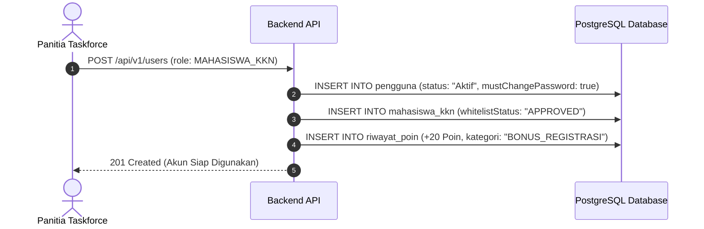
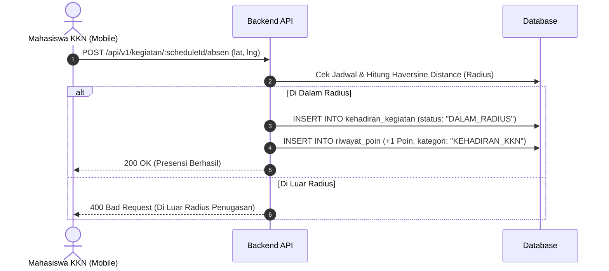
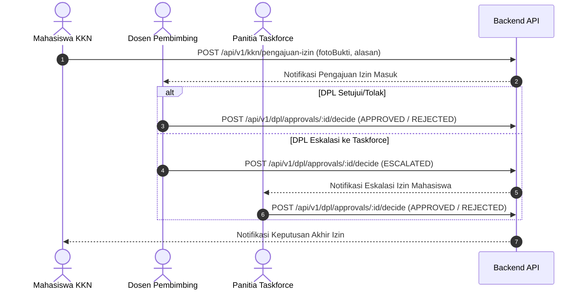
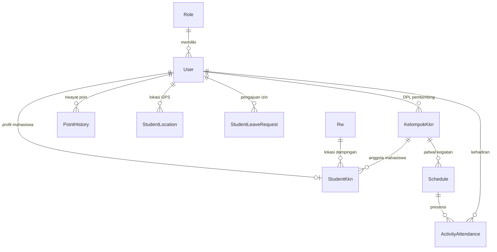

# 📋 MAPPING ROLE FEATURE REQUIREMENT TRASHCARE (KKN & JALUR AKADEMIK)

> **Versi:** 1.0 — 13 Agustus 2026  
> **Proyek:** Trashcare — Sistem Pemilahan Sampah Cerdas Terintegrasi  
> **Wilayah:** Kecamatan Coblong, Kota Bandung — Program KKN UNIKOM  
> **Scope:** Khusus Jalur Akademik (Pimpinan, Panitia Taskforce, DPL, Mahasiswa KKN)  
> **Acuan Rekan Tim:** `ROLE_MAPPING_TRASHCARE.md` (Konteks Tata Kelola Sampah & Master Data)  

---

## 📌 Catatan Acuan Dokumen

Dokumen ini melengkapi `ROLE_MAPPING_TRASHCARE.md` dengan pendalaman khusus pada **Jalur Akademik (KKN)**.

### Hasil Verifikasi Nyata Database & Proyek:
1. **Pemisahan Role di DB**:
   - `id: 1` = `SUPER_USER` (Administrator Sistem)
   - `id: 9` = `PEMIMPIN` (Pimpinan UNIKOM - Monitoring Institusi)
   - `id: 10` = `PANITIA_TASKFORCE` (Admin Operasional KKN)
   - `id: 8` = `DPL` (Dosen Pembimbing Lapangan)
   - `id: 7` = `MAHASISWA_KKN` (Pelaksana Lapangan)
2. **Platform**:
   - `PANITIA_TASKFORCE`, `PEMIMPIN`, `DPL` -> **Web Dashboard**
   - `MAHASISWA_KKN` -> **Mobile App** (Flutter)
3. **Kebijakan Poin**:
   - Bonus registrasi **+20 poin** dipicu saat akun berhasil dibuat di `userService.createUser`.
   - Aktivasi Tempat Sampah: **+5 poin per Tempat Sampah**, **+20 poin bonus** per kelipatan 3 warga.
4. **Relasi Wilayah & DPL**:
   - **1 Kelompok KKN dapat mencakup banyak RW** (didukung field `cakupan_rw` bertipe JSON).
   - **1 DPL membimbing 1 Kelompok KKN**.
5. **Absensi**:
   - Validasi ketat berdasarkan radius GPS gawai mahasiswa saat check-in jadwal kegiatan.

---

## Daftar Isi

1. [Bab 1 — Hierarki & Relasi Jalur Akademik](#bab-1)
2. [Bab 2 — Identitas & Autentikasi](#bab-2)
3. [Bab 3 — Matriks Hak Akses CRUD](#bab-3)
4. [Bab 4 — Spesifikasi Fitur Detail Per Role](#bab-4)
5. [Bab 5 — State Machine & Alur Bisnis KKN](#bab-5)
6. [Bab 6 — Skema Master Data & Relasi Database](#bab-6)
7. [Bab 7 — Mapping Endpoint API](#bab-7)
8. [Bab 8 — Gap Analysis Kodebase Aktual](#bab-8)
9. [Bab 9 — Rangkuman Keputusan Kritis & Solusi](#bab-9)
10. [Bab 10 — Panduan Quality Control (QC)](#bab-10)

---

## Bab 1 — Hierarki & Relasi Jalur Akademik <a name="bab-1"></a>

### 1.1 Diagram Struktur Jalur Akademik

```
┌─────────────────────────────────────────────────────────────┐
│  PEMIMPIN (Pimpinan Perguruan Tinggi / UNIKOM)              │
│  • Platform: Web Dashboard                                  │
│  • Role DB: PEMIMPIN (id: 9)                                │
│  • Akses: Read-Only seluruh agregat & progres KKN institusi │
│  • Didaftarkan oleh: SUPER_USER                             │
└──────────────────────────────┬──────────────────────────────┘
                               │ Delegasi Operasional
                               ▼
┌─────────────────────────────────────────────────────────────┐
│  PANITIA_TASKFORCE (Task Force / Panitia KKN)               │
│  • Platform: Web Dashboard                                  │
│  • Role DB: PANITIA_TASKFORCE (id: 10)                      │
│  • Akses: Full CRUD Kelompok, Jadwal, Akun DPL & Mahasiswa  │
│  • Approver Lapis 2: Eskalasi Izin Mahasiswa                │
│  • Didaftarkan oleh: SUPER_USER / PEMIMPIN                  │
└──────────────┬───────────────────────────────┬──────────────┘
               │ Assign 1 Kelompok             │ Registrasi & Kelola
               ▼                               ▼
┌──────────────────────────────┐ ┌────────────────────────────┐
│  DPL (Dosen Pembimbing)      │ │  MAHASISWA_KKN             │
│  • Platform: Web Dashboard   │ │  • Platform: Mobile App    │
│  • Role DB: DPL (id: 8)      │ │  • Role DB: MAHASISWA_KKN  │
│  • Scope: 1 Kelompok sendiri │ │  • Self-reg: DIBLOKIR      │
│  • Approver Lapis 1: Izin    │ │  • Absen GPS & Aktivasi    │
│  • Validasi Survei Kelurahan │ │    Tempat Sampah Warga     │
└──────────────────────────────┘ └────────────────────────────┘
```

---

## Bab 2 — Identitas & Autentikasi <a name="bab-2"></a>

| Parameter | PEMIMPIN | PANITIA_TASKFORCE | DPL | MAHASISWA_KKN |
|---|---|---|---|---|
| **Role Name DB** | `PEMIMPIN` | `PANITIA_TASKFORCE` | `DPL` | `MAHASISWA_KKN` |
| **Auth Utama** | No HP (+62) + Password | No HP (+62) + Password | No HP (+62) + Password | NIM / No HP (+62) + Password |
| **Pembuat Akun** | SUPER_USER | SUPER_USER / PEMIMPIN | PANITIA_TASKFORCE | PANITIA_TASKFORCE (Individual/Bulk) |
| **Self-Registration** | ❌ Tidak | ❌ Tidak | ❌ Tidak | 🚫 DIBLOKIR |
| **Platform** | Web | Web | Web | Mobile |
| **Metadata Profil** | Jabatan, Institusi | Jabatan, Institusi | NIP, Prodi, Jenjang | NIM, Jurusan, Fakultas, No WA |
| **Tabel Tambahan** | - | - | - | `mahasiswa_kkn` (`StudentKkn`) |
| **Poin Registrasi** | - | - | - | **+20 Poin** (otomatis saat dibuat) |

---

## Bab 3 — Matriks Hak Akses CRUD <a name="bab-3"></a>

| Modul / Resource | PEMIMPIN | PANITIA_TASKFORCE | DPL | MAHASISWA_KKN |
|---|---|---|---|---|
| **Kelola Akun DPL** | 👁️ Read | ✅ Create, Update, Delete | ❌ | ❌ |
| **Kelola Akun Mahasiswa** | 👁️ Read | ✅ Create, Bulk, Update, Delete | 👁️ Read (kelompok) | ❌ |
| **Kelola Kelompok KKN** | 👁️ Read | ✅ Create, Update, Delete | 👁️ Read (kelompok) | 👁️ Read (kelompok) |
| **Assign DPL ke Kelompok** | ❌ | ✅ Tautkan 1 DPL | ❌ | ❌ |
| **Plotting Kelompok ke RW** | ❌ | ✅ Multi-RW (`cakupan_rw`) | ❌ | ❌ |
| **Pindah Kelompok Mahasiswa** | ❌ | ✅ Update `kelompokId` | ❌ | ❌ |
| **Kelola Jadwal KKN** | 👁️ Read | ✅ Create, Update, Delete | 👁️ Read | 👁️ Read |
| **Absensi Mahasiswa (GPS)** | 👁️ Read | 👁️ Read Rekap | 👁️ Read Kelompok | ✅ Check-in (GPS) |
| **Pengajuan Izin/Sakit** | 👁️ Read | 👁️ Read | ❌ | ✅ Create + Upload Bukti |
| **Approval Izin Lapis 1** | ❌ | ❌ | ✅ Approve / Reject / Eskalasi | ❌ |
| **Approval Izin Lapis 2** | ❌ | ✅ Approve / Reject Eskalasi | ❌ | ❌ |
| **Aktivasi Tempat Sampah Warga** | ❌ | ❌ | ❌ | ✅ Scan QR + GPS |
| **Validasi Baseline/Survei** | 👁️ Read | 👁️ Read | ✅ Validasi Kelurahan | ❌ |
| **Rule Engine Poin KKN** | 👁️ Read | ✅ Update Nilai Poin | ❌ | ❌ |

---

## Bab 4 — Spesifikasi Fitur Detail Per Role <a name="bab-4"></a>

### 4.1 PEMIMPIN (Pimpinan Perguruan Tinggi)
- **Tujuan**: Memberikan visibilitas menyeluruh kepada pimpinan perguruan tinggi terhadap dampak program KKN.
- **Fitur Utama**:
  1. Dashboard Agregat KKN (Total mahasiswa aktif, total kelompok, rata-rata kehadiran).
  2. Monitoring Evaluasi Dampak (Baseline vs Endline per kelurahan).
  3. Pemantauan Real-time Lokasi Mahasiswa di Peta Kecamatan Coblong.
  4. Manajemen Pendaftaran Panitia Taskforce (`POST /api/v1/users`).

### 4.2 PANITIA_TASKFORCE (Admin Operasional KKN)
- **Tujuan**: Bertanggung jawab atas seluruh kelancaran administrasi dan operasional KKN.
- **Fitur Utama**:
  1. **Manajemen Akun Mahasiswa**:
     - Pendaftaran individual (`POST /api/v1/users`).
     - Bulk insert mahasiswa melalui script/endpoint.
     - Penanganan kendala akun mahasiswa di lapangan.
  2. **Manajemen Kelompok KKN**:
     - Pembuatan kelompok (`POST /api/v1/kelompok`).
     - Menetapkan 1 DPL per kelompok (`PUT /api/v1/kelompok/:id/assign-dpl`).
     - Plotting kelompok ke beberapa RW (`PUT /api/v1/kelompok/:id/assign-rw`).
     - Memindahkan mahasiswa antar kelompok (`PATCH /api/v1/kelompok/:id/mahasiswa/:sid/pindah`).
  3. **Manajemen Jadwal & Zona Absensi**:
     - Menentukan titik koordinat latitude, longitude, dan radius toleransi (meter).
  4. **Approval Izin Lapis 2**:
     - Memutuskan permohonan izin yang dieskalasi manual oleh DPL.
  5. **Konfigurasi Rule Engine Poin KKN**:
     - Mengatur besaran poin selamat datang, poin per Tempat Sampah, dan poin kelipatan aktivasi.

### 4.3 DPL (Dosen Pembimbing Lapangan)
- **Tujuan**: Membimbing 1 kelompok mahasiswa KKN di wilayah binaan.
- **Fitur Utama**:
  1. Dashboard Kelompok (Statistik kehadiran, daftar mahasiswa, Tempat Sampah binaan).
  2. Approval Izin Mahasiswa (Lapis 1):
     - DPL dapat memilih **Setujui**, **Tolak**, atau **Eskalasi ke Panitia Taskforce**.
  3. Pemantauan Kehadiran & Lokasi GPS Mahasiswa Bimbingan.
  4. Validasi Data Baseline & Hambatan Kelurahan.

### 4.4 MAHASISWA_KKN (Pelaksana Lapangan)
- **Tujuan**: Melakukan pendampingan warga dan digitalisasi pemilahan sampah.
- **Platform**: **Aplikasi Mobile**.
- **Fitur Utama**:
  1. **Aktivasi Tempat Sampah Warga**: Memindai QR Tempat Sampah warga + GPS gawai (+5 Poin per Tempat Sampah, +20 Poin bonus tiap 3 warga).
  2. **Presensi Berbasis GPS**: Check-in otomatis ketika berada di dalam radius jadwal aktif (+1 Poin).
  3. **Location Ping**: Pembaruan koordinat GPS berkala selama jam kegiatan KKN.
  4. **Pengajuan Izin/Sakit**: Unggah bukti surat dokter/foto ke DPL.
  5. **Input Fasilitas & Pemanfaatan**: Pendataan Loseda, Kompos, Maggot, dan Bank Sampah.

---

## Bab 5 — State Machine & Alur Bisnis KKN <a name="bab-5"></a>

### 5.1 Alur Registrasi Akun Mahasiswa & Welcome Bonus



### 5.2 Alur Presensi GPS Mahasiswa



### 5.3 Alur Eskalasi Izin Mahasiswa



---

## Bab 6 — Skema Master Data & Relasi Database <a name="bab-6"></a>

### 6.1 Entity Relationship Diagram (ERD KKN)



### 6.2 Konfigurasi Poin Sistem (`konfigurasi_sistem`)

| Key Konfigurasi | Nilai Default | Deskripsi |
|---|---|---|
| `BONUS_POIN_REGISTRASI` | `20` | Poin bonus awal saat akun dibuat |
| `POIN_PER_BIN` | `5` | Poin per Tempat Sampah yang diaktivasi |
| `BONUS_PER_3_WARGA` | `20` | Bonus aktivasi per kelipatan 3 warga |
| `POIN_KEHADIRAN` | `1` | Poin per kehadiran presensi GPS valid |

---

## Bab 7 — Mapping Endpoint API <a name="bab-7"></a>

### 7.1 Endpoint Perlu Disesuaikan / Dibuat

| Endpoint | Method | Role Akses | Status & Keterangan |
|---|---|---|---|
| `/api/v1/kkn/register-warga` | POST | - | **DIHAPUS** (Warga mendaftar mandiri) |
| `/api/v1/auth/register/mahasiswa-kkn` | POST | PANITIA_TASKFORCE, PEMIMPIN, SUPER_USER | **DIPROTEKSI** (Blokir registrasi mandiri) |
| `/api/v1/users` | POST | SUPER_USER, PEMIMPIN, PANITIA_TASKFORCE | Tambah hak Taskforce (khusus DPL & MHS) |
| `/api/v1/kelompok/:id/assign-dpl` | PUT | PANITIA_TASKFORCE, SUPER_USER | **BARU**: Menautkan 1 DPL ke kelompok |
| `/api/v1/kelompok/:id/assign-rw` | PUT | PANITIA_TASKFORCE, SUPER_USER | **BARU**: Plotting kelompok ke banyak RW |
| `/api/v1/kelompok/:id/mahasiswa/:sid/pindah` | PATCH | PANITIA_TASKFORCE, SUPER_USER | **BARU**: Memindahkan mahasiswa antar kelompok |
| `/api/v1/schedules` | POST, PUT, DELETE | PANITIA_TASKFORCE, PEMIMPIN, SUPER_USER, DPL | Tambah hak akses Taskforce & Pemimpin |
| `/api/v1/dpl/approvals/:id/decide` | POST | DPL, PANITIA_TASKFORCE, SUPER_USER | Tambah hak Taskforce untuk izin eskalasi |

---

## Bab 8 — Gap Analysis Kodebase Aktual <a name="bab-8"></a>

| Lokasi File | Kondisi Saat Ini | Target Perubahan |
|---|---|---|
| `apps/api/src/routes/kknRoutes.ts` | Endpoint `POST /register-warga` masih aktif | Hapus total endpoint dan import terkait |
| `apps/api/src/routes/authRoutes.ts` | `POST /register/mahasiswa-kkn` terbuka publik | Bungkus dengan `authMiddleware` + `roleMiddleware` |
| `apps/api/src/services/userService.ts` | Belum ada welcome bonus poin | Tambah `PointHistory` +20 poin di `createUser` |
| `apps/api/src/services/userService.ts` | Batasan role Taskforce belum diatur | Cegah Taskforce membuat role selain DPL & MHS |
| `apps/api/src/routes/kelompokRoutes.ts` | Belum ada endpoint assign DPL, RW, dan pindah mhs | Tambahkan 3 endpoint manajemen kelompok baru |
| `apps/api/src/routes/scheduleRoutes.ts` | Role `PANITIA_TASKFORCE` belum terdaftar | Daftarkan ke middleware seluruh operasi tulis |

---

## Bab 9 — Rangkuman Keputusan Kritis & Solusi <a name="bab-9"></a>

1. **Self-Registration Mahasiswa**: Resmi **ditutup**. Mahasiswa didaftarkan oleh Panitia Taskforce (individual atau bulk).
2. **Platform Mahasiswa**: Mahasiswa beroperasi **100% pada Aplikasi Mobile**.
3. **Plotting Wilayah Kelompok**: 1 Kelompok dapat memilih **banyak RW** di kelurahan penugasan (struktur JSON array pada kolom `cakupan_rw`).
4. **Alur Izin**: DPL adalah approver pertama. Bila DPL memilih opsi eskalasi, izin diteruskan ke Panitia Taskforce.
5. **Presensi**: Dibatasi ketat oleh GPS radius jadwal kegiatan.

---

## Bab 10 — Panduan Quality Control (QC) <a name="bab-10"></a>

### Checklist Verifikasi
- [ ] Endpoint `POST /api/v1/kkn/register-warga` mengembalikan `404 Not Found`.
- [ ] Request publik tanpa token ke `POST /api/v1/auth/register/mahasiswa-kkn` ditolak `401 Unauthorized`.
- [ ] Panitia Taskforce berhasil mendaftarkan DPL dan Mahasiswa via `POST /api/v1/users`.
- [ ] Panitia Taskforce ditolak `403 Forbidden` jika mencoba mendaftarkan Admin DLH / Camat / Lurah.
- [ ] Pembuatan akun Mahasiswa & Warga otomatis menghasilkan record 20 poin di tabel `riwayat_poin`.
- [ ] Presensi GPS mahasiswa di luar radius menghasilkan error `400 Bad Request`.
- [ ] Tidak ada penggunaan kata terlarang "tong" di UI dan dokumentasi.

---
*Dokumen resmi spesifikasi teknis modul KKN TrashCare. PT Makerindo — 2026.*
