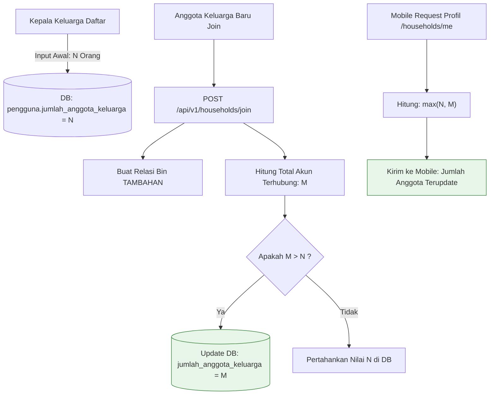

# 📊 Laporan Analisis & Solusi: Mekanisme Hybrid Jumlah Anggota Keluarga

**Kepada**: Manajemen & Tim Pengembang BERSEKA  
**Tanggal**: 18 September 2026  
**Status**: Usulan Disetujui & Spesifikasi Teknis  
**Topik**: Mekanisme Auto-Scale Jumlah Anggota Keluarga Berdasarkan Input Manual Awal vs Pertambahan Akun Digital

---

## 1. Tanggapan atas Usulan Pengguna

> **Usulan Pengguna**:  
> *"Bagaimana apabila anggota keluarga manual yang diinput pertama, misal ketika daftar ia mendaftarkan 4 anggota keluarga. Di sana tetap tertampil 4, namun ketika sudah menambahkan akun hingga 5 akun, maka langsung bertambah sesuai anggota keluarga baru yang masuk?"*

### Kesimpulan: **SANGAT BISA (100% Kompatibel)**
Usulan ini adalah pendekatan **Hybrid Dynamic Scaling**:
- **Baseline / Batas Bawah**: Nilai input manual saat pendaftaran (mengakomodasi anggota keluarga riil di rumah yang belum memiliki smartphone / belum membuat akun).
- **Auto-Scale / Bertambah Otomatis**: Segera setelah jumlah akun digital yang bergabung melewati angka baseline tersebut, sistem secara otomatis menaikkan angka jumlah anggota keluarga mengikuti jumlah akun riil yang terhubung.

---

## 2. Simulasi Logika Sistem (Formula Matematis)

Formula yang diterapkan:
$$\text{Jumlah Ditampilkan} = \max(\text{Input Manual Awal},\, \text{Total Akun Digital Terhubung})$$

### Tabel Simulasi (Contoh Input Awal = 4 Orang):

| Kondisi Akun Terhubung | Akun yang Telah Join | Perhitungan | Angka Tampil di Profil Mobile | Keterangan |
| :---: | :--- | :---: | :---: | :--- |
| **Tahap 1** | Hanya Kepala Keluarga (1 akun) | $\max(4, 1)$ | **4 Orang** | Tetap 4 (3 anggota riil belum buat akun) |
| **Tahap 2** | KK + Istri (2 akun) | $\max(4, 2)$ | **4 Orang** | Tetap 4 (2 anggota riil belum buat akun) |
| **Tahap 3** | KK + Istri + Anak 1 (3 akun) | $\max(4, 3)$ | **4 Orang** | Tetap 4 (1 anggota riil belum buat akun) |
| **Tahap 4** | KK + Istri + Anak 1 + Anak 2 (4 akun) | $\max(4, 4)$ | **4 Orang** | Semua anggota sesuai kuota awal |
| **Tahap 5** | Tambah Anggota Baru / Istri ke-2 (5 akun) | $\max(4, 5)$ | **5 Orang** | 🚀 **Otomatis bertambah jadi 5** |
| **Tahap 6** | Tambah Anggota Baru lagi (6 akun) | $\max(4, 6)$ | **6 Orang** | 🚀 **Otomatis bertambah jadi 6** |

---

## 3. Kondisi Kasus Riil Akun Pengguna Saat Ini

Pada database lokal PostgreSQL (`psc_db`):
- Akun Kepala Keluarga: `acef kiki maulana` memiliki input manual awal = **`3`**.
- Akun terhubung saat ini = **`5 Akun`**:
  1. `acef kiki maulana` (`UTAMA`)
  2. `istri acef kiki maulana` (`TAMBAHAN`)
  3. `anak acef kiki maulana` (`TAMBAHAN`)
  4. `Istri simpenan acef` (`TAMBAHAN`)
  5. `Istri simpenan ke 2 acef` (`TAMBAHAN`)

**Hasil dengan Formula Baru**:
$$\max(3,\, 5) = \mathbf{5\text{ Orang}}$$
Begitu logika ini diaktifkan, profil mobile seluruh anggota keluarga tersebut langsung menampilkan **`5 Orang`**.

---

## 4. Diagram Alur Logika Baru



---

## 5. Rencana Implementasi Teknis (Dual-Layer Sync)

Menerapkan 2 lapis pengamanan agar data konsisten baik di database maupun di respons API:

### Lapis 1: Perhitungan Dinamis di Endpoint (`householdService.ts`)
Saat mobile memanggil `GET /api/v1/households/me`, backend menghitung jumlah akun terhubung pada tong sampah bersama dan menerapkan `Math.max`:

```typescript
// apps/api/src/services/householdService.ts
async getHouseholdsByUser(userId: string) {
  const households = await householdRepository.findHouseholdsByUserId(userId);
  
  return Promise.all(
    households.map(async (h: any) => {
      const headUserId = h.userId || h.user?.id;
      
      // Ambil seluruh bin yang dimiliki kepala keluarga
      const binIds = (
        await prisma.binOwnership.findMany({
          where: { userId: headUserId, type: "UTAMA" },
          select: { binId: true },
        })
      ).map((b) => b.binId);

      // Hitung akun unik terhubung
      const connected = await prisma.binOwnership.groupBy({
        by: ["userId"],
        where: { binId: { in: binIds } },
      });

      const actualConnectedCount = connected.length;
      const declaredFamilySize = h.user?.jumlahAnggotaKeluarga || 1;
      const effectiveFamilySize = Math.max(declaredFamilySize, actualConnectedCount);

      return {
        ...h,
        familySize: effectiveFamilySize,
        jumlahAnggotaKeluarga: effectiveFamilySize,
        user: h.user
          ? {
              ...h.user,
              familySize: effectiveFamilySize,
              jumlahAnggotaKeluarga: effectiveFamilySize,
            }
          : undefined,
      };
    })
  );
}
```

### Lapis 2: Auto-Update Database pada `joinHousehold`
Saat `joinHousehold` dieksekusi, jika jumlah akun terhubung melebihi nilai di database Kepala Keluarga, lakukan update database:

```typescript
// Pada akhir transaksi joinHousehold:
const totalMembers = await tx.binOwnership.groupBy({
  by: ["userId"],
  where: { binId: { in: headUser.binOwnerships.map((b) => b.binId) } },
});

if (totalMembers.length > (headUser.jumlahAnggotaKeluarga || 0)) {
  await tx.user.update({
    where: { id: headUser.id },
    data: { jumlahAnggotaKeluarga: totalMembers.length },
  });
}
```
