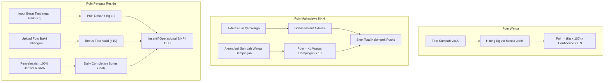

# ANALISIS SKEMA POIN PETUGAS RESIDU BERSEKA

## 1. Karakteristik & Motivasi Utama Setiap Peran

| Parameter | WARGA | MAHASISWA KKN | PETUGAS RESIDU |
|---|---|---|---|
| **Peran Utama** | Penghasil & Pemilah Sampah di Rumah | Edukator & Fasilitator Aktivasi Smart Bin | Operator Lapangan (Pencatat Timbangan & Pengangkut Residu) |
| **Metrik Keberhasilan** | Akurasi Pemilahan (AI Confidence) & Volume | Jumlah Bin Diaktivasi & Kepatuhan Warga Dampingan | Akurasi Timbangan Fisik, Kelengkapan Foto Bukti, & Coverage Wilayah |
| **Tujuan Akhir Poin** | Gamifikasi / Voucher & Hadiah | Nilai Akademik KKN & Poin Kelompok Posko | Insentif Kerja Operasional & Evaluasi KPI DLH/RW |

---

## 2. Analisis Kebutuhan Sistem Poin Petugas Residu

Berbeda dengan Warga (yang dinilai oleh AI) dan Mahasiswa (yang dinilai dari dampak aktivasi/edukasi), Petugas Residu melakukan kerja fisik lapangan dan input data manual yang berdampak langsung ke Web Monitoring RT/RW & DLH.

Oleh karena itu, sistem poin Petugas Residu harus dirancang untuk memenuhi **3 prinsip utama**:

1. **Kejujuran Data Timbangan (Data Integrity):** Mencegah manipulasi berat timbangan.
2. **Kualitas Bukti Lapangan (Verification Quality):** Memastikan foto bukti timbangan jelas dan valid.
3. **Cakupan Wilayah & Ketepatan Waktu (Coverage & Consistency):** Mendorong petugas menyelesaikan seluruh jadwal penugasan di RT/RW.

---

## 3. Rekomendasi Skema & Rumus Kalkulasi Poin Petugas Residu

Kami merekomendasikan **Skema Kombinasi** (Bobot Fisik + Bonus Validasi Foto + Bonus Completion) sebagai sistem yang paling ideal.

### Rumus Kalkulasi Poin (Per Input Timbangan)

$$\text{Poin Input} = (\text{Berat Sampah dalam Kg} \times 2) + \text{Bonus Validasi Foto (10 Poin)}$$

**Contoh Perhitungan:**

Jika Petugas menimbang sampah residu sebesar 14.5 Kg dan mengunggah foto bukti timbangan yang valid:

$$\text{Poin} = (14.5 \times 2) + 10 = 29 \text{ Poin}$$

*(Sesuai dengan contoh response API `earnedPoints: 29` pada dokumen spesifikasi)*

### Bonus Tambahan (Bonus Performa / KPI)

**a. Daily Completion Bonus (Poin Ketuntasan Harian)**
- **Syarat:** Jika Petugas berhasil mengunjungi dan menginput data 100% tempat sampah residu di wilayah penugasannya dalam satu hari (misal 8 dari 8 lokasi selesai).
- **Formula:** $+50 \text{ Poin Bonus Harian}$

**b. Accuracy & Low Anomaly Bonus (Bonus KPI Mingguan)**
- **Syarat:** Jika data timbangan petugas stabil dan terverifikasi cocok oleh Web Monitoring RT/RW tanpa sanggahan/anomali.
- **Formula:** $\text{KPI Score} \times 5 \text{ Poin}$
- **Contoh:** KPI $93.8\% \rightarrow +469 \text{ Poin Mingguan}$

---

## 4. Perbandingan Lengkap 3 Sistem Poin

---

## 5. Kesimpulan & Rekomendasi Fitur

1. **Standar Perolehan Poin:** Gunakan rasio **1 Kg = 2 Poin + 10 Poin Foto Bukti** sebagai standar perolehan poin per-input timbangan.
2. **Orientasi Insentif Kerja:** Poin ini sebaiknya dapat dikonversi menjadi insentif operasional (seperti e-wallet, pulsa, atau bonus kinerja bulanan dari DLH) atau digunakan sebagai indikator penilaian KPI Kinerja Petugas di Web Monitoring RT/RW & DLH.
3. **Pencegahan Fraud/Curang:** Dengan mewajibkan foto bukti timbangan dan Geofence/GPS lokasi RT/RW saat tombol **"Simpan & Kirim Timbangan"** ditekan, data yang masuk ke Web RT/RW dijamin valid.
