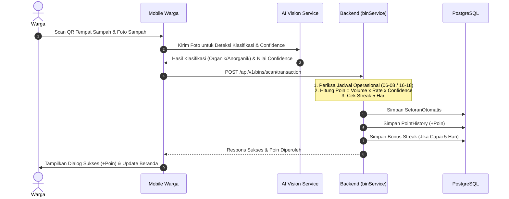
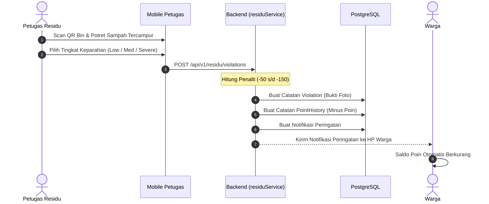

# DOKUMEN SPESIFIKASI & ANALISIS LENGKAP SISTEM POIN WARGA (BERSEKA)
## Panduan Komprehensif Mekanisme Pendapatan (Earning) & Pengurangan (Deduction) Poin

| Atribut Dokumen | Informasi Detail |
| :--- | :--- |
| **Nomor Dokumen** | `008/DOC-SPEC/BERSEKA-POINTS/IX/2026` |
| **Peruntukan** | Tim Pengembang (Mobile & Backend), Product Manager, Pengurus RW, & Dinas Lingkungan Hidup (DLH) |
| **Penyusun** | Tim Arsitektur & Rekayasa Perangkat Lunak BERSEKA |
| **Tanggal Terbit** | 16 September 2026 |
| **Status Dokumen** | Resmi & Siap Menjadi Acuan Sistem (Production Ready) |

---

## DAFTAR ISI
1. [Ringkasan Eksekutif & Filosofi Desain](#1-ringkasan-eksekutif--filosofi-desain)
2. [Arsitektur Dua Buku Kas (Dual-Ledger System)](#2-arsitektur-dua-buku-kas-dual-ledger-system)
3. [Analisis Mekanisme Pendapatan Poin (Point Earning)](#3-analisis-mekanisme-pendapatan-poin-point-earning)
   - 3.1 [Setoran Sampah Cerdas Harian (Core Earning)](#31-setoran-sampah-cerdas-harian-core-earning)
   - 3.2 [Bonus Aktivasi Tempat Sampah Baru (Onboarding)](#32-bonus-aktivasi-tempat-sampah-baru-onboarding)
   - 3.3 [Bonus Konsistensi Partisipasi (Streak 5 Hari)](#33-bonus-konsistensi-partisipasi-streak-5-hari)
   - 3.4 [Pengajuan Ide Kreatif Daur Ulang](#34-pengajuan-ide-kreatif-daur-ulang)
   - 3.5 [Apresiasi Khusus & Penyesuaian Pengurus/Admin](#35-apresiasi-khusus--penyesuaian-pengurusadmin)
4. [Analisis Mekanisme Pengurangan Poin (Point Deduction)](#4-analisis-mekanisme-pengurangan-poin-point-deduction)
   - 4.1 [Penalti Pelanggaran Pemilahan Sampah (Inspeksi Residu)](#41-penalti-pelanggaran-pemilahan-sampah-inspeksi-residu)
   - 4.2 [Penukaran Poin ke Saldo Tunai / E-Wallet (Redemption)](#42-penukaran-poin-ke-saldo-tunai--e-wallet-redemption)
   - 4.3 [Koreksi & Pembatalan Transaksi oleh Developer/Admin (Void & Reversal)](#43-koreksi--pembatalan-transaksi-oleh-developeradmin-void--reversal)
5. [Struktur Data, Skema Database, & API Contracts](#5-struktur-data-skema-database--api-contracts)
6. [Implementasi pada Aplikasi Mobile (Flutter Architecture)](#6-implementasi-pada-aplikasi-mobile-flutter-architecture)
7. [Diagram Alur Sistem (Sequence Diagrams)](#7-diagram-alur-sistem-sequence-diagrams)
8. [Rekomendasi Strategis & Pengembangan Lanjutan](#8-rekomendasi-strategis--pengembangan-lanjutan)

---

## 1. Ringkasan Eksekutif & Filosofi Desain

Sistem Poin BERSEKA dirancang sebagai instrumen **rekayasa perilaku sosial (*behavioral economics*)** guna mendorong masyarakat membiasakan pemilahan sampah dari hulu (rumah tangga) secara mandiri, tepat waktu, dan berkesinambungan.

### Tiga Prinsip Utama Sistem Poin:
1. **Gamifikasi Berkeadilan**: Warga yang memilah sampah dengan bersih, menyetor pada jam operasional yang ditentukan, dan konsisten setiap hari mendapatkan insentif tertinggi.
2. **Disinsentif Transparan**: Kelalaian dalam pemilahan (sampah tercampur atau residu berbahaya) dikenakan penalti pemotongan poin yang disertai dokumentasi foto bukti dan catatan petugas kebersihan.
3. **Konversi Bernilai Riil**: Poin yang terkumpul tidak sekadar angka pajangan, melainkan memiliki daya tukar nyata (dapat dicairkan ke dompet digital / e-wallet) serta menentukan peringkat sosial di lingkungan RW setempat.

---

## 2. Arsitektur Dua Buku Kas (Dual-Ledger System)

Untuk menjaga integritas tata kelola sistem, BERSEKA memisahkan antara insentif perilaku dengan nilai ekonomi material sampah secara tegas ke dalam dua buku besar:

| Dimensi | 1. Buku Poin Gamifikasi (`PointHistory`) | 2. Buku Kas Bank Sampah (`BankSampahLedger`) |
| :--- | :--- | :--- |
| **Satuan Nilai** | **PTS (Points)** | **Rupiah (IDR / Rp)** |
| **Sumber Nilai** | Kepatuhan jadwal, akurasi pemilahan AI, streak harian, ide daur ulang. | Hasil penimbangan fisik & penjualan komoditas daur ulang anorganik di Bank Sampah RW. |
| **Sifat Saldo** | Bersifat akumulatif (*append-only* log transaksi, dijumlahkan via agregasi). | Saldo buku rekening kas warga yang dapat disetor dan ditarik tunai. |
| **Tabel Database** | `riwayat_poin` | `buku_kas_bank_sampah` |
| **Pemanfaatan** | Peringkat *Leaderboard* RT/RW, lencana warga teladan, dan konversi reward. | Tabungan keluarga, penarikan uang tunai di kantor RW/Koperasi. |

---

## 3. Analisis Mekanisme Pendapatan Poin (Point Earning)

Pendapatan poin warga didistribusikan melalui 5 kanal resmi:

```
                              ┌──────────────────────────────────────────────┐
                              │             PENDAPATAN POIN WARGA            │
                              └──────────────────────┬───────────────────────┘
                                                     │
         ┌───────────────────┬───────────────────────┼───────────────────────┬───────────────────┐
         ▼                   ▼                       ▼                       ▼                   ▼
1. Setoran Sampah     2. Aktivasi Bin        3. Streak 5 Hari         4. Ide Daur Ulang    5. Apresiasi Admin
   (AI Scan & Volume)    (+10 s/d +50 Poin)     (+10 Poin Bonus)         (+50 Poin / ACC)     (Manual / Bonus)
```

### 3.1 Setoran Sampah Cerdas Harian (Core Earning)
Setiap kali warga membuang sampah, warga membuka kamera aplikasi mobile BERSEKA untuk memindai QR Code Tempat Sampah dan memotret isi sampah untuk dianalisis oleh AI Vision.

#### Formula Perhitungan Poin Backend (`binService.ts:L704-710`):
$$\text{Poin} = \max\Big(1, \text{round}\big(\text{Volume (Liter)} \times \text{Rate} \times \text{Confidence AI}\big)\Big)$$

Di mana variabel penentu dihitung sebagai berikut:

1. **Estimasi Volume (`Volume`)**:
   Dihitung dari selisih pembacaan kapasitas sensor atau estimasi input volume liter tempat sampah.
2. **Pengali Jadwal Misi Operasional (`Rate = 100 × Multiplier`)**:
   Backend mengevaluasi waktu transaksi secara *real-time*:
   * **Jadwal Misi Pagi**: `06:00 - 08:00 WIB` $\rightarrow \text{Multiplier} = \mathbf{1.0\times}$
   * **Jadwal Misi Sore**: `16:00 - 18:00 WIB` $\rightarrow \text{Multiplier} = \mathbf{1.0\times}$
   * **Di Luar Jadwal (Terlambat)**: Sistem mengaktifkan konfigurasi `late_submission_discount` $\rightarrow \text{Multiplier} = \mathbf{0.3\times}$ (Hanya memperoleh **30% dari poin normal**).
3. **Skala Keyakinan AI (`Confidence AI`)**:
   Skala desimal $0.0 \text{ s/d } 1.0$. Jika foto buram atau material meragukan, pengali poin mengecil secara proporsional.
4. **Guard Status Keaktifan (Lifecycle)**:
   ```typescript
   if (scanUser.lifecycleState !== "FULLY_ACTIVE") {
     calculatedPoints = 0;
   }
   ```
   Hanya warga yang sudah menyelesaikan seluruh siklus registrasi domisili dan tautan tempat sampah yang berhak menerima poin.

---

### 3.2 Bonus Aktivasi Tempat Sampah Baru (Onboarding)
* **Aktivasi Mandiri (+10 Poin)**:
  Warga yang berhasil menautkan tempat sampah pertamanya saat *onboarding* secara otomatis dikreditkan **+10 Poin** (`kategori: PARTISIPASI_STREAK`).
* **Aktivasi Bersama Mahasiswa KKN (+50 Poin)**:
  Jika tempat sampah didistribusikan dan diaktivasi melalui pendampingan mahasiswa KKN berbarcode batch terdaftar, warga memperoleh insentif awal sebesar **+50 Poin** (`kategori: REDUKSI_TONASE`).

---

### 3.3 Bonus Konsistensi Partisipasi (Streak 5 Hari)
* **Aturan Streak (`binRepository.ts:L332-404`)**:
  Sistem melacak histori pencatatan sampah di tabel `setoran_otomatis` selama 5 hari kalender ke belakang.
* **Reward**:
  Jika warga mencatat setoran berturut-turut tanpa putus selama minimal 5 hari, sistem memberikan **Bonus +10 Poin** tambahan (`kategori: PARTISIPASI_STREAK`).
* **Proteksi Dobel Klaim**: Bonus streak dibatasi maksimal 1 kali per hari melalui guard tanggal unik.

---

### 3.4 Pengajuan Ide Kreatif Daur Ulang
* Warga yang memiliki kreasi pemanfaatan sampah anorganik (misal: ecobrick, pot hidroponik dari botol plastik, kerajinan bungkus kopi) dapat mengunggah ide, foto, dan penjelasan ke sistem.
* **Reward RW Approval (`ideDaurUlangService.ts:L58-74`)**:
  Ketika Ketua RW memvalidasi dan menyetujui ide tersebut, warga langsung memperoleh **+50 Poin** (`kategori: IDE_DAUR_ULANG`), dan ide tersebut secara otomatis dipublikasikan ke *Social Feed* seluruh warga di lingkungan RW tersebut.

---

### 3.5 Apresiasi Khusus & Penyesuaian Pengurus/Admin
* Pengurus RW atau Developer DLH dapat memberikan poin apresiasi tambahan secara manual atau massal (*bulk adjustment*) untuk program gotong royong warga, kerja bakti lingkungan, atau pembersihan sungai.

---

### Rangkuman Kanal Pendapatan Poin Warga

| No | Aktivitas / Sumber Poin | Kategori Poin | Besaran Poin | Waktu Pemberian |
| :---: | :--- | :--- | :--- | :--- |
| **1** | Setoran Sampah Tepat Waktu (06-08 / 16-18) | `REDUKSI_TONASE` | Dinamis ($\text{Vol} \times 100 \times \text{AI Conf}$) | Seketika saat foto diverifikasi |
| **2** | Setoran Sampah di Luar Jadwal (Terlambat) | `REDUKSI_TONASE` | Dinamis ($\text{Vol} \times 30 \times \text{AI Conf}$) | Seketika saat foto diverifikasi |
| **3** | Aktivasi Tempat Sampah Baru (Mandiri) | `PARTISIPASI_STREAK` | **+10 Poin** | Seketika saat scan QR aktivasi |
| **4** | Aktivasi Tempat Sampah (Pendampingan KKN) | `REDUKSI_TONASE` | **+50 Poin** | Seketika saat aktivasi batch KKN |
| **5** | Bonus Konsistensi Setoran (Streak 5 Hari) | `PARTISIPASI_STREAK` | **+10 Poin** | Hari ke-5 setoran berturut-turut |
| **6** | Ide Daur Ulang Disetujui Ketua RW | `IDE_DAUR_ULANG` | **+50 Poin** | Saat di-approve Ketua RW |
| **7** | Apresiasi Kerja Bakti / Khusus Admin | `MANUAL_ADJUSTMENT` | Ditentukan Admin/RW | Input dashboard admin |

---

## 4. Analisis Mekanisme Pengurangan Poin (Point Deduction)

Pengurangan poin pada akun warga berlangsung secara terstruktur dan terdata rapi melalui 3 alur spesifik:

```
                              ┌──────────────────────────────────────────────┐
                              │            ALUR PENGURANGAN POIN             │
                              └──────────────────────┬───────────────────────┘
                                                     │
         ┌───────────────────────────────────────────┼───────────────────────────────────────────┐
         ▼                                           ▼                                           ▼
1. Penalti Pelanggaran Pemilahan            2. Penukaran Poin (Redeem)                  3. Koreksi / Pembatalan Admin
   (Oleh Petugas Residu)                       (Oleh Warga Sendiri)                        (Oleh Pengurus / Developer)
```

---

### 4.1 Penalti Pelanggaran Pemilahan Sampah (Inspeksi Residu)

Alur ini berfungsi menegakkan disiplin pemilahan sampah di lapangan. Petugas kebersihan/residu memeriksa fisik tempat sampah saat jadwal pengangkutan.

#### Mekanisme Eksekusi Lapangan (`residuService.ts:L18-98`):
1. **Pemeriksaan & Bukti**:
   Petugas memindai QR Code Tempat Sampah warga, menemukan bahwa sampah tercampur (misal: sampah medis/plastik berada di wadah organik), dan mengambil foto bukti pelanggaran melalui aplikasi petugas.
2. **Kalkulasi Pemotongan Poin**:
   Sistem membaca konfigurasi parameter `residu_penalty_multiplier` (default basis: **50 poin**) dan mengalikannya dengan tingkat keparahan (*severity*):
   * **Tingkat Ringan (*Low / Sedang 1x*)**: $\mathbf{-50\text{ Poin}}$
   * **Tingkat Sedang (*Medium / Sedang 2x*)**: $\mathbf{-100\text{ Poin}}$
   * **Tingkat Berat (*Severe / Tinggi 3x*)**: $\mathbf{-150\text{ Poin}}$
3. **Pencatatan Database Atomik (`prisma.$transaction`)**:
   * Entri pelanggaran dibuat di tabel `violation` lengkap dengan URL foto bukti dan catatan petugas.
   * Entri bernilai negatif dicatat di `pointHistory` (`points: -pointsToDeduct`).
   * Entri notifikasi peringatan diterbitkan ke `notification`.
4. **Notifikasi Seketika ke Warga**:
   Aplikasi mengirimkan notifikasi *Push Notification* dan pesan peringatan otomatis:
   > *"Peringatan Pemilahan Sampah: Ditemukan ketidakpatuhan pemilahan sampah ([Jenis]) dengan tingkat keparahan [Severity]. Poin Anda dipotong [X] poin. Harap pilah sampah dengan benar demi kelestarian lingkungan."*

---

### 4.2 Penukaran Poin ke Saldo Tunai / E-Wallet (Redemption)

Alur ini diinisiasi secara sukarela oleh warga yang ingin mengonversi prestasi lingkungan mereka menjadi dana finansial.

#### Aturan & Parameter Finansial (`pointService.ts:L38-60`):
* **Nilai Kurs Resmi**:
  $$\mathbf{1\text{ Poin} = \text{Rp } 100}$$
  *(Contoh: 100 Poin = Rp 10.000, 500 Poin = Rp 50.000, 1.000 Poin = Rp 100.000)*.
* **Mitra Saldo E-Wallet**: GoPay, OVO, DANA, ShopeePay, LinkAja.

#### Validasi & Alur Transaksi:
1. Warga memasukkan jumlah poin yang ingin ditukarkan dan nomor telepon tujuan.
2. Backend memvalidasi saldo akumulatif warga (`totalPoints >= pointsToConvert`). Jika tidak cukup, sistem melempar pengecualian `INSUFFICIENT_POINTS`.
3. Jika valid, sistem mencatat transaksi pengurang di `pointHistory`:
   * `points: -points`
   * `description: "Konversi [X] Poin ke Saldo [E-Wallet] ([No HP])"`
4. Notifikasi in-app sukses penukaran langsung diterbitkan ke akun warga.

---

### 4.3 Koreksi & Pembatalan Transaksi oleh Developer/Admin (Void & Reversal)

Digunakan untuk menangani insiden anomali, seperti kecurangan manipulasi foto (*fraud*), pemindaian ganda akibat koneksi tidak stabil, atau pembatalan laporan yang keliru.

#### Logika Pembalikan (*Reversal Engine* di `pointService.ts:L516-594`):
* Admin memilih ID transaksi yang ingin dibatalkan di dashboard monitoring.
* Sistem menghitung nilai balik pembalik:
  $$\text{InversePoints} = -(\text{Points Asli})$$
* Transaksi baru dicatat dengan `kategori: "REVERSAL"` dan deskripsi formal: `[REVERSAL / PEMBATALAN] Transaksi (...): alasan pembatalan`.
* **Silent Push Synchronizer**: Backend mengirim payload data Firebase FCM `REFRESH_POIN_WARGA` ke ponsel warga. Provider Riverpod mobile warga langsung memperbarui total poin di layar tanpa perlu membuka ulang aplikasi.

---

### Rangkuman Kanal Pengurangan Poin Warga

| No | Pemicu Pengurangan Poin | Inisiator | Nilai Pengurangan | Keterangan / Dampak |
| :---: | :--- | :--- | :--- | :--- |
| **1** | Pelanggaran Ringan Pemilahan | Petugas Residu | **-50 Poin** | Sampah sedikit tercampur anorganik |
| **2** | Pelanggaran Sedang Pemilahan | Petugas Residu | **-100 Poin** | Tercampur residu/kemasan kotor |
| **3** | Pelanggaran Berat Pemilahan | Petugas Residu | **-150 Poin** | Tercampur sampah B3/bangkai/limbah medis |
| **4** | Penukaran Saldo E-Wallet | Warga (Mandiri) | Sesuai nominal klaim | 1 Poin = Rp 100 (Masuk saldo e-wallet) |
| **5** | Pembatalan / Reversal Transaksi | Admin / Dev | $-\text{Points Transaksi}$ | Koreksi data salah / kecurangan scan |

---

## 5. Struktur Data, Skema Database, & API Contracts

### 5.1 Skema Model Prisma (`schema.prisma`)

```prisma
model PointHistory {
  id          String   @id @default(uuid())
  userId      String   @map("id_pengguna")
  points      Int      // Positif (+) untuk Earning, Negatif (-) untuk Deduction
  description String
  createdAt   DateTime @default(now()) @map("dibuat_pada")
  kategori    String   @default("REDUKSI_TONASE") @map("kategori")
  redeemable  Boolean  @default(false)
  user        User     @relation(fields: [userId], references: [id])

  @@map("riwayat_poin")
}

model Violation {
  id               String   @id @default(uuid())
  userId           String   @map("id_pengguna")
  binId            String   @map("id_tempat_sampah")
  petugasUserId    String   @map("id_petugas")
  type             String   @map("jenis_pelanggaran")
  severity         String   @map("tingkat_keparahan") // LOW, MEDIUM, SEVERE
  evidencePhotoUrl String   @map("foto_bukti_url")
  notes            String?  @map("catatan")
  pointsDeducted   Int      @map("poin_dikurangi")
  createdAt        DateTime @default(now()) @map("dibuat_pada")

  @@map("pelanggaran_sampah")
}
```

### 5.2 Kontrak Antarmuka API Utama (API Contracts)

| Method | Endpoint API | Deskripsi | Akses Role |
| :--- | :--- | :--- | :--- |
| `GET` | `/api/v1/points/me` | Mengambil total poin dan riwayat ledger warga saat ini | `WARGA` |
| `GET` | `/api/v1/points/leaderboard` | Mengambil klasemen ranking poin se-RW | `WARGA`, `ALL` |
| `POST` | `/api/v1/points/convert` | Melakukan klaim penukaran poin ke saldo e-wallet | `WARGA` |
| `POST` | `/api/v1/bins/scan/transaction` | Transaksi setor sampah dengan foto & verifikasi AI | `WARGA` |
| `POST` | `/api/v1/residu/violations` | Pencatatan penalti pelanggaran oleh petugas | `PETUGAS_RESIDU` |
| `POST` | `/api/v1/points/admin/void` | Pembatalan transaksi (*reversal*) oleh admin | `DEVELOPER`, `ADMIN_DLH` |

---

## 6. Implementasi pada Aplikasi Mobile (Flutter Architecture)

### 6.1 State Management (Riverpod Architecture)
Pada layer antarmuka mobile Flutter ([`mobile/lib/app/modules/riwayat/controllers/riwayat_controller.dart`](file:///home/acef-kiki/Documents/Work/Makerindo-Code/berseka/mobile/lib/app/modules/riwayat/controllers/riwayat_controller.dart)), pengelolaan poin menggunakan pola deklaratif reaktif:

```dart
/// Provider total poin akumulasi warga
final totalPointsProvider = FutureProvider<int>((ref) async {
  final repo = ref.watch(wasteLogRepositoryProvider);
  final userId = ref.watch(authProvider.select((s) => s.user?.id ?? ''));
  return repo.getTotalPointsByUser(userId);
});

/// Provider riwayat transaksi poin
final pointHistoryProvider = FutureProvider<List<PointHistoryEntity>>((ref) async {
  final repo = ref.watch(wasteLogRepositoryProvider);
  final userId = ref.watch(authProvider.select((s) => s.user?.id ?? ''));
  return repo.getPointHistoryByUser(userId);
});

/// Provider posisi ranking warga di RW
final userLeaderboardRankProvider = FutureProvider<String>((ref) async {
  final repo = ref.watch(wasteLogRepositoryProvider);
  final userId = ref.watch(authProvider.select((s) => s.user?.id ?? ''));
  return repo.getUserLeaderboardRank(userId);
});
```

### 6.2 Visualisasi Antarmuka Halaman Poin ([`PoinView`](file:///home/acef-kiki/Documents/Work/Makerindo-Code/berseka/mobile/lib/app/modules/poin/poin_view.dart))
Halaman Poin Warga memuat komponen-komponen interaktif:
1. **Header Poin Utama**: Tampilan angka total poin dengan aksen satuan *PTS* dan *progress bar* capaian level.
2. **Widget Jadwal Operasional Pagi & Sore**:
   * Sesi Pagi: `06:00 - 08:00` (Status: **Tersedia** / **Terlewat** / **Belum Mulai**)
   * Sesi Sore: `16:00 - 18:00` (Status: **Tersedia** / **Terlewat** / **Belum Mulai**)
3. **Statistik Tiga Kolom**: Agregasi poin perolehan *Hari Ini*, *Minggu Ini*, dan *Bulan Ini*.
4. **Daftar Riwayat Transaksi**: Setiap transaksi memiliki ikon dinamis (panah hijau naik untuk pendapatan, panah merah turun untuk potongan penalti atau penukaran).

---

## 7. Diagram Alur Sistem (Sequence Diagrams)

### 7.1 Alur Setoran Sampah & Pendapatan Poin



### 7.2 Alur Penalti Pelanggaran Pemilahan



---

## 8. Rekomendasi Strategis & Pengembangan Lanjutan

1. **Proteksi Anti-Kecurangan Pemindaian (*Anti-Fraud Protection*)**:
   * Menambahkan validasi geofencing GPS radius maksimal 25 meter antara koordinat fisik ponsel warga saat memindai dengan koordinat GPS tempat sampah terdaftar.
   * Pembatasan interval pemindaian (*rate limiting*) maksimal 2 kali per sesi jam operasional guna menghindari manipulasi foto berulang kali.
2. **Sistem Tingkatan Warga (*Citizen Badge & Tiering System*)**:
   * Mengelompokkan warga berdasarkan konsistensi poin menjadi tier: **Warga Pemula**, **Pilah Madya**, dan **Warga Teladan Lingkungan**.
   * Tier tertinggi berhak mendapatkan insentif diskon iuran kebersihan RW atau prioritas fasilitas lingkungan.
3. **Penyelarasan Finansial E-Wallet**:
   * Memastikan integrasi *disbursement* otomatis melalui Payment Gateway (Midtrans / Xendit) dengan kuota limit pencairan mingguan yang disepakati bersama Pengurus RW dan Bendahara DLH.

---
*Dokumen ini merupakan spesifikasi teknis resmi BERSEKA. Seluruh modul backend dan mobile wajib merujuk pada standar aturan pada dokumen ini.*
