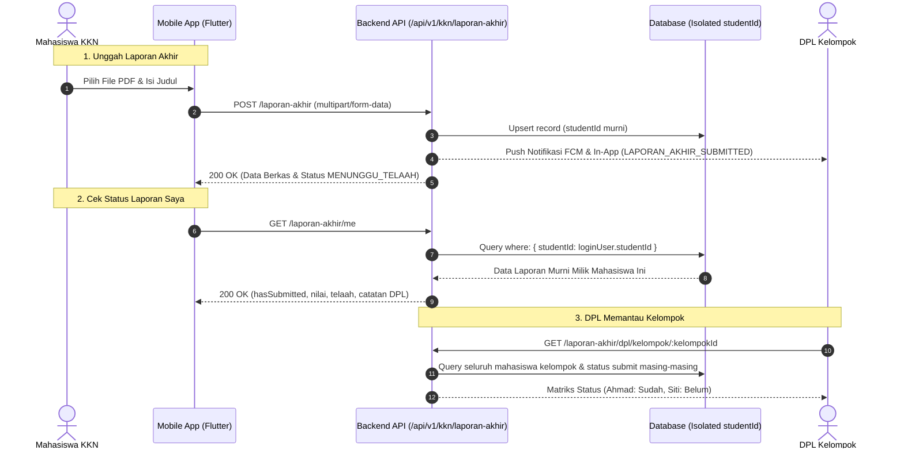

# 📘 DOKUMEN PANDUAN INTEGRASI API: DOMAIN MANDIRI LAPORAN AKHIR KKN (PER-INDIVIDU)

**Versi:** 1.0.0  
**Tanggal:** 2 Oktober 2026  
**Penyusun:** Master Backend Developer  
**Target Pembaca:** Tim Mobile (Flutter), Tim Web Dashboard, Tim QA / Tester  
**Status Implementasi:** ✅ Selesai, Terverifikasi, dan Lulus Seluruh Unit Test  

---

## 1. Latar Belakang & Blueprint Arsitektur

Sebelumnya, Laporan Akhir KKN menumpang di tabel `ProgramKerjaKkn` dan dikelola di tingkat kelompok. Hal tersebut memicu:
1. **Bug Penimpaan Data:** Mahasiswa A dan Mahasiswa B di kelompok yang sama saling melihat berkas satu sama lain karena query mencari di tingkat kelompok.
2. **Pencemaran Data Proker:** Endpoint kegiatan program kerja mengembalikan berkas PDF laporan akhir sehingga aplikasi client terpaksa memfilter manual.

### Arsitektur Baru (Steril & Terisolasi Per-Individu)



---

## 2. Informasi Dasar Endpoint

* **Base URL:** `{{BASE_URL}}/api/v1/kkn/laporan-akhir`
* **Autentikasi:** Bearer Token JWT
* **Format Header:**
  ```http
  Authorization: Bearer <ACCESS_TOKEN>
  ```

---

## 3. Spesifikasi Endpoint Lengkap

### Endpoint 1: Upload / Revisi Laporan Akhir (Mahasiswa)

Digunakan mahasiswa untuk mengunggah dokumen baru atau memperbarui dokumen yang diminta revisi oleh DPL.

* **Method:** `POST`
* **Path:** `/api/v1/kkn/laporan-akhir`
* **Role Akses:** `MAHASISWA_KKN`
* **Content-Type:** `multipart/form-data`

#### Parameter Request (Form-Data):
| Field | Tipe | Wajib? | Keterangan |
|---|---|---|---|
| `judul` | String | Ya | Judul Laporan Akhir Mahasiswa |
| `deskripsi` | String | Tidak | Ringkasan / abstrak laporan |
| `filePdf` | File (Binary) | Ya | Berkas dokumen laporan akhir. Maksimal **15MB**, format **PDF** (`.pdf`) |

#### Contoh Response Sukses (`200 OK`):
```json
{
  "success": true,
  "message": "Laporan Akhir KKN berhasil disimpan dan diteruskan ke DPL.",
  "data": {
    "id": "060d4187-578f-4cfc-b8ea-95d105260124",
    "kelompokId": "a1b2c3d4-e5f6-7890-abcd-ef1234567890",
    "studentId": "e5f6g7h8-i9j0-1234-5678-abcdef987654",
    "kategori": "LAPORAN_AKHIR",
    "deskripsi": "**Laporan Akhir KKN - Budi Santoso**\n\nAnalisis pengelolaan sampah organik di RW 05.",
    "attachmentFile": "/uploads/1727839201923-9b2f.pdf",
    "linkGoogleDrive": "/uploads/1727839201923-9b2f.pdf",
    "hasAttachment": true,
    "statusUsulan": "MENUNGGU_TELAAH",
    "status": "BELUM_DISETUJUI",
    "statusPenilaian": "BELUM_DINILAI",
    "updatedAt": "2026-10-02T10:30:00.000Z"
  }
}
```

#### Kemungkinan Response Error:
* **`400 Bad Request`** (Berkas tidak valid / melebihi ukuran):
  ```json
  {
    "success": false,
    "message": "File too large"
  }
  ```
* **`400 Bad Request`** (Mahasiswa belum terdaftar dalam kelompok):
  ```json
  {
    "success": false,
    "message": "Mahasiswa belum terdaftar dalam kelompok KKN."
  }
  ```
* **`401 Unauthorized`**:
  ```json
  {
    "success": false,
    "message": "Akses tidak sah."
  }
  ```

---

### Endpoint 2: Mengambil Status & Nilai Laporan Saya (Mahasiswa)

Mengambil data berkas, status telaah, dan nilai rubrik milik mahasiswa yang sedang login. **Dijamin terisolasi murni per-individu.**

* **Method:** `GET`
* **Path:** `/api/v1/kkn/laporan-akhir/me`
* **Role Akses:** `MAHASISWA_KKN`

#### Response Kasus A: Mahasiswa Belum Pernah Mengunggah (`hasSubmitted: false`)
```json
{
  "success": true,
  "message": "Belum ada laporan akhir yang diunggah",
  "data": {
    "hasSubmitted": false,
    "kelompokId": "a1b2c3d4-e5f6-7890-abcd-ef1234567890",
    "namaKelompok": "Kelompok 10 Coblong",
    "dpl": {
      "id": "uuid-dpl-123",
      "name": "Dr. Ir. Dosen Pembimbing, M.T.",
      "phone": "+628123456789"
    },
    "data": null
  }
}
```

#### Response Kasus B: Mahasiswa Sudah Mengunggah & Belum Dinilai (`statusTelaah: "MENUNGGU_TELAAH"`)
```json
{
  "success": true,
  "message": "Data laporan akhir berhasil dimuat",
  "data": {
    "hasSubmitted": true,
    "id": "060d4187-578f-4cfc-b8ea-95d105260124",
    "kelompokId": "a1b2c3d4-e5f6-7890-abcd-ef1234567890",
    "namaKelompok": "Kelompok 10 Coblong",
    "judul": "Laporan Akhir KKN - Budi Santoso",
    "deskripsi": "Analisis pengelolaan sampah organik di RW 05.",
    "fileUrl": "/uploads/1727839201923-9b2f.pdf",
    "fileName": "Laporan_Akhir_Budi_Santoso.pdf",
    "isGoogleDrive": false,
    "statusTelaah": "MENUNGGU_TELAAH",
    "status": "BELUM_DISETUJUI",
    "nilaiAkhir": null,
    "skorPenilaian": null,
    "predikat": "Belum Dinilai",
    "catatanDpl": "",
    "catatanRevisi": "",
    "aspekPenilaian": null,
    "submittedAt": "2026-10-02T08:00:00.000Z",
    "updatedAt": "2026-10-02T08:00:00.000Z",
    "dpl": {
      "id": "uuid-dpl-123",
      "name": "Dr. Ir. Dosen Pembimbing, M.T.",
      "phone": "+628123456789"
    }
  }
}
```

#### Response Kasus C: Laporan Telah Dinilai / Disetujui DPL (`statusTelaah: "DISETUJUI"`)
```json
{
  "success": true,
  "message": "Data laporan akhir berhasil dimuat",
  "data": {
    "hasSubmitted": true,
    "id": "060d4187-578f-4cfc-b8ea-95d105260124",
    "kelompokId": "a1b2c3d4-e5f6-7890-abcd-ef1234567890",
    "namaKelompok": "Kelompok 10 Coblong",
    "judul": "Laporan Akhir KKN - Budi Santoso",
    "deskripsi": "Analisis pengelolaan sampah organik di RW 05.",
    "fileUrl": "/uploads/1727839201923-9b2f.pdf",
    "fileName": "Laporan_Akhir_Budi_Santoso.pdf",
    "isGoogleDrive": false,
    "statusTelaah": "DISETUJUI",
    "status": "SELESAI",
    "nilaiAkhir": 88,
    "skorPenilaian": 88,
    "predikat": "A (Sangat Baik)",
    "catatanDpl": "Analisis lapangan sangat tajam dan data tersaji runtut.",
    "catatanRevisi": "Analisis lapangan sangat tajam dan data tersaji runtut.",
    "aspekPenilaian": {
      "rubrikScores": {
        "sistematika": 90,
        "analisis": 85,
        "output": 90,
        "refleksi": 87
      }
    },
    "submittedAt": "2026-10-02T08:00:00.000Z",
    "updatedAt": "2026-10-02T09:45:00.000Z",
    "dpl": {
      "id": "uuid-dpl-123",
      "name": "Dr. Ir. Dosen Pembimbing, M.T.",
      "phone": "+628123456789"
    }
  }
}
```

---

### Endpoint 3: Riwayat Pengajuan / Version History (Mahasiswa)

Mengambil daftar seluruh riwayat pengajuan dokumen laporan akhir mahasiswa yang bersangkutan (misal untuk log audit atau tracking revisi).

* **Method:** `GET`
* **Path:** `/api/v1/kkn/laporan-akhir/history`
* **Role Akses:** `MAHASISWA_KKN`

#### Contoh Response:
```json
{
  "success": true,
  "data": [
    {
      "id": "060d4187-578f-4cfc-b8ea-95d105260124",
      "judul": "Laporan Akhir KKN - Budi Santoso (Revisi 1)",
      "deskripsi": "Perbaikan Bab 3 sesuai masukan DPL.",
      "fileUrl": "/uploads/1727839201923-rev1.pdf",
      "statusTelaah": "MENUNGGU_TELAAH",
      "skorPenilaian": null,
      "predikat": "Belum Dinilai",
      "catatanDpl": null,
      "aspekPenilaian": null,
      "createdAt": "2026-10-02T10:00:00.000Z",
      "updatedAt": "2026-10-02T10:00:00.000Z"
    }
  ]
}
```

---

### Endpoint 4: Matriks Progres Laporan Kelompok (Untuk DPL)

Menampilkan rekapitulasi status pengumpulan laporan akhir seluruh mahasiswa di suatu kelompok KKN.

* **Method:** `GET`
* **Path:** `/api/v1/kkn/laporan-akhir/dpl/kelompok/:kelompokId`
* **Role Akses:** `DPL`, `DOSEN_PEMBIMBING`, `SUPER_USER`, `DEVELOPER`, `ADMIN_DLH`

#### Contoh Response:
```json
{
  "success": true,
  "kelompokId": "a1b2c3d4-e5f6-7890-abcd-ef1234567890",
  "namaKelompok": "Kelompok 10 Coblong",
  "totalMahasiswa": 3,
  "totalSudahSubmit": 2,
  "totalBelumSubmit": 1,
  "mahasiswa": [
    {
      "studentId": "st-001",
      "userId": "usr-001",
      "nama": "Ahmad Fauzi",
      "nim": "2201001",
      "jurusan": "Teknik Informatika",
      "fakultas": "Teknik",
      "isKetua": true,
      "hasSubmitted": true,
      "laporanId": "lap-001",
      "judulLaporan": "Pemberdayaan Bank Sampah Digital",
      "fileUrl": "/uploads/laporan-ahmad.pdf",
      "fileName": "Laporan_Akhir_Ahmad_Fauzi.pdf",
      "statusTelaah": "DISETUJUI",
      "nilaiAkhir": 92,
      "predikat": "A",
      "catatanDpl": "Sangat memuaskan.",
      "submittedAt": "2026-10-01T14:00:00.000Z",
      "updatedAt": "2026-10-02T08:00:00.000Z"
    },
    {
      "studentId": "st-002",
      "userId": "usr-002",
      "nama": "Budi Santoso",
      "nim": "2201002",
      "jurusan": "Sistem Informasi",
      "fakultas": "Teknik",
      "isKetua": false,
      "hasSubmitted": true,
      "laporanId": "lap-002",
      "judulLaporan": "Sosialisasi Pemilahan Sampah",
      "fileUrl": "/uploads/laporan-budi.pdf",
      "fileName": "Laporan_Akhir_Budi_Santoso.pdf",
      "statusTelaah": "MENUNGGU_TELAAH",
      "nilaiAkhir": null,
      "predikat": "Belum Dinilai",
      "catatanDpl": null,
      "submittedAt": "2026-10-02T09:00:00.000Z",
      "updatedAt": "2026-10-02T09:00:00.000Z"
    },
    {
      "studentId": "st-003",
      "userId": "usr-003",
      "nama": "Siti Nurhaliza",
      "nim": "2201003",
      "jurusan": "Ilmu Lingkungan",
      "fakultas": "MIPA",
      "isKetua": false,
      "hasSubmitted": false,
      "laporanId": null,
      "judulLaporan": null,
      "fileUrl": null,
      "fileName": null,
      "statusTelaah": "BELUM_UNGGAH",
      "nilaiAkhir": null,
      "predikat": "Belum Dinilai",
      "catatanDpl": null,
      "submittedAt": null,
      "updatedAt": null
    }
  ]
}
```

---

## 4. Spesifikasi Push Notifikasi (FCM / In-App)

Setiap mahasiswa berhasil mengirimkan atau merevisi laporan akhir, backend otomatis mengirimkan notifikasi ke akun DPL:

* **Tipe Notifikasi:** `LAPORAN_AKHIR_SUBMITTED`
* **Data Payload:**
  ```json
  {
    "event": "REFRESH_LAPORAN_AKHIR_DPL",
    "studentId": "<STUDENT_UUID>",
    "kelompokId": "<KELOMPOK_UUID>",
    "laporanId": "<LAPORAN_UUID>",
    "click_action": "FLUTTER_NOTIFICATION_CLICK"
  }
  ```
* **Rekomendasi Aksi Mobile:**  
  Jika DPL sedang membuka aplikasi mobile pada halaman Laporan Akhir, tangkap `event: "REFRESH_LAPORAN_AKHIR_DPL"` untuk memicu refresh data tabel secara otomatis.

---

## 5. Panduan Implementasi Kode di Mobile (Flutter / Dart)

### A. Contoh Pemanggilan Upload di `ApiKknRepository`

```dart
import 'dart:io';
import 'package:dio/dio.dart';

class LaporanAkhirRepository {
  final Dio _dio;

  LaporanAkhirRepository(this._dio);

  /// 1. Mengunggah / Memperbarui Laporan Akhir Individu
  Future<Map<String, dynamic>> submitLaporanAkhir({
    required String judul,
    String? deskripsi,
    required File filePdf,
    ProgressCallback? onSendProgress,
  }) async {
    final fileName = filePdf.path.split('/').last;

    final formData = FormData.fromMap({
      'judul': judul,
      'deskripsi': deskripsi ?? '',
      'filePdf': await MultipartFile.fromFile(
        filePdf.path,
        filename: fileName,
      ),
    });

    final response = await _dio.post(
      '/api/v1/kkn/laporan-akhir',
      data: formData,
      options: Options(
        headers: {
          'Content-Type': 'multipart/form-data',
        },
      ),
      onSendProgress: onSendProgress,
    );

    return response.data;
  }

  /// 2. Mengambil Status & Nilai Laporan Saya
  Future<Map<String, dynamic>> getLaporanAkhirMe() async {
    final response = await _dio.get('/api/v1/kkn/laporan-akhir/me');
    return response.data;
  }

  /// 3. Mengambil Matriks Anggota Kelompok (Khusus DPL)
  Future<Map<String, dynamic>> getDplKelompokMatrix(String kelompokId) async {
    final response = await _dio.get(
      '/api/v1/kkn/laporan-akhir/dpl/kelompok/$kelompokId',
    );
    return response.data;
  }
}
```

### B. Checklist Penyesuaian Tim Mobile:

- [x] **Ganti Endpoint Submit:**  
  Di `input_laporan_akhir_view.dart`, arahkan submit ke `POST /api/v1/kkn/laporan-akhir` (bukan lagi `POST /api/v1/kkn/program-kerja` dengan flag kategori).
- [x] **Field Form-Data:**  
  Pastikan nama key multipart adalah: `filePdf` (berkas file), `judul` (string), dan `deskripsi` (string).
- [x] **Filter Proker Bersih:**  
  Pengecekan manual `kat != 'LAPORAN_AKHIR'` di layar Proker Tim sudah tidak wajib karena backend telah menyaringnya di database.
- [x] **Batas Berkas:**  
  Maksimum ukuran berkas PDF diizinkan hingga **15 Megabytes**.

---

## 6. Ringkasan Status Nilai Telaah

| Nilai `statusTelaah` | Makna Bisnis | Rekomendasi Badge / Warna UI |
|---|---|---|
| `BELUM_UNGGAH` | Mahasiswa belum pernah upload berkas PDF | Abu-abu (`Colors.grey`) |
| `MENUNGGU_TELAAH` | Dokumen berhasil masuk, menunggu ulasan DPL | Kuning / Oranye (`Colors.amber`) |
| `PERLU_REVISI` | DPL meminta perbaikan dokumen (cek `catatanDpl`) | Merah (`Colors.redAccent`) |
| `DISETUJUI` | Dokumen diterima dan disahkan oleh DPL | Hijau (`Colors.green`) |

---

*Dokumen ini merupakan panduan final integrasi. Jika terdapat pertanyaan atau kebutuhan penyesuaian payload, silakan komunikasikan dengan tim backend.*
