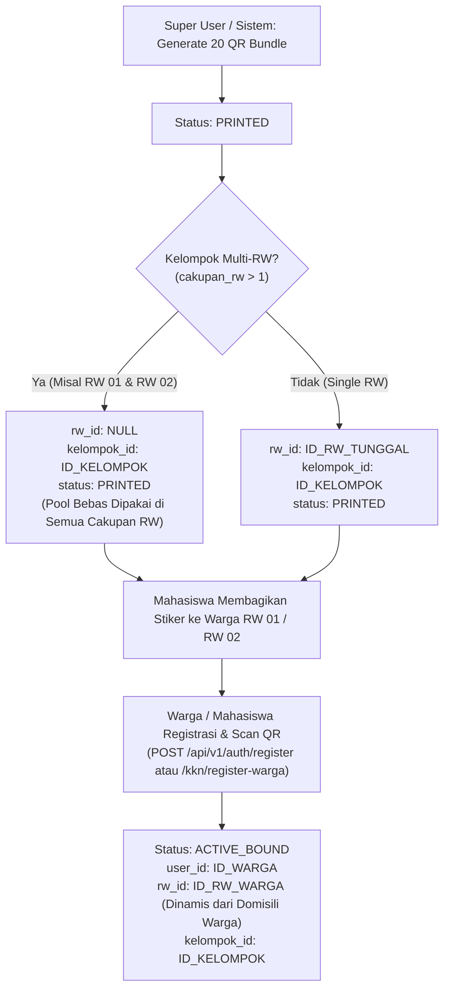

# LAPORAN TEKNIS ARSITEKTUR & REKOMENDASI PERBAIKAN FITUR QR CODE DINAMIS & MULTI-RW
**Kepada:** Tim Backend Developer BERSEKA & Lead Engineer  
**Dari:** Mobile Application Developer (Role Engineer Client)  
**Tanggal:** 11 September 2026  
**Status:** Rekomendasi Resmi & Spesifikasi Integrasi (RFC / Technical Spec)  
**Ref Kasus:** Trial Aktivasi Mahasiswa KKN (`089521384189`), Isu QR Statis (`0466` & `0473`), dan Penanganan Kelompok Multi-RW  

---

## 1. EXECUTIVE SUMMARY (RINGKASAN EKSEKUTIF)

Pada pelaksanaan program KKN BERSEKA di lapangan, muncul laporan kebingungan dari mahasiswa dan tim tester:
1. **Kasus Akun Percobaan Mahasiswa (`089521384189`)**: Mahasiswa melakukan uji coba aktivasi QR Code `BSK-OGN-060926-0466` (Organik) dan `BSK-AGN-060926-0473` (Anorganik).
2. **Kekhawatiran Pengguna**: Mahasiswa dan penguji mengira QR Code yang muncul di aplikasi bersifat "statis/sama" untuk semua kelompok atau akun uji coba, serta cemas aktivasi ini mengurangi kuota poin atau mengunci kelompok lain.
3. **Hasil Temuan**: Kode QR tersebut **bukan duplikat**, melainkan jatah fisik unik kelompok yang bersangkutan. Namun, ditemukan **3 celah logika fundamental pada backend** terkait pengelolaan kuota QR, fallback tester, dan penguncian wilayah pada kelompok yang membawahi **Multi-RW** (2 RW hingga 4 RW).

Dokumen ini disusun untuk memberikan gambaran arsitektural lengkap, analisis akar masalah (root-cause analysis) berbasis kode riil backend (`apps/api`), spesifikasi kontrak API baru, serta panduan solusi teknis siap pakai bagi developer backend.

---

## 2. ANALISIS AKAR MASALAH PADA BACKEND (ROOT-CAUSE FORENSIC)

### 2.1. Celah 1: Fallback Otomatis Akun Tester/Admin Mengunci ke Kelompok Urutan Pertama
- **File**: `apps/api/src/services/kknService.ts` (baris 5728–5735)
- **Kode Saat Ini**:
  ```typescript
  } else if (["SUPER_USER", "ADMIN_DLH", "PANITIA_TASKFORCE", "PEMIMPIN"].includes(userRole)) {
    if (requestedKelompokId) {
      kelompokId = requestedKelompokId;
    } else {
      const firstK = await prisma.kelompokKkn.findFirst();
      if (!firstK) throw new Error("KELOMPOK_NOT_ASSIGNED");
      kelompokId = firstK.id;
    }
  }
  ```
- **Analisis Dampak**:
  Ketika akun Super User, Admin, atau akun uji coba non-mahasiswa membuka endpoint `GET /api/v1/kkn/my-kelompok/qr-codes` tanpa query parameter `?kelompokId=...`, backend secara otomatis mengambil `firstK` (Kelompok index 1 di database).
  Kelompok 1 secara kebetulan memiliki batch QR urutan sequence `0461–0480`, yang di dalamnya terdapat kode `0466` dan `0473`. Akibatnya, setiap kali penguji menguji akun admin/tester, yang ditampilkan selalu QR milik Kelompok 1, sehingga tercipta ilusi bahwa "QR tidak dinamis".

### 2.2. Celah 2: Generate Bundle QR 20 Stiker Mengunci Hanya ke 1 RW Saja pada Kelompok Multi-RW
- **File**: `apps/api/src/services/superUserService.ts` (baris 1563–1618)
- **Kode Saat Ini**:
  ```typescript
  // Mengambil RW hanya dari mahasiswa pertama yang ditemukan:
  const firstStudentWithRw = kelompok.students.find((s) => s.assignedRwId);
  if (firstStudentWithRw?.assignedRwId) {
    rwId = firstStudentWithRw.assignedRwId;
    kelurahanId = firstStudentWithRw.assignedRw?.kelurahanId || null;
  }
  ...
  // Seluruh 20 stiker (Organik & Anorganik) dipaksa memiliki rwId yang sama:
  newBinsData.push({
    qrCode,
    categoryId: catOrganik?.id || null,
    kelompokId: kelompok.id,
    rwId, // <-- TERKUNCI HANYA KE 1 RW
    kelurahanId,
    status: "PRINTED" as any,
    qrBatchId: batch.id,
  });
  ```
- **Analisis Dampak**:
  Banyak kelompok KKN yang membawahi lebih dari 1 RW (misal Kelompok membawahi RW 01 dan RW 02, atau RW 01 s/d RW 04 sebagaimana tercatat dalam `kelompok_kkn.cakupan_rw`).
  Dengan algoritma saat ini:
  1. Ke-20 tempat sampah (10 pasang) langsung dipatok ke RW milik mahasiswa urutan pertama (misal RW 01).
  2. Mahasiswa yang bertugas mendampingi warga di RW 02 tidak memiliki kuota tempat sampah yang terdata di RW-nya pada status `PRINTED`.
  3. Hal ini bertentangan dengan prinsip pembagian wilayah Multi-RW di lapangan, di mana 20 stiker stiker tersebut merupakan pool bersama untuk didistribusikan ke RW-RW binaan kelompok tersebut.

### 2.3. Celah 3: RBAC Scoping Mahasiswa KKN Terisolasi Hanya ke RW Personal
- **File**: `apps/api/src/utils/rbacScoping.ts` (baris 297–308)
- **Kode Saat Ini**:
  ```typescript
  if (student && student.assignedRwId) {
    const kel = student.kelompok?.kelurahan;
    return {
      userFilter: {
        OR: [
          { rwId: student.assignedRwId },
          ...(kel ? [{ rw: { kelurahan: { name: { equals: kel, mode: "insensitive" } } } }] : []),
        ],
      },
      binFilter: {
        rwId: student.assignedRwId, // <-- HANYA BISA LIHAT BIN DENGAN RW PRIBADI
      },
  ```
- **Analisis Dampak**:
  Jika mahasiswa B yang bertugas di RW 02 membuka endpoint monitoring/tempat sampah umum yang menggunakan scoping RBAC `binFilter`, sistem menghasilkan `WHERE rw_id = RW_02_ID`.
  Karena seluruh 20 stiker di database saat awal di-generate bernilai `rw_id = RW_01_ID`, mahasiswa B melihat **0 tempat sampah**. Mahasiswa B baru bisa melihat tempat sampah jika warga di RW 02 sudah melakukan aktivasi/binding, namun setelah itu mahasiswa A (di RW 01) justru kehilangan akses melihat tempat sampah tersebut.

### 2.4. Celah 4: Endpoint `getMyKelompokQrCodes` Belum Mengikutsertakan Relasi `rw` Secara Eksplisit
- **File**: `apps/api/src/services/kknService.ts` (baris 5744–5784)
- **Kode Saat Ini**:
  ```typescript
  bins: {
    include: {
      category: true,
      user: { select: { id: true, name: true, phone: true, address: true } },
    },
    orderBy: { qrCode: "asc" },
  }
  ```
  Pada mapping `items`:
  ```typescript
  terikatWarga: b.user
    ? {
        id: b.user.id,
        nama: b.user.name,
        telepon: b.user.phone || "-",
        alamat: b.user.address || "-",
      }
    : null,
  ```
- **Analisis Dampak**:
  Field `rw` atau `rwId` tidak disertakan dalam objek `b.bins` maupun `terikatWarga`. Tim mobile sebelumnya terpaksa melakukan ekstraksi regex pada alamat warga (`RegExp(r'rw\s*([0-9]+)')`) untuk mendeteksi nomor RW warga terikat. Ini rentan jika format alamat warga tidak seragam.

### 2.5. Celah 5: Endpoint Aktivasi Mahasiswa (`activateWargaBin`) Belum Memvalidasi Kesesuaian Wilayah RW
- **File**: `apps/api/src/services/kknService.ts` (baris 1381–1518)
- **Kode Saat Ini**:
  ```typescript
  for (const bin of bins) {
    // Guard: hanya menolak jika sudah dimiliki warga lain
    if (
      bin.userId &&
      bin.userId !== wargaId &&
      ["ACTIVE_BOUND", "PENDING_APPROVAL"].includes(bin.status)
    ) {
      throw new Error(
        `Tempat sampah ${bin.qrCode} sudah dimiliki oleh warga lain dan tidak bisa diklaim ulang.`
      );
    }

    await tx.bin.update({
      where: { id: bin.id },
      data: {
        userId: wargaId,
        status: "ACTIVE_BOUND",
        registeredByStudentId: kknUserId,
        ...(latitude && longitude ? { latitude, longitude } : {}),
      },
    });
  ```
- **Analisis Dampak**:
  1. **Tidak Ada Validasi Wilayah RW**: Backend tidak memeriksa apakah `bin.rwId` sesuai dengan RW domisili warga (`targetWarga.rwId`) atau penugasan mahasiswa (`student.assignedRwId`). Akibatnya, stiker QR yang dicadangkan untuk RW 01 bisa saja tidak sengaja diaktifkan untuk warga di RW 02 tanpa ada pencegahan dari backend.
  2. **Tidak Memperbarui Kolom `rw_id`**: Pada `tx.bin.update`, kolom `rwId` sama sekali tidak disentuh. Jika stiker berstatus `PRINTED` dengan `rwId = null` (shared pool Multi-RW), setelah diaktivasi statusnya menjadi `ACTIVE_BOUND` namun `rwId` tetap `null`. Sebaliknya jika stiker awalnya terkunci di RW 01 namun diaktivasi untuk warga RW 02, data di database tetap tercatat sebagai tempat sampah RW 01, merusak agregasi statistik DLH dan rekap RW.

---

## 3. ARSITEKTUR KONSEPTUAL: LOGIKA MULTI-RW (DYNAMIC MULTI-RW)

Untuk mendukung operasional lapangan yang dinamis, backend perlu mengadopsi model alur hidup stiker QR berikut:



### Prinsip Utama:
1. **Identitas Global QR**:
   Nomor barcode `BSK-[OGN/AGN]-[DDMMYY]-[URUT]` dicetak tanpa tulisan RW/Kelompok di fisik stiker agar fleksibel diproduksi secara massal.
2. **Afiliasi Kelompok KKN**:
   Stiker QR terikat kuat pada level Kelompok (`bin.kelompokId`). Semua anggota mahasiswa dalam kelompok tersebut memiliki hak bersama untuk melihat, mengunduh PDF, dan membagikan ke-20 stiker tersebut.
3. **Afiliasi RW Fleksibel (Late-Binding)**:
   - Sebelum dipasang (status `PRINTED`), stiker belum terikat ke RW manapun (`rwId: null`) atau dianggap milik bersama seluruh RW dalam `cakupan_rw`.
   - Saat stiker diaktivasi oleh warga (status `ACTIVE_BOUND`), kolom `tb_bins.rw_id` diisi secara riil berdasarkan RW domisili warga (`warga.rwId`).

### 3.1. Penanganan Khusus Mahasiswa Multi-RW di Lapangan
Dalam implementasi KKN Berseka, terdapat 2 pola penugasan wilayah pada kelompok Multi-RW:
1. **Pola Pembagian Individu**: Mahasiswa A ditugaskan di RW 01, Mahasiswa B di RW 02 dalam satu kelompok yang sama.
2. **Pola Kolaboratif (Multi-RW Personal)**: Mahasiswa mengelola 2 atau lebih RW secara bersama-sama (`user.rw = "01, 02"` atau mencakup seluruh RW kelompok).

**Mekanisme Aktivasi Tempat Sampah untuk Mahasiswa Multi-RW:**
- **Objek Aktivasi Selalu Terikat ke Warga**: Tempat sampah diaktivasi untuk warga binaan tertentu, di mana setiap warga **pasti memiliki 1 RW domisili yang definitif** (misal: Pak Budi di RW 01, Ibu Siti di RW 02).
- **Aturan Stiker Shared Pool (Belum Terikat RW / `rwId: null`)**:
  - Mahasiswa Multi-RW dapat membawa stiker shared pool tersebut ke RW 01 maupun ke RW 02.
  - Saat ditempelkan pada tempat sampah warga di RW 01, stiker otomatis terikat permanen ke RW 01 (`bin.rwId = 1`).
  - Saat ditempelkan pada tempat sampah warga di RW 02, stiker otomatis terikat permanen ke RW 02 (`bin.rwId = 2`).
- **Aturan Stiker Terkunci (Pre-Assigned / `rwId: 1`)**:
  - Jika suatu stiker sudah tercatat dialokasikan khusus untuk RW 01, maka mahasiswa (meskipun membina Multi-RW) **TIDAK BISA** menempelkan stiker tersebut ke rumah warga di RW 02.
  - Sistem client mobile dan backend akan menolak dengan error `BIN_RW_MISMATCH` untuk menjaga kuota fisik per wilayah tidak saling tumpang-tindih.
- **Dukungan Antarmuka Mobile**:
  - Layar `Monitoring Warga` otomatis memuat seluruh warga dampingan dari semua RW cakupan kelompok mahasiswa.
  - Scanner kamera dan dialog konfirmasi menampilkan badge dinamis wilayah target (`RW 01` atau `Multi RW: RW 01, RW 02`).

---

## 4. SPESIFIKASI PERBAIKAN BACKEND (ACTIONABLE CODE CHANGES)

### 4.1. Perbaikan `superUserService.ts` (Generate QR Bundle)
**Path**: `apps/api/src/services/superUserService.ts`  
Ubah penentuan `rwId` saat pembuatan tempat sampah baru:

```typescript
// SEBELUM:
// const firstStudentWithRw = kelompok.students.find((s) => s.assignedRwId);
// if (firstStudentWithRw?.assignedRwId) {
//   rwId = firstStudentWithRw.assignedRwId;
// }

// SESUDAH (REKOMENDASI):
const cakupanList = Array.isArray(kelompok.cakupanRw) 
  ? kelompok.cakupanRw 
  : (typeof kelompok.cakupanRw === "string" ? JSON.parse(kelompok.cakupanRw || "[]") : []);

const isMultiRw = cakupanList.length > 1;

// Jika Multi-RW, biarkan rwId = null agar stiker bersifat shared pool,
// atau hanya set rwId jika kelompok memang single RW.
let initialRwId: number | null = null;
if (!isMultiRw) {
  const studentWithRw = kelompok.students.find((s) => s.assignedRwId);
  initialRwId = studentWithRw?.assignedRwId || null;
}

// Saat push ke newBinsData:
newBinsData.push({
  qrCode,
  categoryId: catOrganik?.id || null,
  kelompokId: kelompok.id,
  rwId: initialRwId, // NULL jika Multi-RW, terisi jika Single RW
  kelurahanId,
  status: "PRINTED" as any,
  qrBatchId: batch.id,
});
```

---

### 4.2. Perbaikan `kknService.ts` (`getMyKelompokQrCodes`)
**Path**: `apps/api/src/services/kknService.ts`  
Sertakan relasi `rw` pada query dan tambahkan data RW pada response payload:

```typescript
// 1. Pada prisma.kelompokKkn.findUnique:
bins: {
  include: {
    category: true,
    rw: { select: { id: true, rwNumber: true, name: true } }, // <-- TAMBAHKAN RELASI RW
    user: { 
      select: { 
        id: true, 
        name: true, 
        phone: true, 
        address: true, 
        rwId: true,
        rw: { select: { id: true, rwNumber: true, name: true } },
      } 
    },
  },
  orderBy: { qrCode: "asc" },
},

// 2. Pada mapping items:
const items = kelompok.bins.map((b, idx) => {
  const isAnorg = isAnorganikBin(b);
  const activeRw = b.user?.rw || b.rw;
  
  return {
    id: b.id,
    nomorUrut: idx + 1,
    qrCode: b.qrCode,
    jenis: isAnorg ? "ANORGANIK" : "ORGANIK",
    kategoriNama: isAnorg ? "Tempat Sampah Anorganik" : "Tempat Sampah Organik",
    warnaLabel: isAnorg ? "Kuning (#F59E0B)" : "Hijau (#10B981)",
    hexColor: isAnorg ? "#F59E0B" : "#10B981",
    status: b.status,
    isAvailable: b.status === "PRINTED",
    rwId: b.rwId,
    nomorRw: activeRw ? activeRw.rwNumber || activeRw.name : null,
    terikatWarga: b.user
      ? {
          id: b.user.id,
          nama: b.user.name,
          telepon: b.user.phone || "-",
          alamat: b.user.address || "-",
          rwId: b.user.rwId || b.rwId,
          nomorRw: b.user.rw?.rwNumber || activeRw?.rwNumber || null,
        }
      : null,
    tanggalAktivasi: b.status === "ACTIVE_BOUND" ? b.updatedAt : null,
    // ... metadata aset stiker lainnya dipertahankan
  };
});
```

---

### 4.3. Perbaikan `rbacScoping.ts` (Hak Akses Mahasiswa Multi-RW)
**Path**: `apps/api/src/utils/rbacScoping.ts`  
Perbarui scoping agar mahasiswa dapat melihat seluruh tempat sampah yang dimiliki oleh kelompoknya:

```typescript
// SEBELUM:
// binFilter: {
//   rwId: student.assignedRwId,
// },

// SESUDAH (REKOMENDASI):
let binCondition: any = { rwId: student.assignedRwId };

if (student.kelompokId) {
  // Mahasiswa berhak melihat semua bin kelompoknya (termasuk yang rwId-nya di RW anggota lain atau masih NULL)
  binCondition = {
    OR: [
      { kelompokId: student.kelompokId },
      { rwId: student.assignedRwId },
    ],
  };
}

return {
  userFilter: { ... },
  binFilter: binCondition,
  householdFilter: { ... },
  wasteLogFilter: { ... },
  pemanfaatanFilter: { ... },
};
```

---

### 4.4. Logika Binding Registrasi Warga (`authRepository.ts` & `kknService.ts`)
Pastikan saat proses aktivasi warga (`status = "ACTIVE_BOUND"`), sistem memperbarui `tb_bins.rw_id` dan `tb_bins.kelompok_id`:

```typescript
await tx.bin.update({
  where: { id: bin.id },
  data: {
    status: "ACTIVE_BOUND",
    userId: user.id,
    rwId: user.rwId ?? householdData.rwId, // RW langsung terikat dinamis ke RW warga
    latitude: householdData.latitude,
    longitude: householdData.longitude,
  },
});
```

---

### 4.5. Perbaikan `kknService.ts` (`activateWargaBin`): Validasi Ketat RW & Update Dinamis
**Path**: `apps/api/src/services/kknService.ts`  
Pada fungsi `activateWargaBin`, tambahkan:
1. **Validasi Kepemilikan Kelompok**: Pastikan stiker tempat sampah milik kelompok KKN mahasiswa yang bersangkutan.
2. **Validasi Kesesuaian RW (Strict RW Matching)**: Jika stiker `bin.rwId` sudah teralokasi untuk RW tertentu, stiker tersebut **HARUS** sesuai dengan RW warga/penugasan mahasiswa. Jika berbeda, tolak aktivasi dengan pesan kesalahan yang jelas (`BIN_RW_MISMATCH`).
3. **Pembaruan Kolom `rw_id`**: Saat `tx.bin.update`, tetapkan `rwId` dan `kelurahanId` secara permanen mengikuti RW warga (`targetWarga.rwId`).

```typescript
// Di dalam loop for (const bin of bins) pada activateWargaBin:

// 1. Guard: Validasi Mahasiswa, Kelompok, dan RW Penugasan
if (kknUserId) {
  const student = await tx.studentKkn.findUnique({
    where: { userId: kknUserId },
    include: { assignedRw: true },
  });

  if (student) {
    // 1a. Cek Kepemilikan Kelompok
    if (bin.kelompokId && student.kelompokId && bin.kelompokId !== student.kelompokId) {
      throw new Error(
        `Tempat sampah ${bin.qrCode} bukan milik kelompok KKN Anda dan tidak dapat diaktivasi.`
      );
    }

    // 1b. Cek Wilayah Penugasan Mahasiswa vs Domisili Warga:
    // Mahasiswa HANYA berhak mengaktivasi warga di RW penugasannya sendiri!
    if (student.assignedRwId && targetWarga.rwId && student.assignedRwId !== targetWarga.rwId) {
      throw new Error(
        `Anda hanya berhak mengaktivasi warga di wilayah penugasan Anda (RW ${student.assignedRw?.rwNumber || student.assignedRwId}). Warga ini berada di RW ${targetWarga.rw?.rwNumber || targetWarga.rwId}.`
      );
    }

    // 1c. Cek Stiker vs RW Penugasan Mahasiswa:
    // Stiker yang sudah terkunci untuk RW lain tidak boleh dipakai oleh mahasiswa ini!
    if (bin.rwId !== null && bin.rwId !== undefined && student.assignedRwId) {
      if (bin.rwId !== student.assignedRwId) {
        throw new Error(
          `BIN_RW_MISMATCH: Stiker tempat sampah ${bin.qrCode} dialokasikan untuk RW lain, bukan untuk wilayah penugasan Anda.`
        );
      }
    }
  }
}

// 2. Guard: Validasi kesesuaian RW Stiker vs Domisili Warga (Strict RW Matching)
const wargaRwId = targetWarga.rwId;
if (bin.rwId !== null && bin.rwId !== undefined && wargaRwId) {
  if (bin.rwId !== wargaRwId) {
    throw new Error(
      `BIN_RW_MISMATCH: Stiker tempat sampah ${bin.qrCode} dialokasikan khusus untuk RW lain dan tidak dapat digunakan untuk warga di RW ini.`
    );
  }
}

// 3. Update Bin ke status ACTIVE_BOUND + Assign rwId dinamis warga:
await tx.bin.update({
  where: { id: bin.id },
  data: {
    userId: wargaId,
    status: "ACTIVE_BOUND",
    registeredByStudentId: kknUserId,
    rwId: wargaRwId ?? bin.rwId, // <-- PENTING: Update rwId ke RW warga
    kelurahanId: targetWarga.rw?.kelurahanId ?? bin.kelurahanId,
    ...(latitude && longitude ? { latitude, longitude } : {}),
  },
});
```

---

## 5. KONTRAK DATA API RESMI (CONTRACT SPECIFICATION)

### Endpoint: `GET /api/v1/kkn/my-kelompok/qr-codes`
**Headers**: `Authorization: Bearer <TOKEN_MAHASISWA_ATAU_DPL>`  
**Query Params**:
- `kelompokId` (opsional): ID kelompok KKN (Wajib diisi jika dipanggil oleh role `SUPER_USER` / `ADMIN_DLH` untuk mencegah fallback default).

#### Response Payload Baru (200 OK):
```json
{
  "success": true,
  "message": "Data alokasi QR Code kelompok berhasil dimuat.",
  "data": {
    "kelompok": {
      "id": "c894bd91-b3b4-4f24-9b55-d603e9ffb53e",
      "nama": "Kelompok KKN Cibeunying Kaler 01",
      "kelurahan": "Cibeunying Kaler",
      "cakupanRw": ["01", "02"],
      "dpl": "Dr. Ir. Hendra Setiawan, M.T.",
      "dplPhone": "081234567890"
    },
    "kuota": {
      "targetTotal": 20,
      "totalBins": 20,
      "organikCount": 10,
      "anorganikCount": 10,
      "tersediaBelumTerpakai": 18,
      "sudahTerikatWarga": 2,
      "statusKelengkapan": "LENGKAP_20_QR"
    },
    "items": [
      {
        "id": "a1b2c3d4-...",
        "nomorUrut": 1,
        "qrCode": "BSK-OGN-060926-0466",
        "jenis": "ORGANIK",
        "kategoriNama": "Tempat Sampah Organik",
        "warnaLabel": "Hijau (#10B981)",
        "hexColor": "#10B981",
        "status": "ACTIVE_BOUND",
        "isAvailable": false,
        "rwId": 14,
        "nomorRw": "01",
        "terikatWarga": {
          "id": "usr-warga-123",
          "nama": "Ibu Siti Aminah",
          "telepon": "089521384189",
          "alamat": "Jl. Melati No. 4, RT 02 / RW 01",
          "rwId": 14,
          "nomorRw": "01"
        },
        "tanggalAktivasi": "2026-09-06T10:15:30.000Z",
        "asetUrl": {
          "qrCodeSvg": "https://api.qrserver.com/v1/create-qr-code/?size=1000x1000&margin=0&data=BSK-OGN-060926-0466",
          "templateBackgroundUrl": "/image/qr_template_organik.png"
        }
      },
      {
        "id": "e5f6g7h8-...",
        "nomorUrut": 2,
        "qrCode": "BSK-AGN-060926-0473",
        "jenis": "ANORGANIK",
        "kategoriNama": "Tempat Sampah Anorganik",
        "warnaLabel": "Kuning (#F59E0B)",
        "hexColor": "#F59E0B",
        "status": "PRINTED",
        "isAvailable": true,
        "rwId": null,
        "nomorRw": null,
        "terikatWarga": null,
        "tanggalAktivasi": null,
        "asetUrl": {
          "qrCodeSvg": "https://api.qrserver.com/v1/create-qr-code/?size=1000x1000&margin=0&data=BSK-AGN-060926-0473",
          "templateBackgroundUrl": "/image/qr_template_anorganik.png"
        }
      }
    ]
  }
}
```

---

## 6. PENYESUAIAN YANG SUDAH SELESAI PADA CLIENT MOBILE

Aplikasi Flutter Mobile pada branch `mobile` telah 100% siap dan kompatibel menangani skenario Multi-RW ini:

1. **Parser Robust Cakupan RW**:
   Model `KelompokKknQrOverview` mendukung tipe `cakupanRw` berupa Array `["01", "02"]`, string JSON, maupun comma-separated string (`"01, 02"`).
2. **Multi-Tier Filtering**:
   - **Kategori**: Tempat Sampah Organik / Anorganik / Semua.
   - **Status**: Semua / Tersedia (Belum Terpakai) / Terpasang (Aktif Warga).
   - **Filter RW Dinamis**: Jika kelompok memiliki Multi-RW, antarmuka otomatis memunculkan pilihan chip RW (`Semua RW`, `RW 01`, `RW 02`, dst).
3. **Smart Badging**:
   - Kartu yang sudah terikat warga menampilkan badge lokasi spesifik: `RW 01`.
   - Kartu yang masih `PRINTED` (tersedia) menampilkan badge `Multi RW (N)` yang menegaskan stiker bebas dipasangkan di RW mana pun dalam cakupan kelompok tersebut.
4. **Proteksi Parameter ID Kelompok**:
   Routing mobile selalu menyertakan `groupId` saat berpindah ke halaman stiker QR untuk mencegah fallback ke Kelompok 1 jika dibuka oleh akun tester/admin.
5. **Proteksi Validasi Wilayah RW Ketat pada Scanner Kamera Aktivasi Mahasiswa**:
   - Modul `aktivasi_warga_view.dart` dan `monitoring_warga_view.dart` kini menerapkan validasi ketat wilayah:
     - Nomor RW target warga diteruskan secara eksplisit dari daftar monitoring warga.
     - Saat kamera memindai stiker QR, fungsi `_validateBinQr` mencocokkan kode dengan data inventaris kelompok (`kelompokStikerQrProvider`).
     - Jika stiker terdata khusus untuk RW lain (`itemRw != targetRw`), pemindaian **DIBLOKIR SECARA REAL-TIME DI SISI CLIENT** sebelum request dikirim ke backend.
     - Dialog peringatan tegas muncul: *"Stiker QR (...) terdaftar khusus untuk RW 0X, sedangkan Warga / Penugasan Anda berada di RW 0Y. Stiker tempat sampah TIDAK DAPAT digunakan di luar wilayah RW yang ditentukan."*
     - Scanner kamera dan dialog konfirmasi Step 1 & Step 2 menampilkan visual badge penugasan wilayah (`RW 0X`).
6. **Quality Assurance Mobile**:
   Static analysis `flutter analyze` telah dijalankan dengan hasil **0 issues / clean compilation**.

---

## 7. RANGKUMAN TINDAKAN UNTUK TIM BACKEND (CHECKLIST PENGERJAAN)

| No | File Backend | Tugas / Perbaikan | Prioritas |
|---|---|---|---|
| 1 | `apps/api/src/services/superUserService.ts` | Jangan kunci `rwId` ke mahasiswa pertama saat generate bundle jika kelompok bertipe Multi-RW (`cakupanRw.length > 1`). Gunakan `rwId: null`. | **TINGGI** |
| 2 | `apps/api/src/services/kknService.ts` | Tambahkan relasi `rw` pada include Prisma `getMyKelompokQrCodes` dan sertakan field `rwId` serta `nomorRw` pada response items. | **TINGGI** |
| 3 | `apps/api/src/services/kknService.ts` | Pada `activateWargaBin`, tambahkan validasi kepemilikan kelompok (`kelompokId`) dan validasi kecocokan RW (`bin.rwId === warga.rwId`). Tolak jika beda RW (`BIN_RW_MISMATCH`). Perbarui kolom `rw_id` dan `kelurahanId` pada `tx.bin.update`. | **TINGGI** |
| 4 | `apps/api/src/utils/rbacScoping.ts` | Perluas `binFilter` untuk `MAHASISWA_KKN` menggunakan `{ OR: [{ kelompokId: student.kelompokId }, { rwId: student.assignedRwId }] }`. | **TINGGI** |
| 5 | `apps/api/src/controllers/kknController.ts` | Berikan validasi/peringatan jika Super User / Admin memanggil `getMyKelompokQrCodes` tanpa parameter `?kelompokId=...`. | **SEDANG** |
| 6 | Database Data Fix | Lakukan script update pada database staging/prod untuk melepas kunci `rw_id` (set ke NULL) bagi tempat sampah yang berstatus `PRINTED` pada kelompok-kelompok yang berstatus Multi-RW. | **SEDANG** |

---

*Dokumen ini dibuat untuk menjamin keselarasan antara logika backend, integritas database, dan pengalaman pengguna mobile mahasiswa KKN di lapangan.*  
*Disetujui oleh: Mobile Engineering Team — BERSEKA Project.*
