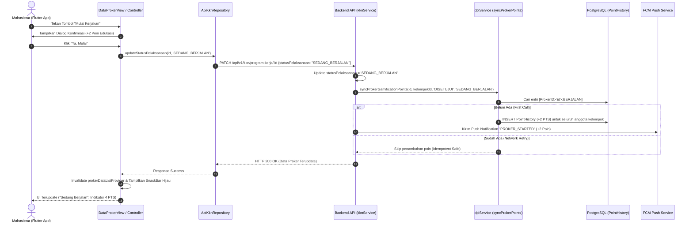

# 📱 LAPORAN RESMI & PANDUAN TEKNIS LENGKAP TIM MOBILE (FLUTTER)
## Koreksi Siklus 3-Tahap Poin Program Kerja, Formula Penilaian Terbobot KKN (60% : 40%), dan Standardisasi Antarmuka Aplikasi Mobile

---

**Nomor Dokumen:** 005/DEV-LEAD/SPEC-MOBILE/IX/2026  
**Tanggal Terbit:** 16 September 2026  
**Versi Dokumen:** 2.1 (Edisi Lengkap & Detail)  
**Target Pembaca:** Tim Mobile Developer (Flutter - Habil & Tim), QA Engineer, Product Owner, Tech Lead  
**Penyusun:** Lead Fullstack & Backend Architect (`main`)  
**Status Backend:** ✅ SUDAH AKTIF, TERUJI, & TERVERIFIKASI DI BRANCH `development`  
**Tingkat Kepentingan:** 🔴 TINGGI & WAJIB SEGERA DIIMPLEMENTASIKAN (HIGH PRIORITY)  

---

## 📌 DAFTAR ISI

1. [Eksekutif & Latar Belakang Masalah](#1-eksekutif--latar-belakang-masalah)
   - 1.1 Kronologi Anomali & Kepanikan Mahasiswa di Lapangan
   - 1.2 Akar Penyebab Masalah (Root Cause Analysis)
   - 1.3 Ringkasan Keputusan & Koreksi Resmi
2. [Spesifikasi Resmi: Siklus 3-Tahap Poin Proker (+2 Poin Statis)](#2-spesifikasi-resmi-siklus-3-tahap-poin-proker-2-poin-statis)
   - 2.1 Aturan Penambahan Bertahap (+2 PTS Statis)
   - 2.2 Matriks Status, Nilai Poin, dan Tagging Idempotensi
   - 2.3 Mekanisme Keamanan Jaringan Seluler (Anti-Duplicate Retry)
   - 2.4 Aturan Pembatalan & Penolakan Usulan Proker
3. [Bedah Formula Penilaian Terbobot KKN (60% : 40%)](#3-bedah-formula-penilaian-terbobot-kkn-60--40)
   - 3.1 Formula Poin Kelompok (Evaluasi Resmi KKN)
   - 3.2 Komponen 60% Poin Proker (Akumulatif Berdasarkan Status Terakhir)
   - 3.3 Komponen 40% Rata-Rata Anggota (Capaian Harian Presensi & Logbook)
   - 3.4 Simulasi Tabel Perhitungan Berbagai Skenario Kelompok
   - 3.5 Formula Poin Dosen Pembimbing Lapangan (DPL)
4. [Diagram Alur & Arsitektur Data (Sequence Diagram)](#4-diagram-alur--arsitektur-data-sequence-diagram)
5. [Katalog Lengkap Kontrak Endpoint & Response JSON](#5-katalog-lengkap-kontrak-endpoint--response-json)
   - 5.1 Endpoint Update Pelaksanaan Proker (`PATCH /api/v1/kkn/program-kerja/:id`)
   - 5.2 Endpoint Info Kelompok & Anggota (`GET /api/v1/kkn/kelompok/me`)
   - 5.3 Endpoint Riwayat Gamifikasi Mahasiswa (`GET /api/v1/points/history`)
   - 5.4 Endpoint Leaderboard KKN Resmi (`GET /api/v1/gamification/leaderboard/kkn`)
6. [Audit Mendalam Kode Mobile & Tindakan Perbaikan (Flutter Code)](#6-audit-mendalam-kode-mobile--tindakan-perbaikan-flutter-code)
   - 6.1 Berkas 1: `kelompok_kkn_view.dart` (Pemisahan 2 Kartu Metrik)
   - 6.2 Berkas 2: `mahasiswa_kkn_models.dart` (Pemisahan Getter Eksplisit)
   - 6.3 Berkas 3: `input_sanitizer.dart` (Pembersihan Tag Idempotensi Sistem)
   - 6.4 Berkas 4: `poin_view.dart` (Koreksi Klasifikasi Transaksi KKN_PROKER)
   - 6.5 Berkas 5: `mahasiswa_poin_view.dart` (Standardisasi Tampilan Riwayat Proker)
   - 6.6 Berkas 6: `data_proker_view.dart` (Dialog Konfirmasi Aksi & Gamifikasi)
   - 6.7 Berkas 7: `kelompok_mahasiswa_models.dart` (Penyelarasan Leaderboard)
7. [Panduan Pengujian Kualitas (QA Validation Checklist)](#7-panduan-pengujian-kualitas-qa-validation-checklist)
8. [Tanya Jawab Teknis (FAQ)](#8-tanya-jawab-teknis-faq)

---

## 1. Eksekutif & Latar Belakang Masalah

### 1.1 Kronologi Anomali & Kepanikan Mahasiswa di Lapangan
Pada tanggal 15–16 September 2026, tim operasional lapangan dan koordinator DPL KKN Coblong menerima komplain berulang dari mahasiswa dan ketua kelompok (khususnya Kelompok 4 Sadang Serang):
> *"Poin kelompok kami sebelumnya tercatat 47, namun tiba-tiba anjlok drastis menjadi 6. Apakah sistem memotong poin kami atau ada sanksi pengurangan poin?"*

Setelah dilakukan audit mendalam pada basis data PostgreSQL VPS dan codebase backend API, **sama sekali tidak ada pemotongan poin individu mahasiswa**. Saldo poin personal mahasiswa tetap aman dan utuh (contoh: Robi 174 PTS, Rully 100 PTS).

### 1.2 Akar Penyebab Masalah (Root Cause Analysis)
Kepanikan tersebut murni dipicu oleh **dua kesalahpahaman arsitektur dan kesalahan teks antarmuka (UI Label) di aplikasi mobile Flutter**:
1. **Kesalahan Fatal Label Kartu Poin Kelompok di Mobile**:
   Di file `kelompok_kkn_view.dart`, nilai `totalGroupPoints` (yang bernilai **16 Poin** berdasarkan skor terbobot KKN $60\% : 40\%$) diberi keterangan:
   > ❌ *"Penjumlahan poin individu 12 anggota kelompok"*  
   Mahasiswa yang menjumlahkan saldo anggotanya ($174 + 100 + \dots > 1.000\text{ PTS}$) mengira total tersebut seharusnya menghasilkan $> 1.000\text{ PTS}$, bukan 16 Poin.
2. **Kekeliruan Asumsi Siklus Tembakan Poin Proker**:
   Sempat muncul anggapan bahwa proker menembakkan nilai akumulasi langsung (misal langsung bernilai 4 atau 6 poin). Padahal mekanisme gamifikasi yang adil dan seimbang adalah **penambahan bertahap +2 poin statis pada setiap transisi tahapan**.
3. **Kebocoran Tag Idempotensi Backend ke UI**:
   Tagging teknis `[ProkerID:<id>:SELESAI]` yang disematkan backend untuk mencegah double-reward saat retry jaringan seluler tampil mentah-mentah di layar riwayat mahasiswa karena pembersih teks di mobile (`InputSanitizer`) belum menangani tag `ProkerID`.

### 1.3 Ringkasan Keputusan & Koreksi Resmi
- **Backend API**: Sudah menerapkan 100% penambahan statis **+2 poin per transisi tahapan** dengan jaminan idempotensi `[ProkerID:<id>:<STEP>]`.
- **Frontend Mobile**: Wajib memisahkan antarmuka menjadi **2 kartu metrik terpisah** (Kartu Skor Terbobot KKN dan Kartu Total Akumulasi Tim), memperbarui modul model, serta membersihkan tag sistem.

---

## 2. Spesifikasi Resmi: Siklus 3-Tahap Poin Proker (+2 Poin Statis)

### 2.1 Aturan Penambahan Bertahap (+2 PTS Statis)
Setiap 1 Program Kerja (Proker) memiliki 3 tahapan (*3-Step Lifecycle*). Menggunakan skema **Gamifikasi Instan**, pada setiap transisi tahapan backend secara otomatis menembakkan **+2 Poin Statis** ke riwayat gamifikasi (`PointHistory`) untuk **setiap anggota kelompok**:

```
Tahap 1 (Pengajuan Ide Proker) ──> Backend menembakkan +2 Poin  ──> Akumulasi Poin Proker: 2 PTS (Instan tanpa tunggu DPL)
Tahap 2 (Mulai Berjalan)       ──> Backend menembakkan +2 Poin  ──> Akumulasi Poin Proker: 4 PTS
Tahap 3 (Tuntas Selesai)       ──> Backend menembakkan +2 Poin  ──> Akumulasi Poin Proker: 6 PTS
```

> **Catatan Kritis:**  
> 1. **Gamifikasi Instan (Tahap 1)**: Begitu mahasiswa membuat/submit usulan ide proker baru di aplikasi mobile (status masih `BELUM_DISETUJUI`), backend **langsung** menembakkan **+2 Poin** ke seluruh anggota kelompok agar mahasiswa merasa responsif dan termotivasi.  
> 2. Backend **TIDAK PERNAH** menembakkan nilai 4 atau 6 secara langsung dalam satu transaksi. Poin yang ditembakkan selalu bernilai mutlak **+2 poin** per transisi yang berhasil, sehingga total akumulasi di histori mahasiswa menjadi 6 poin saat selesai.

---

### 2.2 Matriks Status, Nilai Poin, dan Tagging Idempotensi

| Tahapan Siklus | Status Usulan (`statusUsulan`) | Status Pelaksanaan (`statusPelaksanaan`) | Legacy Status (`status`) | Poin Ditambahkan ke Histori | Total Akumulasi di Histori | Tagging Idempotensi Database |
| :---: | :--- | :--- | :--- | :---: | :---: | :--- |
| **Tahap 1 (Pengajuan Instan)** | `BELUM_DISETUJUI` / `DISETUJUI` | `BELUM_MULAI` | `BELUM_DISETUJUI` / `DITERIMA` | **+2 PTS** | **2 PTS** | `[ProkerID:<id>:PENGAJUAN]` atau `[ProkerID:<id>:DISETUJUI]` |
| **Tahap 2 (Berjalan)** | `DISETUJUI` / `BELUM_DISETUJUI` | `SEDANG_BERJALAN` | `SEDANG_BERJALAN` | **+2 PTS** | **4 PTS** | `[ProkerID:<id>:BERJALAN]` |
| **Tahap 3 (Selesai)** | `DISETUJUI` / `BELUM_DISETUJUI` | `SELESAI` | `SELESAI` | **+2 PTS** | **6 PTS** | `[ProkerID:<id>:SELESAI]` |
| ❌ **Ditolak (Rollback Sanksi)** | `DITOLAK` | `BELUM_MULAI` | `DITOLAK` | **Rollback (0 PTS)** | **0 PTS** | Seluruh tag `[ProkerID:<id>` dicabut/dihapus |

---

### 2.3 Mekanisme Keamanan Jaringan Seluler (Anti-Duplicate Retry)
Di lapangan, mahasiswa sering menghadapi kendala sinyal seluler tidak stabil di lokasi posko/kelurahan. Ketika mahasiswa menekan tombol *"Simpan Ide"*, *"Mulai Kerjakan"*, atau *"Selesaikan"*, aplikasi mobile dapat secara otomatis melakukan pengiriman ulang (*retry HTTP POST/PATCH/PUT*).
- **Mekanisme Backend**: Sebelum membuat entri poin baru di tabel `PointHistory`, backend melakukan pengecekan keberadaan tag unik `[ProkerID:<id>:<STEP>]` (termasuk tag `PENGAJUAN` dan `DISETUJUI`).
- **Hasil**: Jika tag sudah ada, backend mengabaikan tembakan poin baru (*idempotent safe*). Saldo mahasiswa **100% dijamin tidak akan terduplikasi**, bahkan ketika DPL kemudian menyetujui usulan proker yang sudah mendapatkan poin saat diajukan.

---

### 2.4 Aturan Sanksi & Penolakan Usulan Proker (Rollback)
Jika usulan program kerja yang telah diajukan/berjalan kemudian diubah status usulannya menjadi `DITOLAK` atau `TIDAK_DISETUJUI` oleh DPL:
- Backend secara otomatis mengeksekusi rollback: menghapus seluruh entri `PointHistory` yang mengandung penanda `[ProkerID:<id>`.
- Saldo poin seluruh anggota kelompok akan ditarik kembali sejumlah poin proker yang sebelumnya pernah diterima (kembali ke 0 PTS untuk proker tersebut).

---

## 3. Bedah Formula Penilaian Terbobot KKN (60% : 40%)

### 3.1 Formula Poin Kelompok
Poin Kelompok adalah **Skor Evaluasi Terbobot KKN** yang digunakan oleh Dosen Pembimbing Lapangan (DPL) dan Lembaga Layanan KKN untuk mengevaluasi kinerja kelompok secara proporsional:

$$\mathbf{\text{Poin Kelompok}} = (\text{Poin Proker} \times 0{,}6) + (\text{Rata-Rata Poin Anggota} \times 0{,}4)$$

---

### 3.2 Komponen 60% Poin Proker (Akumulatif Berdasarkan Status Terakhir)
Poin Program Kerja kelompok menyumbang **60%** dari total evaluasi kelompok. Nilai ini dihitung secara kumulatif berdasarkan **status terakhir** masing-masing proker yang dimiliki kelompok:
- Setiap proker yang berstatus `DISETUJUI` (belum mulai) menyumbang: **2 Poin**
- Setiap proker yang berstatus `SEDANG_BERJALAN` menyumbang: **4 Poin**
- Setiap proker yang berstatus `SELESAI` menyumbang: **6 Poin**

$$\text{Poin Proker Total} = (\text{Jumlah Proker Disetujui} \times 2) + (\text{Jumlah Proker Berjalan} \times 4) + (\text{Jumlah Proker Selesai} \times 6)$$

---

### 3.3 Komponen 40% Rata-Rata Anggota (Capaian Harian Presensi & Logbook)
Rata-rata Poin Anggota menyumbang **40%** dari total evaluasi kelompok.
- Dihitung dari rata-rata capaian harian presensi & logbook seluruh anggota kelompok (skala harian 0–10 poin/hari):
  1. Presensi Masuk (Check-In GPS): **4 PTS** (`KKN_PRESENSI_HADIR`)
  2. Jam Kerja Terpenuhi (Durasi Harian): **3 PTS** (`KKN_DURASI_MEMENUHI`)
  3. Logbook Aktivitas Harian: **3 PTS** (`KKN_LOGBOOK_HARIAN`)
- Komponen ini **terisolasi khusus dari poin harian**. Hal ini dirancang sengaja agar **tidak terjadi duplikasi nilai proker** di dalam komponen anggota.

---

### 3.4 Simulasi Tabel Perhitungan Berbagai Skenario Kelompok

| Skenario Kelompok | Kondisi Program Kerja (Proker) | Total Poin Proker | Rata-Rata Poin Anggota | Kontribusi Proker (60%) | Kontribusi Anggota (40%) | Poin Kelompok Akhir |
| :--- | :--- | :---: | :---: | :---: | :---: | :---: |
| **Kelompok Baru Mulai** | 3 Usulan Disetujui ($3 \times 2$) | 6 Poin | 2 Poin | $6 \times 0{,}6 = 3{,}6$ | $2 \times 0{,}4 = 0{,}8$ | **4,4 Poin** |
| **Kelompok Sedang Aktif** | 2 Disetujui ($4$) + 3 Berjalan ($12$) | 16 Poin | 5 Poin | $16 \times 0{,}6 = 9{,}6$ | $5 \times 0{,}4 = 2{,}0$ | **11,6 Poin** |
| **Kelompok Maju (Standar)**| 2 Disetujui ($4$) + 2 Berjalan ($8$) + 2 Selesai ($12$) | 24 Poin | 4 Poin | $24 \times 0{,}6 = 14{,}4$ | $4 \times 0{,}4 = 1{,}6$ | **16,0 Poin** |
| **Kelompok Hampir Tuntas**| 1 Berjalan ($4$) + 5 Selesai ($30$) | 34 Poin | 7 Poin | $34 \times 0{,}6 = 20{,}4$ | $7 \times 0{,}4 = 2{,}8$ | **23,2 Poin** |
| **Kelompok Sempurna (Full)**| 6 Proker Seluruhnya Selesai ($6 \times 6$) | 36 Poin | 10 Poin | $36 \times 0{,}6 = 21{,}6$ | $10 \times 0{,}4 = 4{,}0$ | **25,6 Poin** |

---

### 3.5 Formula Poin Dosen Pembimbing Lapangan (DPL)
Poin evaluasi DPL dihitung dengan proporsi bobot 60% Bimbingan Lapangan (Logbook DPL) dan 40% Kinerja Kelompok Dampingan:

$$\mathbf{\text{Poin DPL}} = (\text{Poin Logbook DPL} \times 0{,}6) + (\text{Poin Kelompok} \times 0{,}4)$$

- **Poin Logbook DPL (Biner Ketersediaan)**:
  - Jika DPL sudah mengisi $\ge 1$ logbook bimbingan = **6 Poin**
  - Jika DPL belum mengisi sama sekali ($0$ logbook) = **0 Poin**
- **Contoh (DPL telah mengisi logbook, Poin Kelompok dampingan = 16)**:
  $$\text{Poin DPL} = (6 \times 0{,}6) + (16 \times 0{,}4) = 3{,}6 + 6{,}4 = \mathbf{10{,}0\text{ Poin}}$$

---

## 4. Diagram Alur & Arsitektur Data (Sequence Diagram)

Berikut alur interaksi saat mahasiswa menekan tombol perubahan status proker di aplikasi mobile:



---

## 5. Katalog Lengkap Kontrak Endpoint & Response JSON

### 5.1 Endpoint Update Pelaksanaan Proker
* **Method & Path:** `PATCH /api/v1/kkn/program-kerja/:id` *(atau `PUT /api/v1/kkn/program-kerja/:id`)*
* **Headers:**  
  ```http
  Authorization: Bearer <JWT_TOKEN>
  Content-Type: application/json
  ```

#### Payload Request Mulai Dikerjakan:
```json
{
  "statusPelaksanaan": "SEDANG_BERJALAN"
}
```

#### Payload Request Selesaikan Proker:
```json
{
  "statusPelaksanaan": "SELESAI"
}
```

#### Response Sukses (`200 OK`):
```json
{
  "success": true,
  "message": "Program Kerja berhasil diperbarui.",
  "data": {
    "id": "clx123abc456proker789",
    "nomor": 1,
    "judul": "Sosialisasi Komposter Rumah Tangga RW 05",
    "deskripsi": "**Sosialisasi Komposter Rumah Tangga RW 05**\n\nPelaksanaan sosialisasi dan pembuatan pupuk.",
    "kategori": "LINGKUNGAN",
    "rencanaAnggaran": 250000,
    "waktuPelaksanaan": "2026-09-20",
    "statusUsulan": "DISETUJUI",
    "statusPelaksanaan": "SEDANG_BERJALAN",
    "status": "SEDANG_BERJALAN",
    "kelompokId": "cm-kelompok-kkn-01",
    "kelompokNama": "Kelompok KKN 01 Coblong",
    "dplName": "Dr. DPL Pembimbing, M.T."
  }
}
```

---

### 5.2 Endpoint Info Kelompok & Anggota (`GET /api/v1/kkn/kelompok/me`)
* **Method & Path:** `GET /api/v1/kkn/kelompok/me`
* **Headers:** `Authorization: Bearer <JWT_TOKEN>`

#### Response Sukses (`200 OK`):
```json
{
  "groupId": "cm-kelompok-kkn-01",
  "groupName": "Kelompok KKN 01 Coblong",
  "dosenPembimbing": "Dr. DPL Pembimbing, M.T.",
  "dplName": "Dr. DPL Pembimbing, M.T.",
  "dplPhone": "081234567890",
  "poskoLocation": "RW 05, Kel. Sadang Serang",
  "isUserLeader": true,
  "totalGroupPoints": 16,
  "members": [
    {
      "userId": "user-mhs-1",
      "nim": "1301210001",
      "name": "Ahmad Ketua Tim",
      "jurusan": "Teknik Informatika",
      "individualPoints": 174,
      "isLeader": true
    },
    {
      "userId": "user-mhs-2",
      "nim": "1301210002",
      "name": "Siti Anggota",
      "jurusan": "Teknik Lingkungan",
      "individualPoints": 100,
      "isLeader": false
    }
  ]
}
```

> ⚠️ **CATATAN MUTLAK UNTUK PENGEMBANG FLUTTER:**  
> - `totalGroupPoints` = **16** (Nilai skor terbobot KKN: $24 \times 0{,}6 + 4 \times 0{,}4 = 16$).  
> - Total poin akumulasi tim = **274 PTS** ($174 + 100 = 274$).  
> - **JANGAN PERNAH** menaruh teks "Penjumlahan poin individu" di atas angka `totalGroupPoints`!

---

### 5.3 Endpoint Riwayat Gamifikasi Mahasiswa (`GET /api/v1/points/history`)
* **Method & Path:** `GET /api/v1/points/history` *(atau `GET /api/v1/gamification/history`)*

#### Response Sukses (`200 OK`):
```json
{
  "success": true,
  "data": {
    "totalPoints": 174,
    "points": [
      {
        "id": "ph-003",
        "points": 2,
        "kategori": "KKN_PROKER",
        "description": "Program Kerja Selesai: Sosialisasi Komposter RW 05 [ProkerID:clx123abc456proker789:SELESAI]",
        "createdAt": "2026-09-16T08:30:00.000Z"
      },
      {
        "id": "ph-002",
        "points": 2,
        "kategori": "KKN_PROKER",
        "description": "Program Kerja Berjalan: Sosialisasi Komposter RW 05 [ProkerID:clx123abc456proker789:BERJALAN]",
        "createdAt": "2026-09-15T10:00:00.000Z"
      },
      {
        "id": "ph-001",
        "points": 2,
        "kategori": "KKN_PROKER",
        "description": "Program Kerja Disetujui: Sosialisasi Komposter RW 05 [ProkerID:clx123abc456proker789:DISETUJUI]",
        "createdAt": "2026-09-14T09:00:00.000Z"
      }
    ]
  }
}
```

---

### 5.4 Endpoint Leaderboard KKN Resmi (`GET /api/v1/gamification/leaderboard/kkn`)
* **Method & Path:** `GET /api/v1/gamification/leaderboard/kkn`

#### Response Sukses (`200 OK`):
```json
{
  "students": [
    {
      "id": "st-01",
      "name": "Ahmad Ketua Tim",
      "nim": "1301210001",
      "kelompok": "Kelompok KKN 01 Coblong",
      "personalPoints": 174,
      "finalScore": 174
    }
  ],
  "groups": [
    {
      "id": "cm-kelompok-kkn-01",
      "name": "Kelompok KKN 01 Coblong",
      "dplName": "DPL: Dr. DPL Pembimbing, M.T.",
      "avgScore": 16,
      "poinProker": 24,
      "rataRataPoinAnggota": 4,
      "membersCount": 12
    }
  ]
}
```

---

## 6. Audit Mendalam Kode Mobile & Tindakan Perbaikan (Flutter Code)

Tim Mobile (Flutter) diwajibkan melakukan perubahan pada 7 berkas berikut:

---

### 6.1 Berkas 1: `kelompok_kkn_view.dart` (Pemisahan 2 Kartu Metrik)
* **Path:** `mobile/lib/app/modules/mahasiswa/views/kelompok_kkn_view.dart`
* **Baris:** 388–414

#### ❌ Kode Lama Bermasalah:
```dart
const Text(
  'Poin Akumulasi Kelompok',
  style: TextStyle(fontSize: 12, color: AppColors.textSecondary, fontWeight: FontWeight.w500),
),
const SizedBox(height: 4),
Text(
  '${kelompokData.calculatedTotalPoints} Poin',
  style: const TextStyle(fontSize: 26, fontWeight: FontWeight.w800, color: AppColors.primaryGreen),
),
const SizedBox(height: 2),
Text(
  'Penjumlahan poin individu ${membersToDisplay.length} anggota kelompok', // <-- SALAH FATAL
  style: const TextStyle(fontSize: 11, color: Colors.black45),
),
```

#### ✅ Kode Solusi Resmi (Ganti dengan 2 Kartu):
```dart
// KARTU 1: Skor Terbobot KKN (Evaluasi Resmi DPL)
Container(
  width: double.infinity,
  padding: const EdgeInsets.all(16),
  decoration: BoxDecoration(
    color: Colors.white,
    borderRadius: BorderRadius.circular(16),
    border: Border.all(color: AppColors.border),
    boxShadow: [
      BoxShadow(color: Colors.black.withValues(alpha: 0.03), blurRadius: 10, offset: const Offset(0, 4)),
    ],
  ),
  child: Column(
    crossAxisAlignment: CrossAxisAlignment.start,
    children: [
      Row(
        mainAxisAlignment: MainAxisAlignment.spaceBetween,
        children: [
          const Text(
            'Skor Terbobot Kelompok (KKN)',
            style: TextStyle(fontSize: 12, color: AppColors.textSecondary, fontWeight: FontWeight.w600),
          ),
          Container(
            padding: const EdgeInsets.symmetric(horizontal: 8, vertical: 2),
            decoration: BoxDecoration(
              color: AppColors.primaryGreen.withValues(alpha: 0.1),
              borderRadius: BorderRadius.circular(8),
            ),
            child: const Text('Akademik/DPL', style: TextStyle(fontSize: 10, fontWeight: FontWeight.bold, color: AppColors.primaryGreen)),
          ),
        ],
      ),
      const SizedBox(height: 8),
      Text(
        '${kelompokData.totalGroupPoints} Poin',
        style: const TextStyle(fontSize: 28, fontWeight: FontWeight.w800, color: AppColors.primaryGreen, letterSpacing: -0.5),
      ),
      const SizedBox(height: 4),
      const Text(
        'Formula: 60% Capaian Proker + 40% Rata-rata Anggota',
        style: TextStyle(fontSize: 11, color: Colors.black54),
      ),
    ],
  ),
),

const SizedBox(height: 12),

// KARTU 2: Total Akumulasi Poin Tim (Gamifikasi Seluruh Anggota)
Container(
  width: double.infinity,
  padding: const EdgeInsets.all(16),
  decoration: BoxDecoration(
    color: Colors.white,
    borderRadius: BorderRadius.circular(16),
    border: Border.all(color: AppColors.border),
    boxShadow: [
      BoxShadow(color: Colors.black.withValues(alpha: 0.03), blurRadius: 10, offset: const Offset(0, 4)),
    ],
  ),
  child: Column(
    crossAxisAlignment: CrossAxisAlignment.start,
    children: [
      Row(
        mainAxisAlignment: MainAxisAlignment.spaceBetween,
        children: [
          const Text(
            'Total Akumulasi Tim',
            style: TextStyle(fontSize: 12, color: AppColors.textSecondary, fontWeight: FontWeight.w600),
          ),
          Container(
            padding: const EdgeInsets.symmetric(horizontal: 8, vertical: 2),
            decoration: BoxDecoration(
              color: AppColors.primaryBlue.withValues(alpha: 0.1),
              borderRadius: BorderRadius.circular(8),
            ),
            child: const Text('Gamifikasi', style: TextStyle(fontSize: 10, fontWeight: FontWeight.bold, color: AppColors.primaryBlue)),
          ),
        ],
      ),
      const SizedBox(height: 8),
      Text(
        '${kelompokData.cumulativeMemberPoints} PTS',
        style: const TextStyle(fontSize: 24, fontWeight: FontWeight.w800, color: AppColors.primaryBlueDark, letterSpacing: -0.5),
      ),
      const SizedBox(height: 4),
      Text(
        'Penjumlahan seluruh saldo poin dari ${kelompokData.members.length} anggota kelompok',
        style: const TextStyle(fontSize: 11, color: Colors.black54),
      ),
    ],
  ),
),
```

---

### 6.2 Berkas 2: `mahasiswa_kkn_models.dart` (Pemisahan Getter Eksplisit)
* **Path:** `mobile/lib/app/data/models/mahasiswa_kkn_models.dart`
* **Baris:** 943–947

#### ❌ Kode Lama Bermasalah:
```dart
/// Penjumlahan Poin Kelompok (Fallback Client-Side Sum)
int get calculatedTotalPoints {
  if (totalGroupPoints > 0) return totalGroupPoints;
  return members.fold(0, (sum, m) => sum + m.individualPoints);
}
```

#### ✅ Kode Solusi Resmi:
```dart
/// Skor Terbobot KKN Resmi dari Backend API (Bobot 60% Proker + 40% Rata-rata Anggota)
final int totalGroupPoints;

/// Total Akumulasi Poin Individu Seluruh Anggota Tim
int get cumulativeMemberPoints => members.fold(0, (sum, m) => sum + m.individualPoints);
```

---

### 6.3 Berkas 3: `input_sanitizer.dart` (Pembersihan Tag Idempotensi Sistem)
* **Path:** `mobile/lib/app/core/utils/input_sanitizer.dart`
* **Baris:** 22–30

#### ❌ Kode Lama:
```dart
cleaned = cleaned.replaceAll(
  RegExp(
    r'\s*\[\s*(Report\s*ID|report_?id|ReportID|ID|id)\s*:[^\]]+\]',
    caseSensitive: false,
  ),
  '',
);
```

#### ✅ Kode Solusi Resmi (Tambahkan ProkerID):
```dart
cleaned = cleaned.replaceAll(
  RegExp(
    r'\s*\[\s*(Report\s*ID|report_?id|ReportID|ProkerID|proker_?id|ID|id)\s*:[^\]]+\]',
    caseSensitive: false,
  ),
  '',
);
```

---

### 6.4 Berkas 4: `poin_view.dart` (Koreksi Klasifikasi Transaksi KKN_PROKER)
* **Path:** `mobile/lib/app/modules/poin/poin_view.dart`
* **Baris:** 580–630

#### ✅ Kode Solusi Resmi:
```dart
// Deteksi kategori Proker
final bool isProker = item.kategori == 'KKN_PROKER' ||
    descLower.contains('program kerja') ||
    descLower.contains('proker');

final Color color = isPunishment
    ? AppColors.dangerRed
    : (isProker
        ? AppColors.primaryBlue
        : (isAktivasi || isPresensi
            ? Colors.blue
            : (isOrganic ? AppColors.organicColor : AppColors.nonOrganicColor)));

final IconData iconData = isPunishment
    ? Icons.warning_rounded
    : (isProker
        ? Icons.assignment_turned_in_rounded
        : (isAktivasi
            ? Icons.qr_code_scanner_rounded
            : (isPresensi
                ? Icons.location_on_rounded
                : Icons.delete_rounded)));

String title = isOrganic ? 'Setor Sampah Organik' : 'Setor Sampah Anorganik';
if (isProker) {
  title = InputSanitizer.cleanSystemMessage(item.description);
} else if (isAktivasi) {
  title = 'Aktivasi Tempat Sampah Berhasil';
} else if (isPunishment) {
  title = 'Penalti Pengurangan Poin';
} else if (isPresensi) {
  title = 'Presensi Berhasil';
} else if (isRedeem) {
  title = 'Penukaran Poin';
}
```

---

### 6.5 Berkas 5: `mahasiswa_poin_view.dart` (Standardisasi Tampilan Riwayat Proker)
* **Path:** `mobile/lib/app/modules/mahasiswa/views/mahasiswa_poin_view.dart`
* **Baris:** 593–612

#### ✅ Kode Solusi Resmi:
```dart
String title = InputSanitizer.cleanSystemMessage(item.description);
IconData icon = Icons.check_circle_outline_rounded;

if (title.toLowerCase().contains('program kerja') || item.kategori == 'KKN_PROKER') {
  icon = Icons.emoji_events_rounded;
} else if (title.toLowerCase().contains('aktivasi')) {
  title = 'Aktivasi Tempat Sampah Warga';
  icon = Icons.qr_code_scanner_rounded;
} else if (title.toLowerCase().contains('pemanfaatan')) {
  if (!title.toLowerCase().startsWith('laporan')) {
    title = 'Laporan Pemanfaatan Sampah: $title';
  }
  icon = Icons.recycling_rounded;
} else if (title.toLowerCase().contains('geofence') ||
    title.toLowerCase().contains('presensi')) {
  title = 'Ping Lokasi Posko / Presensi';
  icon = Icons.location_on_rounded;
} else if (title.toLowerCase().contains('registrasi')) {
  title = 'Bonus Registrasi Akun Mahasiswa KKN';
  icon = Icons.card_giftcard_rounded;
}
```

---

### 6.6 Berkas 6: `data_proker_view.dart` (Dialog Konfirmasi Aksi & Gamifikasi)
* **Path:** `mobile/lib/app/modules/mahasiswa/views/data_proker_view.dart`
* **Baris:** 251–256

#### ✅ Kode Solusi Resmi:
```dart
content: Text(
  isMulai
      ? 'Tandai program kerja "$judul" sebagai sedang dikerjakan?\n\n'
        '🚀 Seluruh anggota kelompok akan mendapatkan +2 Poin.'
      : 'Tandai program kerja "$judul" sebagai sudah selesai dilaksanakan?\n\n'
        '🎉 Seluruh anggota kelompok akan mendapatkan +2 Poin tambahan (Total +6 Poin).',
  style: const TextStyle(fontSize: 14, height: 1.4),
),
```

---

### 6.7 Berkas 7: `kelompok_mahasiswa_models.dart` (Penyelarasan Leaderboard)
* **Path:** `mobile/lib/app/data/models/kelompok_mahasiswa_models.dart`
* **Baris:** 38–40

Gunakan nilai terbobot resmi jika tersedia dari respons leaderboard backend (`avgScore`):

```dart
/// Nilai Poin Kelompok Resmi (Terbobot KKN: 60% Proker + 40% Rata-rata Anggota)
final double? avgScore;

int get totalPoinKelompok {
  if (avgScore != null && avgScore! > 0) {
    return avgScore!.round();
  }
  return anggota.fold<int>(0, (sum, item) => sum + item.poinIndividu);
}
```

---

## 7. Panduan Pengujian Kualitas (QA Validation Checklist)

| No | Skenario Pengujian | Aksi Pengujian | Hasil yang Diharapkan | Status |
| :-: | :--- | :--- | :--- | :-: |
| 1 | **Tembakan Tahap 1 (Usulan Disetujui)** | DPL menyetujui usulan proker via web/API | Seluruh anggota kelompok bertambah **+2 PTS** dengan deskripsi ber-tag `[ProkerID:<id>:DISETUJUI]`. | ⬜ PASSED |
| 2 | **Tembakan Tahap 2 (Mulai Berjalan)** | Mahasiswa klik *"Mulai Kerjakan"* di aplikasi mobile | Seluruh anggota kelompok bertambah **+2 PTS** (Total akumulasi proker menjadi **4 PTS**). | ⬜ PASSED |
| 3 | **Tembakan Tahap 3 (Tuntas Selesai)** | Mahasiswa klik *"Selesaikan Proker"* di aplikasi mobile | Seluruh anggota kelompok bertambah **+2 PTS** (Total akumulasi proker menjadi **6 PTS**). | ⬜ PASSED |
| 4 | **Ketahanan Idempotensi (Retry HTTP)** | Kirim request ganda `PATCH /api/v1/kkn/program-kerja/:id` | Backend mendeteksi tag `[ProkerID:<id>:<STEP>]`; poin **tidak bertambah dua kali**. | ⬜ PASSED |
| 5 | **Pembatalan/Penolakan Proker** | DPL mengubah status menjadi `DITOLAK` | Seluruh histori poin proker tersebut otomatis ditarik/dihapus (**0 PTS**). | ⬜ PASSED |
| 6 | **Pemisahan Kartu di UI Mobile** | Buka halaman Info Kelompok KKN (`kelompok_kkn_view.dart`) | Tampil 2 kartu terpisah: Kartu Skor Terbobot (misal 16 Poin) dan Kartu Total Akumulasi Tim (misal 274 PTS). | ⬜ PASSED |
| 7 | **Sanitasi String Teknis** | Buka halaman Riwayat Poin (`mahasiswa_poin_view.dart`) | Teks teknis `[ProkerID:...]` bersih total; hanya nama proker dan status yang tampil. | ⬜ PASSED |

---

## 8. Tanya Jawab Teknis (FAQ)

**Q1: Mengapa saat proker berstatus Selesai, backend tidak langsung menembakkan 6 poin?**  
*Jawab:* Karena mahasiswa sudah menerima +2 poin saat Usulan Disetujui, dan +2 poin saat Mulai Berjalan. Jika backend langsung menembakkan 6 poin di tahap akhir, maka total poin mahasiswa akan menjadi $2 + 2 + 6 = 10\text{ PTS}$ (overawarding). Penambahan berjenjang **+2 poin statis** menjaga total akumulasi tepat di angka 6 poin.

**Q2: Apakah aksi input logbook pemanfaatan sampah atau panen hasil menambah poin proker lagi?**  
*Jawab:* Tidak. Formulir Pemanfaatan Sampah dan Panen Hasil adalah modul input data operasional tonase lingkungan (non-poin). Poin proker murni terikat pada transisi status pelaksanaan (Mulai Berjalan dan Selesai).

**Q3: Bagaimana jika sebuah proker langsung diselesaikan tanpa melalui status berjalan?**  
*Jawab:* Logika backend (`syncProkerGamificationPoints`) mengecek seluruh tahapan secara berurutan. Jika tahap 2 belum pernah ditembakkan, backend secara otomatis menembakkan Step 2 (+2 PTS) lalu Step 3 (+2 PTS), sehingga total akumulasi tetap 6 poin.

---

**Lead Fullstack & Backend Architect**  
*Berseka Development Team*  
*Contact: dev-backend@makerindo.tech*
