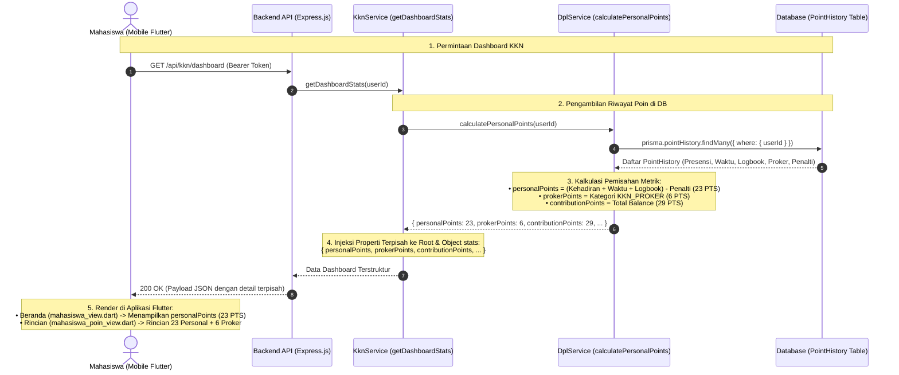
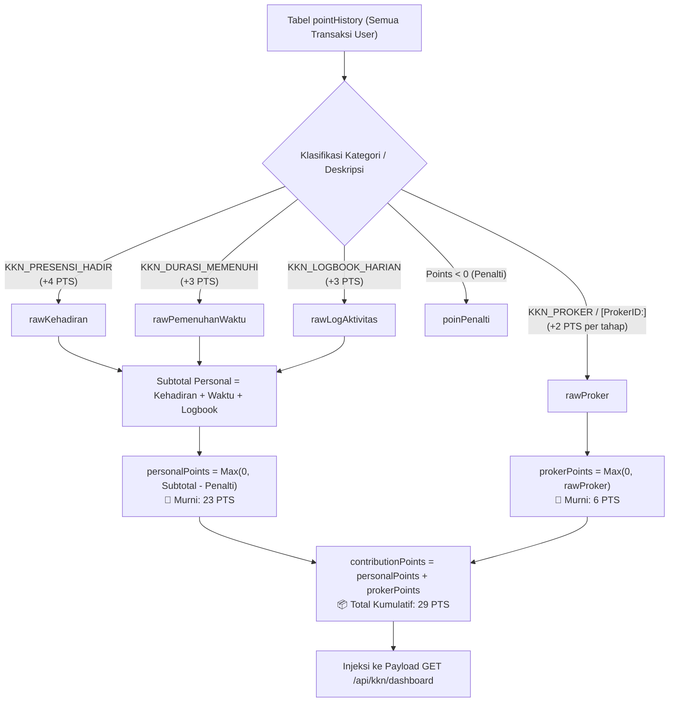

# 📋 Laporan Pemisahan Poin Dashboard KKN & Panduan Integrasi Tim Mobile
**Proyek:** BERSEKA (Aplikasi Pilah Sampah Cerdas - Modul KKN & Gamifikasi)  
**Target Pembaca:** Mobile Flutter Developer (Habil dkk.) & Backend Developer  
**Tanggal Rilis:** 17 September 2026  
**Status Backend:** ✅ **SUDAH DIEKSEKUSI, TERUJI VITEST (5/5 PASSED) & BEBAS ERROR TYPESCRIPT DI REPO `main`**

---

## 📌 1. Ringkasan Eksekutif

Menindaklanjuti kebutuhan pemisahan poin mahasiswa KKN agar tampilan di beranda aplikasi mobile tidak "menyesatkan" pengguna:
1. **Backend Telah Selesai Diperbarui:** Endpoint `GET /api/kkn/dashboard` (dan alias `/api/v1/kkn/dashboard`) sekarang secara resmi mengembalikan rincian poin terpisah:
   - `personalPoints`: **23 PTS** murni (Presensi Hadir + Pemenuhan Durasi Kerja + Logbook Harian dikurangi Penalti).
   - `prokerPoints`: **6 PTS** murni (Akumulasi perolehan Program Kerja Kelompok kategori `KKN_PROKER`: Disetujui +2, Berjalan +2, Selesai +2).
   - `contributionPoints`: **29 PTS** (Total saldo gabungan kumulatif untuk menjaga kompatibilitas mundur / *backwards compatibility*).
   Ketiga properti di atas diinjeksikan **baik pada level root data maupun di dalam objek `stats`**.
2. **Klarifikasi Penting untuk Tim Mobile (Koreksi Asumsi Otomatis):**  
   Pernyataan bahwa *"aplikasi mobile akan secara otomatis membaca personalPoints"* adalah **keliru secara teknis**. Setelah diaudit ke codebase Flutter, model `KknDashboardData` saat ini **belum mendefinisikan field `personalPoints`** dan widget UI masih membaca `contributionPoints`. Oleh karena itu, **Tim Mobile wajib menerapkan perubahan model dan UI di Flutter** sesuai panduan pada dokumen ini.

---

## 📊 2. Diagram Alur & Arsitektur (.mmd)

### A. Sequence Diagram: Alur Ekstraksi & Pemisahan Poin


### B. Flowchart: Logika Klasifikasi Poin di Backend


---

## 📡 3. Kontrak Payload Resmi Backend API

### Endpoint: `GET /api/kkn/dashboard` atau `GET /api/v1/kkn/dashboard`
* **Headers:** `Authorization: Bearer <JWT_MAHASISWA>`
* **Status:** `200 OK`

```json
{
  "success": true,
  "data": {
    "personalPoints": 23,
    "prokerPoints": 6,
    "contributionPoints": 29,
    "points": 29,
    "totalPoints": 29,
    "pointKkn": 29,
    "totalRegisteredBins": 12,
    "remainingQuota": 88,
    "progressPct": 12.0,
    "assignmentLimit": 100,
    "stats": {
      "totalRegistered": 12,
      "remainingQuota": 88,
      "progressPct": 12.0,
      "personalPoints": 23,
      "prokerPoints": 6,
      "contributionPoints": 29,
      "points": 29,
      "totalPoints": 29,
      "pointKkn": 29,
      "maxLimit": 100,
      "personalScoreBreakdown": {
        "personalPoints": 23,
        "prokerPoints": 6,
        "contributionPoints": 29,
        "poinKehadiran": 12,
        "poinPemenuhanWaktu": 5,
        "poinLogAktivitas": 6,
        "poinPenalti": 0,
        "rawKehadiran": 12,
        "rawPemenuhanWaktu": 5,
        "rawLogAktivitas": 6,
        "rawProker": 6
      }
    },
    "studentKkn": {
      "nim": "1301210001",
      "jurusan": "Teknik Lingkungan",
      "fakultas": "FTSL",
      "assignedArea": "RW 21 Sadang Serang"
    }
  }
}
```

> [!NOTE]
> **Kompatibilitas Penuh (Zero Breaking Change):**  
> Properti `points`, `totalPoints`, dan `pointKkn` tetap disediakan dengan nilai total (`29`) agar aplikasi versi sebelumnya tidak mengalami *error null-pointer* atau kegagalan parsing.

---

## 🛠️ 4. Panduan Perbaikan Kode untuk Tim Mobile Flutter

Agar aplikasi mobile segera menampilkan angka yang akurat, berikut panduan implementasi kode di repo `mobile`:

### 1. Perbarui Model `KknDashboardData`
**File:** [`mobile/lib/app/data/models/mahasiswa_kkn_models.dart`](file:///c:/Users/USER/.gemini/antigravity-ide/scratch/berseka/mobile/lib/app/data/models/mahasiswa_kkn_models.dart)

Tambahkan field `personalPoints` dan `prokerPoints`:

```dart
class KknDashboardData extends Equatable {
  static const empty = KknDashboardData(
    nim: '',
    jurusan: '',
    totalRegisteredBins: 0,
    assignmentLimit: 0,
    remainingQuota: 0,
    progressPercentage: 0.0,
    contributionPoints: 0,
    personalPoints: 0,
    prokerPoints: 0,
  );

  const KknDashboardData({
    required this.nim,
    required this.jurusan,
    required this.totalRegisteredBins,
    required this.assignmentLimit,
    required this.remainingQuota,
    required this.progressPercentage,
    required this.contributionPoints,
    this.personalPoints = 0,
    this.prokerPoints = 0,
  });

  final String nim;
  final String jurusan;
  final int totalRegisteredBins;
  final int assignmentLimit;
  final int remainingQuota;
  final double progressPercentage;
  final int contributionPoints;
  final int personalPoints;
  final int prokerPoints;

  factory KknDashboardData.fromJson(Map<String, dynamic> json) {
    final student = json['studentKkn'] as Map<String, dynamic>? ?? {};
    final user = json['user'] as Map<String, dynamic>? ?? {};
    final mhs = json['mahasiswa'] as Map<String, dynamic>? ?? {};
    final stats = json['stats'] as Map<String, dynamic>? ?? {};

    final pointVal =
        (json['contributionPoints'] ??
                json['points'] ??
                json['pointKkn'] ??
                json['totalPoints'] ??
                stats['contributionPoints'] ??
                stats['points'] ??
                stats['pointKkn'] ??
                stats['totalPoints'] ??
                0)
            as num?;

    // ✅ BACA FIELD BARU DARI BACKEND DENGAN FALLBACK AMAN
    final pPoints =
        (json['personalPoints'] ?? stats['personalPoints'] ?? pointVal ?? 0)
            as num;
    final prkPoints =
        (json['prokerPoints'] ?? stats['prokerPoints'] ?? 0) as num;

    final totalBins =
        (json['totalRegisteredBins'] ??
                json['registeredBins'] ??
                stats['totalRegisteredBins'] ??
                stats['registeredBins'] ??
                0)
            as num?;

    final limit =
        (json['assignmentLimit'] ?? stats['assignmentLimit'] ?? 0) as num?;

    final quota =
        (json['remainingQuota'] ?? stats['remainingQuota'] ?? 0) as num?;

    final progress =
        (json['progressPercentage'] ?? stats['progressPercentage'] ?? 0.0)
            as num?;

    return KknDashboardData(
      nim: student['nim']?.toString() ?? json['nim']?.toString() ?? '',
      jurusan: student['jurusan']?.toString() ?? json['jurusan']?.toString() ?? '',
      totalRegisteredBins: totalBins?.toInt() ?? 0,
      assignmentLimit: limit?.toInt() ?? 0,
      remainingQuota: quota?.toInt() ?? 0,
      progressPercentage: progress?.toDouble() ?? 0.0,
      contributionPoints: pointVal?.toInt() ?? 0,
      personalPoints: pPoints.toInt(),
      prokerPoints: prkPoints.toInt(),
    );
  }

  @override
  List<Object?> get props => [
        nim,
        totalRegisteredBins,
        contributionPoints,
        personalPoints,
        prokerPoints,
      ];
}
```

---

### 2. Perbarui Tampilan Beranda Mahasiswa
**File:** [`mobile/lib/app/modules/mahasiswa/views/mahasiswa_view.dart`](file:///c:/Users/USER/.gemini/antigravity-ide/scratch/berseka/mobile/lib/app/modules/mahasiswa/views/mahasiswa_view.dart) (Baris ~846)

Ubah pemanggilan nilai pada `_SummaryCard` agar menggunakan `d?.personalPoints`:

```dart
// ❌ KODE LAMA (Menampilkan 29 PTS karena membaca contributionPoints):
Expanded(
  child: _SummaryCard(
    icon: Icons.stars_rounded,
    iconAsset: 'assets/icons/trophy-star.png',
    label: 'Poin Personal',
    value: '${d?.contributionPoints ?? 0}',
    color: AppColors.success,
  ),
),

// ✅ KODE BARU (Murni menampilkan 23 PTS dari personalPoints):
Expanded(
  child: _SummaryCard(
    icon: Icons.stars_rounded,
    iconAsset: 'assets/icons/trophy-star.png',
    label: 'Poin Personal',
    value: '${d?.personalPoints ?? 0}',
    color: AppColors.success,
  ),
),
```

---

### 3. Perbarui Halaman Rincian Poin Mahasiswa
**File:** [`mobile/lib/app/modules/mahasiswa/views/mahasiswa_poin_view.dart`](file:///c:/Users/USER/.gemini/antigravity-ide/scratch/berseka/mobile/lib/app/modules/mahasiswa/views/mahasiswa_poin_view.dart) (Baris ~43 & ~194)

Gunakan `personalPoints` untuk judul utama, dan tampilkan badge informasi poin proker:

```dart
// ❌ KODE LAMA:
final personalPoints = mhsState.dashboard?.contributionPoints ?? 0;

// ✅ KODE BARU:
final personalPoints = mhsState.dashboard?.personalPoints ?? 0;
final prokerPoints = mhsState.dashboard?.prokerPoints ?? 0;
final totalContribution = mhsState.dashboard?.contributionPoints ?? 0;
```

---

## 🧪 5. Bukti Pengujian & Validasi Backend

Pengujian otomatis telah dijalankan menggunakan Vitest:
* **Perintah:** `npx vitest run src/services/mobileGamificationAndNotification.test.ts`
* **Hasil:**  
  ```text
   ✓ src/services/mobileGamificationAndNotification.test.ts (5 tests) 35ms
   Test Files  1 passed (1)
   Tests       5 passed (5)
  ```
* **Typecheck Compiler:**  
  * **Perintah:** `npx tsc --noEmit`
  * **Hasil:** `Exit Code: 0` (Bebas error kompilasi TypeScript).

---
**Lead Fullstack & Backend Architect**  
*Berseka Development Team*
