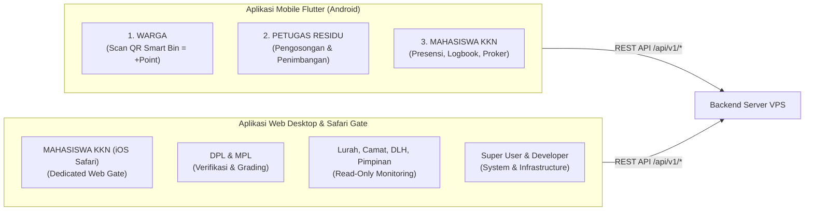

# 📱 LAPORAN RESMI PENYESUAIAN & PANDUAN INTEGRASI TIM MOBILE FLUTTER

**Projek**: BERSEKA (Pilah Sampah Cerdas)  
**Dokumen**: Laporan Penyesuaian Role, Kontrak API, dan Panduan Integrasi Mobile  
**Target Audiens**: Mobile App Engineers / Flutter Developers  
**Tanggal Rilis**: 5 Oktober 2026  
**Status Eksekusi**: ✅ **RESMI & TERSTANDARISASI (PRODUCTION)**  

---

## 1. Latar Belakang & Ruang Lingkup

Sehubungan dengan audit sistem menyeluruh, standarisasi 14 role, dan penguatan keamanan di lingkungan server VPS (`157.10.252.252` / `psc_db`), disusun laporan ini sebagai pedoman resmi bagi **Tim Mobile (Flutter)**. Dokumen ini merangkum pembagian platform, hak akses, aturan perolehan poin yang sah, serta penyesuaian logika di sisi aplikasi mobile.



---

## 2. Matriks Peran & Batasan Platform (Mobile vs Web)

| Peran (Role) | Platform Resmi | Status Akses Web | Hak Akses & Penyesuaian Lapangan |
|---|:---:|:---:|---|
| **WARGA** | **Mobile Flutter** | 🚫 **Diblokir Total** (`WEB_DISABLED_ROLES`) | Warga beroperasi murni di mobile. Login via web desktop otomatis ditolak dengan pesan diarahkan ke aplikasi mobile. |
| **PETUGAS_RESIDU** | **Mobile Flutter** | 🚫 **Diblokir Total** (`WEB_DISABLED_ROLES`) | Petugas beroperasi di lapangan untuk pengosongan tempat sampah dan penimbangan residu di TPS. |
| **MAHASISWA_KKN** | **Mobile (Android) / Web (iOS)** | ✅ **iOS Safari Only** | Pengguna Android menggunakan aplikasi Flutter; pengguna iOS menggunakan Web Safari terisolasi dengan geofencing GPS dan timer. |
| **RT & RW** | *Dormant di Mobile* | *Belum Digunakan* | 1 RW membawahi banyak RT. Data 18 RW tercatat di DB Coblong, namun implementasi lapangan belum digulirkan. **Tim mobile TIDAK PERLU membuat UI/menu khusus RT/RW saat ini.** |
| **DPL, MPL, TASKFORCE** | **Web Desktop** | ✅ **Web Desktop** | Mengelola bimbingan, verifikasi logbook, dan penilaian KKN. |
| **LURAH, CAMAT, ADMIN DLH** | **Web Desktop** | ✅ **Web Desktop** | Pejabat birokrasi berstatus **Strict Read-Only** (hanya melihat data dan mengekspor laporan excel/pdf). |
| **PIMPINAN** | **Web Desktop** | ✅ **Web Desktop** | Eksekutif universitas/pimpinan daerah, dashboard ringkasan read-only. |
| **SUPER_USER & DEVELOPER** | **Web Desktop** | ✅ **Web Desktop** | Super User mengelola operasional universitas; Developer mengelola infrastruktur teknis dan AI. |

---

## 3. Poin Kritis Logika Bisnis & Perolehan Poin (Zero Hallucination)

### A. Aturan Mutlak Poin Warga
> ⚠️ **PERHATIAN KHUSUS TIM MOBILE**:  
> Warga **HANYA** mendapatkan poin reward saat **memindai stiker QR pada tempat sampah pintar (Smart Bin)** ketika membuang sampah terpilah.

- **Kondisi yang Mendapat Poin**:
  - Warga membuka menu scan di aplikasi mobile $\rightarrow$ scan QR Smart Bin $\rightarrow$ submit jenis sampah $\rightarrow$ **+Poin bertambah secara instan**.
- **Kondisi yang TIDAK Mendapat Poin (0 Poin)**:
  - Saat sampah warga diambil atau ditimbang oleh Petugas Residu, warga **TIDAK MENDAPATKAN POIN TAMBAHAN**. Hal ini untuk mencegah inflasi poin ganda (*double rewarding*).
  - Saat mahasiswa mengklaim warga binaan, saldo warga tetap aman dan tidak mengalami penambahan otomatis yang tidak valid.

### B. Alur Aktivasi Wadah Sampah oleh Mahasiswa KKN
Jika mahasiswa membuka data warga binaan yang belum memiliki Smart Bin aktif:
1. Tombol pada tile warga menampilkan label **"Aktivasi Wadah"** (warna hijau dengan ikon QR code).
2. Ketika diklik, aplikasi memunculkan dialog konfirmasi:
   > *"Warga belum memiliki tempat sampah aktif terdaftar. Untuk mendampingi warga ini, Anda perlu menempelkan stiker QR dan melakukan Aktivasi Tempat Sampah. Buka pemindai QR sekarang?"*
3. Menyetujui dialog akan langsung mengarahkan mahasiswa ke layar aktivasi kamera QR (`AppRoutes.kknAktivasiWarga`).

### C. Alur Pengosongan Tempat Sampah Petugas Residu
- Saat petugas pemilah melakukan pengosongan tempat sampah yang berstatus penuh (*Reset Request*):
  - Petugas mendapatkan reward poin kerja sesuai parameter sistem.
  - Data log transaksi pengosongan tercatat dengan relasi `requestId` yang valid.
  - Pembatalan pengosongan kini bersifat granular per-tempat sampah tanpa merusak status wadah lain.

---

## 4. Spesifikasi Kontrak API untuk Integrasi Mobile

Berikut adalah daftar endpoint utama backend yang dikonsumsi aplikasi mobile:

### 1. Modul Warga (Pilah Sampah & Profil)
* **Scan Buang Sampah**:
  - `POST /api/v1/waste/transactions`
  - Headers: `Authorization: Bearer <token_warga>`
  - Body:
    ```json
    {
      "binId": "clx_smartbin_dago_001",
      "category": "ORGANIK",
      "weightKg": 0.5,
      "photoUrl": "https://..."
    }
    ```
  - Response: `{ "success": true, "pointsEarned": 10, "currentBalance": 120 }`

* **Profil Warga & Mahasiswa Pembimbing**:
  - `GET /api/v1/auth/me`
  - Di profil akun Warga, label pendamping menampilkan **"Mahasiswa Pembimbing"** beserta informasi RW binaan.

### 2. Modul Petugas Residu (Operasional Lapangan)
* **Daftar Tempat Sampah Penuh / Perlu Pengosongan**:
  - `GET /api/v1/residu/bins/pending-reset`
* **Eksekusi Pengosongan Wadah**:
  - `POST /api/v1/residu/bins/empty`
  - Body: `{ "binId": "clx_bin_123", "notes": "Pengosongan rutin TPS" }`
* **Penimbangan Residu Akhir**:
  - `POST /api/v1/residu/weighing`
  - Body: `{ "tpsId": "tps_coblong_01", "weightKg": 45.2, "wasteType": "RESIDU" }`

### 3. Modul Mahasiswa KKN (Presensi, Logbook, Pendampingan)
* **Presensi Masuk & Keluar**:
  - `POST /api/v1/presensi-mandiri/check-in`
  - `POST /api/v1/presensi-mandiri/check-out`
  - Body: `{ "latitude": -6.8851, "longitude": 107.6138, "photoUrl": "..." }`
* **Paginasi Logbook Server-Side**:
  - `GET /api/v1/logbook?page=1&limit=10`
  - Response:
    ```json
    {
      "data": [...],
      "meta": { "total": 45, "page": 1, "limit": 10, "totalPages": 5 }
    }
    ```
  - *Catatan*: Status persetujuan logbook menggunakan nilai baku: `MENUNGGU_VERIFIKASI_DPL`, `DISETUJUI`, `DITOLAK`.

---

## 5. Checklist Pengujian (Quality Control Runbook) untuk Tim Mobile

Sebelum merilis build APK baru ke mahasiswa dan warga, pastikan lulus pengujian berikut:

- [ ] **TC-M01 (Login Web Guard)**: Coba gunakan akun Warga atau Petugas Residu login di web browser desktop. Pastikan muncul peringatan bahwa akun tersebut wajib menggunakan aplikasi mobile.
- [ ] **TC-M02 (Poin Warga Smart Bin)**: Lakukan scan buang sampah via aplikasi warga. Pastikan poin bertambah. Pastikan saat petugas residu menimbang sampah TPS, saldo warga **tidak bertambah**.
- [ ] **TC-M03 (Aktivasi Wadah Warga)**: Buka profil warga yang belum memiliki wadah dari akun Mahasiswa. Pastikan tombol berlabel *"Aktivasi Wadah"*, membuka dialog QR, dan dapat melakukan aktivasi wadah secara presisi.
- [ ] **TC-M04 (Presensi Radius KKN)**: Coba check-in presensi di luar radius posko (out of zone). Pastikan aplikasi menampilkan peringatan geofence yang akurat dan mencegah presensi liar.
- [ ] **TC-M05 (Paginasi Logbook)**: Buka riwayat logbook mahasiswa dengan lebih dari 10 aktivitas. Pastikan mekanisme *infinite scroll / load more* bekerja lancar tanpa menduplikasi data.
