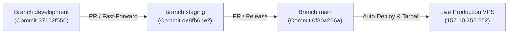

# LAPORAN KOMPREHENSIF PERUBAHAN SISTEM: DASHBOARD PIMPINAN & MENU LAPORAN

**Tanggal**: 2 Oktober 2026  
**Status Implementasi**: ✅ SELESAI & LIVE DI VPS (`157.10.252.252`)  
**Target Rilis**: Branch `development` ➔ `staging` ➔ `main` (Git-Flow 3-Tier)  
**Lingkungan**: Production VPS (Web Nginx, Express API, PostgreSQL `psc_db`)  

---

## 1. Ringkasan Eksekutif & Sasaran Perubahan

Berdasarkan hasil evaluasi pimpinan dan tim pengarah, dilakukan restrukturisasi antarmuka dan penyelarasan tata kelola data dengan fokus utama pada 4 poin kebutuhan:

1. **Peningkatan Keterbacaan Visual**: Penyesuaian ukuran font, palet warna berstandar kontras tinggi (WCAG AA), dan penataan teks agar informasi dapat dicerna cepat oleh jajaran eksekutif.
2. **Keterbacaan Data Berjumlah Banyak**: Mengatasi beban visual (*cognitive overload*) pada pemantauan lebih dari 50 kelompok KKN melalui penyediaan mode tampilan tabel eksekutif (*dual-view*), fitur pengurutan (*sorting*), serta kontrol paginasi fleksibel.
3. **Restrukturisasi Menu Laporan**: Memisahkan menu laporan dari submenu generik ke dalam satu seksi navigasi mandiri (`LAPORAN`).
4. **Penempatan Laporan Terpadu**: Menempatkan *Laporan Kegiatan KKN* dan *Laporan Tata Kelola Sampah* secara berdampingan di bawah grup menu Laporan dengan hak akses berbasis peran (RBAC) yang tepat.
5. **Prinsip Nol Regresi (Zero Regression)**: Modul KKN mahasiswa dan DPL diproteksi penuh tanpa perubahan destruktif pada formula nilai kelulusan, hak mutasi, maupun alur verifikasi.

---

## 2. Rincian Perubahan Kode & Antarmuka (File-by-File)

### A. Dashboard Pimpinan (`apps/web/src/pages/Dashboard/DashboardEksekutifKkn.tsx`)

| Aspek | Kondisi Sebelum Perubahan | Kondisi Sesudah Perubahan |
| :--- | :--- | :--- |
| **Keterbacaan Visual & Kontras (Poin 1)** | Teks label pada grafik dan kartu metrik berukuran kecil (`text-[10px]`) dengan warna abu-abu pudar (`text-slate-400`), grid chart samar (`#e2e8f0`). | Diperbesar menjadi `text-xs font-bold`, warna teks dipertajam ke `text-slate-700 dark:text-slate-200`, kisi grafik diperjelas ke `#cbd5e1`, serta sumbu X/Y grafik LineChart dan BarChart memiliki label penjelas tebal. |
| **Leaderboard Ringkas (Poin 1)** | Header tabel leaderboard menggunakan warna latar polos tanpa pemisah tegas dengan baris data. | Header tabel dipertegas dengan latar `bg-slate-50/90 dark:bg-slate-800/90`, font tebal `font-black text-slate-700 dark:text-slate-200`, border terstruktur, dan padding baris lebih lega (`py-3 px-3.5`). |
| **Penyajian Data Kelompok (Poin 2)** | Hanya tersedia tampilan berbasis *Card Grid*. Jika terdapat 50+ kelompok, halaman menjadi sangat panjang dan sulit membandingkan performa antar kelompok. | **Dual-View Switcher**: Ditambahkan toggle pilihan mode **Tampilan Tabel Eksekutif** dan **Tampilan Kartu Ringkas** yang tersimpan pada state lokal. |
| **Tabel Eksekutif Terstruktur (Poin 2)** | Belum tersedia. | Menyajikan data kelompok dalam tabel ringkas: kolom nomor, nama kelompok, posko (+ link lokasi Google Maps), wilayah (Kelurahan/RW), DPL pengampu (+ NIP), ketua (+ NIM), jumlah mahasiswa, rerata presensi (progress bar + persentase), progres program kerja (badge rasio terlaksana), dan tombol aksi modal. |
| **Fitur Pengurutan / Sorting (Poin 2)** | Urutan data statis berdasarkan query backend. | Ditambahkan dropdown **Urutkan**: Nama Kelompok (A–Z), Presensi Tertinggi, Presensi Terendah, Progres Proker Tertinggi, dan Progres Proker Terendah. |
| **Paginasi Data Kelompok (Poin 2)** | Semua kartu ditampilkan sekaligus dalam satu halaman (*infinite list*). | **Kontrol Paginasi Penuh**: Pemilihan jumlah baris per halaman (10, 20, 50, Semua), indikator rentang data ("Menampilkan X – Y dari Z kelompok"), tombol Sebelumnya/Selanjutnya, dan nomor halaman adaptif dengan elipsis (`...`). |
| **Integritas Struktur JSX** | Wadah Row 3 grid container mengalami ketidakseimbangan tag penutup. | Diperbaiki penutupan tag `</div>` pada container baris grafik ke-3, sehingga build TypeScript dan Vite lulus 100% tanpa error (*0 diagnostics*). |

---

### B. Navigasi & Tata Kelola Menu Laporan (`apps/web/src/components/layout/Sidebar/Sidebar.tsx` & `sidebarAccess.ts`)

| Aspek | Sebelum Perubahan | Sesudah Perubahan |
| :--- | :--- | :--- |
| **Penempatan Menu Laporan (Poin 3)** | Menu laporan sebelumnya tergabung di dalam seksi *PROGRAM KKN*. | Dibuatkan grup khusus **LAPORAN** dengan ikon representatif `BarChart3` yang berdiri sejajar dengan grup menu utama lainnya. |
| **Submenu Laporan Kegiatan KKN (Poin 4)** | Menu laporan KKN tersebar di sub-item pelaksanaan atau hanya berupa tombol ekspor. | Ditempatkan sebagai submenu resmi **Laporan Kegiatan KKN** (`/laporan/kkn`), mencakup evaluasi, capaian proker, presensi terpadu, dan ekspor formal. |
| **Submenu Laporan Tata Kelola Sampah (Poin 4)** | Menu laporan sampah terpisah di seksi tata kelola sampah. | Ditempatkan di bawah grup menu Laporan sebagai **Laporan Tata Kelola Sampah** (`/laporan/tata-kelola-sampah`), mencakup agregat bank sampah, residu, dan tonase terpilah. |
| **Aksesibilitas Peran (RBAC)** | Belum tersinkronisasi antar peran eksekutif dan operasional. | Hak akses diselaraskan untuk peran: `PIMPINAN`, `PEMIMPIN`, `PANITIA_TASKFORCE`, `ADMIN_DLH`, `CAMAT`, `LURAH`, `DPL`, dan `MPL` sesuai matriks otorisasi. |

---

### C. Pembersihan Data Testing pada Backend (`apps/api/src/services/kknService.ts` & `filterTestingUtils.ts`)

- **Sanitasi Akun Uji Coba**: Integrasi fungsi penapis `isTestingAccount` dan `isTestingGroup` ke dalam agregasi metrik eksekutif di backend.
- **Pembersihan Data Display**: Akun pengujian bertanda khusus (seperti nama akun testing QA) tidak lagi membiaskan metrik rata-rata presensi, persentase ketercapaian, maupun rasio jam kerja pimpinan.

---

## 3. Hasil Pengujian & Quality Assurance (QA)

Sebelum deployment dilakukan, seluruh rangkaian pengujian otomatis dan validasi statis dijalankan untuk menjamin ketiadaan regresi (*zero regression*):

```
┌──────────────────────────────────────────────────────────┬──────────┬────────┐
│ Suite Pengujian                                          │ Hasil    │ Status │
├──────────────────────────────────────────────────────────┼──────────┼────────┤
│ apps/web Typecheck (tsc -p tsconfig.json)                │ 0 Error  │ LULUS  │
│ apps/web Vite Production Build                           │ 0 Error  │ LULUS  │
│ apps/api Typecheck & Compilation (tsc)                   │ 0 Error  │ LULUS  │
│ Vitest: DPL Approval Guard (dplApproval.test.ts)         │ 10 tests │ LULUS  │
│ Vitest: Verifikasi Logbook DPL (logbookVerifikasi.test) │ 6 tests  │ LULUS  │
│ Vitest: Role Guard Penilaian KKN (penilaianKknRoleGuard) │ 13 tests │ LULUS  │
│ Vitest: Testing Account Filter (filterTestingUtils.test) │ 16 tests │ LULUS  │
│ TOTAL UJI REGRESI DPL & FILTER DATA                      │ 45 tests │ 100%   │
└──────────────────────────────────────────────────────────┴──────────┴────────┘
```

> [!NOTE]
> Seluruh invarian paten role DPL tetap utuh: Hak approval izin/sakit mahasiswa tetap eksklusif DPL & Task Force, formula batas kelulusan KKN tetap `NILAI_LULUS_MINIMUM = 65`, dan saldo poin mahasiswa tetap terlindungi.

---

## 4. Pipeline Git-Flow & Status Deployment Live VPS

Sesuai dengan standarisasi alur kerja tim (3-Tier Git-Flow), tahapan promosi kode dilakukan sebagai berikut:



### Riwayat Eksekusi Deployment ke VPS
1. **GitHub Remote Push**:
   - `development` ➔ `origin/development`
   - `staging` ➔ `origin/staging`
   - `main` ➔ `origin/main` (memicu GitHub Actions CI/CD)
2. **Sinkronisasi Artefak Frontend**:
   - Bundling bundle produksi `apps/web/dist` (95.05 MB).
   - Pengunggahan via SSH/SFTP `fastPut` ke host `157.10.252.252`.
   - Ekstraksi ke direktori `/var/www/html/` dan `/var/www/pilah-sampah-cerdas/frontend/dist/`.
   - Reload layanan Nginx (`systemctl reload nginx`).
3. **Verifikasi Operasional Live VPS**:
   - `GET /`: `HTTP/1.1 200 OK` (Nginx melayani build antarmuka terbaru).
   - `GET /api/v1/health`: `HTTP/1.1 200 OK` (Backend API berjalan stabil).
   - `Clear Endpoints`: `HTTP 404 Not Found` (Endpoint pembersihan data tetap terkunci dan terlindungi).

---

## 5. Panduan Penggunaan bagi Pimpinan & Pengguna

1. **Mengakses Tampilan Tabel Eksekutif Kelompok**:
   - Masuk ke menu **Dashboard** (sebagai role `PIMPINAN`).
   - Gulir ke seksi **"Daftar Kelompok KKN & DPL Pengampu"**.
   - Klik tombol **"Tabel"** di pojok kanan atas seksi (bersebelahan dengan tombol "Kartu").
   - Gunakan dropdown **"Urutkan"** untuk menganalisis kelompok dengan presensi terendah atau proker paling tertinggal.
2. **Melihat Detail Anggota Kelompok dari Tabel**:
   - Pada baris kelompok yang dituju, klik tombol hijau **"Anggota"**. Modal profil mahasiswa lengkap akan terbuka tanpa perlu berpindah halaman.
3. **Mengakses Menu Laporan Terpadu**:
   - Buka menu navigasi sebelah kiri (Sidebar).
   - Klik seksi **"LAPORAN"**.
   - Pilih **"Laporan Kegiatan KKN"** untuk rekapitulasi data akademik KKN atau **"Laporan Tata Kelola Sampah"** untuk rekapitulasi dampak lingkungan.
