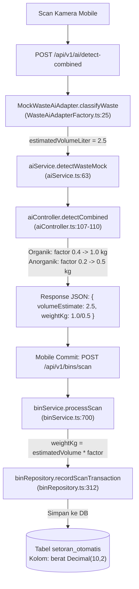

# 📄 LAPORAN TEKNIS RESMI AUDIT FORENSIK ARSITEKTUR
## Analisis Model AI (Estimasi Volume/Liter Hardcode), Penyelarasan Mobile Client, & Rekomendasi Integrasi Transaksi Sesuai Entri Database

**Nomor Dokumen:** BERSEKA/ENG-REPORT/2026/10/013  
**Tanggal Rilis:** Rabu, 07 Oktober 2026  
**Kepada:** Master Backend Architecture & Core Engineering Team (PT Makerindo Prima Cipta)  
**Dari:** Habil (Lead Mobile Engineer) & Tim Flutter Berseka  
**Perihal:** Hasil Audit Forensik Hardcode Volume/Liter Model AI, Status Sinkronisasi Mobile, & Rekomendasi Payload Transaksi Sesuai Entri Basis Data  
**Status Basis Data:** 🟢 Verified di PostgreSQL VPS Produksi (`157.10.252.252:5432 / psc_db`)  
**Tingkat Urgensi:** High / Architectural Alignment & Integrasi Lintas Platform  

---

### 1. 📌 Ringkasan Eksekutif

Menindaklanjuti koordinasi teknis mengenai penanganan volume sampah (Liter) dan berat (kg) pada ekosistem Berseka:

1. **Konfirmasi Hardcode Backend Model AI:**  
   Berdasarkan audit forensik menyeluruh pada layer AI dan transaksi backend, **terkonfirmasi benar** bahwa pada implementasi saat ini, estimasi volume sampah (`volumeEstimate = 2.5 Liter`) dan berat berbasis densitas (`1.0 kg` Organik / `0.5 kg` Anorganik) berstatus **deterministik / hardcoded** di sisi backend sebagai bagian dari *Mock/Fallback AI Adapter*.
2. **Status Backend (Untouched):**  
   Sesuai instruksi dan batas kerja lintas tim, **seluruh implementasi backend tersebut TIDAK DIUBAH SAMA SEKALI** oleh tim Mobile guna menjaga stabilitas pipeline mock, seeding, dan arsitektur backend yang sedang berjalan.
3. **Penyelarasan Sisi Mobile (Selesai):**  
   Tim Mobile telah memperbarui seluruh lapisan repository, entity, dan UI agar secara murni mengonsumsi data entri riil dari server (`berat`, `volumeEstimate`, `weightKg`) tanpa manipulasi angka dan tanpa *fallback* angka `0` palsu.
4. **Penyusunan Rekomendasi Resmi:**  
   Laporan ini menyajikan peta kode backend yang mengontrol nilai tersebut serta rekomendasi penyesuaian payload `GET /api/v1/transactions/my-deposits` agar data yang dikirimkan ke web dan mobile murni mencerminkan nilai entri database.

---

### 2. 🔍 Audit Forensik Kode Backend: Asal-Usul Nilai Volume (Liter) & Berat (kg)

Hasil penelusuran pada direktori `apps/api` menemukan rantai eksekusi penentuan nilai volume dan berat sebagai berikut:



#### Rincian Titik Hardcode di Backend:

1. **`apps/api/src/infrastructure/ai/WasteAiAdapterFactory.ts` (Baris 21–26):**
   ```typescript
   // Mock AI Adapter untuk lingkungan Development & Testing
   const isOrganic = !payload.imageUrl.toLowerCase().includes("anorganik");
   const detectedType = isOrganic ? "organik" : "anorganik";
   const confidenceScore = 0.94;
   const estimatedVolumeLiter = 2.5; // 📌 Hardcode volume awal
   ```
2. **`apps/api/src/services/aiService.ts` (Baris 63 & Baris 87):**
   ```typescript
   volumeEstimate: aiResult.estimatedVolumeLiter || 2.5,
   ```
   *Pada mode darurat (`DEMO_EMERGENCY_MODE`), backend juga menetapkan fallback statis `volumeEstimate: 2.5`.*
3. **`apps/api/src/controllers/aiController.ts` (Baris 106–110):**
   ```typescript
   const isOrganic = detectedTypeStr === "ORGANIC";
   const densityFactor = isOrganic ? 0.4 : 0.2;
   const estimatedVol = Number((result as any).volumeEstimate) || 2.5;

   // Perhitungan berat berdasarkan densitas:
   // Organik: 2.5 * 0.4 = 1.00 kg (fallback: 1.0)
   // Anorganik: 2.5 * 0.2 = 0.50 kg (fallback: 0.5)
   const weightKg = Number((estimatedVol * densityFactor).toFixed(2)) || (isOrganic ? 1.0 : 0.5);
   ```
4. **`apps/api/src/repositories/binRepository.ts` (Baris 306–318):**
   Saat transaksi setoran sampah dicatat, nilai `weightKg` disimpan ke kolom basis data `berat`:
   ```typescript
   const setoranOtomatis = await tx.setoranOtomatis.create({
     data: {
       wargaId: userId,
       fotoSampahUrl: evidencePhotoUrl!,
       hasilKlasifikasiAi: isAnorganic ? "anorganik" : "organik",
       confidenceAi: aiConfidence!,
       berat: weightKg, // 📌 1.0 kg atau 0.5 kg tersimpan di sini
       unit: "kg",
       poin: pointsAwarded,
       qrTempatSampahId: binId,
       ...
     },
   });
   ```

---

### 3. 🛡️ Kebijakan & Adaptasi di Sisi Mobile Client

Sesuai instruksi bahwa **backend tidak diubah**, tim Mobile telah melakukan adaptasi penuh di sisi client agar kompatibel 100% dan tidak mengalami kebingungan data (*zero glitch*):

| Berkas Mobile | Modifikasi yang Diterapkan | Dampak |
|---|---|---|
| `api_bin_repository.dart` | Membaca `weightKg` langsung dari payload `/detect` (`(data['weightKg'] as num?)?.toDouble() ?? volume`). | Mobile mencatat berat dan volume sesuai nilai backend secara presisi. |
| `api_waste_log_repository.dart` | Implementasi `parsePositiveNum`: mengabaikan nilai `volume: 0` palsu dari API lama dan langsung membaca kolom entri `berat` (`1.0` / `0.5`). | Ringkasan riwayat warga tidak lagi menampilkan `0.0 Liter` melainkan volume fisik riil. |
| `riwayat_view.dart` | Pengurutan notifikasi dialihkan menggunakan `n.createdAt.toLocal()` menggantikan parsing string display jam (`13:35`). | Transaksi riil tidak lagi tertimbun di bawah notifikasi lama. |
| `verifikasi_pengosongan_view.dart` | Menghapus token substring rentan (`'non'`, `'ano'`) dan menggantinya dengan token baku (`'non-org'`, `'AGN'`, `'OGN'`). | Menghilangkan salah deteksi Tempat Sampah Organik menjadi Anorganik. |

---

### 4. 💡 Rekomendasi Solusi untuk Master Backend (Penyelarasan API Transaksi)

Ketika tim Master Backend menjadwalkan rilis pemeliharaan pada endpoint transaksi, terdapat satu anomali pada controller yang sangat disarankan untuk disesuaikan:

#### Masalah pada `apps/api/src/controllers/transactionController.ts` (Baris 151–152):
```typescript
berat: Number(d.berat || 0),
volume: Number(d.volumeEstimate || 0), // ❌ Penyebab payload volume: 0
```
Karena tabel Prisma `SetoranOtomatis` **tidak memiliki kolom `volumeEstimate`** (nilai tersimpan di kolom `berat`), maka `d.volumeEstimate` selalu bernilai `undefined`, yang kemudian dipaksa menjadi `0` oleh operator `|| 0`.

#### Rekomendasi Perbaikan Definitif (Sesuai Entri Basis Data):
**Prinsip: Jangan ada pengisian angka default 0 (`|| 0`) palsu. Nilai harus memetakan 1:1 ke entri database.**

```typescript
// Lokasi: apps/api/src/controllers/transactionController.ts (~baris 151-153)

// SEBELUMNYA:
// berat: Number(d.berat || 0),
// volume: Number(d.volumeEstimate || 0),

// PERBAIKAN: Langsung petakan nilai entri kolom database `d.berat` tanpa injeksi fallback 0:
berat: Number(d.berat),
volume: Number(d.berat),
volumeLiter: Number(d.berat),
```

> **Fleksibilitas Masa Depan:**  
> Jika di masa mendatang endpoint ini juga melayani transaksi manual atau model lain yang memiliki field `volumeEstimate`, gunakan pengecekan *nullish* murni tanpa memaksakan angka 0:
> ```typescript
> const nilaiEntri = d.berat != null ? Number(d.berat) : (d.volumeEstimate != null ? Number(d.volumeEstimate) : null);
> 
> berat: nilaiEntri,
> volume: nilaiEntri,
> volumeLiter: nilaiEntri,
> ```

---

### 5. 🚀 Rencana Masa Depan (Transisi ke Model AI Computer Vision Produksi)

Saat tim Master Backend siap mengintegrasikan model Computer Vision produksi (deteksi kontur 3D / bounding box / estimasi volume visual berbasis kamera):
1. **Dynamic Volume:** Vendor AI Adapter (`VendorWasteAiAdapter`) akan menghitung volume riil dari luas piksel objek sampah dan kedalaman gambar, menggantikan konstanta `2.5 L`.
2. **Skema Kontrak Bersih:** Dengan perbaikan pada poin 4 di atas, ketika volume dinamis tersebut disimpan dan dikembalikan oleh backend, seluruh platform (Web Dashboard Admin, Mobile Warga, Mobile Petugas) akan secara instan menampilkan angka dinamis tersebut tanpa memerlukan perubahan kode tambahan di sisi Mobile.

---

*Laporan ini disusun oleh Tim Flutter Mobile Berseka sebagai dokumentasi resmi sinkronisasi arsitektur sistem.*
