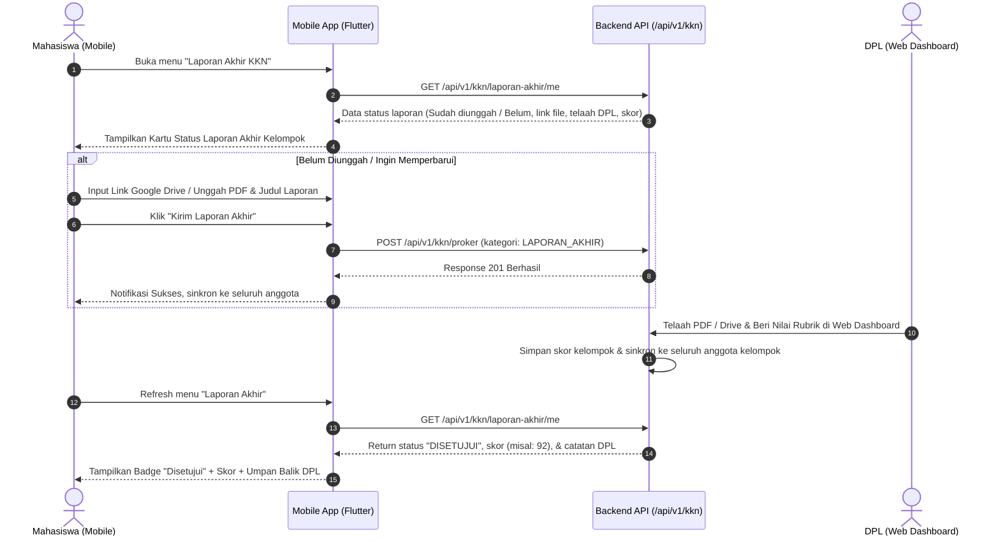

# Panduan Integrasi Mobile: Pengunggahan & Pemantauan Laporan Akhir KKN

**Dokumen**: Panduan Integrasi Endpoint & Alur Aplikasi Mobile (Flutter)  
**Ditujukan Kepada**: Mobile Developer (Flutter App KKN Berseka)  
**Terkait**: Fitur Laporan Akhir KKN Mahasiswa (Komunal vs Individu) & Integrasi DPL  
**Status**: Siap Digunakan / Production Ready  

---

## 1. Konsep & Arsitektur: Komunal (Kelompok) vs Individu

### Mengapa Laporan Akhir Bersifat Komunal (Kelompok)?
1. **Satu Laporan per Kelompok**:  
   Setiap kelompok KKN ditempatkan di 1 wilayah RW binaan dengan 1 Dosen Pendamping Lapangan (DPL). Luaran akademik utama KKN adalah dokumen komprehensif Program Kerja Wilayah, sehingga dokumen Laporan Akhir disusun dan disahkan **secara kolektif per kelompok**.
2. **Kolektif tetapi Fleksibel**:  
   - Siapa pun anggota kelompok (Ketua ataupun perwakilan anggota) dapat mengunggah atau memperbarui dokumen Laporan Akhir (Tautan Google Drive atau File PDF).
   - Ketika 1 mahasiswa mengunggah, seluruh anggota kelompok langsung tersinkronisasi dan melihat status *"Sudah Diunggah"* beserta tautan berkas yang sama.
3. **Harmonisasi Nilai Kelompok vs Nilai Individu Mahasiswa**:  
   - DPL menelaah dan memberikan nilai dasar (*baseline score*) berdasarkan rubrik 4 kriteria Laporan Akhir Kelompok.
   - Nilai kelompok ini otomatis terdistribusi ke Aspek 6 (*Laporan Akhir, Esai Lapangan, & Refleksi*) pada penilaian individu tiap mahasiswa.
   - Jika ada mahasiswa dengan kontribusi luar biasa atau kurang aktif, DPL tetap memiliki fleksibilitas menyesuaikan skor individu mahasiswa tersebut di dashboard web DPL tanpa merusak nilai anggota kelompok lainnya.

---

## 2. Alur Pengguna (User Journey) di Aplikasi Mobile



---

## 3. Spesifikasi Kontrak API (API Contract)

### Endpoint 1: Mengambil Status & Rincian Laporan Akhir Saya
Digunakan oleh Mobile App saat membuka halaman/kartu Laporan Akhir untuk menampilkan status terkini, berkas yang sudah diunggah, serta hasil telaah/nilai dari DPL.

- **URL**: `/api/v1/kkn/laporan-akhir/me`
- **Method**: `GET`
- **Headers**:
  ```http
  Authorization: Bearer <JWT_ACCESS_TOKEN>
  Content-Type: application/json
  ```
- **Response Success (`200 OK`)**:
  ```json
  {
    "success": true,
    "message": "Data laporan akhir kelompok berhasil diambil",
    "data": {
      "kelompokId": "cm81abc...",
      "namaKelompok": "Coblong RW 03",
      "dplNama": "Dr. Ir. Budi Santoso, M.T.",
      "hasSubmitted": true,
      "laporan": {
        "id": "cm82proker123...",
        "judul": "Laporan Akhir KKN Tematik BERSEKA Kelompok Coblong RW 03",
        "deskripsi": "Laporan komprehensif program pengelolaan sampah organik dan anorganik...",
        "fileUrl": "https://drive.google.com/file/d/1abcxyz/view?usp=sharing",
        "fileName": "Laporan_Akhir_KKN_Coblong_RW03.pdf",
        "status": "DISETUJUI",
        "statusTelaah": "DISETUJUI",
        "skorPenilaian": 90,
        "catatanRevisi": "Analisis dan program kerja sangat memuaskan, dampak nyata.",
        "rubrikScores": {
          "sistematika": 90,
          "analisis": 90,
          "output": 90,
          "refleksi": 90
        },
        "submittedAt": "2026-09-08T07:30:00.000Z",
        "submittedBy": "Ahmad Fauzi (120120001)"
      },
      "skorIndividu": {
        "skorDplLaporanAkhir": 90,
        "isCustomized": false
      }
    }
  }
  ```

- **Response Jika Belum Diunggah (`200 OK`)**:
  ```json
  {
    "success": true,
    "message": "Kelompok belum mengunggah laporan akhir",
    "data": {
      "kelompokId": "cm81abc...",
      "namaKelompok": "Coblong RW 03",
      "dplNama": "Dr. Ir. Budi Santoso, M.T.",
      "hasSubmitted": false,
      "laporan": null,
      "skorIndividu": {
        "skorDplLaporanAkhir": 0,
        "isCustomized": false
      }
    }
  }
  ```

---

### Endpoint 2: Mengunggah / Memperbarui Laporan Akhir
Digunakan oleh mahasiswa untuk mengirimkan berkas Laporan Akhir kelompok.

- **URL**: `/api/v1/kkn/proker`
- **Method**: `POST`
- **Headers**:
  ```http
  Authorization: Bearer <JWT_ACCESS_TOKEN>
  Content-Type: application/json
  ```
- **Request Body Payload**:
  ```json
  {
    "nama": "Laporan Akhir KKN Tematik BERSEKA Kelompok Coblong RW 03",
    "kategori": "LAPORAN_AKHIR",
    "deskripsi": "Laporan akhir komprehensif pelaksanaan program kerja KKN tematik persampahan di RW 03 Kelurahan Coblong.",
    "driveUrl": "https://drive.google.com/file/d/1xyz.../view?usp=sharing",
    "fileUrl": "https://storage.berseka.id/uploads/kkn/laporan-akhir-rw03.pdf",
    "targetAudience": "Masyarakat RW 03 & Tim DPL",
    "lokasi": "RW 03 Coblong"
  }
  ```
  > **Catatan Validasi**:
  > - Kolom `nama`, `kategori`, dan `deskripsi` wajib diisi.
  > - `kategori` harus bernilai `"LAPORAN_AKHIR"`.
  > - Minimal salah satu antara `driveUrl` (Tautan Google Drive) atau `fileUrl` (Berkas PDF terunggah) **wajib disertakan**.
  > - Pastikan link Google Drive diset dengan hak akses publik (*Anyone with the link can view*).

- **Response Success (`201 Created`)**:
  ```json
  {
    "success": true,
    "message": "Laporan Akhir KKN berhasil disimpan dan disinkronkan ke tim kelompok!",
    "data": {
      "id": "cm82proker123...",
      "nama": "Laporan Akhir KKN Tematik BERSEKA Kelompok Coblong RW 03",
      "kategori": "LAPORAN_AKHIR",
      "status": "MENUNGGU_PERSETUJUAN",
      "fileUrl": "https://drive.google.com/file/d/1xyz.../view?usp=sharing"
    }
  }
  ```

---

## 4. Rekomendasi Contoh Implementasi Mobile (Flutter / Dart)

### Model Data Dart (`LaporanAkhirModel.dart`)
```dart
class LaporanAkhirResponse {
  final bool success;
  final String message;
  final LaporanAkhirData? data;

  LaporanAkhirResponse({required this.success, required this.message, this.data});

  factory LaporanAkhirResponse.fromJson(Map<String, dynamic> json) {
    return LaporanAkhirResponse(
      success: json['success'] ?? false,
      message: json['message'] ?? '',
      data: json['data'] != null ? LaporanAkhirData.fromJson(json['data']) : null,
    );
  }
}

class LaporanAkhirData {
  final String? kelompokId;
  final String? namaKelompok;
  final String? dplNama;
  final bool hasSubmitted;
  final LaporanDetail? laporan;
  final int skorIndividu;

  LaporanAkhirData({
    this.kelompokId,
    this.namaKelompok,
    this.dplNama,
    required this.hasSubmitted,
    this.laporan,
    required this.skorIndividu,
  });

  factory LaporanAkhirData.fromJson(Map<String, dynamic> json) {
    return LaporanAkhirData(
      kelompokId: json['kelompokId'],
      namaKelompok: json['namaKelompok'],
      dplNama: json['dplNama'],
      hasSubmitted: json['hasSubmitted'] ?? false,
      laporan: json['laporan'] != null ? LaporanDetail.fromJson(json['laporan']) : null,
      skorIndividu: json['skorIndividu']?['skorDplLaporanAkhir'] ?? 0,
    );
  }
}

class LaporanDetail {
  final String id;
  final String judul;
  final String? fileUrl;
  final String? fileName;
  final String status;
  final int? skorPenilaian;
  final String? catatanRevisi;
  final String? submittedAt;
  final String? submittedBy;

  LaporanDetail({
    required this.id,
    required this.judul,
    this.fileUrl,
    this.fileName,
    required this.status,
    this.skorPenilaian,
    this.catatanRevisi,
    this.submittedAt,
    this.submittedBy,
  });

  factory LaporanDetail.fromJson(Map<String, dynamic> json) {
    return LaporanDetail(
      id: json['id'] ?? '',
      judul: json['judul'] ?? '',
      fileUrl: json['fileUrl'],
      fileName: json['fileName'],
      status: json['status'] ?? 'MENUNGGU_PERSETUJUAN',
      skorPenilaian: json['skorPenilaian'],
      catatanRevisi: json['catatanRevisi'],
      submittedAt: json['submittedAt'],
      submittedBy: json['submittedBy'],
    );
  }
}
```

### Service API Dart (`KknApiService.dart`)
```dart
import 'dart:convert';
import 'package:http/http.dart' as http;

class KknApiService {
  final String baseUrl = "https://api.berseka.id/api/v1"; // sesuaikan environment

  // 1. Ambil Rincian Laporan Akhir Kelompok Saya
  Future<LaporanAkhirData?> fetchLaporanAkhirMe(String token) async {
    final res = await http.get(
      Uri.parse('$baseUrl/kkn/laporan-akhir/me'),
      headers: {
        'Authorization': 'Bearer $token',
        'Content-Type': 'application/json',
      },
    );

    if (res.statusCode == 200) {
      final jsonMap = jsonDecode(res.body);
      return LaporanAkhirResponse.fromJson(jsonMap).data;
    } else {
      throw Exception('Gagal memuat status laporan akhir');
    }
  }

  // 2. Unggah / Perbarui Tautan Laporan Akhir Kelompok
  Future<bool> submitLaporanAkhir({
    required String token,
    required String judul,
    required String deskripsi,
    required String driveUrl,
  }) async {
    final res = await http.post(
      Uri.parse('$baseUrl/kkn/proker'),
      headers: {
        'Authorization': 'Bearer $token',
        'Content-Type': 'application/json',
      },
      body: jsonEncode({
        'nama': judul,
        'kategori': 'LAPORAN_AKHIR',
        'deskripsi': deskripsi,
        'driveUrl': driveUrl,
      }),
    );

    return res.statusCode == 200 || res.statusCode == 201;
  }
}
```

---

## 5. Ringkasan Status & Badge UI untuk Mobile
Gunakan panduan visual berikut pada aplikasi mobile:

| Status Backend | Label UI Mobile | Warna Badge | Keterangan |
| :--- | :--- | :--- | :--- |
| `hasSubmitted: false` | **Belum Diunggah** | Abu-abu / Slate | Tampilkan form input link Google Drive / Upload PDF |
| `MENUNGGU_PERSETUJUAN` / `MENUNGGU_TELAAH` | **Menunggu Review DPL** | Biru / Amber | Laporan berhasil terunggah, sedang dalam proses review dosen |
| `PERLU_REVISI` | **Perlu Revisi** | Merah / Oranye | Tampilkan catatan/umpan balik DPL & tombol "Unggah Revisi" |
| `DISETUJUI` / `SELESAI` | **Disetujui & Dinilai** | Hijau / Emerald | Tampilkan nilai akhir laporan, badge nilai (misal: 92/100), dan feedback DPL |
