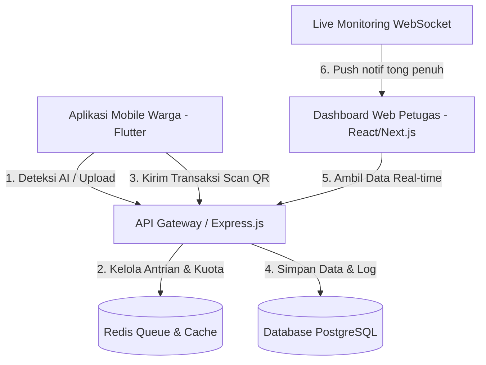

# Pilah Sampah Cerdas — Product Requirement, System Requirements, and System Design Documentation

Dokumen ini disusun sebagai acuan teknis tunggal (*Single Source of Truth*) guna menghindari asumsi salah selama fase pengembangan sistem manajemen sampah pintar berbasis kecerdasan buatan.

**Repository:** `pilah-sampah-cerdas` (GitHub Public)  
**Default Branch:** `backend` | Branch lain: `frontend`, `mobile`

---

## 1. Product Requirement Document (PRD)

### 1.1 Deskripsi Produk
**Pilah Sampah Cerdas** adalah platform berbasis IoT/sensor & AI untuk mengotomatisasi pendataan, pemilahan, dan pemantauan kapasitas tong sampah secara real-time. Produk ini dibuat untuk membantu petugas kebersihan RT/RW/Kelurahan dan warga mengelola sampah secara disiplin guna menaikkan efisiensi pemilahan sampah di permukiman Kecamatan Coblong, Kota Bandung.

### 1.2 Masalah yang Diselesaikan
1. **Ketidakdisiplinan Pemilahan:** Sampah organik kerap tercampur dengan anorganik sehingga merusak proses daur ulang.
2. **Tong Sampah Meluber:** Petugas tidak tahu kapan tong sampah penuh, mengakibatkan tumpukan sampah di luar kapasitas.
3. **Kurangnya Insentif Warga:** Warga malas memilah karena tidak ada umpan balik langsung.
4. **Data Tidak Terpusat:** Tidak ada satu platform yang menyatukan data RT/RW/Kelurahan dalam satu dasbor monitoring.

### 1.3 Alur Pengguna (User Flow)
#### Alur UX Warga (Aplikasi Mobile)
1. **Foto Sampah:** Warga mengambil foto sampah yang akan dibuang.
2. **Kompresi Citra:** Aplikasi secara otomatis memotong resolusi foto hingga berukuran di bawah 1MB untuk menghemat kuota transmisi.
3. **Verifikasi AI:** Foto dikirim ke AI Mock Service. AI mengembalikan jenis sampah (`ORGANIC` / `NON_ORGANIC`) dan estimasi volume (Liter).
4. **Scan QR:** Warga memindai QR Code di tong sampah fisik.
5. **Kirim Transaksi:** Data dikirim ke backend. Jika kapasitas mencukupi, data disimpan dan warga mendapat poin. Jika tong penuh, transaksi ditolak dan petugas RT/RW mendapatkan notifikasi otomatis.

---

## 2. Software Requirement Specification (SRS)

### 2.1 Spesifikasi Fungsional (Functional Requirements)
* **FR-01 (Deteksi AI):** Sistem harus mampu menerima request foto, memproses antrian secara FIFO dan memprediksi tipe serta volume sampah dalam batas timeout 2000 ms.
* **FR-02 (Validasi QR & Kapasitas):** Sistem harus menolak transaksi jika jenis sampah tidak sesuai dengan tipe peruntukan tong atau jika volume sisa tong (maksimal 25L) terlampaui.
* **FR-03 (Sistem Poin):** Sistem harus mengonversi liter ke kilogram berdasarkan massa jenis (ORGANIC = 0.4 kg/L, NON_ORGANIC = 0.2 kg/L) dan memberikan 100 poin per kg.
* **FR-04 (Notifikasi & Monitoring):** Sistem harus memicu notifikasi "Tong Penuh" jika kapasitas tong mencapai >90%.
* **FR-05 (Master Data CRUD):** Admin dan Petugas Kelurahan dapat mengelola seluruh entitas master data melalui halaman Master Data dengan navigasi dropdown.
* **FR-06 (Live Monitoring):** Sistem menyediakan 1 halaman khusus Live Monitoring yang menampilkan titik tong sampah real-time di atas peta geospatial, mencakup area RT, RW, dan Kelurahan secara hierarkis.

### 2.2 Spesifikasi Non-Fungsional (Non-Functional Requirements)
* **NFR-01:** Mampu menangani hingga 100 request deteksi foto bersamaan menggunakan Redis Concurrent Queue.
* **NFR-02:** Batas aman request AI dibatasi maksimal 50 request per user/hari.
* **NFR-03:** Database wajib merekam koordinat GIS menggunakan tipe DECIMAL(11,8) dengan akurasi hingga 1.1 cm.
* **NFR-04:** Halaman Live Monitoring harus refresh otomatis setiap 30 detik (polling atau WebSocket).

---

## 3. Software Design Document (SDD)

### 3.1 Arsitektur Sistem



### 3.2 Desain Database (11 Tabel Utama)
* **`roles`**: Menyimpan level hak akses (ADMIN, PETUGAS_KELURAHAN, PETUGAS_RW, PETUGAS_RT, WARGA).
* **`users`**: Kredensial akun dan profil warga/petugas.
* **`kelurahan`**: Data kelurahan dalam Kecamatan Coblong (Dago, Sadangserang, Sekeloa, Lebak Siliwangi, Cipaganti, Coblong).
* **`rt_rw_areas`**: Penanda area administratif pengelolaan sampah (berelasi ke kelurahan).
* **`households`**: Data rumah tangga warga dengan koordinat presisi DECIMAL(11,8) untuk peta GIS.
* **`bins`**: Informasi fisik tong sampah warga (kapasitas maks 25 Liter), dengan status real-time kapasitas.
* **`waste_categories`**: Kategori sampah (ORGANIC, NON_ORGANIC, B3) — Master Data.
* **`waste_logs`**: Catatan riwayat setoran volume dan berat sampah.
* **`ai_request_logs`**: Log transaksi pendeteksian AI beserta status (SUCCESS, TIMEOUT, IMAGE_UNREADABLE).
* **`point_history`**: Riwayat perolehan poin warga.
* **`notifications`**: Penyimpanan pesan notifikasi sistem.

---

## 4. Master Data

### 4.1 Konsep Master Data
Halaman **Master Data** di web dashboard menggunakan navigasi **dropdown** di sidebar atau sub-menu. Setiap item Master Data memiliki tampilan CRUD tabel standar (Create, Read, Update, Delete).

### 4.2 Daftar Entitas Master Data (Dropdown List)

| # | Nama Entitas | Deskripsi | Siapa yang Bisa CRUD |
|---|---|---|---|
| 1 | Manajemen User | Daftar akun seluruh pengguna (Admin, Petugas, Warga) | Admin |
| 2 | Area Kelurahan | Data 6 kelurahan di Kec. Coblong (nama, batas wilayah) | Admin |
| 3 | Area RT / RW | Data RT/RW per kelurahan, koordinat batas poligon | Admin, Petugas Kelurahan |
| 4 | Data Rumah Tangga | Data warga terdaftar dengan koordinat GPS rumah | Admin, Petugas Kelurahan, Petugas RW, Petugas RT |
| 5 | Tong Sampah | Inventaris tong sampah fisik (QR Code, jenis, kapasitas, lokasi) | Admin, Petugas Kelurahan, Petugas RW |
| 6 | Kategori Sampah | Jenis sampah (Organik, Anorganik, B3) beserta parameter konversi berat | Admin |
| 7 | Jadwal Pengangkutan | Jadwal rutin pengambilan/pengangkutan sampah per RT/RW | Admin, Petugas Kelurahan, Petugas RW |
| 8 | Konfigurasi Poin | Multiplier poin per kategori, batas kuota harian AI | Admin |

### 4.3 Hak Akses CRUD per Role
```
ADMIN              -> Full CRUD semua entitas Master Data
PETUGAS_KELURAHAN  -> CRUD: Area RT/RW, Data Rumah Tangga, Tong Sampah, Jadwal
PETUGAS_RW         -> Read + Update: Data Rumah Tangga, Tong Sampah, Jadwal (lingkup RW)
PETUGAS_RT         -> Read: Data Rumah Tangga, Tong Sampah (lingkup RT)
WARGA              -> Tidak ada akses Master Data
```

---

## 5. Live Monitoring (Halaman Khusus)

### 5.1 Konsep
Satu halaman khusus bernama "Live Monitoring" yang menampilkan kondisi real-time seluruh area secara geospatial dari titik tong sampah hingga batas wilayah RT, RW, dan Kelurahan.

### 5.2 Elemen Peta Live Monitoring
* **Batas Wilayah Geospatial (Poligon Berwarna):**
  * Kelurahan — outline tebal warna biru tua, opacity 20%
  * RW — outline sedang warna hijau tua, opacity 15%
  * RT — fill transparan, warna sesuai tingkat kepatuhan (Hijau/Kuning/Merah)
* **Pin Titik Tong Sampah (Marker Real-Time):**
  * Hijau: Kapasitas < 70% (aman)
  * Kuning: Kapasitas 70-90% (perlu perhatian)
  * Merah + berkedip: Kapasitas > 90% (penuh, butuh tindakan)
  * Klik marker -> popup info: nama warga, alamat, kapasitas saat ini, tombol Reset Volume
* **Filter Interaktif:** Dropdown Kelurahan, RW, RT. Toggle: Tampilkan semua / hanya tong kritis
* **Auto-Refresh:** Data diperbarui setiap 30 detik. Indikator waktu update terakhir ditampilkan.
* **KPI Sidebar (Kanan):** Total tong aktif, total tong kritis, total tong aman, persentase kepatuhan real-time.

### 5.3 Akses Live Monitoring per Role
| Role | Cakupan Peta |
|---|---|
| ADMIN | Seluruh Kecamatan Coblong |
| PETUGAS_KELURAHAN | Seluruh RT/RW dalam kelurahan yang dipegang |
| PETUGAS_RW | RT-RT dalam RW yang dipegang |
| PETUGAS_RT | Rumah tangga dalam RT yang dipegang |

---

## 6. API Contract Specification

### 6.1 AI Mock Detection
* **Endpoint:** `POST /api/v1/waste/detect-mock`
* **Request Body:** `{ "userId": "user-jeremy" }`
* **Response 200:** `{ "success": true, "data": { "detectedType": "ORGANIC", "volumeEstimate": 3.4, "isBlurry": false } }`
* **Response 408 Timeout:** `{ "error": "AI_TIMEOUT" }`
* **Response 422 Unreadable:** `{ "error": "IMAGE_UNREADABLE" }`

### 6.2 Bin QR Scan Transaction
* **Endpoint:** `POST /api/v1/bins/scan`
* **Response 200:** `{ "success": true, "data": { "weightKg": 1.8, "pointsAwarded": 180, "newBinVolume": 14.8 } }`
* **Response 400 Overflow:** `{ "error": "BIN_OVERFLOW" }`

### 6.3 Live Monitoring
* **Endpoint:** `GET /api/v1/monitoring/live`
* **Query Params:** `kelurahan`, `rw`, `rt` (opsional)
* **Response 200:**
```json
{
  "lastUpdated": "2026-07-10T11:23:00Z",
  "data": {
    "bins": [
      { "binId": "bin-uuid-01", "lat": -6.9034, "lng": 107.6198,
        "capacityPercent": 94, "status": "CRITICAL",
        "householdName": "Bp. Asep Syaepudin", "rt": "RT 04", "rw": "RW 02", "kelurahan": "Dago" }
    ],
    "summary": { "totalBins": 142, "criticalBins": 8, "warningBins": 23, "safeBins": 111 }
  }
}
```
## 7. Alur Pengosongan Tong Sampah On-Demand (Reset Volume)

Untuk menjaga akurasi kapasitas tanpa perlu sensor IoT real-time mahal di tiap rumah, sistem menggunakan mekanisme **On-Demand Reset dengan Verifikasi Foto oleh Petugas**.

### 7.1 Alur UX Warga (Mobile)
1. **Pemberitahuan Penuh:** Ketika kapasitas tong warga sudah mencapai status kritis (>90%), warga masuk ke menu **"Ajukan Pengosongan Tong"**.
2. **Foto Bukti Fisik:** Warga memotret kondisi tong sampahnya yang penuh sebagai bukti fisik pengosongan.
3. **Kirim Pengajuan:** Warga menekan tombol **"Ajukan Reset"**. Request dikirim ke backend dengan membawa parameter:
   - `binId`
   - `userId` (warga)
   - `photoBase64` / `photoUrl`
4. **Status Pending:** Status tong tetap penuh di sistem, dan status pengajuan warga tercatat `PENDING`.

### 7.2 Alur UX Petugas RT/RW (Web Dashboard / Mobile View)
1. **Notifikasi Masuk:** Petugas RT/RW mendapatkan notifikasi bahwa ada warga di lingkungannya yang mengajukan pengosongan tong.
2. **Review Pengajuan:** Petugas masuk ke menu **"Persetujuan Pengosongan"** (Approval Dashboard):
   - Petugas melihat nama warga, RT/RW, dan foto bukti fisik tong sampah yang dikirim.
3. **Konfirmasi Pengosongan (Approve/Reject):**
   - **Approve:** Petugas menyetujui (kapasitas tong warga tersebut langsung ter-reset kembali ke `0 Liter` di database).
   - **Reject:** Petugas menolak jika foto tidak sesuai/bohong (status tong tetap penuh, warga mendapatkan notifikasi penolakan).

---

## 8. Spesifikasi Bulk Actions Tong Sampah (Master Data)

Disediakan menu khusus di dalam Master Data Tong Sampah untuk mempermudah pendaftaran masal:

### 8.1 Bulk Generate Bins (Pre-Registration)
* **Fungsi:** Menghasilkan (generate) nomor ID Tong Sampah dan QR Serial secara masal (misal: generate 100 tong sekaligus).
* **Hasil Output:** File Excel/CSV berisi kolom `bin_id` dan `qr_serial_code`. 
* **Tujuan:** Data ini di-print oleh kelurahan menjadi stiker QR Code fisik untuk ditempel di tong sampah baru sebelum didistribusikan ke warga.
* **Aktivasi Mobile:** Saat warga menerima tong, mereka melakukan scan pertama kali lewat aplikasi mobile untuk mengasosiasikan `bin_id` tersebut dengan akun warga mereka.

### 8.2 Bulk Import & Verify Bins (Linked to Master Data)
* **Fungsi:** Mengimpor file Excel/CSV berisi tong sampah yang sudah diverifikasi dan langsung diasosiasikan dengan Master Data Warga (`user_id` / NIK).
* **Format File CSV/Excel:**
  ```csv
  nik_warga,nama_kk,bin_id,qr_serial_code,tipe_sampah
  327301XXXXXXXXXX,Budi Santoso,BIN-CBL-001,QR-ORGANIC-001,ORGANIC
  327301XXXXXXXXXX,Ibu Siti Nurhayati,BIN-CBL-002,QR-NON-ORGANIC-002,NON_ORGANIC
  ```
* **Proses Sistem:** Backend secara otomatis mencocokkan NIK warga dengan data User, membuat entry pada tabel `bins`, dan menandai tong sampah tersebut berstatus `ACTIVE` & `VERIFIED`.

---

## 9. Penyesuaian Skema Database (Tabel Baru)

* **`bin_reset_requests`** (Persetujuan Pengosongan Tong):
  - `id` (UUID, Primary Key)
  - `bin_id` (FK to `bins`)
  - `user_id` (FK to `users`, pemohon)
  - `evidence_photo_url` (String, bukti foto)
  - `status` (Enum: PENDING, APPROVED, REJECTED)
  - `reviewed_by` (FK to `users`, petugas RT/RW yang memproses)
  - `created_at` (DateTime)
  - `updated_at` (DateTime)
