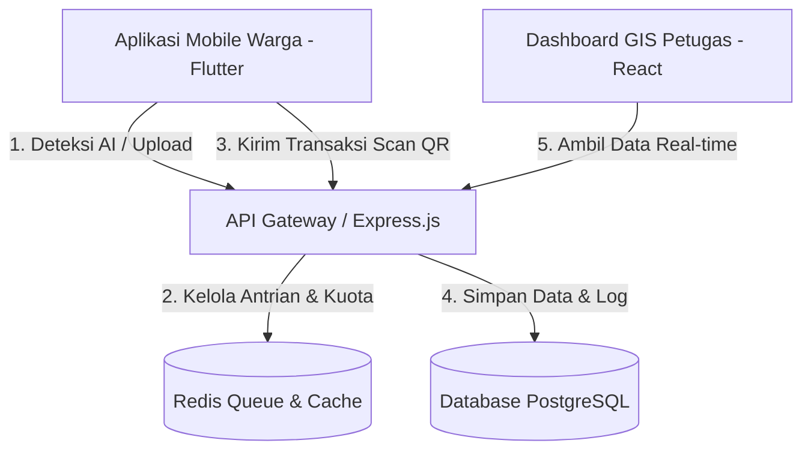

# pilahsampah.id — Product Requirement, System Requirements, and System Design Documentation

Dokumen ini disusun sebagai acuan teknis tunggal (*Single Source of Truth*) guna menghindari asumsi salah selama fase pengembangan sistem manajemen sampah pintar berbasis kecerdasan buatan.

---

## 1. Product Requirement Document (PRD)

### 1.1 Deskripsi Produk
**pilahsampah.id** adalah platform berbasis IoT/sensor & AI untuk mengotomatisasi pendataan, pemilahan, dan pemantauan kapasitas tong sampah secara real-time. Produk ini dibuat untuk membantu petugas kebersihan RT/RW dan warga mengelola sampah secara disiplin guna menaikkan efisiensi pemilahan sampah di perkotaan.

### 1.2 Masalah yang Diselesaikan
1. **Ketidakdisiplinan Pemilahan:** Sampah organik kerap tercampur dengan anorganik sehingga merusak proses daur ulang.
2. **Tong Sampah Meluber:** Petugas tidak tahu kapan tong sampah penuh, mengakibatkan tumpukan sampah di luar kapasitas.
3. **Kurangnya Insentif Warga:** Warga malas memilah karena tidak ada umpan balik langsung.

### 1.3 Alur Pengguna (User Flow)
#### Alur UX Warga (Aplikasi Mobile)
1. **Foto Sampah:** Warga mengambil foto sampah yang akan dibuang.
2. **Kompresi Citra:** Aplikasi secara otomatis memotong resolusi foto hingga berukuran di bawah 1MB untuk menghemat kuota transmisi.
3. **Verifikasi AI:** Foto dikirim ke AI Mock Service. AI mengembalikan jenis sampah (`ORGANIC` / `NON_ORGANIC`) dan estimasi volume (Liter).
4. **Scan QR:** Warga memindai QR Code di tong sampah fisik.
5. **Kirim Transaksi:** Data dikirim ke backend. Jika kapasitas mencukupi, data disimpan dan warga mendapat poin. Jika tong penuh, transaksi ditolak dan petugas RT/RW mendapatkan notifikasi otomatis.

---

## 2. Software Requirement Specification (SRS)

### 2.1 Spesifikasi Fungsional (Functional Requirements)
* **FR-01 (Deteksi AI):** Sistem harus mampu menerima request foto, memproses antrian secara FIFO (First In First Out), dan memprediksi tipe serta volume sampah dalam batas timeout 2000 ms.
* **FR-02 (Validasi QR & Kapasitas):** Sistem harus menolak transaksi jika jenis sampah tidak sesuai dengan tipe peruntukan tong (misal, membuang plastik ke tong organik) atau jika volume sisa tong (maksimal 25L) terlampaui.
* **FR-03 (Sistem Poin):** Sistem harus mengonversi liter ke kilogram berdasarkan massa jenis (`ORGANIC = 0.4 kg/L`, `NON_ORGANIC = 0.2 kg/L`) dan memberikan 100 poin per kg.
* **FR-04 (Notifikasi & Monitoring):** Sistem harus memicu notifikasi "Tong Penuh" jika kapasitas tong mencapai >90%.

### 2.2 Spesifikasi Non-Fungsional (Non-Functional Requirements)
* **NFR-01 (Kinerja Antrian):** Mampu menangani hingga 100 request deteksi foto bersamaan menggunakan Redis Concurrent Queue.
* **NFR-02 (Keamanan):** Batas aman request AI dibatasi maksimal 50 request per user/hari.
* **NFR-03 (Presisi Geospasial):** Database wajib merekam koordinat GIS (latitude & longitude) rumah tangga menggunakan tipe DECIMAL(11,8) dengan akurasi hingga 1.1 cm di permukaan bumi.

---

## 3. Software Design Document (SDD)

### 3.1 Arsitektur Sistem



### 3.2 Desain Database (9 Tabel Utama)
* **`roles`**: Menyimpan level hak akses (ADMIN, PETUGAS_KELURAHAN, PETUGAS_RW, PETUGAS_RT, WARGA).
* **`users`**: Kredensial akun dan profil warga/petugas.
* **`rt_rw_areas`**: Penanda area administratif pengelolaan sampah.
* **`households`**: Data rumah tangga warga dengan koordinat presisi DECIMAL(11,8) untuk peta GIS.
* **`bins`**: Informasi fisik tong sampah warga (kapasitas maks 25 Liter).
* **`waste_logs`**: Catatan riwayat setoran volume dan berat sampah.
* **`ai_request_logs`**: Log transaksi pendeteksian AI beserta status (SUCCESS, TIMEOUT, IMAGE_UNREADABLE).
* **`point_history`**: Riwayat perolehan poin warga.
* **`notifications`**: Penyimpanan pesan notifikasi sistem.

---

## 4. API Contract Specification

### 4.1 AI Mock Detection
* **Endpoint:** `POST /api/v1/waste/detect-mock`
* **Request Headers:**
  - `Content-Type: application/json`
* **Request Body:**
  ```json
  {
    "userId": "user-jeremy"
  }
  ```
* **Response Success (200 OK):**
  ```json
  {
    "success": true,
    "requestId": "550e8400-e29b-41d4-a716-446655440000",
    "data": {
      "requestId": "550e8400-e29b-41d4-a716-446655440000",
      "detectedType": "ORGANIC",
      "volumeEstimate": 3.4,
      "isBlurry": false
    }
  }
  ```
* **Response Timeout (408 Request Timeout):**
  ```json
  {
    "error": "AI_TIMEOUT",
    "message": "Waktu deteksi AI habis (Timeout > 2000ms). Silakan coba lagi."
  }
  ```
* **Response Unreadable Image (422 Unprocessable Entity):**
  ```json
  {
    "error": "IMAGE_UNREADABLE",
    "message": "Gambar buram atau jenis sampah tidak teridentifikasi."
  }
  ```

### 4.2 Bin QR Scan Transaction
* **Endpoint:** `POST /api/v1/bins/scan`
* **Request Body:**
  ```json
  {
    "qrCode": "QR-BIN-WARGA-ORGANIK",
    "userId": "user-jeremy",
    "detectedType": "ORGANIC",
    "estimatedVolume": 4.5,
    "householdId": "household-uuid-01"
  }
  ```
* **Response Success (200 OK):**
  ```json
  {
    "success": true,
    "message": "Transaksi berhasil dicatat dan poin telah ditambahkan.",
    "data": {
      "wasteLogId": "log-uuid-99",
      "weightKg": 1.8,
      "volumeLiter": 4.5,
      "pointsAwarded": 180,
      "newBinVolume": 14.8
    }
  }
  ```
* **Response Overflow (400 Bad Request):**
  ```json
  {
    "error": "BIN_OVERFLOW",
    "status": "Selesai - Tidak Tersimpan",
    "message": "Penyimpanan ditolak karena sisa kapasitas tong tidak mencukupi (Kapasitas Maks: 25 Liter)."
  }
  ```
