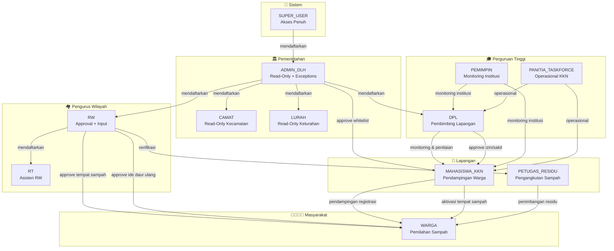
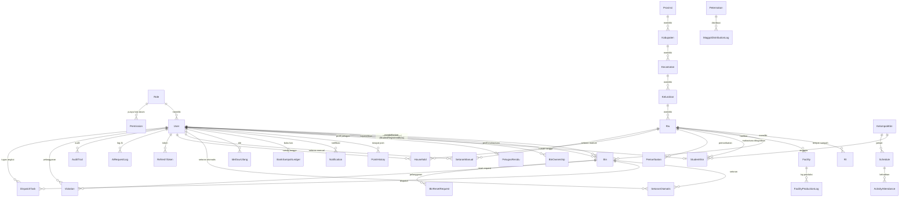
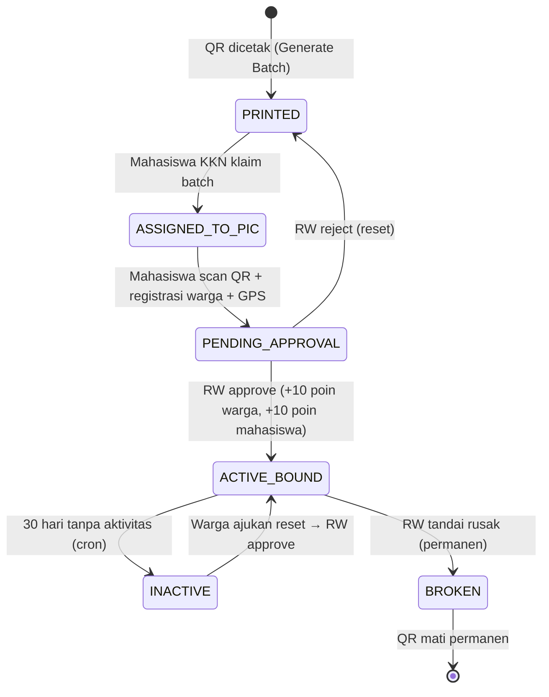
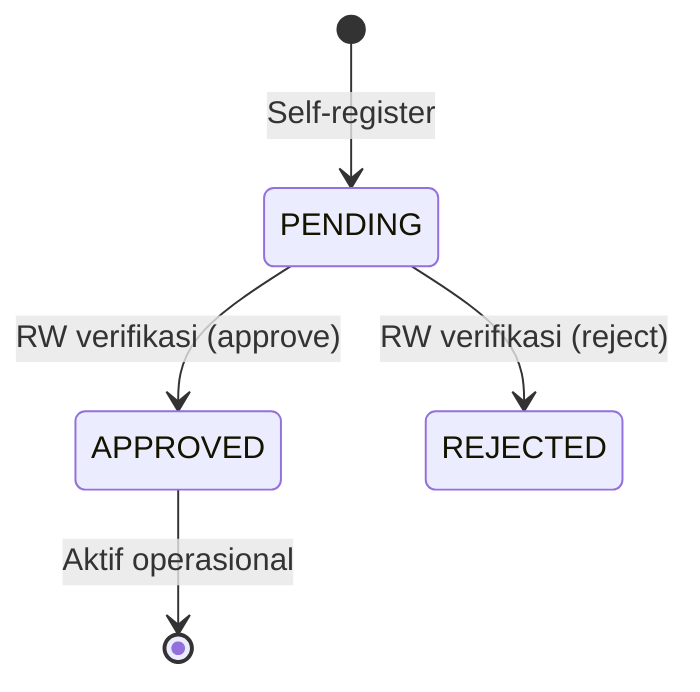
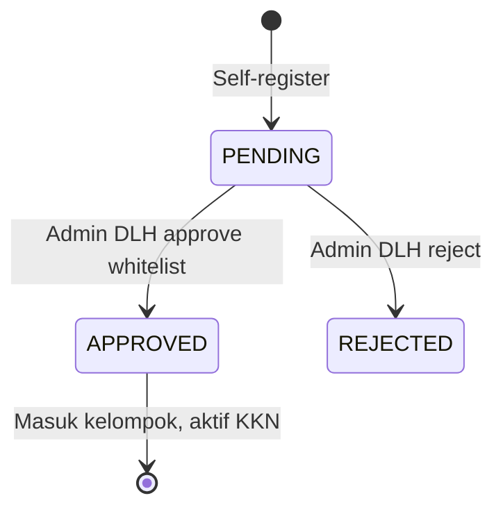
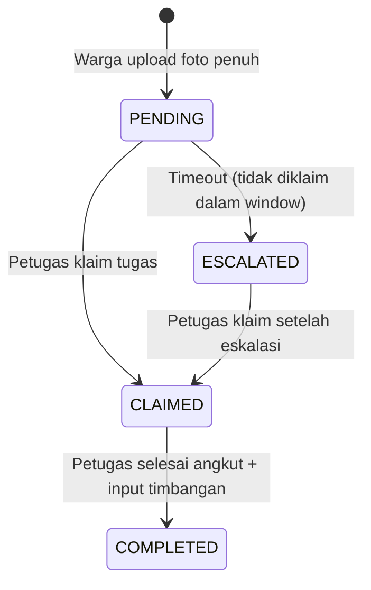
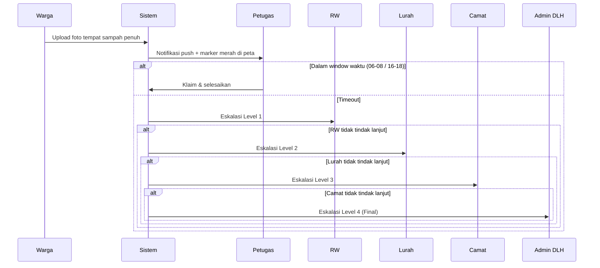
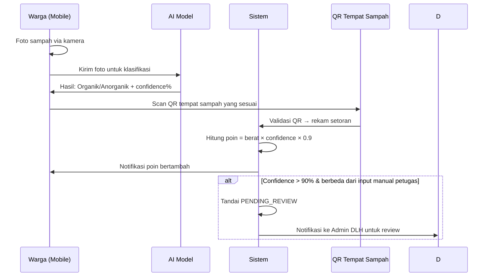

# 📋 ROLE MAPPING BERSEKA — Dokumentasi Komprehensif

> **Versi:** 1.0 — 10 Agustus 2026  
> **Proyek:** BERSEKA — Sistem Pemilahan Sampah Cerdas Terintegrasi  
> **Wilayah:** Kecamatan Coblong, Kota Bandung  
> **Maintainer:** Tim Full-Stack PT Makerindo  

---

## Daftar Isi

1. [Bab 1 — Hierarki & Relasi Antar Role](#bab-1--hierarki--relasi-antar-role)
2. [Bab 2 — Matriks Akses CRUD Per Role Per Resource](#bab-2--matriks-akses-crud-per-role-per-resource)
3. [Bab 3 — Fungsi & Fitur Detail Per Role](#bab-3--fungsi--fitur-detail-per-role)
4. [Bab 4 — Skema Master Data (Tabel, Kolom, Relasi)](#bab-4--skema-master-data-tabel-kolom-relasi)
5. [Bab 5 — Dashboard & Halaman Per Role](#bab-5--dashboard--halaman-per-role)
6. [Bab 6 — Matriks Fitur × Role (Cross-Reference)](#bab-6--matriks-fitur--role-cross-reference)
7. [Bab 7 — Struktur Sidebar Baru Per Role](#bab-7--struktur-sidebar-baru-per-role)
8. [Bab 8 — Rancangan Implementasi](#bab-8--rancangan-implementasi)

---

## Bab 1 — Hierarki & Relasi Antar Role

### 1.1 Daftar Seluruh Role (13 Role)

| # | Role ID | Nama Tampilan | Kategori | Auth Method | Platform Utama |
|---|---------|---------------|----------|-------------|----------------|
| 1 | `SUPER_USER` | Super User | Sistem | Email + Password | Web |
| 2 | `ADMIN_DLH` | Admin Dinas Lingkungan Hidup | Pemerintahan | Email + Password | Web |
| 3 | `CAMAT` | Camat (Admin Kecamatan) | Pemerintahan | Email + Password | Web |
| 4 | `LURAH` | Lurah (Admin Kelurahan) | Pemerintahan | Email + Password | Web |
| 5 | `RW` | Ketua RW (Rukun Warga) | Pengurus Wilayah | Email + Password | Web |
| 6 | `RT` | Ketua RT (Rukun Tetangga) | Pengurus Wilayah | Email + Password | Web |
| 7 | `DPL` | Dosen Pendamping Lapangan | Perguruan Tinggi | Email + Password | Web |
| 8 | `PEMIMPIN` | Pimpinan Perguruan Tinggi | Perguruan Tinggi | Email + Password | Web |
| 9 | `PANITIA_TASKFORCE` | Panitia / Task Force PT | Perguruan Tinggi | Email + Password | Web |
| 10 | `PETUGAS_RESIDU` | Petugas Residu (Pengangkut) | Lapangan | Email + Password | Mobile + Web Portal |
| 11 | `MAHASISWA_KKN` | Mahasiswa KKN | Lapangan | NIM/Phone + Password | Mobile + Web Portal |
| 12 | `WARGA` | Warga | Masyarakat | No HP (+62) + OTP/Password | Mobile |
| 13 | `DOSEN_PEMBIMBING` | *(Alias → DPL)* | — | — | — |

> **Catatan:** `DOSEN_PEMBIMBING` di-normalize menjadi `DPL` di middleware backend. Keduanya identik secara fungsional.

### 1.2 Diagram Hierarki Organisasi



### 1.3 Relasi Fungsional Antar Role

| Relasi | Role A → Role B | Fungsi |
|--------|-----------------|--------|
| **Registrasi Hierarkis** | SUPER_USER → ADMIN_DLH | Mendaftarkan akun Admin DLH |
| **Registrasi Hierarkis** | ADMIN_DLH → CAMAT | Mendaftarkan akun Camat |
| **Registrasi Hierarkis** | ADMIN_DLH → LURAH | Mendaftarkan akun Lurah |
| **Registrasi Hierarkis** | ADMIN_DLH → RW | Mendaftarkan akun RW |
| **Registrasi Hierarkis** | ADMIN_DLH → DPL | Mendaftarkan akun DPL |
| **Registrasi Hierarkis** | RW / ADMIN_DLH → RT | Mendaftarkan akun RT |
| **Whitelist KKN** | ADMIN_DLH → MAHASISWA_KKN | Approve/reject pendaftaran mahasiswa |
| **Verifikasi Petugas** | RW → PETUGAS_RESIDU | Verifikasi akun petugas residu |
| **Approval Tempat Sampah** | RW → WARGA | Menyetujui pengajuan aktivasi tempat sampah |
| **Approval Ide** | RW → WARGA | Menyetujui ide daur ulang warga (+50 poin) |
| **Pendampingan** | MAHASISWA_KKN → WARGA | Membantu registrasi & aktivasi tempat sampah |
| **Monitoring KKN** | DPL → MAHASISWA_KKN | Monitoring kehadiran & penilaian aktivitas |
| **Izin/Sakit** | DPL → MAHASISWA_KKN | Approve/reject pengajuan izin/sakit |
| **Monitoring Institusi** | PEMIMPIN → DPL, MHS | Pemantauan program KKN level institusi |
| **Operasional KKN** | PANITIA_TASKFORCE → DPL, MHS | Operasional & administrasi KKN |
| **Penimbangan** | PETUGAS_RESIDU → WARGA | Input timbangan residu dari tempat sampah warga |
| **Pelaporan Pelanggaran** | PETUGAS_RESIDU → WARGA | Mencatat pelanggaran pemilahan sampah |
| **Data-Scoping** | ADMIN_DLH: Seluruh Kota | Lihat data semua wilayah |
| **Data-Scoping** | CAMAT: 1 Kecamatan | Lihat data kecamatan saja |
| **Data-Scoping** | LURAH: 1 Kelurahan | Lihat data kelurahan saja |
| **Data-Scoping** | RW: 1 RW | Lihat dan kelola data RW sendiri |
| **Diskrepansi AI** | ADMIN_DLH | Resolve diskrepansi AI (confidence >90%) |
| **QR Batch** | ADMIN_DLH | Generate dan assign batch QR ke PIC |

### 1.4 Aturan Akses Read-Only (readOnlyGuard)

Role **ADMIN_DLH**, **CAMAT**, dan **LURAH** memiliki akses **Read-Only**. Operasi tulis (POST, PUT, DELETE, PATCH) ditolak 403 KECUALI:

| Exception | Role | Method | Endpoint |
|-----------|------|--------|----------|
| Resolve Diskrepansi AI | ADMIN_DLH | PUT | `/waste/logs/:id/resolve` |
| Registrasi Staff | ADMIN_DLH | POST | `/auth/register/(camat\|lurah\|rw\|petugas-residu)` |
| Approve KKN Whitelist | ADMIN_DLH | PATCH/PUT | `/auth/kkn/whitelist/:id` |
| QR Batch Management | ADMIN_DLH | POST/PUT/PATCH | `/bins/generate-qr`, `/bins/qr-batch` |
| Kelola Notifikasi | Semua | * | `/notifications/*` |
| Update Profil | Semua | * | `/auth/profile`, `/auth/password` |

---

## Bab 2 — Matriks Akses CRUD Per Role Per Resource

### 2.1 Legenda

- ✅ = Punya akses
- ❌ = Tidak punya akses
- 👁️ = Read-Only
- 🔒 = Dengan batasan/scope tertentu

### 2.2 Matriks CRUD — Resource Utama

#### A. User Management

| Resource | SUPER_USER | ADMIN_DLH | CAMAT | LURAH | RW | RT | DPL | PEMIMPIN | PANITIA_TF | PETUGAS | MHS_KKN | WARGA |
|----------|-----------|-----------|-------|-------|----|----|-----|----------|------------|---------|---------|-------|
| **List Users** | ✅ CRUD | ✅ R + Register | 👁️ R | 👁️ R | 👁️ R scope RW | ❌ | 👁️ R scope DPL | ✅ R | ✅ R | ❌ | ❌ | ❌ |
| **Register Admin DLH** | ✅ C | ❌ | ❌ | ❌ | ❌ | ❌ | ❌ | ❌ | ❌ | ❌ | ❌ | ❌ |
| **Register Camat** | ❌ | ✅ C | ❌ | ❌ | ❌ | ❌ | ❌ | ❌ | ❌ | ❌ | ❌ | ❌ |
| **Register Lurah** | ❌ | ✅ C | ❌ | ❌ | ❌ | ❌ | ❌ | ❌ | ❌ | ❌ | ❌ | ❌ |
| **Register RW** | ❌ | ✅ C | ❌ | ❌ | ❌ | ❌ | ❌ | ❌ | ❌ | ❌ | ❌ | ❌ |
| **Register RT** | ❌ | ✅ C | ❌ | ❌ | ✅ C | ❌ | ❌ | ❌ | ❌ | ❌ | ❌ | ❌ |
| **Register DPL** | ❌ | ✅ C | ❌ | ❌ | ❌ | ❌ | ❌ | ❌ | ❌ | ❌ | ❌ | ❌ |
| **Register Petugas** | ❌ | ❌ | ❌ | ❌ | ❌ | ❌ | ❌ | ❌ | ❌ | ✅ Self | ❌ | ❌ |
| **Register Warga** | ❌ | ❌ | ❌ | ❌ | ❌ | ❌ | ❌ | ❌ | ❌ | ❌ | ✅ C (bantu) | ✅ Self |
| **Register MHS KKN** | ❌ | ❌ | ❌ | ❌ | ❌ | ❌ | ❌ | ❌ | ❌ | ❌ | ✅ Self | ❌ |
| **Online Users** | ✅ R + Force Logout | ❌ | ❌ | ❌ | ❌ | ❌ | ❌ | ❌ | ❌ | ❌ | ❌ | ❌ |

#### B. Tempat Sampah (Bin)

| Resource | SUPER_USER | ADMIN_DLH | CAMAT | LURAH | RW | RT | DPL | PEMIMPIN | PANITIA_TF | PETUGAS | MHS_KKN | WARGA |
|----------|-----------|-----------|-------|-------|----|----|-----|----------|------------|---------|---------|-------|
| **List Bins** | ✅ R | ✅ R | 👁️ R | 👁️ R | ✅ R scope | ✅ R scope | ❌ | ✅ R | ✅ R | ✅ R scope | ✅ R scope | ✅ R milik |
| **Create Bin** | ✅ C | ✅ C | ❌ | ❌ | ❌ | ❌ | ❌ | ❌ | ❌ | ❌ | ✅ C (registrasi) | ✅ C (registrasi) |
| **Update Bin** | ✅ U | ✅ U | ❌ | ❌ | ❌ | ❌ | ❌ | ❌ | ❌ | ❌ | ❌ | ❌ |
| **Delete Bin** | ✅ D | ✅ D | ❌ | ❌ | ❌ | ❌ | ❌ | ❌ | ❌ | ❌ | ❌ | ❌ |
| **Mark Broken** | ✅ | ✅ | ❌ | ❌ | ✅ | ❌ | ❌ | ❌ | ❌ | ❌ | ❌ | ❌ |
| **Approve Bin (PENDING→ACTIVE)** | ✅ | ❌ | ❌ | ❌ | ✅ | ✅ | ❌ | ❌ | ❌ | ❌ | ❌ | ❌ |
| **Reject Bin** | ✅ | ❌ | ❌ | ❌ | ✅ | ✅ | ❌ | ❌ | ❌ | ❌ | ❌ | ❌ |
| **Generate QR Batch** | ✅ | ✅ | ❌ | ❌ | ❌ | ❌ | ❌ | ❌ | ❌ | ❌ | ❌ | ❌ |
| **Reactivate Bin** | ✅ | ✅ | ❌ | ❌ | ❌ | ❌ | ❌ | ❌ | ❌ | ❌ | ❌ | ❌ |
| **Scan QR (aktivasi)** | ❌ | ❌ | ❌ | ❌ | ❌ | ❌ | ❌ | ❌ | ❌ | ❌ | ✅ | ❌ |
| **Scan QR (setoran)** | ❌ | ❌ | ❌ | ❌ | ❌ | ❌ | ❌ | ❌ | ❌ | ❌ | ❌ | ✅ |

#### C. Setoran & Residu

| Resource | SUPER_USER | ADMIN_DLH | CAMAT | LURAH | RW | RT | DPL | PEMIMPIN | PANITIA_TF | PETUGAS | MHS_KKN | WARGA |
|----------|-----------|-----------|-------|-------|----|----|-----|----------|------------|---------|---------|-------|
| **Setoran Otomatis (AI)** | 👁️ R | 👁️ R | 👁️ R | 👁️ R | 👁️ R | 👁️ R | ❌ | 👁️ R | 👁️ R | 👁️ R | ❌ | ✅ C (foto + scan) |
| **Setoran Manual (Residu)** | 👁️ R | 👁️ R | ❌ | ❌ | 👁️ R (monitoring) | ❌ | ❌ | ❌ | ❌ | ✅ CR | ❌ | ❌ |
| **Rekap Setoran** | ✅ R | ✅ R | 👁️ R | 👁️ R | ✅ R scope | ✅ R scope | ✅ R | ✅ R | ✅ R | ✅ R scope | ✅ R | ❌ |
| **Input Timbangan** | ❌ | ❌ | ❌ | ❌ | ❌ | ❌ | ❌ | ❌ | ❌ | ✅ C | ❌ | ❌ |
| **Pelanggaran** | 👁️ R | 👁️ R | ❌ | ❌ | ❌ | ❌ | ❌ | ❌ | ❌ | ✅ C | ❌ | ❌ |

#### D. Wilayah & Fasilitas

| Resource | SUPER_USER | ADMIN_DLH | CAMAT | LURAH | RW | RT | DPL | PEMIMPIN | PANITIA_TF | PETUGAS | MHS_KKN | WARGA |
|----------|-----------|-----------|-------|-------|----|----|-----|----------|------------|---------|---------|-------|
| **Master Wilayah** | ✅ CRUD | ✅ R | 👁️ R | 👁️ R | 👁️ R | 👁️ R | ❌ | ✅ R | ✅ R | ❌ | ❌ | ❌ |
| **Fasilitas** | ✅ CRUD | ✅ R | 👁️ R | 👁️ R | ✅ CRUD scope | ✅ CR scope | ❌ | ❌ | ❌ | ❌ | ✅ C (bantu input) | ❌ |
| **Produksi Fasilitas** | ✅ CR | ✅ R | 👁️ R | 👁️ R | ✅ CR scope | ✅ CR scope | ❌ | ❌ | ❌ | ❌ | ❌ | ❌ |
| **Pemanfaatan Sampah** | ✅ CRUD | ✅ R | 👁️ R | 👁️ R | ✅ CRUD scope | ✅ CR scope | ❌ | ✅ R | ✅ R | ❌ | ✅ C | ❌ |
| **Peternakan** | ✅ CR | ✅ R | ❌ | ❌ | ❌ | ❌ | ❌ | ❌ | ❌ | ❌ | ❌ | ❌ |

#### E. KKN & Akademik

| Resource | SUPER_USER | ADMIN_DLH | CAMAT | LURAH | RW | RT | DPL | PEMIMPIN | PANITIA_TF | PETUGAS | MHS_KKN | WARGA |
|----------|-----------|-----------|-------|-------|----|----|-----|----------|------------|---------|---------|-------|
| **Kelompok KKN** | ✅ CRUD | ✅ R | ❌ | ❌ | ❌ | ❌ | ✅ R scope | ✅ R | ✅ R | ❌ | ✅ R milik | ❌ |
| **Whitelist KKN** | ✅ R | ✅ RU (approve) | ❌ | ❌ | ❌ | ❌ | ❌ | ❌ | ❌ | ❌ | ❌ | ❌ |
| **Kehadiran KKN** | ✅ R | ✅ R | 👁️ R | 👁️ R | ✅ R | ✅ R | ✅ R scope | ✅ R | ✅ R | ❌ | ✅ C (check-in) | ❌ |
| **Penilaian Mahasiswa** | ✅ R | ❌ | ❌ | ❌ | ❌ | ❌ | ✅ CRU scope | ✅ R | ✅ R | ❌ | 👁️ R milik | ❌ |
| **Izin/Sakit Mahasiswa** | ✅ R | ❌ | ❌ | ❌ | ❌ | ❌ | ✅ RU (decide) | ✅ R | ✅ R | ❌ | ✅ C | ❌ |
| **Handover KKN** | ✅ CRU | ❌ | ❌ | ❌ | ❌ | ❌ | ❌ | ❌ | ❌ | ❌ | ✅ C | ❌ |
| **Jadwal/Schedule** | ✅ CRUD | ✅ R | 👁️ R | 👁️ R | ✅ R | ✅ R | ✅ R | ✅ R | ✅ R | ❌ | ✅ R | ❌ |

#### F. Gamifikasi & Sosial

| Resource | SUPER_USER | ADMIN_DLH | CAMAT | LURAH | RW | RT | DPL | PEMIMPIN | PANITIA_TF | PETUGAS | MHS_KKN | WARGA |
|----------|-----------|-----------|-------|-------|----|----|-----|----------|------------|---------|---------|-------|
| **Leaderboard** | ✅ R | ✅ R | ✅ R | ✅ R | ✅ R | ✅ R | ✅ R | ✅ R | ✅ R | ✅ R | ✅ R | ✅ R |
| **Poin Warga** | ✅ R | ✅ R | ✅ R | ✅ R | ✅ R | ✅ R | ✅ R | ✅ R | ✅ R | ❌ | ❌ | ✅ R milik |
| **Ide Daur Ulang (submit)** | ✅ C | ✅ C | ❌ | ❌ | ✅ C | ✅ C | ❌ | ❌ | ❌ | ❌ | ❌ | ✅ C |
| **Ide Daur Ulang (approve)** | ✅ | ❌ | ❌ | ❌ | ✅ | ✅ | ❌ | ❌ | ❌ | ❌ | ❌ | ❌ |
| **Flash Drop Event** | ✅ CRUD | ❌ | ❌ | ❌ | ❌ | ❌ | ❌ | ❌ | ❌ | ❌ | ❌ | ❌ |

#### G. Sistem & Konfigurasi

| Resource | SUPER_USER | ADMIN_DLH | CAMAT | LURAH | RW | RT | DPL | PEMIMPIN | PANITIA_TF | PETUGAS | MHS_KKN | WARGA |
|----------|-----------|-----------|-------|-------|----|----|-----|----------|------------|---------|---------|-------|
| **System Config** | ✅ CRUD | 👁️ R | ❌ | ❌ | ❌ | ❌ | ❌ | ❌ | ❌ | ❌ | ❌ | ❌ |
| **Audit Trail** | ✅ R | ❌ | ❌ | ❌ | ❌ | ❌ | ❌ | ❌ | ❌ | ❌ | ❌ | ❌ |
| **Role/Permission (RBAC)** | ✅ CRUD | ❌ | ❌ | ❌ | ❌ | ❌ | ❌ | ❌ | ❌ | ❌ | ❌ | ❌ |
| **Simulasi Model AI** | ✅ R | ✅ R | ❌ | ❌ | ❌ | ❌ | ❌ | ❌ | ❌ | ❌ | ❌ | ❌ |
| **Review Diskrepansi AI** | ✅ R | ✅ RU | ❌ | ❌ | ❌ | ❌ | ❌ | ✅ R | ❌ | ❌ | ❌ | ❌ |
| **Notifikasi** | ✅ CRUD | ✅ CRUD | ✅ CRUD | ✅ CRUD | ✅ CRUD | ✅ CRUD | ✅ CRUD | ✅ CRUD | ✅ CRUD | ✅ CRUD | ✅ CRUD | ✅ CRUD |
| **Pengaturan Profil** | ✅ RU | ✅ RU | ✅ RU | ✅ RU | ✅ RU | ✅ RU | ✅ RU | ✅ RU | ✅ RU | ✅ RU | ✅ RU | ✅ RU |

---

## Bab 3 — Fungsi & Fitur Detail Per Role

### 3.1 SUPER_USER — Administrator Sistem

**Deskripsi:** Memiliki akses penuh ke seluruh sistem tanpa batasan. Bertanggung jawab atas konfigurasi teknis, audit, dan pengelolaan master data.

**Fitur Utama:**
1. **Dashboard Agregat** — Melihat ringkasan KPI seluruh kecamatan
2. **Manajemen Pengguna** — CRUD seluruh user dari semua role
3. **Rule Engine** — Kelola konfigurasi sistem (`system_configs`)
4. **Hak Akses (RBAC)** — Kelola permission per role per resource secara dinamis
5. **Audit Trail** — Lihat seluruh jejak perubahan data (immutable log)
6. **Master QR & Inaktif** — Generate batch QR, reactivate tempat sampah inaktif
7. **Review Diskrepansi AI** — Mereview semua setoran yang flagged oleh AI
8. **Manajemen Tempat Sampah** — Full CRUD + replace broken bin
9. **Master Wilayah** — CRUD hierarki Provinsi → Kabupaten → Kecamatan → Kelurahan → RW → RT
10. **Pengguna Online** — Monitor real-time users via RefreshToken + force logout
11. **Handover KKN** — Kelola serah terima antar gelombang mahasiswa
12. **Data Cleansing** — Purge duplicate data
13. **Circular Economy Report** — Laporan ekonomi sirkular
14. **Flash Drop Event** — Buat event pembuangan sampah dadakan berhadiah

**Relasi dengan Role Lain:**
- Mendaftarkan → ADMIN_DLH
- Mengawasi → Seluruh role

---

### 3.2 ADMIN_DLH — Dinas Lingkungan Hidup

**Deskripsi:** Role pemerintahan level kota dengan akses Read-Only + beberapa pengecualian operasi tulis. Data-scoping: seluruh kecamatan.

**Fitur Utama:**
1. **Dashboard KPI Kota** — Monitoring keseluruhan kecamatan
2. **Registrasi Pejabat** — Mendaftarkan Camat, Lurah, RW, DPL
3. **Whitelist KKN** — Approve/reject pendaftaran mahasiswa KKN
4. **QR Batch Management** — Generate dan assign batch QR ke PIC mahasiswa
5. **Review Diskrepansi AI** — Resolve konflik klasifikasi AI vs manual petugas
6. **Monitoring Wilayah** — Peta & grafik timbulan sampah per kelurahan
7. **Monitoring Absen KKN** — Lihat kehadiran seluruh mahasiswa
8. **Simulasi Model AI** — Test klasifikasi sampah AI
9. **Rekap Setoran** — Laporan setoran per wilayah
10. **Laporan Analitik** — Chart komposisi & akurasi pemilahan
11. **Ekspor Dataset** — Download CSV/Excel untuk laporan

**Pengecualian Read-Only:**
- POST registrasi staff (Camat, Lurah, RW, Petugas)
- PATCH/PUT approve KKN whitelist
- POST/PUT/PATCH generate QR batch
- PUT resolve diskrepansi AI

**Relasi:** Mendaftarkan → Camat, Lurah, RW, DPL | Approve whitelist → Mahasiswa KKN

---

### 3.3 CAMAT — Admin Kecamatan

**Deskripsi:** Role monitoring Read-Only level kecamatan. Data-scoping: 1 kecamatan saja.

**Fitur Utama:**
1. **Dashboard KPI Kecamatan** — Monitoring 1 kecamatan
2. **Monitoring Wilayah** — Peta & grafik untuk kelurahan di kecamatannya
3. **Monitoring Absen KKN** — Lihat kehadiran di kecamatannya
4. **Rekap Setoran** — Laporan setoran di kecamatannya
5. **Laporan Analitik** — Chart kecamatan
6. **Leaderboard** — Lihat ranking semua wilayah
7. **Manajemen Tempat Sampah** — Lihat data (read-only)
8. **Pengangkutan Sampah** — Monitoring status pengangkutan

**Relasi:** Dipantau oleh → ADMIN_DLH | Menerima eskalasi dari → Lurah

---

### 3.4 LURAH — Admin Kelurahan

**Deskripsi:** Role monitoring Read-Only level kelurahan. Data-scoping: 1 kelurahan saja.

**Fitur Utama:**
1. **Dashboard KPI Kelurahan** — Monitoring 1 kelurahan
2. **Monitoring Wilayah** — Peta kelurahan dengan detail RW
3. **Monitoring Absen KKN** — Lihat kehadiran di kelurahannya
4. **Rekap Setoran** — Laporan setoran kelurahan
5. **Laporan Analitik** — Chart kelurahan
6. **Leaderboard** — Lihat ranking
7. **Monitoring Aktivitas** — Lihat aktivitas di kelurahan
8. **Pengangkutan Sampah** — Monitoring pengangkutan

**Relasi:** Dipantau oleh → CAMAT | Menerima eskalasi dari → RW

---

### 3.5 RW — Ketua Rukun Warga

**Deskripsi:** Role operasional di tingkat wilayah dengan hak tulis terbatas di scope wilayah RW-nya.

**Fitur Utama:**
1. **Dashboard RW** — Statistik ringkasan wilayah
2. **Approval Tempat Sampah** — Approve/reject pengajuan aktivasi tempat sampah warga
3. **Verifikasi Petugas** — Approve/reject akun petugas residu
4. **Approval Ide Daur Ulang** — Approve/reject ide warga (+50 poin)
5. **Verifikasi Fasilitas** — Approve/reject registrasi fasilitas
6. **Input Fasilitas & Produksi** — Catat material masuk & hasil panen
7. **Mark Broken** — Menandai tempat sampah rusak permanen
8. **Monitoring Residu** — Pantau setoran petugas residu terikat RW
9. **Pemanfaatan Sampah** — Input data pemanfaatan (Loseda, Maggot, POC, dll.)
10. **Ide Daur Ulang** — Submit dan approve ide
11. **Monitoring Wilayah** — Peta RW

**Relasi:** Dipantau oleh → Lurah | Approve → Warga, Petugas | Eskalasi ke → Lurah

---

### 3.6 RT — Ketua Rukun Tetangga

**Deskripsi:** Asisten RW dengan scope lebih kecil (level RT). Memiliki kemampuan serupa RW tapi terbatas wilayah RT-nya.

**Fitur Utama:**
1. **Dashboard RT** — Sama dengan RW tapi scope RT
2. **Approval Tempat Sampah** — Approve/reject di wilayah RT
3. **Input Fasilitas** — Bantu catat fasilitas di wilayah
4. **Produksi Fasilitas** — Input laporan produksi
5. **Monitoring Wilayah** — Peta RT
6. **Pemanfaatan Sampah** — Input data
7. **Ide Daur Ulang** — Approve/reject dan submit

**Relasi:** Dipantau oleh → RW | Mendaftarkan bisa oleh → RW, ADMIN_DLH

---

### 3.7 DPL — Dosen Pembimbing Lapangan

**Deskripsi:** Role perguruan tinggi untuk pembimbingan dan evaluasi mahasiswa KKN.

**Fitur Utama:**
1. **Dashboard KKN** — Ringkasan kelompok bimbingan
2. **Kelompok KKN** — Lihat kelompok yang dibimbing
3. **Portofolio Mahasiswa** — Detail mahasiswa (NIM, jurusan, skor, aktivitas)
4. **Penilaian Mahasiswa** — Submit assessment score mahasiswa
5. **Approval Izin/Sakit** — Decide pengajuan izin/sakit mahasiswa
6. **Peta Cakupan** — Sebaran polygon RW & titik koordinat bin KKN
7. **Alert & Notifikasi** — Notifikasi terkait mahasiswa bimbingan
8. **Riwayat Approval** — Histori keputusan logbook
9. **Monitoring Absen** — Kehadiran mahasiswa bimbingan
10. **Warga Dampingan** — Lihat warga yang didampingi per mahasiswa

**Relasi:** Membimbing → Mahasiswa KKN | Dipantau oleh → PEMIMPIN, PANITIA_TASKFORCE

---

### 3.8 PEMIMPIN — Pimpinan Perguruan Tinggi

**Deskripsi:** Role monitoring level institusi perguruan tinggi. Memiliki akses luas untuk oversight program KKN.

**Fitur Utama:**
1. **Dashboard Utama** — Overview seluruh program
2. **Dashboard KKN** — Monitoring semua kelompok KKN
3. **Manajemen Pengguna** — Lihat semua user (read)
4. **Master Wilayah** — Lihat data wilayah
5. **Monitoring Absen** — Kehadiran semua mahasiswa
6. **Manajemen Tempat Sampah** — Lihat data
7. **Rekap Setoran** — Lihat laporan
8. **Laporan Analitik** — Chart analitik
9. **Review Diskrepansi** — Lihat hasil review AI
10. **Pengguna Online** — Monitor real-time

**Relasi:** Mengawasi → DPL, Mahasiswa KKN, PANITIA_TASKFORCE

---

### 3.9 PANITIA_TASKFORCE — Task Force Perguruan Tinggi

**Deskripsi:** Role operasional KKN dari sisi perguruan tinggi. Memiliki akses serupa PEMIMPIN.

**Fitur Utama:** *(Identik dengan PEMIMPIN — lihat 3.8)*

**Relasi:** Koordinasi → DPL, Mahasiswa KKN | Dipantau oleh → PEMIMPIN

---

### 3.10 PETUGAS_RESIDU — Pengangkut Sampah

**Deskripsi:** Role lapangan untuk pengangkutan dan penimbangan residu. Harus diverifikasi RW sebelum aktif.

**Platform:** Mobile (utama) + Web Portal (`/residu-portal`)

**Fitur Utama:**
1. **Dashboard Residu** — Ringkasan monitoring timbulan & penjemputan
2. **Jadwal Harian** — Antrian pengangkutan hari ini (06:00–08:00, 16:00–18:00)
3. **Pending Logs** — Tempat sampah yang perlu ditimbang/diangkut
4. **Submit Log Timbangan** — Input manual berat dari timbangan industri + foto bukti
5. **Catat Pelanggaran** — Lapor pelanggaran pemilahan warga + foto bukti
6. **Analitik Residu** — Grafik timbulan per wilayah
7. **Riwayat Setoran** — Histori penimbangan

**State Machine:**
1. Self-register → status `PENDING`
2. RW verifikasi → status `APPROVED` → aktif
3. Jika ditolak → `REJECTED`

**Relasi:** Diverifikasi oleh → RW | Menimbang residu → Warga | Dispatch dari → Sistem otomatis

---

### 3.11 MAHASISWA_KKN — Mahasiswa KKN

**Deskripsi:** Role lapangan untuk pendampingan warga dalam program KKN. Harus di-whitelist ADMIN_DLH.

**Platform:** Mobile (utama) + Web Portal (`/kkn-portal`)

**Fitur Utama:**
1. **Dashboard KKN** — Statistik progress penugasan
2. **Validasi QR Master** — Scan QR saat serah terima batch
3. **Klaim Batch QR** — Klaim batch QR yang di-assign
4. **Registrasi Warga** — Bantu daftarkan akun warga di lapangan (+10 poin masing-masing)
5. **Aktivasi Tempat Sampah** — Scan QR + GPS untuk aktivasi bin warga
6. **Warga Dampingan** — Daftar warga yang didampingi
7. **Location Ping** — Ping GPS real-time (interval 5–10 menit)
8. **Check-in/Check-out Absen** — Absensi kehadiran GPS + polygon
9. **Pengajuan Izin/Sakit** — Submit izin + upload foto bukti ke DPL
10. **Info Kelompok** — Lihat kelompok, anggota, DPL pembimbing
11. **Zona Aktif** — Batas wilayah penugasan (polygon)
12. **Input Fasilitas** — Bantu data fasilitas warga
13. **Pemanfaatan Sampah** — Catat pemanfaatan (Loseda/Maggot/Kompos)
14. **Activity Log** — Logbook kegiatan lapangan
15. **Handover** — Serah terima wilayah antar gelombang

**State Machine Whitelist:**
1. Self-register → `PENDING`
2. ADMIN_DLH approve → `APPROVED` → masuk kelompok
3. ADMIN_DLH reject → `REJECTED`

**Relasi:** Dibimbing oleh → DPL | Mendampingi → Warga | Diawasi oleh → PEMIMPIN, PANITIA_TASKFORCE

---

### 3.12 WARGA — Masyarakat

**Deskripsi:** Pengguna akhir sistem. Melakukan pemilahan dan setoran sampah harian.

**Platform:** Mobile (utama, prioritas)

**Fitur Utama:**
1. **Dashboard Warga** — Ringkasan poin, setoran, tempat sampah
2. **Foto Sampah + AI** — Foto sampah → klasifikasi AI → arahkan ke tempat sampah yang sesuai
3. **Scan QR Tempat Sampah** — Scan QR untuk mencatat setoran
4. **Riwayat Setoran** — Histori pembuangan sampah
5. **Poin & Leaderboard** — Lihat poin dan ranking
6. **Ide Daur Ulang** — Submit ide (disetujui RW → +50 poin)
7. **Notifikasi** — Pemberitahuan status tempat sampah, poin, jadwal
8. **Profil & Pengaturan** — Edit profil, ubah password
9. **Pengajuan Aktivasi Ulang** — Jika tempat sampah inaktif (30 hari tanpa aktivitas)

**State Machine Tempat Sampah:**
1. QR dicetak → `PRINTED`
2. Mahasiswa scan → `ASSIGNED_TO_PIC`
3. Registrasi warga → `PENDING_APPROVAL`
4. RW approve → `ACTIVE_BOUND`
5. 30 hari tanpa aktivitas → `INACTIVE`
6. RW mark rusak → `BROKEN` (permanen)

**Relasi:** Didampingi oleh → Mahasiswa KKN | Tempat sampah diapprove oleh → RW | Residu ditimbang oleh → Petugas Residu

---

## Bab 4 — Skema Master Data (Tabel, Kolom, Relasi)

### 4.1 Entity-Relationship Diagram



### 4.2 Daftar Seluruh Tabel (34 Model Prisma)

#### Grup 1: Role & Permission (RBAC)

##### Tabel `peran` (Role)
| Kolom | Tipe | Keterangan |
|-------|------|------------|
| `id` | Int (PK, auto) | ID role |
| `nama` | String (unique) | Nama role |
| `dibuat_pada` | DateTime | Timestamp dibuat |
| `diperbarui_pada` | DateTime | Timestamp update |
| **Relasi** | `users` → User[] | User dengan role ini |
| **Relasi** | `permissions` → Permission[] | Hak akses role |

##### Tabel `hak_akses` (Permission)
| Kolom | Tipe | Keterangan |
|-------|------|------------|
| `id` | Int (PK) | |
| `id_peran` | Int (FK → Role) | Role pemilik |
| `resource` | String | Nama resource (e.g. "bins", "users") |
| `bisa_lihat` | Boolean | Can View |
| `bisa_buat` | Boolean | Can Create |
| `bisa_edit` | Boolean | Can Edit |
| `bisa_hapus` | Boolean | Can Delete |
| `diperbarui_pada` | DateTime | |
| **Constraint** | Unique(id_peran, resource) | 1 permission per role per resource |

---

#### Grup 2: Hierarki Wilayah

##### Tabel `provinsi` (Provinsi)
| Kolom | Tipe | Keterangan |
|-------|------|------------|
| `id` | Int (PK) | |
| `nama` | String (unique) | Nama provinsi |
| **Relasi** | → Kabupaten[] | |

##### Tabel `kabupaten` (Kabupaten)
| Kolom | Tipe | Keterangan |
|-------|------|------------|
| `id` | Int (PK) | |
| `id_provinsi` | Int (FK) | |
| `nama` | String | |
| **Constraint** | Unique(id_provinsi, nama) | |
| **Relasi** | → Kecamatan[] | |

##### Tabel `kecamatan` (Kecamatan)
| Kolom | Tipe | Keterangan |
|-------|------|------------|
| `id` | Int (PK) | |
| `id_kabupaten` | Int (FK) | |
| `nama` | String | |
| **Constraint** | Unique(id_kabupaten, nama) | |
| **Relasi** | → Kelurahan[] | |

##### Tabel `kelurahan` (Kelurahan)
| Kolom | Tipe | Keterangan |
|-------|------|------------|
| `id` | UUID (PK) | |
| `id_kecamatan` | Int? (FK) | Nullable |
| `nama` | String (unique) | |
| **Relasi** | → Rw[], Bin[] | |

##### Tabel `rw` (Rw)
| Kolom | Tipe | Keterangan |
|-------|------|------------|
| `id` | Int (PK) | |
| `id_kelurahan` | String (FK) | |
| `nama` | String | Contoh: "RW 06" |
| `latitude` | Decimal(11,8)? | Koordinat GPS |
| `longitude` | Decimal(11,8)? | |
| `id_petugas_residu` | String? (FK, unique) | Petugas terikat |
| **Relasi** | → Rt[], User[], Bin[], Facility[], StudentKkn[], Pemanfaatan[], Household[], SetoranManual[], KknHandoverHistory[] | |

##### Tabel `rt` (Rt)
| Kolom | Tipe | Keterangan |
|-------|------|------------|
| `id` | Int (PK) | |
| `id_rw` | Int (FK) | |
| `nama` | String | |
| **Relasi** | → User[] | |

---

#### Grup 3: User & Auth

##### Tabel `pengguna` (User)
| Kolom | Tipe | Keterangan |
|-------|------|------------|
| `id` | UUID (PK) | |
| `nama` | String | Nama lengkap |
| `kata_sandi` | String | Hash bcrypt |
| `token_fcm` | String? | Firebase push token |
| `id_peran` | Int (FK → Role) | Role user |
| `foto_profil` | String? | URL foto |
| `id_rw` | Int? (FK → Rw) | RW terkait |
| `id_rt` | Int? (FK → Rt) | RT terkait |
| `status` | String (default "Aktif") | Status akun |
| `alamat` | String? | Alamat |
| `no_telepon` | String (unique) | No HP +62 |
| `harus_ganti_password` | Boolean | Force change pw |
| `subtipe_warga` | String? | Sub-tipe warga |
| **Relasi** | → *Lihat diagram ER* | 25+ relasi |

##### Tabel `token_penyegar` (RefreshToken)
| Kolom | Tipe | Keterangan |
|-------|------|------------|
| `id` | UUID (PK) | |
| `id_pengguna` | String (FK) | |
| `token` | String (unique) | JWT refresh token |
| `kedaluwarsa_pada` | DateTime | Expiry |

##### Tabel `kode_otp` (OtpCode)
| Kolom | Tipe | Keterangan |
|-------|------|------------|
| `id` | UUID (PK) | |
| `phone` | String | No telepon |
| `code` | String | Kode OTP 6 digit |
| `kedaluwarsa_pada` | DateTime | |
| `used` | Boolean | Sudah dipakai? |

---

#### Grup 4: Rumah Tangga

##### Tabel `rumah_tangga` (Household)
| Kolom | Tipe | Keterangan |
|-------|------|------------|
| `id` | UUID (PK) | |
| `id_pengguna` | String (FK) | Pemilik |
| `address` | String | Alamat lengkap |
| `id_rw` | Int (FK) | RW lokasi |
| `latitude` | Decimal(11,8) | GPS |
| `longitude` | Decimal(11,8) | GPS |

---

#### Grup 5: Sampah & Tempat Sampah

##### Tabel `kategori_sampah` (WasteCategory)
| Kolom | Tipe | Keterangan |
|-------|------|------------|
| `id` | UUID (PK) | |
| `nama` | String (unique) | "Organik" / "Anorganik" |
| `poin_per_kg` | Int | Konversi poin |
| `description` | String? | |
| **Relasi** | → Bin[] | |

##### Tabel `gelombang_qr` (QrBatch)
| Kolom | Tipe | Keterangan |
|-------|------|------------|
| `id` | UUID (PK) | |
| `kode_gelombang` | String (unique) | Kode batch |
| `status` | String | Status batch |
| `id_pengguna_pic_ditugaskan` | String? (FK) | PIC mahasiswa |
| `total_qr` | Int | Jumlah QR |
| `dicetak_pada` | DateTime | |
| **Relasi** | → Bin[] | |

##### Tabel `tempat_sampah` (Bin)
| Kolom | Tipe | Keterangan |
|-------|------|------------|
| `id` | UUID (PK) | |
| `kode_qr` | String (unique) | QR code unik |
| `id_kategori` | String? (FK) | Organik/Anorganik |
| `maks_kapasitas_liter` | Decimal(5,2) | Default 25.0 |
| `volume_sekarang_liter` | Decimal(5,2) | Volume saat ini |
| `id_rw` | Int? (FK) | Lokasi RW |
| `id_kelurahan` | String? (FK) | Lokasi kelurahan |
| `latitude` | Decimal(11,8)? | GPS |
| `longitude` | Decimal(11,8)? | GPS |
| `id_gelombang_qr` | String? (FK) | Batch QR asal |
| `status` | Enum BinStatus | PRINTED → ASSIGNED_TO_PIC → PENDING_APPROVAL → ACTIVE_BOUND → INACTIVE / BROKEN |
| `id_pengguna` | String? (FK) | Pemilik warga |
| `bentuk` | String? | Bentuk Tempat Sampah |
| `diameter` | Decimal(5,2)? | |
| `lebar` | Decimal(5,2)? | |
| `panjang` | Decimal(5,2)? | |
| `tinggi` | Decimal(5,2)? | |
| `tipe_wadah` | String? | Tipe Tempat Sampah |
| `id_mahasiswa_pendaftar` | String? (FK) | Mahasiswa pendaftar |
| **Relasi** | → BinOwnership[], Violation[], BinResetRequest[], SetoranOtomatis[], DispatchTask[] | |

##### Tabel `kepemilikan_tempat_sampah` (BinOwnership)
| Kolom | Tipe | Keterangan |
|-------|------|------------|
| `id` | UUID (PK) | |
| `id_tempat_sampah` | String (FK) | |
| `id_pengguna` | String (FK) | |
| `tipe_kepemilikan` | Enum (UTAMA / TAMBAHAN) | |

---

#### Grup 6: KKN & Akademik

##### Tabel `mahasiswa_kkn` (StudentKkn)
| Kolom | Tipe | Keterangan |
|-------|------|------------|
| `id` | UUID (PK) | |
| `id_pengguna` | String (FK, unique) | Akun user |
| `nim` | String? (unique) | NIM mahasiswa |
| `jurusan` | String | |
| `fakultas` | String | |
| `no_wa` | String | WhatsApp |
| `tanggal_mulai` | DateTime | Mulai KKN |
| `tanggal_selesai` | DateTime | Selesai KKN |
| `id_rw_ditugaskan` | Int? (FK) | Wilayah tugas |
| `status_whitelist` | String (default "PENDING") | PENDING / APPROVED / REJECTED |
| `id_kelompok` | String? (FK) | Kelompok KKN |
| `skor_penilaian_dpl` | Decimal(5,2)? | Skor dari DPL |
| `is_ketua` | Boolean | Ketua kelompok? |

##### Tabel `kelompok_kkn` (KelompokKkn)
| Kolom | Tipe | Keterangan |
|-------|------|------------|
| `id` | UUID (PK) | |
| `nama` | String (unique) | Nama kelompok |
| `kelurahan` | String? | Kelurahan cakupan |
| `cakupan_rw` | Json? | Array RW yang dicakup |
| `dpl_nama_mentah` | String? | Nama DPL (mentah dari import) |
| `id_dpl` | String? (FK) | DPL pembimbing |
| **Relasi** | → StudentKkn[], Schedule[] | |

##### Tabel `riwayat_serah_terima_kkn` (KknHandoverHistory)
| Kolom | Tipe | Keterangan |
|-------|------|------------|
| `id` | UUID (PK) | |
| `id_pengguna_dari` | String (FK) | Mahasiswa lama |
| `id_pengguna_ke` | String (FK) | Mahasiswa baru |
| `id_rw` | Int (FK) | Wilayah |
| `notes` | String? | Catatan |
| `tanggal_serah_terima` | DateTime | |

##### Tabel `kehadiran_kegiatan` (ActivityAttendance)
| Kolom | Tipe | Keterangan |
|-------|------|------------|
| `id` | UUID (PK) | |
| `id_mahasiswa` | String (FK) | |
| `id_jadwal` | String (FK) | |
| `waktu_absen` | DateTime | Check-in |
| `metode` | String | GPS/QR |
| `latitude` | Decimal(11,8) | |
| `longitude` | Decimal(11,8) | |
| `waktu_checkout` | DateTime? | Check-out |
| `status` | String | DALAM_RADIUS / DILUAR_RADIUS |

##### Tabel `lokasi_mahasiswa` (StudentLocation)
| Kolom | Tipe | Keterangan |
|-------|------|------------|
| `id` | UUID (PK) | |
| `id_mahasiswa` | String (FK) | |
| `latitude` | Decimal | |
| `longitude` | Decimal | |
| `direkam_pada` | DateTime | Timestamp ping |

##### Tabel `pengajuan_izin_mahasiswa` (StudentLeaveRequest)
| Kolom | Tipe | Keterangan |
|-------|------|------------|
| `id` | UUID (PK) | |
| `id_mahasiswa` | String (FK) | Pengaju |
| `tipe` | String | IZIN / SAKIT |
| `alasan` | String | |
| `url_bukti` | String? | Foto bukti |
| `tanggal_mulai` | DateTime | |
| `tanggal_selesai` | DateTime | |
| `status` | String | PENDING / APPROVED / REJECTED |
| `id_pereview` | String? (FK) | DPL yang review |
| `alasan_penolakan` | String? | |

---

#### Grup 7: Petugas Residu

##### Tabel `petugas_residu` (PetugasResidu)
| Kolom | Tipe | Keterangan |
|-------|------|------------|
| `id` | UUID (PK) | |
| `id_pengguna` | String (FK, unique) | Akun user |
| `nama` | String | |
| `no_wa` | String | WhatsApp |
| `skor_kpi` | Decimal(5,2) | Default 100.0 |
| `zona_ditugaskan` | String? | Zone area |
| `latitude` | Decimal? | Lokasi terakhir |
| `longitude` | Decimal? | |
| `status_whitelist` | String | PENDING / APPROVED / REJECTED |

---

#### Grup 8: Fasilitas & Produksi

##### Tabel `fasilitas` (Facility)
| Kolom | Tipe | Keterangan |
|-------|------|------------|
| `id` | UUID (PK) | |
| `jenis` | Enum FacilityType | loseda / bata_terawang / rumah_maggot / bank_sampah / tps / buruan_sae / poc |
| `nama` | String | |
| `pic` | String | Penanggung jawab |
| `foto` | String? | |
| `kontak` | String? | |
| `kapasitas` | Decimal(10,2)? | |
| `latitude` | Decimal(11,8) | |
| `longitude` | Decimal(11,8) | |
| `id_rw` | Int? (FK) | |
| `status_persetujuan` | String | PENDING / APPROVED / REJECTED |
| **Relasi** | → FacilityProductionLog[] | |

##### Tabel `catatan_produksi_fasilitas` (FacilityProductionLog)
| Kolom | Tipe | Keterangan |
|-------|------|------------|
| `id` | UUID (PK) | |
| `id_fasilitas` | String (FK) | |
| `material_masuk_kg` | Decimal(10,2) | |
| `output_kg` | Decimal(10,2) | |
| `jenis_output` | String | Kompos/Kasgot/dll |
| `periode` | String | Mingguan/bulanan |

---

#### Grup 9: Setoran Sampah

##### Tabel `setoran_otomatis` (SetoranOtomatis)
| Kolom | Tipe | Keterangan |
|-------|------|------------|
| `id` | UUID (PK) | |
| `warga_id` | String (FK) | Warga yang setor |
| `foto_sampah_url` | String | URL foto |
| `hasil_klasifikasi_ai` | String | Organik/Anorganik |
| `confidence_ai` | Decimal(5,2) | 0-100% |
| `berat` | Decimal(10,2) | Kg |
| `unit` | String | "Kg" |
| `poin` | Decimal(10,2) | Poin diperoleh |
| `qr_tempat_sampah_id` | String (FK) | Tempat sampah tujuan |
| `lokasi_gps` | String? | |

##### Tabel `setoran_manual` (SetoranManual)
| Kolom | Tipe | Keterangan |
|-------|------|------------|
| `id` | UUID (PK) | |
| `petugas_residu_id` | String (FK) | Petugas penginput |
| `diinput_oleh` | String | Nama petugas |
| `rw_id` | Int (FK) | Wilayah |
| `foto_residu_url` | String | Foto bukti |
| `berat` | Decimal(10,2) | Kg |
| `unit` | String | "Kg" |
| `lokasi_gps` | String? | |
| `kategori` | String | "residu" |

---

#### Grup 10: Pemanfaatan Sampah

##### Tabel `pemanfaatan_sampah` (Pemanfaatan)
| Kolom | Tipe | Keterangan |
|-------|------|------------|
| `id` | UUID (PK) | |
| `id_rw` | Int (FK) | Wilayah |
| `nomor_cara_pemanfaatan` | String (unique) | Kode unik |
| `program` | String | Nama program |
| `teknologi` | String | Jenis teknologi |
| `bahan_baku` | String | |
| `volume_bahan_baku` | Decimal(10,2) | |
| `unit_bahan_baku` | String | |
| `hasil` | Decimal(10,2) | |
| `unit_hasil` | String | |
| `foto_dokumentasi_url` | String | |
| `tanggal_pencatatan` | DateTime | |
| `jenis_komoditas` | String? | |
| `luas_lahan_m2` | Decimal(8,2)? | |
| `volume_pupuk_dipakai_kg` | Decimal(10,2)? | |
| `bibit_telur_gram` | Decimal(8,2)? | Maggot |
| `hasil_kasgot_kg` | Decimal(10,2)? | |
| `volume_bioaktivator_liter` | Decimal(8,2)? | |
| `masa_fermentasi_hari` | Int? | |

---

#### Grup 11: Gamifikasi & Poin

##### Tabel `riwayat_poin` (PointHistory)
| Kolom | Tipe | Keterangan |
|-------|------|------------|
| `id` | UUID (PK) | |
| `id_pengguna` | String (FK) | |
| `points` | Int | Jumlah poin |
| `description` | String | Keterangan |
| `kategori` | String | REDUKSI_TONASE / REGISTRASI_WARGA / IDE_DAUR_ULANG / dll |
| `redeemable` | Boolean | Placeholder masa depan |

##### Tabel `buku_kas_bank_sampah` (BankSampahLedger)
| Kolom | Tipe | Keterangan |
|-------|------|------------|
| `id` | UUID (PK) | |
| `id_pengguna` | String (FK, unique) | |
| `saldo_rupiah` | Decimal(12,2) | |
| `riwayat_transaksi` | Json | Array transaksi |

##### Tabel `ide_daur_ulang` (IdeDaurUlang)
| Kolom | Tipe | Keterangan |
|-------|------|------------|
| `id` | UUID (PK) | |
| `id_pengguna` | String (FK) | Pengaju |
| `judul` | String | |
| `foto` | String? | |
| `material` | String | |
| `status_persetujuan` | String | PENDING / APPROVED / REJECTED |
| `disetujui_oleh` | String? | RW ID |

##### Tabel `aksi_drop_sampah` (FlashDropEvent)
| Kolom | Tipe | Keterangan |
|-------|------|------------|
| `id` | UUID (PK) | |
| `title` | String | |
| `latitude` | Decimal | Lokasi event |
| `longitude` | Decimal | |
| `radius` | Int | Default 100m |
| `points` | Int | Default 50 poin |
| `waktu_mulai` | DateTime | |
| `waktu_selesai` | DateTime | |

---

#### Grup 12: Sistem & Monitoring

##### Tabel `konfigurasi_sistem` (SystemConfig)
| Kolom | Tipe | Keterangan |
|-------|------|------------|
| `key` | String (PK) | Kunci config |
| `value` | String | Nilai |
| `tipe` | String | number/string/boolean |
| `deskripsi` | String? | |
| `diperbarui_oleh` | String? | User ID |

##### Tabel `jejak_audit` (AuditTrail)
| Kolom | Tipe | Keterangan |
|-------|------|------------|
| `id` | UUID (PK) | |
| `action` | String | Jenis aksi |
| `id_pengguna` | String? (FK) | Pelaku |
| `timestamp` | DateTime | |
| `nilai_lama` | Json? | Data sebelum |
| `nilai_baru` | Json? | Data sesudah |

##### Tabel `kabar_sosial` (SocialFeed)
| Kolom | Tipe | Keterangan |
|-------|------|------------|
| `id` | UUID (PK) | |
| `tipe` | String | Jenis feed |
| `deskripsi` | String | |
| `id_pengguna` | String? | |
| `id_entitas` | String? | Referensi entity |
| `timestamp` | DateTime | |

##### Tabel `catatan_notifikasi` (NotificationLog)
| Kolom | Tipe | Keterangan |
|-------|------|------------|
| `id` | UUID (PK) | |
| `channel` | String | WA/FCM/Web |
| `tujuan` | String | Nomor/token |
| `status_kirim` | String | sent/failed |
| `tipe_pemicu` | String | Trigger type |

##### Tabel `catatan_permintaan_ai` (AiRequestLog)
| Kolom | Tipe | Keterangan |
|-------|------|------------|
| `id` | UUID (PK) | |
| `id_pengguna` | String (FK) | |
| `id_permintaan` | UUID (unique) | Request ID |
| `url_gambar` | String | URL foto |
| `status_hasil` | String | success/failed |

##### Tabel `notifikasi` (Notification)
| Kolom | Tipe | Keterangan |
|-------|------|------------|
| `id` | UUID (PK) | |
| `id_pengguna` | String (FK) | Penerima |
| `title` | String | |
| `message` | String | |
| `sudah_dibaca` | Boolean | |

---

#### Grup 13: Pengangkutan & Dispatch

##### Tabel `pengajuan_aktivasi_tempat_sampah` (BinResetRequest)
| Kolom | Tipe | Keterangan |
|-------|------|------------|
| `id` | UUID (PK) | |
| `id_tempat_sampah` | String (FK) | |
| `id_pengguna` | String (FK) | Pengaju |
| `url_foto_bukti` | String | |
| `status` | String | PENDING / APPROVED / REJECTED |
| `id_pereview` | String? (FK) | |

##### Tabel `jadwal` (Schedule)
| Kolom | Tipe | Keterangan |
|-------|------|------------|
| `id` | UUID (PK) | |
| `title` | String | |
| `date` | DateTime | |
| `time` | String? | |
| `category` | String | |
| `location` | String? | |
| `latitude` | Decimal? | |
| `longitude` | Decimal? | |
| `polygon` | Json? | Zona kegiatan |
| `radius` | Int? | Default 100m |
| `id_kelompok` | String? (FK) | Kelompok KKN |
| **Relasi** | → ActivityAttendance[] | |

##### Tabel `tugas_penjemputan` (DispatchTask)
| Kolom | Tipe | Keterangan |
|-------|------|------------|
| `id` | UUID (PK) | |
| `id_tempat_sampah` | String (FK) | |
| `status` | Enum DispatchStatus | PENDING → CLAIMED → COMPLETED / ESCALATED |
| `id_pengguna_mengklaim` | String? (FK) | Petugas |

---

#### Grup 14: Peternakan & Maggot

##### Tabel `peternakan` (Peternakan)
| Kolom | Tipe | Keterangan |
|-------|------|------------|
| `id` | UUID (PK) | |
| `nama` | String | |
| `pemilik` | String | |
| `no_wa` | String | |
| `populasi` | Int | Populasi ternak |
| `hasil_panen_kg` | Decimal(10,2) | |

##### Tabel `catatan_distribusi_maggot` (MaggotDistributionLog)
| Kolom | Tipe | Keterangan |
|-------|------|------------|
| `id` | UUID (PK) | |
| `id_peternakan` | String (FK) | |
| `kuantitas_kg` | Decimal(10,2) | |
| `tanggal` | DateTime | |

---

#### Grup 15: Pelanggaran

##### Tabel `pelanggaran` (Violation)
| Kolom | Tipe | Keterangan |
|-------|------|------------|
| `id` | UUID (PK) | |
| `id_pengguna` | String (FK) | Warga pelanggar |
| `id_tempat_sampah` | String? (FK) | |
| `id_pengguna_petugas` | String (FK) | Petugas pelapor |
| `type` | String | Jenis pelanggaran |
| `severity` | String | RINGAN/SEDANG/BERAT |
| `url_foto_bukti` | String | |
| `notes` | String? | |
| `poin_dikurangi` | Int | |

### 4.3 Enums

| Enum | Values | Keterangan |
|------|--------|------------|
| `BinStatus` | PRINTED, ASSIGNED_TO_PIC, ACTIVE_BOUND, BROKEN, INACTIVE, PENDING_APPROVAL | State machine tempat sampah |
| `FacilityType` | loseda, bata_terawang, rumah_maggot, bank_sampah, tps, buruan_sae, poc | Jenis fasilitas |
| `OwnershipType` | UTAMA, TAMBAHAN | Tipe kepemilikan bin |
| `DispatchStatus` | PENDING, CLAIMED, COMPLETED, ESCALATED | Status dispatch pengangkutan |

---

## Bab 5 — Dashboard & Halaman Per Role

### 5.1 Matriks Halaman × Role

| Halaman | Path | SU | DLH | CMT | LRH | RW | RT | DPL | PMP | PTF | PTG | MHS | WRG |
|---------|------|:--:|:---:|:---:|:---:|:--:|:--:|:---:|:---:|:---:|:---:|:---:|:---:|
| Landing Page | `/` | — | — | — | — | — | — | — | — | — | — | — | — |
| Login | `/login` | — | — | — | — | — | — | — | — | — | — | — | — |
| Register | `/register` | — | — | — | — | — | — | — | — | — | — | — | — |
| Register Mahasiswa | `/register-mahasiswa` | — | — | — | — | — | — | — | — | — | — | — | — |
| **Dashboard** | `/dashboard` | ✅ | ✅ | ✅ | ✅ | ✅ | ✅ | ✅ | ✅ | ✅ | — | — | — |
| Monitoring | `/monitoring` | ✅ | ✅ | ✅ | ✅ | ✅ | ✅ | — | — | — | — | — | — |
| Monitoring Absen | `/monitoring-absen` | ✅ | ✅ | ✅ | ✅ | ✅ | ✅ | ✅ | ✅ | ✅ | — | — | — |
| Monitoring Aktivitas | `/monitoring-aktivitas` | ✅ | ✅ | ✅ | ✅ | — | — | — | — | — | — | — | — |
| Pengangkutan | `/manajemen-pengangkutan` | ✅ | ✅ | ✅ | ✅ | — | — | — | ✅ | ✅ | ✅ | — | — |
| Master QR | `/master-qr` | ✅ | ✅ | ✅ | ✅ | — | — | — | — | — | — | — | — |
| Master Wilayah | `/master-wilayah` | ✅ | ✅ | — | — | — | — | — | ✅ | ✅ | — | — | — |
| Leaderboard | `/leaderboard` | ✅ | ✅ | ✅ | ✅ | ✅ | ✅ | ✅ | ✅ | ✅ | — | — | — |
| Manajemen Pengguna | `/manajemen-pengguna` | ✅ | ✅ | — | — | — | — | — | ✅ | ✅ | — | — | — |
| Pengguna Online | `/pengguna-online` | ✅ | ✅ | ✅ | ✅ | — | — | — | ✅ | ✅ | — | — | — |
| Manajemen Tempat Sampah | `/manajemen-tempat-sampah` | ✅ | ✅ | ✅ | ✅ | ✅ | ✅ | — | ✅ | ✅ | ✅ | ✅ | — |
| Manajemen Lokasi | `/manajemen-lokasi` | ✅ | ✅ | ✅ | ✅ | ✅ | ✅ | — | ✅ | ✅ | — | ✅ | — |
| Dashboard DPL/KKN | `/dashboard-dpl` | ✅ | — | — | — | — | — | ✅ | ✅ | ✅ | — | — | — |
| Role Permissions | `/role-permissions` | ✅ | — | — | — | — | — | — | — | — | — | — | — |
| Simulasi AI | `/simulasi-model-ai` | ✅ | ✅ | — | — | — | — | — | — | — | — | — | — |
| Ekosistem KKN | `/manajemen-ekosistem-kkn` | ✅ | ✅ | — | — | — | — | — | — | — | — | — | — |
| Pemanfaatan Sampah | `/pemanfaatan-sampah` | ✅ | ✅ | ✅ | ✅ | ✅ | ✅ | — | ✅ | ✅ | — | — | — |
| Hasil Pemanfaatan | `/hasil-pemanfaatan` | ✅ | ✅ | ✅ | ✅ | ✅ | ✅ | — | ✅ | ✅ | — | — | — |
| Setor Sampah | `/setor-sampah` | ✅ | ✅ | ✅ | ✅ | ✅ | ✅ | ✅ | ✅ | ✅ | ✅ | ✅ | ✅ |
| Jadwal Kegiatan | `/jadwal-kegiatan` | ✅ | ✅ | ✅ | ✅ | ✅ | ✅ | ✅ | ✅ | ✅ | — | — | — |
| Input Manual Residu | `/input-manual` | ✅ | ✅ | — | — | — | — | — | — | — | ✅ | — | — |
| Kategori Sampah | `/kategori-sampah` | ✅ | ✅ | — | — | — | — | — | ✅ | ✅ | — | — | — |
| Rekap Setoran | `/rekap-setoran` | ✅ | ✅ | ✅ | ✅ | ✅ | ✅ | ✅ | ✅ | ✅ | ✅ | ✅ | — |
| Poin Warga | `/poin-warga` | ✅ | ✅ | ✅ | ✅ | ✅ | ✅ | ✅ | ✅ | ✅ | — | — | — |
| Laporan Analitik | `/laporan-analitik` | ✅ | ✅ | ✅ | ✅ | ✅ | ✅ | — | ✅ | ✅ | — | — | — |
| Notifikasi | `/notifikasi` | ✅ | ✅ | ✅ | ✅ | ✅ | ✅ | ✅ | ✅ | ✅ | — | — | — |
| Pengaturan | `/pengaturan` | ✅ | ✅ | ✅ | ✅ | ✅ | ✅ | ✅ | ✅ | ✅ | ✅ | ✅ | ✅ |
| Panduan | `/panduan` | ✅ | ✅ | ✅ | ✅ | ✅ | ✅ | ✅ | ✅ | ✅ | — | — | — |
| Tentang | `/tentang` | ✅ | ✅ | ✅ | ✅ | ✅ | ✅ | ✅ | ✅ | ✅ | — | — | — |
| Ide Daur Ulang | `/ide-daur-ulang` | ✅ | ✅ | ✅ | ✅ | ✅ | ✅ | ✅ | ✅ | ✅ | — | — | — |
| RW Approval | `/rw/approval` | ✅ | ✅ | — | — | ✅ | ✅ | — | — | — | — | — | — |
| RW Fasilitas | `/rw/fasilitas` | ✅ | ✅ | — | — | ✅ | ✅ | — | — | — | — | — | — |
| Diskrepansi AI | `/superUser/discrepancies` | ✅ | ✅ | — | — | — | — | — | ✅ | ✅ | — | — | — |
| Rule Engine | `/superUser/configs` | ✅ | — | — | — | — | — | — | — | — | — | — | — |
| Audit Trail | `/superUser/audit` | ✅ | — | — | — | — | — | — | — | — | — | — | — |
| Master QR Manager | `/superUser/qr-master` | ✅ | — | — | — | — | — | — | — | — | — | — | — |
| **Portal KKN** | `/kkn-portal` | — | — | — | — | — | — | — | — | — | — | ✅ | — |
| **Portal Residu** | `/residu-portal` | — | — | — | — | — | — | — | — | — | ✅ | — | — |
| Monitoring Warga KKN | `/kkn/monitoring-warga` | ✅ | — | — | — | — | — | — | — | — | — | ✅ | — |

### 5.2 Konten Dashboard Per Role

#### SUPER_USER Dashboard
- Total pengguna per role
- Total tempat sampah per status
- Timbulan sampah harian/mingguan/bulanan (kg)
- Compliance score agregat
- Tempat sampah inaktif
- Alert eskalasi
- Grafik tren timbulan

#### ADMIN_DLH / CAMAT / LURAH Dashboard
- KPI wilayah (sesuai data-scoping)
- Transaksi timbulan real-time
- Analytics komposisi pemilahan
- Tren timbulan berkelanjutan
- Region breakdown

#### RW / RT Dashboard
- Jumlah warga aktif di wilayah
- Tempat sampah pending approval
- Petugas pending verifikasi
- Ide daur ulang pending
- Fasilitas di wilayah
- Monitoring residu petugas

#### DPL Dashboard
- Ringkasan kelompok bimbingan
- Statistik kehadiran mahasiswa
- Daftar mahasiswa + skor penilaian
- Alert (mahasiswa tidak hadir, izin pending)
- Peta cakupan

#### PEMIMPIN / PANITIA_TASKFORCE Dashboard
- *(Sama dengan DPL tapi tanpa scope filter — lihat semua kelompok)*

#### PETUGAS_RESIDU Dashboard (Portal)
- Antrian penjemputan hari ini
- Riwayat setoran manual
- KPI petugas pribadi
- Analitik timbulan per wilayah

#### MAHASISWA_KKN Dashboard (Portal)
- Progress penugasan (QR terdistribusi, warga terdaftar)
- Info kelompok & anggota
- Jadwal hari ini
- Activity log

#### WARGA Dashboard (Mobile)
- Poin total
- Riwayat setoran
- Status tempat sampah
- Posisi leaderboard
- Notifikasi terbaru

---

## Bab 6 — Matriks Fitur × Role (Cross-Reference)

### 6.1 Fitur Utama & Role yang Menggunakan

| # | Fitur | SU | DLH | CMT | LRH | RW | RT | DPL | PMP | PTF | PTG | MHS | WRG |
|---|-------|:--:|:---:|:---:|:---:|:--:|:--:|:---:|:---:|:---:|:---:|:---:|:---:|
| 1 | Login (Email+PW) | ✅ | ✅ | ✅ | ✅ | ✅ | ✅ | ✅ | ✅ | ✅ | ✅ | ✅ | — |
| 2 | Login (OTP WhatsApp) | — | — | — | — | — | — | — | — | — | — | — | ✅ |
| 3 | Registrasi Hierarkis | ✅ | ✅ | — | — | ✅ | — | — | — | — | — | — | — |
| 4 | Self-Registration | — | — | — | — | — | — | — | — | — | ✅ | ✅ | ✅ |
| 5 | Dashboard KPI | ✅ | ✅ | ✅ | ✅ | ✅ | ✅ | — | ✅ | ✅ | — | — | — |
| 6 | Monitoring Peta Wilayah | ✅ | ✅ | ✅ | ✅ | ✅ | ✅ | ✅ | — | — | — | — | — |
| 7 | QR Generation & Batch | ✅ | ✅ | — | — | — | — | — | — | — | — | — | — |
| 8 | Scan QR (Aktivasi Bin) | — | — | — | — | — | — | — | — | — | — | ✅ | — |
| 9 | Scan QR (Setoran) | — | — | — | — | — | — | — | — | — | — | — | ✅ |
| 10 | Klasifikasi AI (Foto) | — | — | — | — | — | — | — | — | — | — | — | ✅ |
| 11 | Simulasi Model AI | ✅ | ✅ | — | — | — | — | — | — | — | — | — | — |
| 12 | Approval Tempat Sampah | ✅ | — | — | — | ✅ | ✅ | — | — | — | — | — | — |
| 13 | Mark Broken | ✅ | ✅ | — | — | ✅ | — | — | — | — | — | — | — |
| 14 | Reactivate Bin | ✅ | ✅ | — | — | — | — | — | — | — | — | — | — |
| 15 | Verifikasi Petugas | ✅ | — | — | — | ✅ | — | — | — | — | — | — | — |
| 16 | Whitelist KKN | — | ✅ | — | — | — | — | — | — | — | — | — | — |
| 17 | Input Timbangan Manual | — | — | — | — | — | — | — | — | — | ✅ | — | — |
| 18 | Catat Pelanggaran | — | — | — | — | — | — | — | — | — | ✅ | — | — |
| 19 | Input Fasilitas | ✅ | ✅ | — | — | ✅ | ✅ | — | — | — | — | ✅ | — |
| 20 | Input Produksi Fasilitas | ✅ | ✅ | — | — | ✅ | ✅ | — | — | — | — | — | — |
| 21 | Input Pemanfaatan Sampah | ✅ | ✅ | — | — | ✅ | ✅ | — | — | — | — | ✅ | — |
| 22 | Monitoring Residu | ✅ | ✅ | — | — | ✅ | — | — | — | — | — | — | — |
| 23 | Penilaian Mahasiswa | — | — | — | — | — | — | ✅ | — | — | — | — | — |
| 24 | Approve Izin/Sakit | — | — | — | — | — | — | ✅ | — | — | — | — | — |
| 25 | Submit Izin/Sakit | — | — | — | — | — | — | — | — | — | — | ✅ | — |
| 26 | Location Ping GPS | — | — | — | — | — | — | — | — | — | — | ✅ | — |
| 27 | Check-in/out Absen KKN | — | — | — | — | — | — | — | — | — | — | ✅ | — |
| 28 | Handover KKN | ✅ | — | — | — | — | — | — | — | — | — | ✅ | — |
| 29 | Submit Ide Daur Ulang | ✅ | ✅ | — | — | ✅ | ✅ | — | — | — | — | — | ✅ |
| 30 | Approve Ide | ✅ | — | — | — | ✅ | ✅ | — | — | — | — | — | — |
| 31 | Leaderboard | ✅ | ✅ | ✅ | ✅ | ✅ | ✅ | ✅ | ✅ | ✅ | — | — | ✅ |
| 32 | Rekap Setoran | ✅ | ✅ | ✅ | ✅ | ✅ | ✅ | ✅ | ✅ | ✅ | ✅ | ✅ | — |
| 33 | Laporan Analitik | ✅ | ✅ | ✅ | ✅ | ✅ | ✅ | — | ✅ | ✅ | — | — | — |
| 34 | Ekspor Dataset | ✅ | ✅ | ✅ | ✅ | — | — | — | — | — | — | — | — |
| 35 | Review Diskrepansi AI | ✅ | ✅ | — | — | — | — | — | ✅ | ✅ | — | — | — |
| 36 | Rule Engine (Config) | ✅ | — | — | — | — | — | — | — | — | — | — | — |
| 37 | RBAC Management | ✅ | — | — | — | — | — | — | — | — | — | — | — |
| 38 | Audit Trail | ✅ | — | — | — | — | — | — | — | — | — | — | — |
| 39 | Online Users + Logout | ✅ | — | — | — | — | — | — | — | — | — | — | — |
| 40 | Notifikasi Inbox | ✅ | ✅ | ✅ | ✅ | ✅ | ✅ | ✅ | ✅ | ✅ | ✅ | ✅ | ✅ |
| 41 | Pengaturan Profil | ✅ | ✅ | ✅ | ✅ | ✅ | ✅ | ✅ | ✅ | ✅ | ✅ | ✅ | ✅ |
| 42 | Eskalasi Otomatis | — | — | — | — | — | — | — | — | — | — | — | — |
| 43 | Registrasi Warga (bantu) | — | — | — | — | — | — | — | — | — | — | ✅ | — |
| 44 | Flash Drop Event | ✅ | — | — | — | — | — | — | — | — | — | — | — |
| 45 | Circular Economy Report | ✅ | ✅ | ✅ | ✅ | — | — | — | — | — | — | — | — |

---

## Bab 7 — Struktur Sidebar Baru Per Role

### 7.1 Struktur Sidebar Universal (Filtered Per Role)

Berikut adalah rancangan sidebar **baru yang terstruktur ulang** berdasarkan pengelompokan logis, menggantikan sidebar saat ini yang sudah terlalu banyak menu tanpa hierarki jelas.

```
📊 LAYANAN UTAMA
├── Dashboard Utama ────────── [SU, DLH, CMT, LRH, RW, RT, DPL, PMP, PTF]
├── Monitoring Wilayah ─────── [SU, DLH, CMT, LRH, RW, RT]
└── Monitoring Aktivitas ───── [SU, DLH, CMT, LRH]

🎓 KEGIATAN KKN
├── Kelompok KKN ──────────── [SU, DPL, PMP, PTF]
├── Portofolio Mahasiswa ──── [SU, DPL, PMP, PTF]
├── Persetujuan Izin/Sakit ── [SU, DPL, PMP, PTF]
├── Monitoring Absen KKN ──── [SU, DLH, CMT, LRH, RW, RT, DPL, PMP, PTF]
└── Manajemen Ekosistem KKN ─ [SU, DLH]

♻️ TATA KELOLA SAMPAH
├── Pemilahan Sampah Warga ── [Semua Web Role]
├── Approval Tempat Sampah ── [SU, RW, RT]
├── Pengangkutan Sampah ───── [SU, DLH, CMT, LRH, PMP, PTF, PTG]
├── Input Setoran Manual ──── [SU, DLH, PTG]
├── Entri Pemanfaatan ─────── [SU, DLH, CMT, LRH, RW, RT, PMP, PTF]
└── Laporan Hasil Panen ───── [SU, DLH, CMT, LRH, RW, RT, PMP, PTF]

👥 MANAJEMEN DATA
├── ▸ Master Pengguna ─────── [SU, DLH, PMP, PTF]
│   ├── Super User
│   ├── Dinas Lingkungan Hidup
│   ├── Camat
│   ├── Lurah
│   ├── Rukun Warga
│   ├── Pimpinan PT
│   ├── Task Force PT
│   ├── Dosen Pembimbing
│   ├── Petugas Residu
│   ├── Mahasiswa KKN
│   └── Warga
├── ▸ Master Wilayah ──────── [SU, DLH, PMP, PTF]
│   ├── Kecamatan
│   ├── Kelurahan
│   └── Rukun Warga (RW)
├── Pengguna Online ────────── [SU, DLH, PMP, PTF]
├── Manajemen Tempat Sampah ── [SU, DLH, CMT, LRH, RW, RT, PMP, PTF]
├── Manajemen Lokasi (Peta) ── [SU, DLH, CMT, LRH, RW, RT, PMP, PTF]
└── Fasilitas & Ide ─────────── [SU, RW, RT]

📈 LAPORAN & VALIDASI
├── Review Diskrepansi AI ──── [SU, DLH, PMP]
├── Rekap Setoran ─────────── [SU, DLH, CMT, LRH, RW, RT, PMP, PTF, DPL]
└── Laporan Analitik ─────── [SU, DLH, CMT, LRH, RW, RT, PMP, PTF]

🏆 EDUKASI & GAMIFIKASI
├── Leaderboard ────────────── [Semua Web Role]
├── Poin Warga ─────────────── [Semua Web Role]
├── Ide Daur Ulang ─────────── [Semua Web Role]
├── Jadwal Kegiatan ────────── [Semua Web Role]
└── Kategori Sampah ────────── [SU, DLH, PMP, PTF]

⚙️ SISTEM & BANTUAN
├── Menu Panduan ──────────── [Semua Web Role]
├── Notifikasi ─────────────── [Semua Web Role]
├── Pengaturan ─────────────── [Semua Web Role]
└── Tentang Aplikasi ─────── [Semua Web Role]

🔒 SUPER USER PANEL
├── Rule Engine ────────────── [SU]
├── Master QR & Inaktif ───── [SU]
├── Audit Trail ────────────── [SU]
├── Hak Akses (RBAC) ─────── [SU]
└── Simulasi Model AI ─────── [SU, DLH]
```

### 7.2 Sidebar Khusus Portal Mobile (Web View)

#### Portal Mahasiswa KKN (`/kkn-portal`)
```
📊 Dashboard KKN
🗺️ Zona Aktif
👥 Warga Dampingan
📋 Activity Log
📅 Jadwal Kegiatan
🔔 Notifikasi
⚙️ Pengaturan
```

#### Portal Petugas Residu (`/residu-portal`)
```
📊 Dashboard Residu
📋 Antrian Penjemputan
⚖️ Input Timbangan
📜 Riwayat Setoran
📈 Analitik
🔔 Notifikasi
⚙️ Pengaturan
```

---

## Bab 8 — Rancangan Implementasi

### 8.1 State Machine — Tempat Sampah



### 8.2 State Machine — Petugas Residu



### 8.3 State Machine — Mahasiswa KKN



### 8.4 State Machine — Pengangkutan (Dispatch)



### 8.5 Alur Eskalasi Otomatis



### 8.6 Alur Setoran Sampah Warga



### 8.7 Formula & Kalkulasi

| Rumus | Formula | Digunakan Oleh |
|-------|---------|----------------|
| **Poin Setoran** | `poin = berat(Kg) × confidence_AI × 0.9` | Warga (otomatis oleh sistem) |
| **Skor Kepatuhan Warga** | `0.5 × OnTimeSubmissionRate + 0.5 × avg(AI_Confidence)` | Dashboard monitoring |
| **KPI Petugas** | `0.6 × Ketepatan_Waktu_Lapor + 0.4 × Akurasi_vs_AI` | Dashboard petugas & monitoring |
| **Agregasi Wilayah** | `MEDIAN` (bukan rata-rata) | Dashboard KPI wilayah |
| **Leaderboard Warga** | Ranking by total poin (all-time, real-time) | Leaderboard publik |
| **Leaderboard RT/RW** | Ranking by total volume sampah (Kg) dikelola | Leaderboard publik |

### 8.8 Roadmap Prioritas Pengembangan

| Fase | Scope | Prioritas | Target |
|------|-------|-----------|--------|
| **Fase 1: Core Auth & RBAC** | Login 13 role, registrasi hierarkis, readOnlyGuard, RBAC dinamis | 🔴 Kritikal | ✅ Selesai |
| **Fase 2: Tempat Sampah & QR** | State machine bin, generate QR batch, approval RW | 🔴 Kritikal | ✅ Selesai |
| **Fase 3: Setoran & AI** | Foto → AI → scan QR → catat setoran + poin | 🔴 Kritikal | ✅ Selesai |
| **Fase 4: KKN Ecosystem** | Whitelist, kelompok, absen GPS, penilaian DPL, handover | 🟡 Tinggi | ✅ Selesai |
| **Fase 5: Petugas Residu** | Verifikasi RW, input timbangan, violation, dispatch | 🟡 Tinggi | ✅ Selesai |
| **Fase 6: Monitoring Dashboard** | KPI, analitik, grafik wilayah, ekspor data | 🟡 Tinggi | ✅ Selesai |
| **Fase 7: Fasilitas & Pemanfaatan** | CRUD fasilitas, input produksi, pemanfaatan | 🟢 Sedang | ✅ Selesai |
| **Fase 8: Gamifikasi** | Leaderboard, poin, ide daur ulang, flash drop | 🟢 Sedang | ✅ Selesai |
| **Fase 9: Eskalasi & Notifikasi** | Cron eskalasi, push FCM, WA Fonnte | 🟡 Tinggi | 🟡 Sedang |
| **Fase 10: Polygon & GIS** | Zona warga (6.1), zona KKN (6.2), drill-down zoom | 🟡 Tinggi | 🟡 Sedang |
| **Fase 11: Redeem Poin** | Deferred — struktur data sudah siap (`redeemable: false`) | ⚪ Ditunda | ⚪ Ditunda |

### 8.9 Daftar API Endpoint Per Module

| Module | Base Path | Total Endpoints | Route File |
|--------|-----------|-----------------|------------|
| Auth | `/api/v1/auth` | 18 | `authRoutes.ts` |
| Bins | `/api/v1/bins` | 15+ | `binRoutes.ts` |
| Dashboard | `/api/v1/dashboard` | 7 | `dashboardRoutes.ts` |
| KKN | `/api/v1/kkn` | 18 | `kknRoutes.ts` |
| KKN Attendance | `/api/v1/` | 5 | `kknAttendanceRoutes.ts` |
| Residu | `/api/v1/petugas-residu` | 7 | `residuRoutes.ts` |
| RW/RT Portal | `/api/v1/rw` | 12 | `rwRoutes.ts` |
| DPL | `/api/v1/dpl` | 8 | `dplRoutes.ts` |
| Super User | `/api/v1/super-user` | 14 | `superUserRoutes.ts` |
| Permissions | `/api/v1/permissions` | 3 | `permissionRoutes.ts` |
| Notifications | `/api/v1/notifications` | 10+ | `notificationRoutes.ts` |
| Areas/Wilayah | `/api/v1/areas` | 8+ | `areaRoutes.ts` |
| Facilities | `/api/v1/facilities` | 6 | `facilityRoutes.ts` |
| Gamification | `/api/v1/gamification` | 5 | `gamificationRoutes.ts` |
| Ide Daur Ulang | `/api/v1/ide-daur-ulang` | 6 | `ideDaurUlangRoutes.ts` |
| Categories | `/api/v1/categories` | 3 | `categoryRoutes.ts` |
| Pemanfaatan | `/api/v1/pemanfaatan` | 3 | `pemanfaatanRoutes.ts` |
| Pengangkutan | `/api/v1/pengangkutan` | 4 | `pengangkutanRoutes.ts` |
| Schedules | `/api/v1/schedules` | 4 | `scheduleRoutes.ts` |
| Points | `/api/v1/points` | 3 | `pointRoutes.ts` |
| Transactions | `/api/v1/transactions` | 3 | `transactionRoutes.ts` |
| AI/Waste | `/api/v1/waste` | 5 | `aiRoutes.ts` |
| System | `/api/v1/system` | 3 | `systemRoutes.ts` |
| Configs | `/api/v1/configs` | 2 | `configRoutes.ts` |
| Users | `/api/v1/users` | 4 | `userRoutes.ts` |
| Households | `/api/v1/households` | 4 | `householdRoutes.ts` |
| Bank Sampah | `/api/v1/bank-sampah` | 2 | `bankSampahRoutes.ts` |
| Kelompok | `/api/v1/kelompok` | 2 | `kelompokRoutes.ts` |
| Admin Mahasiswa | `/api/v1/admin/mahasiswa` | 2 | `adminMahasiswaRoutes.ts` |

---

## Lampiran

### A. Catatan Teknis Penting

1. **NIK DIHAPUS** — Tidak ada field NIK di seluruh sistem (sesuai kebijakan AGENTS.md)
2. **Istilah "Tempat Sampah"** — WAJIB digunakan, DILARANG "tong" atau "Tempat Sampah"
3. **Satuan Standar** — Kg (K besar, g kecil) di header; angka saja di isi tabel
4. **Timestamp** — Semua dari server (Asia/Jakarta), bukan device user
5. **Max 2 tempat sampah per rumah tangga** — 1 Organik + 1 Anorganik
6. **Residu** — Tidak ada tempat sampah tersendiri; ditimbang di hilir oleh petugas
7. **Data-scoping** — DLH: seluruh kota; Camat: 1 kecamatan; Lurah: 1 kelurahan; RW: 1 RW
8. **RBAC Dinamis** — Tabel `Permission` memungkinkan SuperUser mengubah hak akses runtime

### B. File Referensi Kode

| File | Path | Keterangan |
|------|------|------------|
| Schema Prisma | `apps/api/prisma/schema.prisma` | 34 model, 815 baris |
| Role Middleware | `apps/api/src/middlewares/roleMiddleware.ts` | Normalisasi + RBAC |
| ReadOnly Guard | `apps/api/src/middlewares/readOnlyGuard.ts` | Read-only enforcement |
| Auth Store | `apps/web/src/store/useAuthStore.ts` | 13 role types |
| App Routes | `apps/web/src/routes/AppRoutes.tsx` | 40+ routes |
| Sidebar | `apps/web/src/components/layout/Sidebar/Sidebar.tsx` | Menu filtering |
| Entry Point | `apps/api/src/index.ts` | 30 route mounts |
| Spec Final | `docs/SPEC_FINAL_BERSEKA.md` | Keputusan meeting |
| AGENTS.md | `AGENTS.md` (root) | Master rules |

---

> **Dokumen ini di-generate dari analisis lengkap codebase BERSEKA pada 10 Agustus 2026.**  
> **Setiap perubahan role, fitur, atau struktur data WAJIB di-update di dokumen ini.**
