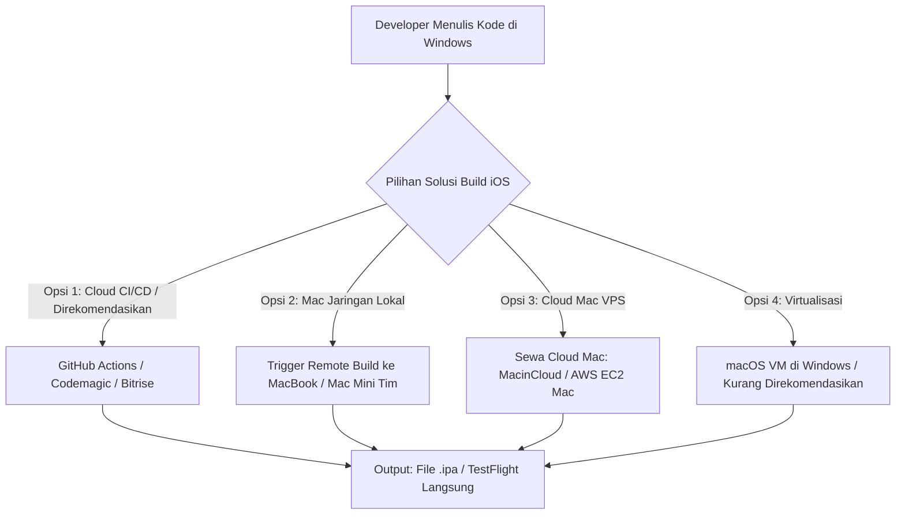

# Strategi & Solusi Build iOS dari Lingkungan Windows
**Aplikasi Mobile BERSEKA (Flutter Multi-Platform)**  
*Dokumen Arsitektur & Solusi Teknis Build & Release*

---

## 1. Analisis Teknis: Mengapa Build iOS Tidak Bisa Langsung di Windows?

Secara standar arsitektur dan hukum dari Apple, **kompilasi langsung aplikasi iOS di dalam sistem operasi Windows tidak dapat dilakukan secara native**.

Penyebab utamanya adalah:
1. **Xcode Toolchain Eksklusif macOS**:
   - Kompilator bahasa Swift/Objective-C (`Clang` dengan target Darwin Mach-O), *Metal shader compiler*, *Asset catalog compiler* (`actool`), dan dynamic linker (`ld64`) hanya dirilis oleh Apple untuk sistem operasi **macOS (Darwin kernel)**.
2. **iOS SDK & Framework Tertutup**:
   - Framework bawaan iOS (`UIKit`, `Foundation`, `CoreLocation`, `AVFoundation`) dilindungi hak cipta Apple dan tidak dapat dipasang di Windows.
3. **Apple Code Signing & Keychain Security**:
   - Proses penandatanganan aplikasi (*codesign*) terintegrasi secara kriptografis dengan Apple Keychain di kernel macOS.

---

## 2. Solusi Industri: Bagaimana Developer Windows Membangun File iOS (`.ipa`)?

Berikut 4 metode standar industri yang digunakan para pengembang aplikasi mobile:



---

## 3. Implementasi Solusi Projek: GitHub Actions Cloud macOS Runner

Kami telah menyiapkan alur **GitHub Actions Pipeline** resmi pada file:
`.github/workflows/build_ios.yml`

### Keunggulan:
- **100% Gratis & Otomatis**: Memanfaatkan runner macOS resmi GitHub (`macos-14` M1 Apple Silicon).
- **Tidak Memerlukan MacBook Fisik**: Developer cukup push kode dari Windows, GitHub Actions yang akan melakukan kompilasi iOS.
- **Artifact Siap Unduh**: File `.ipa` langsung tersedia di tab *Actions* untuk diunduh setelah selesai (~5–8 menit).

---

## 4. Cara Menjalankan Build iOS dari Windows

### Cara A: Melalui Browser (GitHub Web UI)
1. Buka repositori GitHub BERSEKA Mobile di browser.
2. Klik tab **Actions** di menu atas.
3. Pilih workflow **"BERSEKA Mobile — iOS Build Pipeline (macOS Runner)"**.
4. Klik tombol **Run workflow**:
   - Pilih Branch: `development` / `mobile`.
   - Centang opsi *Sign IPA* jika sudah memasukkan sertifikat Apple.
5. Setelah build selesai, scroll ke bagian bawah halaman (*Artifacts*) dan unduh file `BERSEKA-iOS-Build-Run-XX.zip`.

### Cara B: Melalui Terminal Windows (PowerShell Script)
Jalankan script helper yang telah kami sediakan:
```powershell
cd mobile
.\scripts\trigger_ios_build.ps1 -Branch "development"
```

---

## 5. Konfigurasi Code Signing Apple untuk Rilis TestFlight / App Store

Jika ingin menghasilkan file `.ipa` resmi yang sudah ditandatangani sertifikat Apple Developer:

1. **Ekspor Sertifikat dari Apple Developer Portal**:
   - Sertifikat Distribusi: `certificate.p12`
   - Profil Provisi: `profile.mobileprovision`
2. **Konversi ke Base64 (di Windows PowerShell)**:
   ```powershell
   [Convert]::ToBase64String([IO.File]::ReadAllBytes("certificate.p12")) | Set-Clipboard
   ```
3. **Simpan di GitHub Secrets** (`Settings -> Secrets and variables -> Actions`):
   - `APPLE_CERTIFICATE_BASE64`: String Base64 dari file `.p12`
   - `APPLE_CERTIFICATE_PASSWORD`: Kata sandi file `.p12`
   - `APPLE_PROVISION_PROFILE_BASE64`: String Base64 dari file `.mobileprovision`

---

## 6. Cara Menguji Aplikasi iOS yang Dihasilkan

Setelah file `.ipa` berhasil di-build dari Windows via GitHub Actions:
1. **Uji Nyata di iPhone (Tanpa Mac)**:
   - Unggah otomatis ke **Apple TestFlight**.
   - Atau instal via **AltStore** / **TrollStore** / **Sideloadly** dari laptop Windows dengan menghubungkan kabel USB ke iPhone.
2. **Uji di Emulator iOS Cloud**:
   - Menggunakan layanan [Appetize.io](https://appetize.io) atau [BrowserStack](https://www.browserstack.com) untuk menjalankan aplikasi iOS langsung di browser tanpa perangkat fisik iPhone.
