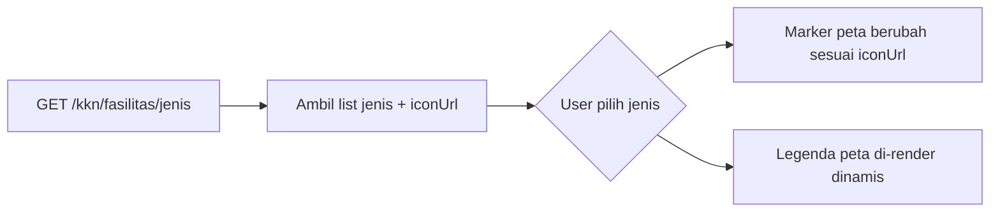
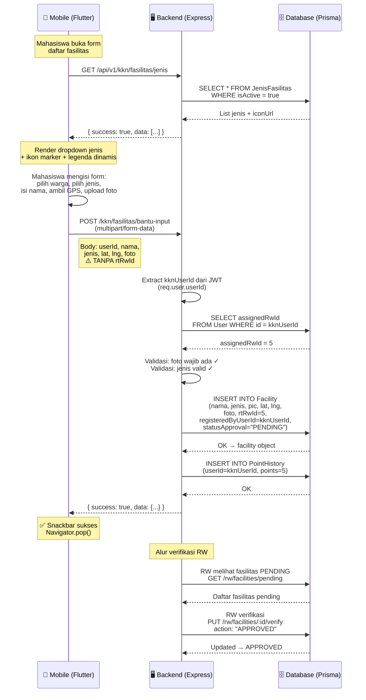

# 📋 Dokumentasi Kebutuhan Backend: Fitur Fasilitas Warga KKN

> **Dokumen ini ditujukan untuk Tim Backend** sebagai panduan implementasi endpoint terkait fitur **Daftar Fasilitas Warga** pada aplikasi mobile Pilah Sampah Cerdas.
>
> **Tanggal**: 20 Agustus 2026 | **Branch**: `acef-branch`

---

## 📌 Konteks & Latar Belakang

Fitur **Daftar Fasilitas Warga** memungkinkan mahasiswa KKN mendaftarkan fasilitas pengolahan sampah (Rumah Maggot, Bank Sampah, Loseda, dll.) yang dikelola oleh warga dampingan mereka.

### Kondisi Saat Ini (Hasil Riset Codebase)

| Aspek | Kondisi | Referensi Kode |
|-------|---------|---------------|
| **Endpoint register** | ✅ Sudah ada `POST /kkn/fasilitas/bantu-input` | [kknRoutes.js:L24](file:///home/acef-kiki/Documents/Work/Makerindo-Code/Pilah-Sampah-Cerdas/apps/api/dist/routes/kknRoutes.js#L24) |
| **Jenis fasilitas** | ❌ Hardcoded di mobile DAN backend — **belum ada endpoint master data** | [register_fasilitas_view.dart:L36-44](file:///home/acef-kiki/Documents/Work/Makerindo-Code/Pilah-Sampah-Cerdas/lib/app/modules/mahasiswa/views/register_fasilitas_view.dart#L36-L44), [facilityService.js:L15-23](file:///home/acef-kiki/Documents/Work/Makerindo-Code/Pilah-Sampah-Cerdas/apps/api/dist/services/facilityService.js#L15-L23) |
| **RW ID** | ⚠️ Diinput manual user, dikirim sebagai `rtRwId` di body | [kknService.js:L405](file:///home/acef-kiki/Documents/Work/Makerindo-Code/Pilah-Sampah-Cerdas/apps/api/dist/services/kknService.js#L405) |
| **Logo/ikon marker** | ❌ 2 ikon statis (fasilitas hijau + posko ungu) | [register_fasilitas_view.dart:L742-800](file:///home/acef-kiki/Documents/Work/Makerindo-Code/Pilah-Sampah-Cerdas/lib/app/modules/mahasiswa/views/register_fasilitas_view.dart#L742-L800) |
| **Foto fasilitas** | ⚠️ Opsional, field `foto` dikirim ke Prisma tapi tidak required | [kknService.js:L406](file:///home/acef-kiki/Documents/Work/Makerindo-Code/Pilah-Sampah-Cerdas/apps/api/dist/services/kknService.js#L406) |
| **Data pendaftar** | ⚠️ `kknUserId` sudah digunakan untuk poin tapi **tidak disimpan** di tabel `Facility` | [kknService.js:L410-417](file:///home/acef-kiki/Documents/Work/Makerindo-Code/Pilah-Sampah-Cerdas/apps/api/dist/services/kknService.js#L410-L417) |

### Endpoint Fasilitas yang Sudah Ada di Backend

| Method | Endpoint | Role | Keterangan |
|--------|----------|------|------------|
| `POST` | `/api/v1/kkn/fasilitas/bantu-input` | MAHASISWA_KKN | Input fasilitas oleh mahasiswa (+5 poin) |
| `POST` | `/api/v1/facilities` | SUPER_ADMIN, ADMIN_DLH, MAHASISWA_KKN, RW, RT | Pendaftaran fasilitas umum |
| `GET` | `/api/v1/facilities?jenis=` | Authenticated | Ambil daftar fasilitas (filter jenis) |
| `GET` | `/api/v1/rw/facilities/pending` | RW | Fasilitas PENDING di wilayah RW |
| `PUT` | `/api/v1/rw/facilities/:id/verify` | RW | Verifikasi fasilitas (APPROVED/REJECTED) |
| `GET` | `/api/v1/rw/facilities` | RW | Fasilitas APPROVED di wilayah RW + production logs |

---

## 🔴 Daftar Perubahan yang Dibutuhkan

---

### 1. ✅ Endpoint Master Data Jenis Fasilitas — `BARU`

> [!IMPORTANT]
> **Endpoint ini BELUM ADA.** Saat ini jenis fasilitas di-hardcode di 2 tempat:
> - **Mobile**: `_jenisFasilitasMap` di [register_fasilitas_view.dart:L36-44](file:///home/acef-kiki/Documents/Work/Makerindo-Code/Pilah-Sampah-Cerdas/lib/app/modules/mahasiswa/views/register_fasilitas_view.dart#L36-L44)
> - **Backend**: `validTypes` array di [facilityService.js:L15-23](file:///home/acef-kiki/Documents/Work/Makerindo-Code/Pilah-Sampah-Cerdas/apps/api/dist/services/facilityService.js#L15-L23)

#### Endpoint

```
GET /api/v1/kkn/fasilitas/jenis
Authorization: Bearer <token>
```

#### Response yang Diharapkan

```json
{
  "success": true,
  "data": [
    {
      "id": 1,
      "key": "rumah_maggot",
      "nama": "Rumah Maggot",
      "iconUrl": "https://berseka.id/uploads/icons/rumah_maggot.png",
      "deskripsi": "Fasilitas pengolahan sampah organik menggunakan larva BSF",
      "isActive": true
    },
    {
      "id": 2,
      "key": "loseda",
      "nama": "Loseda",
      "iconUrl": "https://berseka.id/uploads/icons/loseda.png",
      "deskripsi": "Lubang sedalam 1 meter untuk pengomposan langsung",
      "isActive": true
    },
    {
      "id": 3,
      "key": "bata_terawang",
      "nama": "Bata Terawang",
      "iconUrl": "https://berseka.id/uploads/icons/bata_terawang.png",
      "deskripsi": "Komposter aerobik menggunakan susunan bata berongga",
      "isActive": true
    },
    {
      "id": 4,
      "key": "bank_sampah",
      "nama": "Bank Sampah",
      "iconUrl": "https://berseka.id/uploads/icons/bank_sampah.png",
      "deskripsi": "Tempat pengumpulan sampah anorganik bernilai ekonomi",
      "isActive": true
    },
    {
      "id": 5,
      "key": "buruan_sae",
      "nama": "Buruan Sae",
      "iconUrl": "https://berseka.id/uploads/icons/buruan_sae.png",
      "deskripsi": "Program pengelolaan pekarangan untuk ketahanan pangan",
      "isActive": true
    },
    {
      "id": 6,
      "key": "poc",
      "nama": "Pupuk Organik Cair (POC)",
      "iconUrl": "https://berseka.id/uploads/icons/poc.png",
      "deskripsi": "Fasilitas pembuatan pupuk cair dari sampah organik",
      "isActive": true
    },
    {
      "id": 7,
      "key": "tps",
      "nama": "TPS",
      "iconUrl": "https://berseka.id/uploads/icons/tps.png",
      "deskripsi": "Tempat Pembuangan Sampah sementara",
      "isActive": true
    },
    {
      "id": 8,
      "key": "posko",
      "nama": "Posko KKN",
      "iconUrl": "https://berseka.id/uploads/icons/posko.png",
      "deskripsi": "Posko / kantor kelurahan",
      "isActive": true
    }
  ]
}
```

#### Perubahan Backend yang Diperlukan

**Opsi A — Tabel baru (Disarankan):**

Buat tabel Prisma `JenisFasilitas`:
```prisma
model JenisFasilitas {
  id        Int      @id @default(autoincrement())
  key       String   @unique  // e.g. "rumah_maggot"
  nama      String             // e.g. "Rumah Maggot"
  iconUrl   String?            // URL gambar ikon marker
  deskripsi String?
  isActive  Boolean  @default(true)
  createdAt DateTime @default(now())
  updatedAt DateTime @updatedAt
}
```

Lalu seed data awal:
```javascript
const jenisData = [
  { key: 'rumah_maggot', nama: 'Rumah Maggot', deskripsi: 'Fasilitas pengolahan sampah organik menggunakan larva BSF' },
  { key: 'loseda', nama: 'Loseda', deskripsi: 'Lubang sedalam 1 meter untuk pengomposan langsung' },
  { key: 'bata_terawang', nama: 'Bata Terawang', deskripsi: 'Komposter aerobik menggunakan susunan bata berongga' },
  { key: 'bank_sampah', nama: 'Bank Sampah', deskripsi: 'Tempat pengumpulan sampah anorganik bernilai ekonomi' },
  { key: 'buruan_sae', nama: 'Buruan Sae', deskripsi: 'Program pengelolaan pekarangan untuk ketahanan pangan' },
  { key: 'poc', nama: 'Pupuk Organik Cair (POC)', deskripsi: 'Fasilitas pembuatan pupuk cair dari sampah organik' },
  { key: 'tps', nama: 'TPS', deskripsi: 'Tempat Pembuangan Sampah sementara' },
  { key: 'posko', nama: 'Posko KKN', deskripsi: 'Posko / kantor kelurahan' },
];
```

**Opsi B — Tanpa tabel baru (Cepat):**

Cukup buat endpoint statis yang return array JSON jenis fasilitas (hardcode di service), ditambah field `iconUrl` yang menunjuk ke file statis di folder `/uploads/icons/`.

**Perubahan kode di [facilityService.js:L15-23](file:///home/acef-kiki/Documents/Work/Makerindo-Code/Pilah-Sampah-Cerdas/apps/api/dist/services/facilityService.js#L15-L23):**
- Jika memakai tabel baru, ganti `validTypes` array hardcoded dengan query `SELECT key FROM JenisFasilitas WHERE isActive = true`
- Validasi di `createFacility` dan `getFacilities` juga perlu diupdate

#### Kebutuhan Ikon Marker

| Jenis | Key | Ikon yang Perlu Disiapkan |
|-------|-----|--------------------------|
| Rumah Maggot | `rumah_maggot` | 🪱 Ikon maggot/larva |
| Loseda | `loseda` | 🕳️ Ikon lubang/tanah |
| Bata Terawang | `bata_terawang` | 🧱 Ikon bata berlubang |
| Bank Sampah | `bank_sampah` | 🏦 Ikon bank/timbangan |
| Buruan Sae | `buruan_sae` | 🌱 Ikon kebun/pekarangan |
| POC | `poc` | 🧪 Ikon botol cairan |
| TPS | `tps` | 🗑️ Ikon tempat sampah |
| Posko | `posko` | 🏠 Ikon kantor/posko |

**Spesifikasi ikon**: PNG transparan, 128×128px, file disimpan di folder `uploads/icons/`

---

### 2. ⚠️ RW ID — Resolve dari Data Mahasiswa, Bukan Input User

> [!WARNING]
> **Field `rwId`/`rtRwId` TIDAK boleh diinput manual oleh user.**
> Backend harus mengambilnya dari data mahasiswa yang login.

#### Kode Backend Saat Ini

Di [kknService.js:L397-419](file:///home/acef-kiki/Documents/Work/Makerindo-Code/Pilah-Sampah-Cerdas/apps/api/dist/services/kknService.js#L397-L419):

```javascript
async bantuInputFasilitas(kknUserId, data) {
    const facility = await prisma.facility.create({
        data: {
            nama: data.nama,
            jenis: data.jenis,
            pic: data.userId,       // Warga's ID
            latitude: data.latitude,
            longitude: data.longitude,
            rtRwId: data.rtRwId,    // ← DARI REQ.BODY (input user)
            foto: data.foto,
            statusApproval: "PENDING",
        },
    });
    // ... +5 poin untuk mahasiswa
}
```

#### Perubahan yang Diperlukan

```diff
  async bantuInputFasilitas(kknUserId, data) {
+     // Resolve rtRwId dari data mahasiswa yang login
+     const mahasiswa = await prisma.user.findUnique({
+         where: { id: kknUserId },
+         select: { assignedRwId: true, rtRwId: true }
+     });
+     const resolvedRtRwId = mahasiswa?.assignedRwId ?? mahasiswa?.rtRwId ?? data.rtRwId;
+
      const facility = await prisma.facility.create({
          data: {
              nama: data.nama,
              jenis: data.jenis,
              pic: data.userId,
              latitude: data.latitude,
              longitude: data.longitude,
-             rtRwId: data.rtRwId,
+             rtRwId: resolvedRtRwId,
              foto: data.foto,
              statusApproval: "PENDING",
+             registeredByUserId: kknUserId,
          },
      });
```

> [!NOTE]
> - `kknUserId` sudah tersedia di controller: `const kknUserId = req.user.userId;` — [kknController.js:L162](file:///home/acef-kiki/Documents/Work/Makerindo-Code/Pilah-Sampah-Cerdas/apps/api/dist/controllers/kknController.js#L162)
> - Cukup query tabel `User` berdasarkan `kknUserId` untuk mendapatkan `assignedRwId` atau `rtRwId`
> - **Fallback**: jika `rtRwId` masih dikirim di body (versi mobile lama), gunakan sebagai fallback

---

### 3. 🎨 Logo/Ikon Marker Legenda — Dari Data Jenis Fasilitas

> [!IMPORTANT]
> Setelah endpoint jenis fasilitas tersedia (poin 1), mobile akan menampilkan **legenda dinamis** dan **marker unik** per jenis fasilitas.

#### Yang Perlu Disiapkan Backend

1. **Upload file ikon** ke folder `uploads/icons/` (sudah ada folder `uploads/` di [apps/api/uploads/](file:///home/acef-kiki/Documents/Work/Makerindo-Code/Pilah-Sampah-Cerdas/apps/api/uploads))
2. **Serve file statis** ikon agar bisa diakses publik via URL (e.g. `https://berseka.id/uploads/icons/rumah_maggot.png`)
3. **Pastikan `iconUrl`** menggunakan URL absolut (bukan relative path)
4. Format: **PNG transparan**, ukuran **128×128px**

#### Bagaimana Mobile Akan Menggunakannya



---

### 4. 📸 Foto Fasilitas — Dijadikan WAJIB

> [!CAUTION]
> **Foto fasilitas harus field WAJIB (required)**, bukan opsional.

#### Kode Saat Ini

| Sisi | Keterangan | Referensi |
|------|-----------|-----------|
| **Mobile Controller** | `imagePath` nullable: `String? imagePath` | [fasilitas_kkn_controller.dart:L37](file:///home/acef-kiki/Documents/Work/Makerindo-Code/Pilah-Sampah-Cerdas/lib/app/modules/mahasiswa/controllers/fasilitas_kkn_controller.dart#L37) |
| **Mobile API Repo** | Jika `imagePath == null`, kirim JSON tanpa foto | [api_kkn_repository.dart:L492-508](file:///home/acef-kiki/Documents/Work/Makerindo-Code/Pilah-Sampah-Cerdas/lib/app/data/repositories/api_kkn_repository.dart#L492-L508) |
| **Mobile View** | Label "(Opsional)" | [register_fasilitas_view.dart:L805](file:///home/acef-kiki/Documents/Work/Makerindo-Code/Pilah-Sampah-Cerdas/lib/app/modules/mahasiswa/views/register_fasilitas_view.dart#L805) |
| **Backend Service** | `foto: data.foto` (nullable, tidak divalidasi) | [kknService.js:L406](file:///home/acef-kiki/Documents/Work/Makerindo-Code/Pilah-Sampah-Cerdas/apps/api/dist/services/kknService.js#L406) |

#### Perubahan Backend

```diff
  async bantuInputFasilitas(kknUserId, data) {
+     // Validasi foto wajib
+     if (!data.foto) {
+         throw new Error("Foto fasilitas wajib diunggah");
+     }
+
      const facility = await prisma.facility.create({
```

**Tambahan untuk web dashboard:**
- Tampilkan thumbnail foto di tabel daftar fasilitas
- Gunakan `fotoUrl` dari response (URL absolut ke file yang diupload)

#### Perubahan Mobile (akan dilakukan setelah backend siap)

- Hapus teks "(Opsional)" dari label foto
- Tambahkan validasi di `_submit()`: form tidak bisa di-submit tanpa foto
- `imagePath` dijadikan **required** (non-nullable)

---

### 5. 👤 Data Pendaftar (Mahasiswa) — Simpan dan Tampilkan

> [!IMPORTANT]
> `kknUserId` **sudah tersedia** di controller tapi **TIDAK disimpan** di tabel `Facility`.

#### Kode Backend Saat Ini

```javascript
// kknController.js:L162 — kknUserId sudah di-extract dari JWT
const kknUserId = req.user.userId;

// kknService.js:L410-417 — kknUserId HANYA dipakai untuk poin
await prisma.pointHistory.create({
    data: {
        userId: kknUserId,   // ← dipakai di sini
        points: 5,
        description: `Bantu warga input fasilitas GIS: ${data.nama}`,
        kategori: "PARTISIPASI_STREAK",
    },
});

// TAPI TIDAK disimpan di tabel Facility!
```

#### Perubahan yang Diperlukan

**1. Tambah kolom di Prisma model `Facility`:**

```prisma
model Facility {
  // ... field yang sudah ada ...
  registeredByUserId  String?    // ID mahasiswa yang mendaftarkan
  registeredBy        User?      @relation("FacilityRegisteredBy", fields: [registeredByUserId], references: [id])
}
```

**2. Update `bantuInputFasilitas` di [kknService.js:L397-419](file:///home/acef-kiki/Documents/Work/Makerindo-Code/Pilah-Sampah-Cerdas/apps/api/dist/services/kknService.js#L397-L419):**

```diff
  const facility = await prisma.facility.create({
      data: {
          nama: data.nama,
          jenis: data.jenis,
          pic: data.userId,
          latitude: data.latitude,
          longitude: data.longitude,
          rtRwId: resolvedRtRwId,
          foto: data.foto,
          statusApproval: "PENDING",
+         registeredByUserId: kknUserId,
      },
  });
```

**3. Update response GET fasilitas (untuk web dashboard):**

```diff
  // rwService.js & facilityService.js — getFacilities
  return prisma.facility.findMany({
      where: { rtRwId, statusApproval: "APPROVED" },
-     include: { productionLogs: true },
+     include: {
+         productionLogs: true,
+         registeredBy: {
+             select: {
+                 id: true,
+                 name: true,
+                 nim: true,
+                 universitas: true,
+             }
+         },
+         penanggungJawab: {
+             select: {
+                 id: true,
+                 name: true,
+             }
+         }
+     },
  });
```

#### Tampilan di Tabel Web Dashboard

| No | Nama Fasilitas | Jenis | Penanggung Jawab | Didaftarkan Oleh | RW | Foto | Status | Tanggal |
|----|---------------|-------|------------------|------------------|----|------|--------|---------|
| 1 | Rumah Maggot Berkah RT 03 | 🪱 Rumah Maggot | Bpk. Suherman | Ahmad Rizki (12345678) | RW 03 | 🖼️ | ✅ Approved | 20 Aug 2026 |

---

## 📊 Ringkasan Perubahan Endpoint

| No | Endpoint | Method | Status | Detail Perubahan |
|----|----------|--------|--------|-----------------|
| 1 | `/api/v1/kkn/fasilitas/jenis` | `GET` | 🆕 **BARU** | Master data jenis fasilitas + `iconUrl` marker |
| 2 | `/api/v1/kkn/fasilitas/bantu-input` | `POST` | 🔄 **MODIFIKASI** | `rtRwId` dari JWT (bukan body), `foto` required, simpan `registeredByUserId` |
| 3 | `/api/v1/rw/facilities` | `GET` | 🔄 **MODIFIKASI** | Include `registeredBy` (mahasiswa), `fotoUrl` di response |
| 4 | `/api/v1/facilities` | `GET` | 🔄 **MODIFIKASI** | Include `registeredBy` (mahasiswa), `fotoUrl` di response |

---

## 📐 Kontrak API Lengkap: POST (Setelah Modifikasi)

### `POST /api/v1/kkn/fasilitas/bantu-input`

**Request:** `multipart/form-data`

| Field | Tipe | Required | Keterangan |
|-------|------|----------|------------|
| `userId` | String (UUID) | ✅ Ya | ID warga penanggung jawab |
| `nama` | String | ✅ Ya | Nama fasilitas |
| `jenis` | String | ✅ Ya | Key jenis fasilitas (e.g. `rumah_maggot`) — validasi terhadap tabel `JenisFasilitas` |
| `latitude` | Double | ✅ Ya | Koordinat GPS |
| `longitude` | Double | ✅ Ya | Koordinat GPS |
| `foto` | File (image) | ✅ Ya | Foto fasilitas (**WAJIB**) |

> [!NOTE]
> **Field yang TIDAK dikirim mobile (diambil oleh backend):**
> - `rtRwId` → resolve dari `req.user.userId` → query tabel `User` → `assignedRwId` / `rtRwId`
> - `registeredByUserId` → dari `req.user.userId` (sudah tersedia sebagai `kknUserId` di [kknController.js:L162](file:///home/acef-kiki/Documents/Work/Makerindo-Code/Pilah-Sampah-Cerdas/apps/api/dist/controllers/kknController.js#L162))

**Response Success (201):**

```json
{
  "success": true,
  "data": {
    "id": "uuid-fasilitas",
    "nama": "Rumah Maggot Berkah RT 03",
    "jenis": "rumah_maggot",
    "fotoUrl": "https://berseka.id/uploads/fasilitas/xxx.jpg",
    "latitude": -6.914744,
    "longitude": 107.609810,
    "rtRwId": 5,
    "registeredByUserId": "uuid-mahasiswa",
    "statusApproval": "PENDING",
    "createdAt": "2026-08-20T08:00:00Z"
  }
}
```

---

## 🔄 Diagram Alur Terintegrasi (Mobile ↔ Backend)



---

## ✅ Checklist Implementasi

### Backend (Prioritas 1 — Kerjakan Duluan)

- [ ] **Database**: Buat tabel/model `JenisFasilitas` di Prisma schema
- [ ] **Database**: Tambah kolom `registeredByUserId` (FK → User) di model `Facility`
- [ ] **Migration**: Jalankan `prisma migrate dev`
- [ ] **Seed**: Insert 7 jenis fasilitas + 1 posko ke tabel `JenisFasilitas`
- [ ] **File**: Upload 8 file ikon PNG ke `uploads/icons/`
- [ ] **Endpoint**: Buat `GET /api/v1/kkn/fasilitas/jenis` (route, controller, service)
- [ ] **Service**: Update `bantuInputFasilitas()` di `kknService.js`:
  - [ ] Resolve `rtRwId` dari data mahasiswa (JWT)
  - [ ] Validasi `foto` required
  - [ ] Simpan `registeredByUserId = kknUserId`
- [ ] **Service**: Update validasi `validTypes` di `facilityService.js` — query dari DB
- [ ] **Service**: Update `getFacilities` — include `registeredBy` dan foto
- [ ] **RW Service**: Update `getFacilities` & `getPendingFacilities` — include `registeredBy`
- [ ] **Web Dashboard**: Tampilkan kolom foto, pendaftar (mahasiswa), jenis fasilitas
- [ ] **Test**: Uji endpoint baru dan yang dimodifikasi
- [ ] 📢 **Konfirmasi ke tim mobile** setelah semua endpoint siap

### Mobile (Prioritas 2 — Setelah Backend Konfirmasi)

- [ ] Tambah endpoint `kknFasilitasJenis` di `ApiEndpoints`
- [ ] Buat service/method `getJenisFasilitas()` di repository
- [ ] Panggil `GET /kkn/fasilitas/jenis` saat halaman daftar fasilitas dibuka
- [ ] Replace `_jenisFasilitasMap` hardcoded dengan data dari API
- [ ] Hapus field input "ID RW" dari form & controller
- [ ] Ubah foto dari opsional menjadi wajib (hapus "(Opsional)", tambah validasi)
- [ ] Render marker peta berdasarkan `iconUrl` dari jenis fasilitas terpilih
- [ ] Render legenda peta secara dinamis dari seluruh jenis fasilitas
- [ ] Update payload: hapus `rwId`, selalu kirim `multipart/form-data`

---

## ⚠️ Strategi Kompatibilitas Versi Lama

> [!TIP]
> Agar versi mobile lama tidak langsung rusak saat backend di-deploy:
> 
> **Backend harus menangani `rtRwId` secara opsional:**
> ```javascript
> // Jika rtRwId dikirim di body (versi mobile lama) → pakai itu
> // Jika tidak ada → resolve dari data mahasiswa (versi baru)
> const resolvedRtRwId = data.rtRwId ?? mahasiswa?.assignedRwId ?? mahasiswa?.rtRwId;
> ```
>
> **Untuk foto:**
> ```javascript
> // Tetap terima request tanpa foto (versi lama)
> // Tapi tampilkan warning di log bahwa foto kosong
> if (!data.foto) {
>     console.warn(`[KKN] Fasilitas ${data.nama} didaftarkan tanpa foto oleh ${kknUserId}`);
> }
> ```

---

## 📝 Catatan Akhir

> [!WARNING]
> **Urutan deploy yang aman:**
> 1. ✅ Backend deploy **endpoint baru + modifikasi** (backward compatible)
> 2. ✅ Mobile **rilis update** yang menggunakan endpoint baru
> 3. ✅ Setelah mayoritas user update, backend bisa menghapus fallback kompatibilitas
