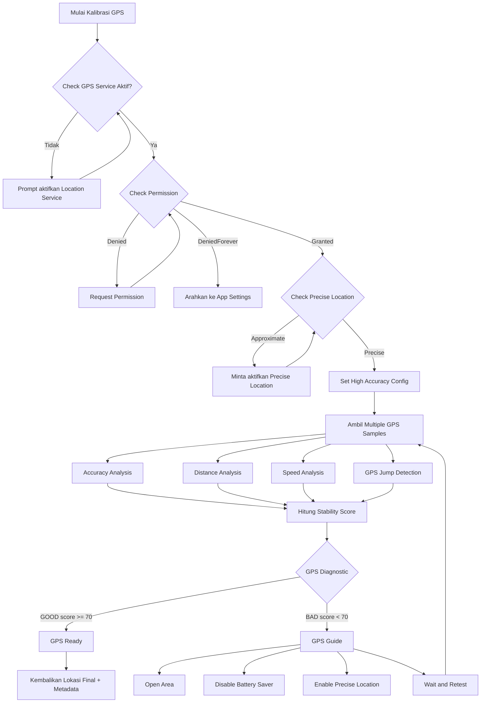

# Arsitektur Kalibrasi GPS — Flutter

> Dokumen ini adalah panduan implementasi lengkap untuk AI coding agent (Cursor/Copilot/Claude Code/dsb) dalam membangun modul **GPS Calibration & Diagnostic** pada aplikasi Flutter. Mencakup requirement fitur, package, landasan teknis, dan arsitektur alur (flow architecture).

---

## 1. Konteks & Latar Belakang

Modul ini dibangun untuk fitur **presensi kegiatan KKN (Kuliah Kerja Nyata) berbasis geofencing**. Setiap mahasiswa melakukan presensi berdasarkan keberadaannya di dalam radius geofence lokasi kegiatan (posko, lokasi program kerja, dsb).

**Masalah utama** yang melatarbelakangi kebutuhan kalibrasi ini:

- Lokasi kegiatan KKN tersebar di berbagai **wilayah dengan kualitas sinyal & jaringan yang sangat bervariasi** — mulai dari daerah dengan sinyal 4G stabil hingga daerah pelosok/pedesaan dengan sinyal lemah, GPS lambat lock, atau sering terjadi *multipath* (sinyal memantul karena kondisi geografis seperti perbukitan, pepohonan lebat, atau bangunan).
- Presensi berbasis geofencing **sangat bergantung pada akurasi koordinat GPS**. Jika koordinat yang didapat tidak akurat atau melompat-lompat (jump), sistem geofencing bisa salah menilai mahasiswa "di luar area" padahal sebenarnya berada di dalam, atau sebaliknya — berisiko presensi tidak valid/curang.
- Tanpa mekanisme validasi, mahasiswa di daerah bersinyal buruk akan mengalami kegagalan presensi berulang **tanpa tahu penyebabnya** (apakah GPS mati, izin lokasi kurang tepat, sinyal lemah, atau memang berada di luar geofence).

**Tujuan modul kalibrasi GPS ini:**

1. Memberi **indikator kualitas sinyal/lokasi** secara real-time kepada user sebelum presensi diproses, sehingga jelas apakah kondisi GPS di wilayah tersebut cukup layak dipakai untuk validasi geofencing.
2. Memberi **panduan (guide) yang actionable** ketika kualitas GPS buruk — bukan sekadar pesan error generik "gagal presensi", melainkan langkah konkret (pindah ke area terbuka, matikan battery saver, aktifkan precise location, tunggu & coba lagi) yang relevan dengan kondisi lapangan KKN yang beragam.
3. **Mengurangi presensi gagal/keliru akibat kualitas GPS**, khususnya di lokasi KKN dengan infrastruktur jaringan terbatas, tanpa mengorbankan integritas geofencing (tetap menolak titik yang benar-benar tidak valid).
4. Menjadi **lapisan validasi sebelum data lokasi dikirim ke sistem geofencing presensi**, sehingga sistem geofencing di backend hanya menerima koordinat yang sudah lolos uji stabilitas.

Dengan kata lain, modul ini bukan sekadar "pengecekan GPS" generik, melainkan **jembatan antara kondisi jaringan lapangan yang tidak merata dan kebutuhan akurasi presensi geofencing** — memastikan mahasiswa di daerah sinyal buruk tetap punya jalur yang jelas untuk berhasil presensi, sambil tetap menjaga validitas data lokasi.

## 2. Ringkasan Sistem

Modul ini bertugas memastikan **titik koordinat GPS yang digunakan aplikasi benar-benar valid, akurat, dan stabil** sebelum dipakai untuk fitur presensi geofencing KKN. Sistem bekerja dalam 4 fase:

1. **Validasi Akses & Konfigurasi Dasar**
2. **Pengambilan Sampel & Analisis Kualitas**
3. **Diagnostik (keputusan GOOD/BAD)**
4. **Tindakan Lanjutan (Ready atau Guide/Troubleshooting)**

---

## 3. Feature Requirements

### 3.1 Functional Requirements

| ID | Requirement | Deskripsi |
|----|-------------|-----------|
| FR-01 | Cek status layanan GPS | Deteksi apakah GPS/location service perangkat aktif |
| FR-02 | Cek permission lokasi | Deteksi status izin: denied, deniedForever, whileInUse, always |
| FR-03 | Cek precise location | Deteksi apakah izin yang diberikan precise atau approximate (Android 12+/iOS 14+) |
| FR-04 | Request high accuracy | Konfigurasi `LocationAccuracy.best` / `bestForNavigation` |
| FR-05 | Multi-sampling | Ambil minimal N sampel lokasi berurutan (default: 5–8 sampel, interval 1 detik) |
| FR-06 | Analisis akurasi | Evaluasi radius akurasi (meter) tiap sampel, tolak sampel di atas threshold |
| FR-07 | Analisis jarak & kecepatan | Hitung jarak antar sampel (Haversine) dan kecepatan implisit |
| FR-08 | Deteksi GPS jump | Tandai anomali bila kecepatan implisit melebihi batas wajar (multipath bounce) |
| FR-09 | Stability scoring | Hitung skor gabungan 0–100 dari seluruh metrik |
| FR-10 | Keputusan diagnostik | Klasifikasi biner GOOD/BAD berdasarkan threshold skor |
| FR-11 | Output GPS Ready | Jika GOOD, kembalikan objek lokasi final + metadata kualitas |
| FR-12 | Output GPS Guide | Jika BAD, tampilkan UI troubleshooting dengan langkah spesifik |
| FR-13 | Retry mechanism | Sediakan aksi "Wait & Retest" yang mengulang proses dari fase 2 |
| FR-14 | Timeout handling | Batasi total durasi kalibrasi (default: 30 detik) sebelum fallback ke BAD |
| FR-15 | Integrasi geofencing presensi | Koordinat final (state GOOD) diteruskan ke modul geofencing untuk cek apakah user berada dalam radius lokasi kegiatan KKN sebelum presensi dicatat |
| FR-16 | Indikator kualitas sinyal per wilayah | Tampilkan status kualitas GPS (mis. badge "Sinyal Baik" / "Sinyal Lemah") agar user tahu kondisi lapangan tempatnya berada saat presensi |
| FR-17 | Riwayat percobaan kalibrasi | Simpan log jumlah retry & skor stabilitas per sesi presensi untuk keperluan audit/DPL (Dosen Pembimbing Lapangan) jika ada sengketa presensi |

### 3.2 Non-Functional Requirements

- **Performa**: proses kalibrasi total idealnya < 15 detik pada kondisi sinyal normal.
- **Battery-friendly**: hentikan stream GPS segera setelah stability score tercapai atau timeout.
- **Testability**: setiap fungsi analisis (accuracy, distance, speed, jump detection, scoring) harus pure function agar mudah di-unit-test.
- **Platform parity**: perilaku konsisten di Android & iOS, termasuk penanganan `precise location` yang berbeda API-nya.
- **Observability**: log setiap sampel & skor untuk debugging (opsional: kirim ke analytics).

### 3.3 Out of Scope

- Background location tracking kontinu (modul ini hanya untuk *one-shot calibration*, bukan tracking real-time berkelanjutan).
- Geofencing.
- Reverse geocoding (alamat dari koordinat).

---

## 4. Package & Dependency

```yaml
dependencies:
  flutter:
    sdk: flutter

  # Core GPS
  geolocator: ^13.0.1          # akses lokasi native, accuracy, distanceBetween
  geolocator_android: ^4.6.1   # (transitive, biasanya auto)
  geolocator_apple: ^2.3.9     # (transitive, biasanya auto)

  # Permission handling
  permission_handler: ^11.3.1  # cek & request izin runtime (fine/coarse location)

  # State management (pilih salah satu sesuai proyek)
  flutter_bloc: ^8.1.6         # atau riverpod / provider / getx

  # Utilitas
  equatable: ^2.0.5            # value comparison untuk state class
  logger: ^2.4.0                # logging terstruktur untuk debugging kalibrasi

dev_dependencies:
  mocktail: ^1.0.4             # mocking geolocator di unit test
  flutter_test:
    sdk: flutter
```

### Konfigurasi Native Wajib

**Android** (`android/app/src/main/AndroidManifest.xml`):
```xml
<uses-permission android:name="android.permission.ACCESS_FINE_LOCATION"/>
<uses-permission android:name="android.permission.ACCESS_COARSE_LOCATION"/>
```

**iOS** (`ios/Runner/Info.plist`):
```xml
<key>NSLocationWhenInUseUsageDescription</key>
<string>Aplikasi memerlukan lokasi presisi untuk verifikasi titik jemput/check-in.</string>
<key>NSLocationTemporaryUsageDescriptionDictionary</key>
<dict>
  <key>precise_location_reason</key>
  <string>Lokasi presisi dibutuhkan agar validasi GPS lebih akurat.</string>
</dict>
```

---

## 5. Landasan Teknis

### 5.1 Precise vs Approximate Location

- Android 12+ dan iOS 14+ memperkenalkan opsi "Approximate Location" yang memberi radius akurasi hingga ±3 km — **tidak cocok** untuk validasi check-in/pickup point.
- Deteksi via `Geolocator.getLocationAccuracy()` (Android) atau `desiredAccuracy` yang dikembalikan sistem (iOS, melalui `CLLocationManager.accuracyAuthorization`).
- Jika approximate terdeteksi, sistem harus meminta user mengaktifkan "Precise Location" lewat pengaturan aplikasi (`Geolocator.openAppSettings()`).

### 5.2 Haversine Formula (Distance Analysis)

Digunakan untuk menghitung jarak antar dua koordinat GPS di permukaan bumi:

```
a = sin²(Δφ/2) + cos φ1 · cos φ2 · sin²(Δλ/2)
c = 2 · atan2(√a, √(1−a))
d = R · c        // R = radius bumi ≈ 6371 km
```

`geolocator` sudah menyediakan `Geolocator.distanceBetween(lat1, lon1, lat2, lon2)` yang mengimplementasikan formula ini secara native — tidak perlu reimplementasi manual.

### 5.3 Speed Analysis

```
speed (m/s) = distance (m) / Δtime (s)
```

Threshold wajar bergantung konteks aplikasi (contoh: untuk aplikasi pejalan kaki/ojek, kecepatan > 40 m/s ≈ 144 km/jam antar sampel dalam 1 detik jelas anomali fisik → flag sebagai GPS jump).

### 5.4 GPS Jump Detection

Multipath (sinyal GPS memantul di gedung tinggi) menyebabkan lompatan koordinat mendadak lalu kembali normal. Deteksi umum:

- Bandingkan sampel ke-N dengan **median** posisi dari sampel-sampel sebelumnya (bukan hanya sampel terakhir, agar tidak mudah tertipu drift bertahap).
- Jika jarak ke median > threshold (misal 30–50 m) **dan** kecepatan implisit tidak wajar → tandai sebagai jump, buang sampel tersebut dari perhitungan skor akhir.

### 5.5 Stability Score (Weighted Scoring)

Skor komposit 0–100, contoh bobot yang bisa disesuaikan:

| Komponen | Bobot | Kriteria Skor Penuh |
|----------|-------|----------------------|
| Accuracy rata-rata sampel valid | 40% | ≤ 10 m |
| Konsistensi jarak antar sampel (variance rendah) | 25% | std-dev < 5 m |
| Tidak ada GPS jump terdeteksi | 20% | 0 jump dari N sampel |
| Kecepatan implisit wajar | 15% | < 2 m/s (kondisi statis) |

```
score = (accuracyScore * 0.40)
      + (consistencyScore * 0.25)
      + (noJumpScore * 0.20)
      + (speedScore * 0.15)
```

**Threshold keputusan** (dapat dikonfigurasi):
- `score >= 70` → **GOOD**
- `score < 70` → **BAD**

### 5.6 Timeout & Fallback Strategy

Jika setelah *timeout* (misal 30 detik) skor belum mencapai threshold, sistem tetap masuk ke state **BAD** dan menampilkan `GPS Guide` — jangan biarkan user menunggu tanpa batas (infinite loading).

---

## 6. Flow Architecture

### 6.1 Diagram Alur (Mermaid)



### 6.2 State Machine (Representasi Kode)

```dart
enum GpsCalibrationStatus {
  idle,
  checkingService,
  checkingPermission,
  checkingPrecision,
  sampling,
  analyzing,
  ready,     // GOOD
  guide,     // BAD
  error,
}

class GpsCalibrationState extends Equatable {
  final GpsCalibrationStatus status;
  final List<Position> samples;
  final double? stabilityScore;
  final Position? finalPosition;
  final List<String> guideActions; // e.g. ["open_area", "disable_saver"]
  final String? errorMessage;

  const GpsCalibrationState({
    this.status = GpsCalibrationStatus.idle,
    this.samples = const [],
    this.stabilityScore,
    this.finalPosition,
    this.guideActions = const [],
    this.errorMessage,
  });

  @override
  List<Object?> get props =>
      [status, samples, stabilityScore, finalPosition, guideActions, errorMessage];
}
```

### 6.3 Struktur Modul (Folder Layout Disarankan)

```
lib/
└── features/
    └── gps_calibration/
        ├── data/
        │   └── gps_repository.dart          # wrapper Geolocator + permission_handler
        ├── domain/
        │   ├── entities/
        │   │   └── gps_sample.dart
        │   ├── analyzers/
        │   │   ├── accuracy_analyzer.dart
        │   │   ├── distance_analyzer.dart
        │   │   ├── speed_analyzer.dart
        │   │   ├── jump_detector.dart
        │   │   └── stability_scorer.dart
        │   └── usecases/
        │       └── calibrate_gps_usecase.dart
        ├── presentation/
        │   ├── bloc/
        │   │   ├── gps_calibration_bloc.dart
        │   │   ├── gps_calibration_event.dart
        │   │   └── gps_calibration_state.dart
        │   └── widgets/
        │       ├── gps_ready_view.dart
        │       └── gps_guide_view.dart
        └── gps_calibration.dart              # barrel export
```

### 6.4 Pseudocode Use Case Utama

```dart
class CalibrateGpsUseCase {
  final GpsRepository repository;
  final int sampleCount;
  final Duration sampleInterval;
  final Duration timeout;
  final double scoreThreshold;

  CalibrateGpsUseCase(
    this.repository, {
    this.sampleCount = 6,
    this.sampleInterval = const Duration(seconds: 1),
    this.timeout = const Duration(seconds: 30),
    this.scoreThreshold = 70.0,
  });

  Stream<GpsCalibrationState> call() async* {
    // 1. Validasi dasar
    if (!await repository.isServiceEnabled()) {
      yield GpsCalibrationState(status: GpsCalibrationStatus.guide,
          guideActions: ['enable_gps_service']);
      return;
    }

    final permission = await repository.checkPermission();
    if (permission.isDeniedForever) {
      yield GpsCalibrationState(status: GpsCalibrationStatus.guide,
          guideActions: ['open_app_settings']);
      return;
    }
    if (permission.isDenied) {
      await repository.requestPermission();
    }

    if (!await repository.isPreciseLocation()) {
      yield GpsCalibrationState(status: GpsCalibrationStatus.guide,
          guideActions: ['enable_precise_location']);
      return;
    }

    // 2. Sampling
    yield const GpsCalibrationState(status: GpsCalibrationStatus.sampling);
    final samples = await repository.collectSamples(
      count: sampleCount,
      interval: sampleInterval,
      accuracy: LocationAccuracy.best,
    ).timeout(timeout, onTimeout: (_) => []);

    // 3. Analisis
    final accuracyScore = AccuracyAnalyzer.score(samples);
    final consistencyScore = DistanceAnalyzer.consistencyScore(samples);
    final jumps = JumpDetector.detect(samples);
    final speedScore = SpeedAnalyzer.score(samples);

    final stability = StabilityScorer.compute(
      accuracyScore: accuracyScore,
      consistencyScore: consistencyScore,
      jumpCount: jumps.length,
      speedScore: speedScore,
    );

    // 4. Keputusan
    if (stability >= scoreThreshold && samples.isNotEmpty) {
      // Koordinat pada tahap ini baru dinyatakan "layak dipakai" secara kualitas GPS.
      // Validasi geofencing (apakah berada dalam radius lokasi KKN) dilakukan
      // TERPISAH oleh modul geofencing setelah state `ready` diterima —
      // modul kalibrasi ini tidak menentukan valid/tidaknya presensi,
      // hanya menjamin kualitas titik lokasi yang dipakai.
      yield GpsCalibrationState(
        status: GpsCalibrationStatus.ready,
        stabilityScore: stability,
        finalPosition: samples.last,
        samples: samples,
      );
    } else {
      yield GpsCalibrationState(
        status: GpsCalibrationStatus.guide,
        stabilityScore: stability,
        samples: samples,
        guideActions: _buildGuideActions(samples, jumps),
      );
    }
  }

  List<String> _buildGuideActions(List<Position> samples, List<int> jumps) {
    final actions = <String>['wait_and_retest'];
    if (jumps.isNotEmpty) actions.add('open_area');
    if (samples.any((s) => s.accuracy > 30)) actions.add('open_area');
    actions.add('disable_battery_saver');
    return actions;
  }
}
```

---

## 7. Panduan Implementasi untuk Agent

Ketika mengimplementasikan modul ini, agent IDE **harus**:

1. **Membuat analyzer sebagai pure function** (input: `List<Position>` atau dua `Position`, output: `double`/`bool`), agar mudah di-unit-test tanpa mocking GPS.
2. **Memisahkan repository (I/O) dari use case (logika bisnis)** — repository hanya membungkus `Geolocator` & `permission_handler`; use case murni logika kalkulasi & keputusan.
3. **Menggunakan `Stream`/`Bloc` (atau state management pilihan proyek)** agar UI bisa menampilkan progres real-time (misal: "Mengambil sampel 3/6...").
4. **Selalu membatasi durasi kalibrasi dengan `timeout`** agar tidak infinite-loading saat sinyal buruk.
5. **Menulis unit test untuk tiap analyzer** dengan data sampel sintetis (termasuk kasus edge: sampel kosong, satu sampel, sampel dengan jump ekstrem).
6. **Menyediakan widget `GpsGuideView`** yang menampilkan daftar `guideActions` secara dinamis (bukan hardcode 4 kartu), agar mudah ditambah aksi baru di masa depan.
7. **Membuat threshold (`scoreThreshold`, `sampleCount`, dsb.) dapat dikonfigurasi** dari luar use case, bukan hardcoded constant di dalam logika — memudahkan tuning per jenis aplikasi (ride-hailing vs absensi vs delivery).

---

## 8. Checklist Sebelum Merge

- [ ] Semua analyzer memiliki unit test dengan coverage kasus normal & edge case.
- [ ] Permission flow teruji di Android 12+ dan iOS 14+ (precise vs approximate).
- [ ] Timeout kalibrasi berfungsi dan mengarah ke state `guide`, bukan hang.
- [ ] UI `GpsReadyView` dan `GpsGuideView` sudah terhubung ke Bloc/state management.
- [ ] Logging sampel & skor tersedia untuk debugging produksi (dengan level yang bisa dimatikan di release build).
- [ ] Tidak ada memory leak — location stream di-cancel saat widget/bloc di-dispose.
