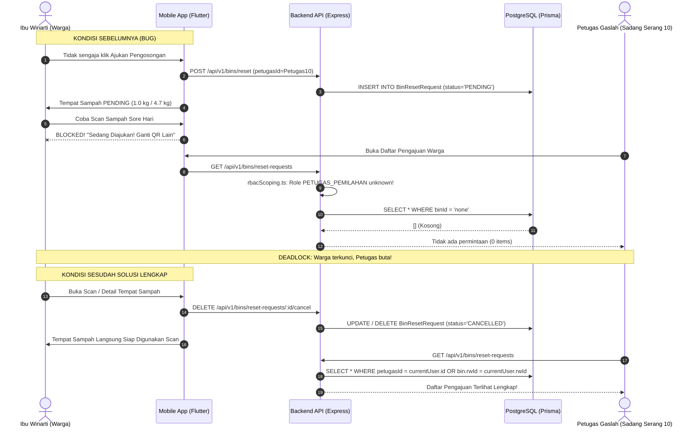

# Laporan Teknis Backend: Investigasi & Solusi Pengajuan Pengosongan Tempat Sampah (Kasus RW 10 Sadang Serang)

> [!IMPORTANT]
> **Status Dokumen**: Laporan Rekomendasi Teknis Backend (Backend Read-Only).  
> **Target Audiens**: Backend Engineer / Tech Lead BERSEKA API.  
> **Ruang Lingkup**: `main/apps/api` (`src/utils/rbacScoping.ts`, `src/services/binService.ts`, `src/routes/binRoutes.ts`, `src/routes/notificationRoutes.ts`, `src/controllers/binController.ts`).

---

## 1. Ringkasan Eksekutif & Kronologi Kasus

### A. Laporan Lapangan (User Asli)
> *"Selamat malam kak, ini info dari warga atas nama Winarti RW 10 Sadang Serang tempat sampahnya masih kosong dan belum mengajukan pengosongan tapi di aplikasi kaya gini dan pas di cek di akun gaslah juga tidak ada permintaan pengosongan nya, jadinya tidak bisa scan sore ini. Sama ka. Dari kelompok 10 sadang serang juga ada yang seperti ini. Waktunya juga mirip²."*

### B. Hasil Investigasi Terpadu (Human vs System)
1. **Trigger Awal (Human Action)**:
   - Terjadi pengajuan pengosongan tempat sampah yang tidak disengaja (*accidental submit*) pada saat pendampingan / demonstrasi lapangan oleh Kelompok 10 KKN Sadang Serang.
   - Bobot sampah tercatat $1.0\text{ kg} / 4.7\text{ kg}$ ($2.5\text{ L}$). Angka $2.5\text{ L}$ adalah nilai estimasi fallback default AI detection (`aiController.ts:108` & `aiService.ts:63`) saat scan sampah sebelumnya.
2. **Deadlock di Sisi Mobile**:
   - Status tempat sampah berubah menjadi `isResetPending = true` di database.
   - Alur pemindaian sampah mobile (`scan_flow_view.dart`) memblokir scan QR secara mutlak jika `isResetPending == true`.
   - Tidak ada mekanisme tombol pembatalan bagi warga yang salah mengajukan.
3. **Kebutaan di Sisi Akun Petugas Gaslah (*Petugas Sadang Serang 10*)**:
   - Petugas Gaslah login dengan role `PETUGAS_PEMILAHAN`.
   - Endpoint `GET /api/v1/bins/reset-requests` memanggil `binService.listResetRequests`.
   - Di backend, fungsi `getScopingFilters` (`rbacScoping.ts`) **tidak mengenali role `PETUGAS_PEMILAHAN`**, sehingga jatuh ke fallback default:
     ```typescript
     binFilter: { id: "none" }
     ```
   - Akibatnya, query Prisma menghasilkan SQL:
     ```sql
     SELECT * FROM "BinResetRequest" WHERE "binId" = 'none'
     ```
     Query selalu mengembalikan array kosong (`[]`).
   - Petugas tidak pernah melihat pengajuan Ibu Winarti, dan warga tidak bisa menggunakan tempat sampahnya.

---

## 2. Diagram Alur Masalah vs Solusi



---

## 3. Titik Masalah Spesifik di Backend (Root Causes)

### Masalah 1: Role `PETUGAS_PEMILAHAN` Hilang dari Normalisasi RBAC Scoping
- **File**: [`main/apps/api/src/utils/rbacScoping.ts`](file:///d:/berseka/main/apps/api/src/utils/rbacScoping.ts#L35-L53)
- **Baris 35–53**:
  ```typescript
  const normalizeRole = (r: string) => {
    if (["DLH", "DLH_ADMIN", "Admin DLH"].includes(r)) return "ADMIN_DLH";
    if (["ADMIN_KECAMATAN", "Camat", "CAMAT_ADMIN"].includes(r)) return "CAMAT";
    if (["ADMIN_KELURAH", "Lurah", "LURAH_ADMIN"].includes(r)) return "LURAH";
    if (["PIMPINAN", "Pimpinan", "PEMIMPIN", "Pemimpin"].includes(r)) return "PEMIMPIN";
    if (
      [
        "MPL",
        "MITRA_PENDAMPING_LAPANGAN",
        "MITRA PENDAMPING LAPANGAN",
        "MITRA_PEMBIMBING_LAPANGAN",
        "MITRA PEMBIMBING LAPANGAN",
        "MITRA",
      ].includes(r)
    )
      return "MPL";
    return r;
  };
  ```
  **Dampak**: Role seperti `PETUGAS_PEMILAHAN`, `PETUGAS_GASLAH`, `PETUGAS_TPS3R` tidak dinormalisasi ke `PETUGAS_RESIDU`.
- **Baris 571–585**:
  ```typescript
  if (role === "PETUGAS_RESIDU") { ... }
  ```
  Hanya mengecek `role === "PETUGAS_RESIDU"`. Karena role token pengguna bernilai `PETUGAS_PEMILAHAN`, ia terlempar ke baris 601 (*default fallback*):
  ```typescript
  return {
    userFilter: { id: "none" },
    binFilter: { id: "none" },
    householdFilter: { id: "none" },
    ...
  };
  ```

---

### Masalah 2: Query `listResetRequests` Mengabaikan `petugasId`
- **File**: [`main/apps/api/src/services/binService.ts`](file:///d:/berseka/main/apps/api/src/services/binService.ts#L1715-L1733)
- **Baris 1715–1733**:
  ```typescript
  async listResetRequests(
    currentUser?: { userId: string; role: string },
    filters?: { status?: string }
  ) {
    let whereClause: any = {};
    if (currentUser) {
      const { getScopingFilters } = await import("../utils/rbacScoping.js");
      const scoping = await getScopingFilters(currentUser);
      if (scoping.binFilter) {
        whereClause.bin = scoping.binFilter;
      }
    }
  ```
  **Dampak**:
  - Kolom `petugasId` pada tabel `BinResetRequest` (yang diisi saat warga memilih petugas tertentu seperti *Petugas Sadang Serang 10*) **sama sekali tidak dievaluasi**.
  - Query hanya memfilter relasi `whereClause.bin = scoping.binFilter`. Jika scoping mengembalikan `{ id: "none" }` atau jika `rwId` tempat sampah berbeda format dengan `rwId` akun petugas di DB, pengajuan tidak akan pernah muncul.

---

### Masalah 3: Notifikasi Petugas Mengecualikan `PETUGAS_PEMILAHAN`
- **File**: [`main/apps/api/src/routes/notificationRoutes.ts`](file:///d:/berseka/main/apps/api/src/routes/notificationRoutes.ts#L351-L415)
- **Baris 351–362**:
  ```typescript
  const isAdminOrPetugas = [
    "DEVELOPER",
    "SUPER_USER",
    "PEMIMPIN",
    "PANITIA_TASKFORCE",
    "ADMIN_DLH",
    "CAMAT",
    "LURAH",
    "RW",
    "RT",
    "PETUGAS_RESIDU",
  ].includes(role);
  ```
  Array ini **tidak mencantumkan `"PETUGAS_PEMILAHAN"`**, sehingga blok pembacaan `BinResetRequest` (baris 405–435) dilewati seluruhnya bagi akun Petugas Pemilahan / Gaslah.

---

### Masalah 4: Ketiadaan Endpoint Pembatalan Mandiri oleh Warga
- **File**: [`main/apps/api/src/routes/binRoutes.ts`](file:///d:/berseka/main/apps/api/src/routes/binRoutes.ts)
- **Kondisi**:
  Hanya tersedia:
  - `POST /api/v1/bins/reset` (buat pengajuan)
  - `GET /api/v1/bins/reset-requests` (lihat pengajuan)
  - `PUT /api/v1/bins/reset/:id/approve` (verifikasi oleh petugas)
  **Tidak ada endpoint `DELETE` atau `PUT /cancel`** yang memungkinkan warga pemohon membatalkan pengajuannya sendiri jika terjadi salah tekan atau tempat sampah belum penuh.

---

## 4. Rekomendasi Kode Solusi untuk Tim Backend (Patch Siap Pasang)

### Patch 1: Normalisasi Role & Scoping Petugas Pemilahan
Ubah file [`src/utils/rbacScoping.ts`](file:///d:/berseka/main/apps/api/src/utils/rbacScoping.ts):

```typescript
// 1. Pada helper normalizeRole (baris ~35)
const normalizeRole = (r: string) => {
  if (["DLH", "DLH_ADMIN", "Admin DLH"].includes(r)) return "ADMIN_DLH";
  if (["ADMIN_KECAMATAN", "Camat", "CAMAT_ADMIN"].includes(r)) return "CAMAT";
  if (["ADMIN_KELURAH", "Lurah", "LURAH_ADMIN"].includes(r)) return "LURAH";
  if (["PIMPINAN", "Pimpinan", "PEMIMPIN", "Pemimpin"].includes(r)) return "PEMIMPIN";
  if (
    [
      "PETUGAS_PEMILAHAN",
      "PETUGAS_GASLAH",
      "PETUGAS_TPS3R",
      "Petugas Pemilahan",
      "Petugas Gaslah",
    ].includes(r)
  ) {
    return "PETUGAS_RESIDU";
  }
  // ...
  return r;
};

// 2. Pada penanganan PETUGAS_RESIDU (baris ~571)
if (role === "PETUGAS_RESIDU") {
  const userRwId = dbUser.rwId;
  const userKelurahanId = dbUser.rw?.kelurahanId;

  // Izinkan filter fallback berdasarkan Kelurahan jika rwId tidak diset eksplisit
  let binFilter: any = {};
  if (userRwId) {
    binFilter = { rwId: userRwId };
  } else if (userKelurahanId) {
    binFilter = { rw: { kelurahanId: userKelurahanId } };
  }

  return {
    userFilter: userRwId
      ? { role: { name: "WARGA" }, rwId: userRwId }
      : { role: { name: "WARGA" } },
    binFilter,
    householdFilter: userRwId ? { rwId: userRwId } : {},
    wasteLogFilter: userRwId ? { bin: { rwId: userRwId } } : {},
    pemanfaatanFilter: { id: "none" },
    facilityFilter: { id: "none" },
    kelompokKknFilter: { id: "none" },
    studentKknFilter: { userId: "none" },
  };
}
```

---

### Patch 2: Query Prioritas `petugasId` pada `listResetRequests`
Ubah fungsi `listResetRequests` pada [`src/services/binService.ts`](file:///d:/berseka/main/apps/api/src/services/binService.ts#L1715):

```typescript
async listResetRequests(
  currentUser?: { userId: string; role: string },
  filters?: { status?: string }
) {
  let whereClause: any = {};

  if (currentUser) {
    const { getScopingFilters } = await import("../utils/rbacScoping.js");
    const scoping = await getScopingFilters(currentUser);

    const isPetugas = [
      "PETUGAS_RESIDU",
      "PETUGAS_PEMILAHAN",
      "PETUGAS_GASLAH",
      "PETUGAS_TPS3R",
    ].includes(currentUser.role);

    if (isPetugas) {
      // Prioritaskan pengajuan yang ditujukan langsung ke petugasId ini,
      // ATAU pengajuan di area RW tempat sampah petugas
      const orConditions: any[] = [{ petugasId: currentUser.userId }];
      if (scoping.binFilter && scoping.binFilter.id !== "none") {
        orConditions.push({ bin: scoping.binFilter });
      }
      whereClause.OR = orConditions;
    } else if (scoping.binFilter) {
      whereClause.bin = scoping.binFilter;
    }
  }

  if (filters && filters.status) {
    whereClause.status = filters.status;
  }

  return prisma.binResetRequest.findMany({
    where: whereClause,
    include: {
      bin: {
        include: {
          rw: {
            include: {
              kelurahan: true,
            },
          },
        },
      },
      user: true,
      petugas: true, // Sertakan relasi petugas
    },
    orderBy: {
      createdAt: "desc",
    },
  });
}
```

---

### Patch 3: Tambahkan Role `PETUGAS_PEMILAHAN` pada Notifikasi
Ubah file [`src/routes/notificationRoutes.ts`](file:///d:/berseka/main/apps/api/src/routes/notificationRoutes.ts):

```typescript
// Baris ~351
const isAdminOrPetugas = [
  "DEVELOPER",
  "SUPER_USER",
  "PEMIMPIN",
  "PANITIA_TASKFORCE",
  "ADMIN_DLH",
  "CAMAT",
  "LURAH",
  "RW",
  "RT",
  "PETUGAS_RESIDU",
  "PETUGAS_PEMILAHAN", // TAMBAHKAN
  "PETUGAS_GASLAH",   // TAMBAHKAN
].includes(role);

// Baris ~409
if (["RW", "RT", "PETUGAS_RESIDU", "PETUGAS_PEMILAHAN", "PETUGAS_GASLAH", "MAHASISWA_KKN"].includes(role)) {
  let binCondition: any = areaIds.length > 0 ? { rwId: { in: areaIds } } : { rwId: -1 };
  reqWhere.OR = [
    { petugasId: userId },
    { bin: binCondition }
  ];
}
```

---

### Patch 4: Implementasi Endpoint Pembatalan Pengajuan oleh Warga (`cancelResetRequest`)

#### A. Tambahkan Service Method di `src/services/binService.ts`:
```typescript
async cancelResetRequest(requestId: string, userId: string) {
  const request = await prisma.binResetRequest.findUnique({
    where: { id: requestId },
    include: { bin: true },
  });

  if (!request) {
    throw new Error("RESOURCE_NOT_FOUND");
  }

  // Guard: Hanya pemilik pengajuan yang boleh membatalkan
  if (request.userId !== userId) {
    throw new Error("FORBIDDEN");
  }

  // Guard: Hanya boleh dibatalkan jika status masih PENDING
  if (request.status !== "PENDING") {
    throw new Error("ALREADY_PROCESSED");
  }

  // Update status atau hapus pengajuan
  const updated = await prisma.binResetRequest.update({
    where: { id: requestId },
    data: {
      status: "REJECTED", // atau CANCELLED jika enum schema mendukung
      notes: "Dibatalkan oleh warga pemohon",
    },
  });

  return updated;
}
```

#### B. Tambahkan Controller Method di `src/controllers/binController.ts`:
```typescript
async cancelResetRequest(req: Request, res: Response): Promise<void> {
  try {
    const { id } = req.params;
    const userId = req.user!.userId;

    const result = await binService.cancelResetRequest(id, userId);
    res.status(200).json({
      success: true,
      message: "Pengajuan pengosongan berhasil dibatalkan",
      data: result,
    });
  } catch (error: any) {
    console.error("[BinController] cancelResetRequest error:", error);
    if (error.message === "RESOURCE_NOT_FOUND") {
      res.status(404).json({ error: "RESOURCE_NOT_FOUND", message: "Pengajuan tidak ditemukan" });
    } else if (error.message === "FORBIDDEN") {
      res.status(403).json({ error: "FORBIDDEN", message: "Anda tidak berhak membatalkan pengajuan ini" });
    } else if (error.message === "ALREADY_PROCESSED") {
      res.status(400).json({ error: "ALREADY_PROCESSED", message: "Pengajuan sudah diproses oleh petugas" });
    } else {
      res.status(500).json({ error: "INTERNAL_SERVER_ERROR", message: "Gagal membatalkan pengajuan" });
    }
  }
}
```

#### C. Daftarkan Route di `src/routes/binRoutes.ts`:
```typescript
/**
 * @swagger
 * /api/v1/bins/reset-request/{id}/cancel:
 *   put:
 *     summary: Batalkan pengajuan pengosongan tempat sampah oleh warga pemohon
 *     tags: [Bins]
 *     security:
 *       - bearerAuth: []
 */
router.put(
  "/reset-request/:id/cancel",
  authMiddleware,
  roleMiddleware(["WARGA"]),
  binController.cancelResetRequest
);
```

---

## 5. Ringkasan Sinkronisasi Mobile yang Sudah Selesai (QC Passed)

Sisi mobile saat ini telah disiapkan untuk langsung sinkron dengan backend di atas:
1. **Self-Healing Storage**: Cache lokal `active_reset_request_` tidak lagi memaksakan status zombie jika backend mengembalikan data bersih.
2. **Cancellation Dialog**: Pengguna dan petugas pendamping kini dapat membatalkan pengajuan langsung via kartu tempat sampah maupun tombol formulir.
3. **Anti-Deadlock Scan**: Jika scan mendeteksi tempat sampah pending tapi fisik belum penuh, warga dapat memilih *"Batalkan Pengajuan & Lanjut Scan"* atau *"Tetap Lanjut Scan"*.
4. **Petugas Mapping**: Repository mobile telah memetakan `petugasId` dan memperluas filter RW agar tidak ada pengajuan warga yang hilang dari dashboard Petugas Gaslah.
