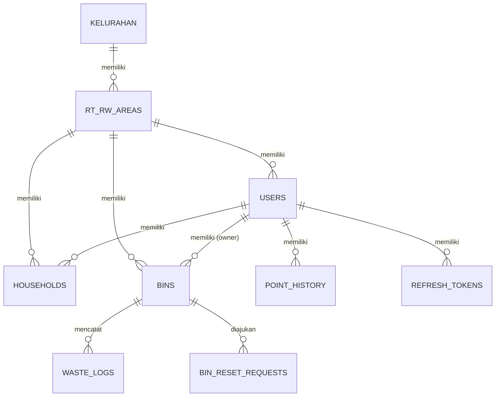
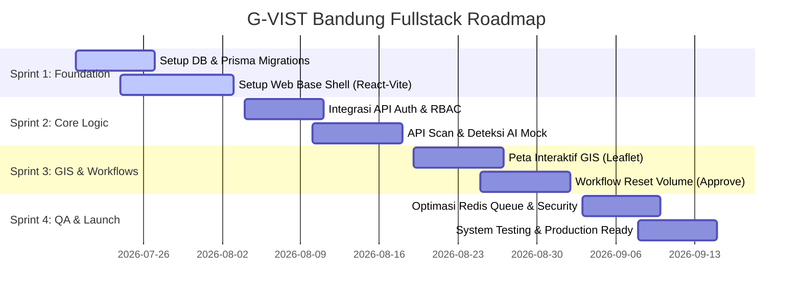

# Project Planning: Geo-Vision Waste Bandung (G-VIST Bandung)
## Pilah Sampah Cerdas Berbasis Computer Vision AI & Geospasial

Dokumen ini berisi rencana kerja, spesifikasi detail, dan arsitektur pengembangan untuk bagian **Fullstack (Backend & Frontend)** pada sistem Pilah Sampah Cerdas Kota Bandung.

---

## 1. Informasi Proyek
* **Nama Proyek:** Geo-Vision Waste Bandung (G-VIST Bandung)
* **Klien Utama:** Warga Kota Bandung & Dinas Lingkungan Hidup (DLH) Kota Bandung
* **Pengembang:** PT Makerindo Prima Solusi
* **Ruang Lingkup Dokumen:** Perencanaan Teknis Fullstack (Backend API & Frontend Web Dashboard)

---

## 2. Teknologi & Arsitektur Stack

### 2.1 Backend (BE)
* **Runtime & Framework:** Node.js, Express.js, TypeScript.
* **Database ORM:** Prisma Client v6.
* **Relational Database:** PostgreSQL (skema 13 tabel).
* **Caching & Queue:** Redis (manajemen antrian deteksi AI dan *rate-limiting*).
* **Dokumentasi API:** Swagger UI (`swagger-jsdoc` & `swagger-ui-express`).

### 2.2 Frontend (FE)
* **Framework:** React.js dengan bundler **Vite** (TypeScript).
* **Styling:** Vanilla CSS & Tailwind CSS (desain responsif).
* **Peta Geospasial (GIS):** Leaflet.js / React-Leaflet untuk plotting peta sebaran tong sampah.
* **State Management & Routing:** React Context API & React Router DOM.
* **API Client:** Axios / Fetch API.

---

## 3. Desain & Struktur Data (Prisma Schema Integration)

Relasi geospasial dan entitas user dimodelkan secara terstruktur di dalam database PostgreSQL:

### Detil Kolom Geospasial (GIS)
* **`Households` & `Bins`:** Kolom `latitude` dan `longitude` menggunakan tipe data `Decimal(11, 8)` untuk menjamin presisi lokasi hingga skala sentimeter, meminimalkan *false-positive* pada aturan Geofencing (jarak buang maksimal 10 meter).

---

## 4. Pembagian Fitur & Spesifikasi API (Backend)

### 4.1 Modul Autentikasi & RBAC (Role-Based Access Control)
Sistem memisahkan akses berdasarkan peran pengguna:
1. **Admin Kecamatan:** Akses CRUD penuh ke semua Kelurahan.
2. **Petugas Kelurahan:** Mengelola warga dan tong sampah di kelurahannya.
3. **Petugas RW / RT:** Memantau kapasitas dan menyetujui pengosongan (*reset*) tong sampah warga di wilayahnya.
4. **Warga:** Menyetor sampah via Mobile App.

* **API Endpoints:**
  * `POST /api/v1/auth/login` (Login user, mengembalikan JWT & refresh token)
  * `POST /api/v1/auth/refresh` (Rotasi refresh token)
  * `POST /api/v1/auth/logout` (Invalidasi token)

### 4.2 Modul Transaksi & AI Core (Deteksi Sampah & Geofencing)
Membatasi aktivitas pembuangan sampah berdasarkan lokasi dan kategori sampah hasil klasifikasi Computer Vision AI.

* **Alur Validasi Backend:**
  1. Validasi jenis sampah antara hasil foto AI dengan peruntukan Tong Sampah (misal: plastik tidak boleh masuk tong organik).
  2. Validasi jarak (*Haversine formula*) antara koordinat GPS HP Warga dengan koordinat Tong Sampah (harus < 10 meter).
  3. Validasi sisa kapasitas tong (maksimal volume 25 Liter). Jika aman, update sisa volume tong dan kirim poin ke warga.

* **API Endpoints:**
  * `POST /api/v1/waste/detect-mock` (Mock API pendeteksi foto AI)
  * `POST /api/v1/bins/scan` (Kirim transaksi setoran sampah dan kalkulasi poin)

### 4.3 Modul Pengosongan Tong (Reset Volume Workflow)
Mekanisme reset kapasitas tong sampah secara on-demand berbasis bukti foto untuk menghindari peluberan sampah.

* **API Endpoints:**
  * `POST /api/v1/bins/reset-request` (Warga mengunggah foto bukti tong penuh)
  * `GET /api/v1/bins/reset-request/pending` (Petugas melihat daftar pengajuan pending)
  * `PUT /api/v1/bins/reset-request/:id/approve` (Petugas menyetujui reset tong menjadi 0 Liter)
  * `PUT /api/v1/bins/reset-request/:id/reject` (Petugas menolak pengajuan reset)

---

## 5. Rencana Halaman & UI (Frontend Dashboard)

Frontend Web Dashboard dirancang khusus untuk Petugas (Kecamatan, Kelurahan, RW, dan RT) dengan tampilan responsif.

### 5.1 Struktur Navigasi & Halaman
1. **Halaman Dashboard Utama:**
   * Ringkasan statistik (Total sampah terkumpul, jumlah poin beredar, persentase tong sampah kritis/penuh).
   * Grafik tren volume setoran sampah (harian/mingguan).
2. **Halaman Master Data (Admin & Kelurahan):**
   * CRUD Warga (User), CRUD RT/RW, dan CRUD Tong Sampah.
   * **Fitur Bulk Actions:** Tombol *Bulk Generate Bins* untuk mengunduh daftar QR Code baru dalam format CSV/Excel.
3. **Halaman Persetujuan Reset (RT/RW Approval):**
   * Antarmuka perbandingan foto bukti pengajuan warga. Tombol Aksi cepat **Setujui (Approve)** atau **Tolak (Reject)**.
4. **Halaman Live Monitoring GIS:**
   * Menggunakan peta interaktif (*Leaflet.js*) untuk memetakan koordinat latitude/longitude seluruh tong sampah.
   * **Skema Warna Marker Peta:**
     * **Hijau:** Kapasitas < 50%
     * **Kuning:** Kapasitas 50% - 89%
     * **Merah (Kritis):** Kapasitas ≥ 90% (Memicu tanda kedip visual).

### 5.2 Responsive Layout Breakpoints
* **Mobile (sm):** Bottom navigation, sidebar tersembunyi.
* **Tablet (md):** Sidebar mini berupa ikon saja.
* **Desktop (lg):** Sidebar teks + ikon penuh.
* **Large Desktop (xl):** Kolom monitoring peta GIS diperlebar.

---

## 6. Milestones & Jadwal Rilis (Roadmap Sprint)

Pengembangan fullstack dibagi dalam **4 Sprint** (durasi 2 minggu per Sprint):

---

## 7. Rencana Pengujian & Validasi (QA Plan)

Untuk menjamin reliabilitas sebelum diserahkan ke Dinas Lingkungan Hidup dan Warga:

### 7.1 Pengujian Backend (API)
* **Unit Testing:** Menggunakan `vitest` untuk menguji logika perhitungan volume sampah dan konversi poin.
* **Integration Testing:** Simulasi antrian Redis dengan 50+ request upload foto simultan guna memastikan tidak terjadi *race condition* atau *deadlock* pada database PostgreSQL.

### 7.2 Pengujian Frontend
* **Cross-Browser Testing:** Uji coba antarmuka peta GIS di Chrome, Safari, dan Firefox.
* **Geofencing & Coordinate Simulation:** Uji coba pergerakan titik koordinat buatan untuk memverifikasi akurasi rumus Haversine geofencing 10 meter.
