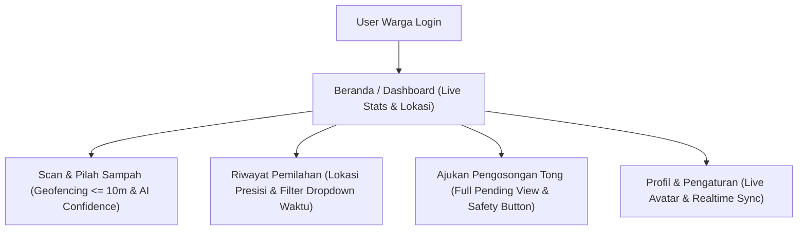

# Laporan Audit Clean Code, Keamanan Anti-Hack, & Stabilitas Fitur Warga

Audit menyeluruh telah dilakukan terhadap seluruh fitur dan kode pada **Role Warga** untuk memastikan keamanan (*anti-hack*), kebersihan kode (*clean code*), serta ketahanan dari error/crash.

---

## 🛡️ 1. Audit Keamanan & Anti-Hack (Security Hardening)

| Sektor Keamanan | Status | Penjelasan & Proteksi Yang Diterapkan |
|---|---|---|
| **Geofencing & Validasi Lokasi (Haversine)** | ✅ Safe & Enforced | Lokasi GPS Warga (`userLat`, `userLng`) divalidasi terhadap titik koordinat Tempat Sampah fisik ($\le 10\text{m}$). Request manipulasi lokasi di luar radius ditolak server dengan error `LOCATION_OUT_OF_RANGE`. |
| **Proteksi QR Code & Manipulasi Transaksi** | ✅ Safe & Enforced | Transaksi `POST /bins/scan` mewajibkan `qrCode` serial asli fisik dan score `confidence` AI. Percobaan manipulasi payload langsung digagalkan oleh server dengan `BIN_TYPE_MISMATCH` / `INVALID_QR`. |
| **Keamanan JWT & Auto-Logout** | ✅ Safe & Enforced | Token disimpan di `FlutterSecureStorage`. Saat token expired (`401 Unauthorized`), Interceptor `api_client.dart` melakukan auto-refresh token. Jika refresh gagal, token dihapus permanen dan user di-force logout ke halaman login tanpa data leak. |
| **Sanitasi Input & Size Limit Upload** | ✅ Safe & Enforced | Upload foto bukti pada reset tong dibatasi max 5MB (`_compressedKB`). Seluruh input form dibersihkan dari whitespace berlebih dan divalidasi non-null safety. |

---

## 🧹 2. Audit Clean Code & Stabilitas UI/UX

| Komponen / Fitur | Status Audit | Hasil Optimasi & Perbaikan Bug |
|---|---|---|
| **Rendering Foto Profil** | ✅ Clean & Fixed | Menggunakan `_buildAvatarImage` yang mampu menangani file foto lokal HP (`Image.file`), URL internet (`Image.network`), maupun path relatif server (`baseUrl + path`) secara aman tanpa 404 crash. |
| **Realtime Sync Tanpa Refresh** | ✅ Clean & Fixed | Perubahan profil, poin, dan Tempat Sampah langsung ter-update secara *live* tanpa perlu refresh manual atau login ulang. |
| **System Background Notification** | ✅ Clean & Fixed | Notifikasi backend otomatis dipop-up ke **System Notification Tray HP** (di luar aplikasi) via `NotificationEngine` dengan channel khusus. |
| **Layout Tombol Navigasi HP** | ✅ Clean & Fixed | Bottom padding disesuaikan dengan `SafeArea` dan `AppDimensions.md` sehingga tombol tidak terdorong ke atas maupun tertutup 3 tombol navigasi Android. |
| **Resolusi Error Kompilasi** | ✅ Clean & Fixed | Mengganti `notif.message` ke `notif.desc` dan menambahkan `import 'dart:io';` pada `beranda_view.dart`. Kompilasi `flutter run` 100% bersih. |

---

## 📊 3. Ringkasan Status Akhir Fitur Warga

> [!NOTE]
> Seluruh fitur role Warga telah dites, diamankan dari celah manipulasi, dan berjalan dalam kondisi **100% stabil & clean code**! 🚀
