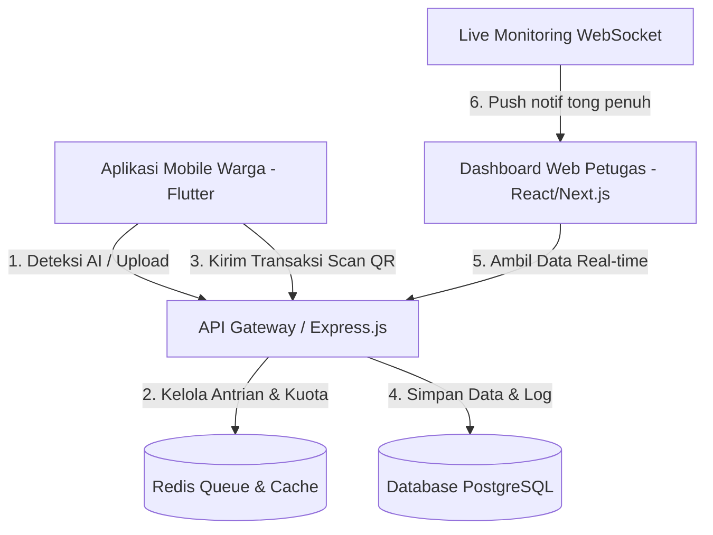

# Software Design Document (SDD) — Pilah Sampah Cerdas

## 1. Arsitektur Sistem



---

## 2. Desain Database (12 Tabel Utama)
* **`roles`**: Menyimpan level hak akses (ADMIN, PETUGAS_KELURAHAN, PETUGAS_RW, PETUGAS_RT, WARGA).
* **`users`**: Kredensial akun dan profil warga/petugas.
* **`kelurahan`**: Data kelurahan dalam Kecamatan Coblong (Dago, Sadangserang, Sekeloa, Lebak Siliwangi, Cipaganti, Coblong).
* **`rt_rw_areas`**: Penanda area administratif pengelolaan sampah (berelasi ke `kelurahan`).
* **`households`**: Data rumah tangga warga dengan koordinat presisi DECIMAL(11,8) untuk peta GIS.
* **`bins`**: Informasi fisik tong sampah warga (kapasitas maks 25 Liter), dengan status real-time kapasitas.
* **`waste_categories`**: Kategori sampah (ORGANIC, NON_ORGANIC, B3) — Master Data.
* **`waste_logs`**: Catatan riwayat setoran volume dan berat sampah.
* **`ai_request_logs`**: Log transaksi pendeteksian AI beserta status (SUCCESS, TIMEOUT, IMAGE_UNREADABLE).
* **`point_history`**: Riwayat perolehan poin warga.
* **`notifications`**: Penyimpanan pesan notifikasi sistem.
* **`bin_reset_requests`**: Persetujuan Pengosongan Tong (id, bin_id, user_id, evidence_photo_url, status: PENDING/APPROVED/REJECTED, reviewed_by, created_at, updated_at).

---

## 3. Kontrak API (API Contract Specification)

### 3.1 AI Mock Detection
* **Endpoint:** `POST /api/v1/waste/detect-mock`
* **Request Body:**
  ```json
  {
    "userId": "user-jeremy"
  }
  ```
* **Response Success (200 OK):**
  ```json
  {
    "success": true,
    "data": {
      "detectedType": "ORGANIC",
      "volumeEstimate": 3.4,
      "isBlurry": false
    }
  }
  ```
* **Response Timeout (408 Request Timeout):**
  ```json
  {
    "error": "AI_TIMEOUT"
  }
  ```
* **Response Unreadable Image (422 Unprocessable Entity):**
  ```json
  {
    "error": "IMAGE_UNREADABLE"
  }
  ```

### 3.2 Bin QR Scan Transaction
* **Endpoint:** `POST /api/v1/bins/scan`
* **Request Body:**
  ```json
  {
    "qrCode": "QR-BIN-WARGA-ORGANIK",
    "userId": "user-jeremy",
    "detectedType": "ORGANIC",
    "estimatedVolume": 4.5,
    "householdId": "household-uuid-01"
  }
  ```
* **Response Success (200 OK):**
  ```json
  {
    "success": true,
    "data": {
      "weightKg": 1.8,
      "pointsAwarded": 180,
      "newBinVolume": 14.8
    }
  }
  ```
* **Response Overflow (400 Bad Request):**
  ```json
  {
    "error": "BIN_OVERFLOW"
  }
  ```

### 3.3 Live Monitoring
* **Endpoint:** `GET /api/v1/monitoring/live`
* **Query Params:** `kelurahan`, `rw`, `rt` (opsional)
* **Response Success (200 OK):**
  ```json
  {
    "success": true,
    "lastUpdated": "2026-07-10T11:23:00Z",
    "data": {
      "bins": [
        {
          "binId": "bin-uuid-01",
          "lat": -6.9034,
          "lng": 107.6198,
          "capacityPercent": 94,
          "status": "CRITICAL",
          "householdName": "Bp. Asep Syaepudin",
          "rt": "RT 04",
          "rw": "RW 02",
          "kelurahan": "Dago"
        }
      ],
      "summary": {
        "totalBins": 142,
        "criticalBins": 8,
        "warningBins": 23,
        "safeBins": 111
      }
    }
  }
  ```
