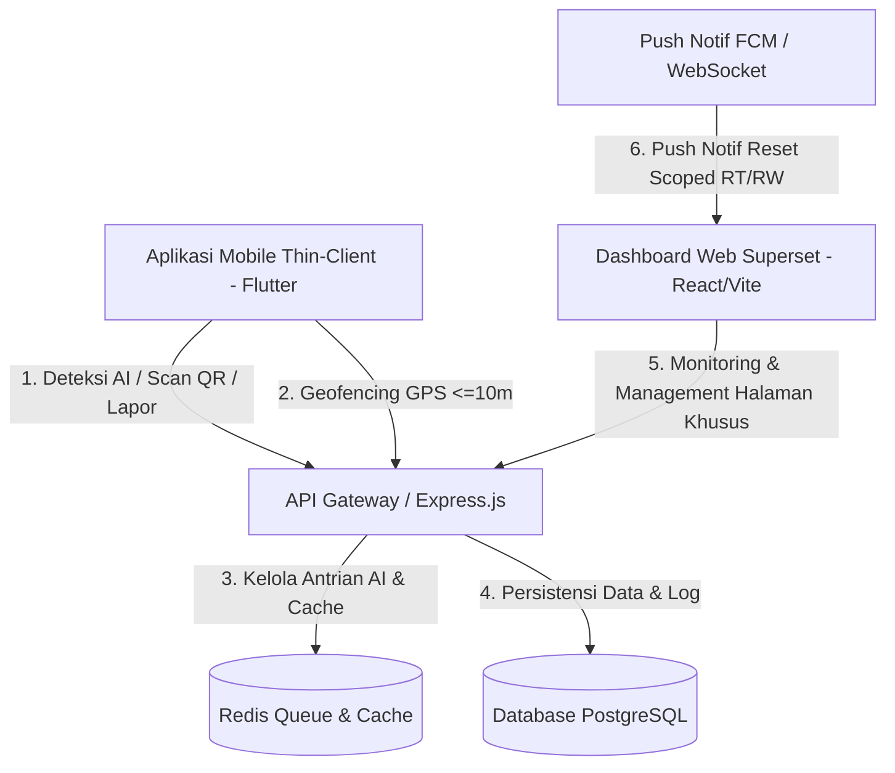

# Software Design Document (SDD) — Pilah Sampah Cerdas

## 1. Arsitektur Sistem



### 1.1 Scope Platform & Target Role
* **Aplikasi Mobile (Thin-Client):** Digunakan secara eksklusif oleh **Warga**, **Mahasiswa KKN**, dan **Petugas Residu**. Focus pada aksi lapangan cepat.
* **Aplikasi Web (Superset Dashboard):** Digunakan oleh **RT, RW, Pengangkut, DPL, Admin Kelurahan, Admin Kecamatan, SUPER USER**, serta **Warga/Mahasiswa/Petugas Residu** (sebagai superset monitoring visual & analytics).

---

## 2. Desain Database & Skema Master Data (No NIK)

> ⚠️ DEPRECATED (skema lama)
> *Dahulu: Field identifikasi menggunakan `nik` pada tabel `users` dan `households_nik`.*
> *Digantikan: `phone_number` untuk Warga & Pengurus, `nim` untuk Mahasiswa KKN, `nip` untuk DPL. Seluruh NIK dihapus total.*

* **`roles`**: Level hak akses (SUPER_USER, ADMIN_KECAMATAN, ADMIN_KELURAHAN, DPL, PENGANGKUT, PETUGAS_RW, PETUGAS_RT, PETUGAS_RESIDU, MAHASISWA_KKN, WARGA).
* **`users`**: Identitas akun (id, phone_number, nim, nip, email, password_hash, full_name, role_id, rt_id, rw_id, kelurahan_id, created_at).
* **`refresh_tokens`**: Token rotasi refresh session (id, user_id, token, expires_at, created_at).
* **`kelurahan`**: Data kelurahan di Kecamatan Coblong.
* **`rt_rw_areas`**: Penanda wilayah administratif RT/RW.
* **`households`**: Data rumah tangga Warga dengan koordinat presisi DECIMAL(11,8) lokasi rumah/tempat sampah.
* **`bins`**: Informasi fisik 2 tempat sampah Warga per rumah (1 Organik & 1 Anorganik), kapasitas maks 25 Liter, `qr_code`, `bin_type` (`ORGANIC` / `NON_ORGANIC`), `user_id`, koordinat GPS presisi.
* **`waste_categories`**: Kategori sampah (`ORGANIC`, `NON_ORGANIC`).
* **`waste_logs`**: Catatan riwayat setoran volume (L), berat (Kg), dan poin.
* **`ai_request_logs`**: Log deteksi AI beserta status (`SUCCESS`, `TIMEOUT`, `IMAGE_UNREADABLE`).
* **`point_history`**: Riwayat poin (Akumulasi & Leaderboard).
* **`notifications`**: Penyimpanan pesan notifikasi sistem terarah.
* **`bin_reset_requests`**: Request Pengosongan Tempat Sampah (id, bin_id, user_id, rt_id, rw_id, evidence_photo_url, status: `PENDING`/`APPROVED`/`REJECTED`, reviewed_by, created_at, updated_at).

---

## 3. Standar Autentikasi (No NIK) & Session

### 3.1 Login (Berdasarkan Role Identifier)
* **Endpoint:** `POST /api/v1/auth/login`
* **Request Body (Warga / Pengurus):**
  ```json
  { "phoneNumber": "081234567890", "password": "rahasia123" }
  ```
* **Request Body (Mahasiswa KKN):**
  ```json
  { "nim": "13522001", "password": "rahasia123" }
  ```
* **Request Body (DPL):**
  ```json
  { "nip": "198501012010121001", "password": "rahasia123" }
  ```
* **Response Success (200 OK):**
  ```json
  {
    "success": true,
    "data": {
      "accessToken": "<jwt_string>",
      "user": { "id": "uuid-01", "name": "Bpk. Asep", "role": "WARGA", "phoneNumber": "081234567890" }
    }
  }
  ```

---

## 4. Kontrak API Utama

### 4.1 AI Mock Detection
* **Endpoint:** `POST /api/v1/waste/detect-mock`
* **Request Body:**
  ```json
  { "userId": "user-uuid-01" }
  ```
* **Response Success (200 OK):**
  ```json
  {
    "success": true,
    "data": {
      "detectedType": "ORGANIC",
      "volumeEstimate": 3.4,
      "isBlurry": false
    }
  }
  ```

### 4.2 Penyetoran Sampah (Scan QR & Geofencing GPS)
* **Endpoint:** `POST /api/v1/bins/scan`
* **Formula Perhitungan Poin (FR-03 & SDD Spec):**
  $$\text{Poin} = (\text{Berat (kg)} \times 100) \times \text{Confidence AI} \times 0.9$$
  * *Ket:* $\text{Berat (kg)} = \text{estimatedVolume (Liter)} \times \text{density}$ ($0.4\text{ kg/L}$ untuk Organik, $0.2\text{ kg/L}$ untuk Anorganik).
  * *Multiplier:* $0.9$ digunakan sebagai faktor penyesuaian (*safety margin 90%*).
* **Request Body:**
  ```json
  {
    "qrCode": "QR-BIN-WARGA-ORGANIK-01",
    "userId": "user-uuid-01",
    "detectedType": "ORGANIC",
    "estimatedVolume": 4.5,
    "userLat": -6.90341234,
    "userLng": 107.61981234,
    "confidence": 0.95,
    "householdId": "household-uuid-01"
  }
  ```
* **Response Success (200 OK):**
  ```json
  {
    "success": true,
    "data": {
      "weightKg": 1.8,
      "pointsAwarded": 154,
      "newBinVolume": 14.8
    }
  }
  ```

---

## 5. Kontrak API — Scoped Reset Tempat Sampah Warga

### 5.1 Ajukan Reset Tempat Sampah (Warga)
* **Endpoint:** `POST /api/v1/bins/reset-request`
* **Authorization:** Role `WARGA`
* **Request Body (multipart/form-data):**
  ```
  binId: "bin-uuid-01"
  evidencePhoto: <file.jpg, maks 1MB>
  ```
* **Response Success (201 Created):**
  ```json
  {
    "success": true,
    "data": { 
      "resetRequestId": "req-uuid-01", 
      "status": "PENDING",
      "targetRtId": "rt-uuid-04",
      "targetRwId": "rw-uuid-02"
    }
  }
  ```

### 5.2 Get List Reset Requests (Halaman Khusus RT/RW Dashboard)
* **Endpoint:** `GET /api/v1/bins/reset-requests`
* **Authorization:** Role `PETUGAS_RT`, `PETUGAS_RW`
* **Response Success (200 OK):**
  ```json
  {
    "success": true,
    "data": [
      {
        "resetRequestId": "req-uuid-01",
        "binId": "bin-uuid-01",
        "binType": "ORGANIC",
        "wargaName": "Bpk. Asep",
        "phoneNumber": "081234567890",
        "evidencePhotoUrl": "/uploads/evidence-01.jpg",
        "status": "PENDING",
        "createdAt": "2026-07-31T20:00:00Z"
      }
    ]
  }
  ```

### 5.3 Approve Reset Tempat Sampah (RT/RW)
* **Endpoint:** `PATCH /api/v1/bins/reset-request/:id/approve`
* **Authorization:** Role `PETUGAS_RT`, `PETUGAS_RW`
* **Response Success (200 OK):**
  ```json
  {
    "success": true,
    "data": { "resetRequestId": "req-uuid-01", "status": "APPROVED", "newBinVolume": 0 }
  }
  ```

---

## 6. Standar Kode Error API

| Kode Error | HTTP Status | Deskripsi |
|:---|:---:|:---|
| `INVALID_CREDENTIALS` | 401 | Nomor Telepon / NIM / NIP atau password salah |
| `USER_NOT_FOUND` | 404 | User tidak ditemukan di sistem |
| `UNAUTHORIZED` | 403 | Role tidak memiliki akses endpoint ini |
| `LOCATION_OUT_OF_RANGE` | 400 | Jarak GPS Warga > 10m dari lokasi tempat sampah |
| `BIN_TYPE_MISMATCH` | 400 | Jenis sampah AI tidak cocok dengan jenis tempat sampah |
| `BIN_OVERFLOW` | 400 | Volume sampah melebihi kapasitas (25L) |
| `BIN_NOT_CRITICAL` | 400 | Tempat sampah belum >90% penuh |
| `DAILY_LIMIT_EXCEEDED` | 429 | Kuota AI 50 request/hari habis |

---

## 7. Matriks RBAC Endpoint

| Endpoint | Mobile (Warga/KKN/Residu) | Web RT / RW | Web Admin / Super |
|:---|:---:|:---:|:---:|
| `POST /auth/login` | ✅ | ✅ | ✅ |
| `POST /waste/detect-mock` | ✅ (Warga) | ❌ | ❌ |
| `POST /bins/scan` | ✅ (Warga) | ❌ | ❌ |
| `POST /bins/reset-request` | ✅ (Warga) | ❌ | ❌ |
| `GET /bins/reset-requests` | ❌ | ✅ (Scoped RT/RW) | ✅ |
| `PATCH /bins/reset-request/:id/approve` | ❌ | ✅ (Scoped RT/RW) | ✅ |
| `PATCH /bins/reset-request/:id/reject` | ❌ | ✅ (Scoped RT/RW) | ✅ |
| `GET /monitoring/warga` | ✅ (Self) | ✅ | ✅ |
