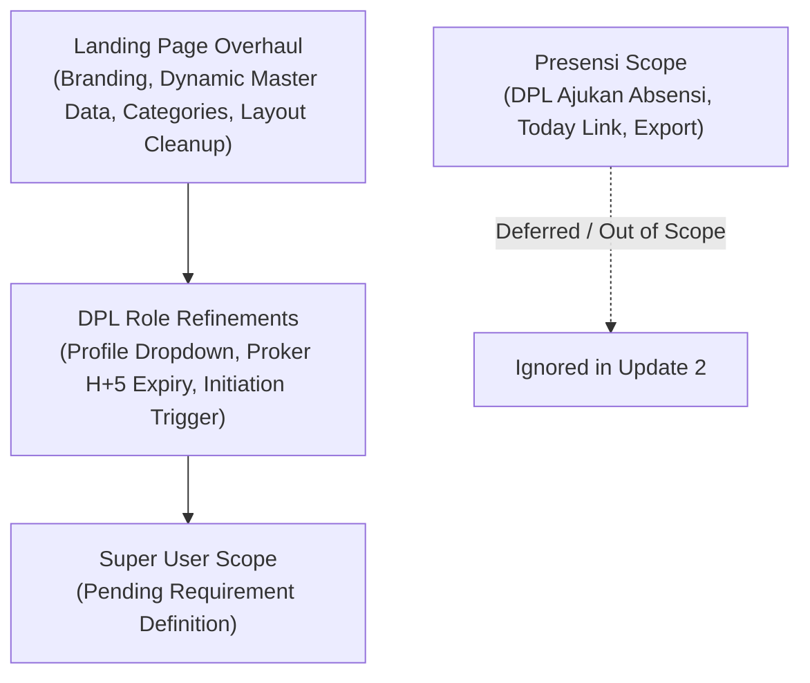

# 🚀 BERSEKA — Update 2 Planning & Backlog Specification (`upd2planning.md`)

> **Document Version:** 2.0.0  
> **Target Release:** BERSEKA Phase 2 Update  
> **Status:** Draft / Active Backlog  
> **Presensi Tab Status:** **IGNORED / DEFERRED** (Presensi backlog documented as reference but out of current sprint scope)

---

## 📋 Executive Summary

This document defines the actionable technical specifications, UI/UX refinements, and business logic updates for **BERSEKA Update 2**. It consolidates requirements across the **Public Landing Page**, **DPL Portal**, and **Super User Management**, while explicitly setting attendance/presensi updates to deferred status.

---

## 🗺️ Scope Breakdown Matrix

---

## 🌐 Workstream 1: Public Landing Page Polish & Dynamic Data

Focus: Transform static UI placeholders into real database-driven aggregations, fix branding terminology, expand commercial categories, and declutter visual sections.

### 1.1 `LP-001`: "Kalkulator BERSEKA" Renaming & Emission Reduction Citation
* **Component:** [`apps/web/src/pages/LandingPage/`](file:///c:/laragon/www/Pilah-Sampah-Cerdas/apps/web/src/pages/LandingPage/)
* **Issue:** The waste reduction calculator uses legacy naming ("Kalkulator Berkah") and lacks scientific citations for carbon and emission reduction calculations.
* **Requirements:**
  1. Rename component and UI headings strictly to **"Kalkulator BERSEKA"**.
  2. Add an explicit methodological citation/footnote detailing how emission reduction is determined (e.g., standard KLHK / IPCC waste emission factor: $\approx 0.58\text{ kg CO}_2\text{e}$ per kg composted organic waste).
  3. Include an expandable info tooltip explaining the formula.

### 1.2 `LP-002`: Expand Contact Information (Preserve Existing)
* **Component:** Landing Page Footer / Contact Section
* **Requirements:**
  1. Add newly supplied contact channels (phone, WhatsApp helpline, office hours).
  2. Preserve all existing contact information (do not overwrite or delete previous email, social media links, or official address).

### 1.3 `LP-003`: Dynamic Kelurahan Count & Segregated Waste Tonnage
* **Component:** Hero & Impact Summary Cards
* **Requirements:**
  1. Connect total Kelurahan metrics directly to Master Data API (`GET /api/v1/areas/kelurahan`).
  2. Split "Sampah Terkelola" (Managed Waste) into two distinct category metrics:
     - **Sampah Organik (Kg)**
     - **Sampah Anorganik (Kg)**

### 1.4 `LP-004`: Dynamic "Pengguna Terlibat" (Engaged Users) Aggregation
* **Component:** Community Metrics Card
* **Requirements:**
  1. Replace static user count with dynamic aggregation from User Master (`GET /api/v1/users/count-summary` or public stats endpoint).
  2. Metric reflects real registered citizens (*Warga*), active students (*Mahasiswa KKN*), and field officers (*Petugas Residu*).

### 1.5 `LP-005`: Feed "Kegiatan" Directly from Active KKN Work Programs (*Program Kerja*)
* **Component:** Activities Carousel / Section
* **Requirements:**
  1. Connect the public activity stream directly to approved KKN Work Programs (`/api/v1/kkn/program-kerja?status=SEDANG_BERJALAN,SELESAI`).
  2. Display program title, Kelompok KKN, location/Kelurahan, and verified completion progress.

### 1.6 `LP-006`: News Retention Filter (Max 2 Articles, 3-Day Time Window)
* **Component:** News / "Berita Terbaru" Section
* **Requirements:**
  1. Limit displayed news cards to a maximum of **2 items**.
  2. Filter articles with a strict retention window of $\le 3\text{ days}$ from publication date (`publishedAt >= NOW() - INTERVAL 3 DAYS`).
  > [!TIP]
  > **Engineering Recommendation:** Implement a graceful fallback to display the latest 2 published articles if no articles have been published within the last 3 days to prevent an awkward empty state on the public landing page.

### 1.7 `LP-007`: Remove "Dampak Nyata" (Real Impact) Section
* **Component:** Landing page main body
* **Requirements:**
  1. Fully remove the redundant "Dampak Nyata" block to streamline page length and eliminate duplicate metric counters.

### 1.8 `LP-008`: Remove Redundant "Menu Mitra" (Partners Menu)
* **Component:** Navigation Bar / Section Anchor
* **Requirements:**
  1. Remove "Mitra" from the navigation menu and mid-page section, as partner affiliations are already prominently integrated in the header/hero.

### 1.9 `LP-009`: Relocate "Bantuan / Petunjuk" to Sidebar Navigation
* **Component:** Header Navigation & Sidebar Drawer
* **Requirements:**
  1. Remove "Bantuan / Petunjuk" from top header links.
  2. Relocate user guides and support links into the dedicated mobile/web sidebar navigation drawer.

### 1.10 `LP-010`: Expand "Pasar BERSEKA" Categories (Telur & Daging)
* **Component:** Marketplace / Eco-Market Section
* **Requirements:**
  1. Expand categories beyond "Buah-buahan" and "Sayuran".
  2. Add **"Telur"** (Eggs) and **"Daging"** (Meat / Poultry / Fresh Produce).
  3. Ensure category filter tabs reflect the newly expanded product taxonomy.

### 1.11 `LP-011` & `LP-012`: Dynamic Action Program Cards (Max 2 Displayed)
* **Component:** "Aksi Nyata" / Action Initiatives Section
* **Requirements:**
  1. Limit visible action program cards to strictly **2 cards**.
  2. Make the category tags and action program data dynamic based on registered action categories rather than static hardcoded layout tiles.

### 1.13 `LP-013`: Retain Existing Mobile APK Download Flow
* **Component:** Download CTA
* **Requirements:**
  1. Maintain consistency with the existing APK download flow and route (`/download` / `/downloads/berseka-release.apk`).

### 1.14 `LP-014`: Replace Hero Top-Right Graphic
* **Component:** Hero Section Visual
* **Requirements:**
  1. Replace the static/mockup statistics image in the top-right hero with an authentic app interface preview or clean real-world visual asset.

---

## 👨‍🏫 Workstream 2: Role DPL (Dosen Pendamping Lapangan) Enhancements

Focus: Navigation streamlining and business lifecycle rules for student work programs (*Program Kerja*).

### 2.1 `DPL-001`: Move Logout Button to Profile Avatar Dropdown
* **Component:** DPL Layout Header & Sidebar
* **Requirements:**
  1. Remove standalone "Keluar" button from primary sidebar navigation.
  2. Move the Logout action inside the User Profile avatar dropdown menu in the top navigation header.

### 2.2 `DPL-002`: Work Program Initiation Trigger & Status Notification
* **Component:** [`apps/web/src/pages/dpl/ProgramKerjaPage.tsx`](file:///c:/laragon/www/Pilah-Sampah-Cerdas/apps/web/src/pages/dpl/) & Backend KKN Service
* **Requirements:**
  1. When a work program status is `BELUM_MULAI`, provide an explicit student start notification request button and allow DPL to manually toggle status to `SEDANG_BERJALAN`.
  2. Trigger WebSocket / Push notification to DPL when Mahasiswa submits a start request.

### 2.3 `DPL-003`: Work Program H+5 Start Expiry Enforcement
* **Component:** [`apps/api/src/services/kknProgramKerjaService.ts`](file:///c:/laragon/www/Pilah-Sampah-Cerdas/apps/api/) & Cron Worker
* **Requirements:**
  1. Enforce a strict 5-day ($H+5$) deadline: Once a work program is `DISETUJUI` (Approved), the student group must start the program within 5 days.
  2. If the program is not started after $H+5$, mark status as `KADALUARSA` / `BATAL` and remove from active list.
  > [!WARNING]
  > **Engineering Caution on Data Deletion:** Do not execute a destructive SQL `DELETE`. Use soft-cancellation/archival (`status: 'KADALUARSA_OTOMATIS'`) with an audit log to ensure field data and accountability records are preserved.

---

## ⏸️ Excluded / Deferred Scope: Presensi (Attendance) Tab

> **Policy Decision:** As requested, the Presensi tab overhaul is **ignored / deferred** from the current sprint execution. The items below are archived for future milestone planning only.

| Item Ref | Requirement Summary | Status in Update 2 |
|---|---|---|
| `PRES-001` | Remove "Ajukan Absensi" button for DPL role | ⚪ **IGNORED / DEFERRED** |
| `PRES-002` | Add "Presensi Kegiatan Hari Ini" text with external/detail navigation link | ⚪ **IGNORED / DEFERRED** |
| `PRES-003` | Move data export feature strictly into "Laporan" (Reports) tab instead of Presensi tab | ⚪ **IGNORED / DEFERRED** |

---

## 🛡️ Workstream 3: Role Super User (SU)

* **Status:** Open for backlog requirements definition.
* **Allocated Items:**
  1. *[Awaiting input / TBD by Team]*

---

## 💡 Engineering Feedback & Architectural Opinions

1. **Auto-cancellation of Proker (H+5 Rule):**  
   *Field Reality:* Student groups often face permit delays from local RW/RT.  
   *Suggestion:* Instead of permanent disappearance, transition the status to `TERTUNDA_MELEBIHI_BATAS` and allow DPL to grant a 3-day grace extension with a single click.
2. **3-Day News Window vs Freshness:**  
   *Risk:* A strict 3-day window can leave the public landing page with zero news during holidays or quiet weeks.  
   *Suggestion:* Use an `OR` fallback to ensure at least 2 latest articles are always rendered.
3. **Profile Logout Dropdown:**  
   *Approval:* Highly recommended. Aligns with modern standard dashboard UX across all enterprise portals.
